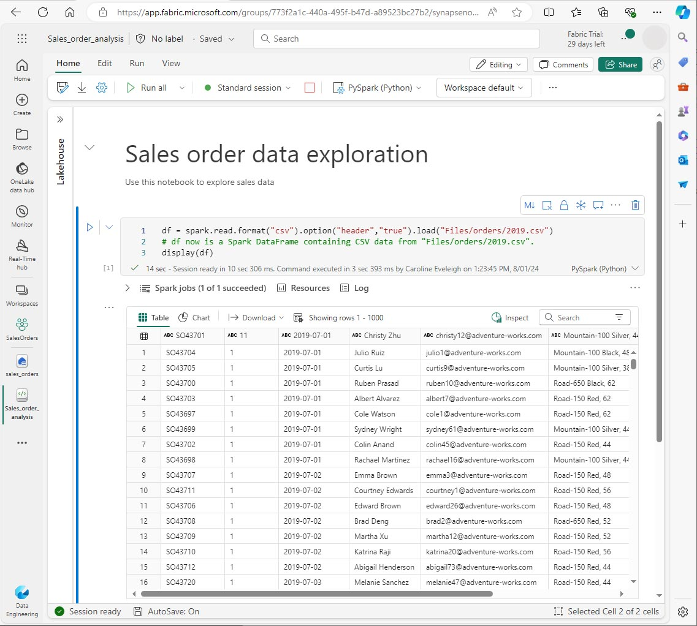

---
lab:
  title: Análisis de datos con Apache Spark
  module: Use Apache Spark to work with files in a lakehouse
---

# Análisis de datos con Apache Spark en Fabric

En este laboratorio, ingerirás datos en el almacén de lago de Fabric y usarás PySpark para leer y analizarlos.

Este laboratorio tardará aproximadamente 45 minutos en completarse.

## Requisitos previos

* Una [versión de prueba de Microsoft Fabric](/fabric/get-started/fabric-trial#start-the-fabric-capacity-trial)

## Creación de un área de trabajo

Para poder trabajar con datos en Fabric, debes crear un área de trabajo.

1. En la página principal de [Microsoft Fabric](https://app.fabric.microsoft.com) en https://app.fabric.microsoft.com, selecciona experiencia de **Ingeniería de datos**.
1. En la barra de menú izquierda, selecciona **Áreas de trabajo** (🗇) y **Nueva área de trabajo**.
1. Asigna un nombre a la nueva área de trabajo y, en la sección **Avanzado**, selecciona el modo de licencia adecuado. Si has iniciado una versión de prueba de Microsoft Fabric, selecciona Prueba.
1. Selecciona **Aplicar** para crear un área de trabajo vacía.
 


## Creación de un almacén de lago y carga de archivos

Ahora que tienes un área de trabajo, puedes crear un almacén de lago para los archivos de datos. En el área de trabajo nueva, selecciona **Nuevo** y **Almacén de lago**. Asigna un nombre al almacén de lago y selecciona **Crear**. Después de un breve retraso, se crea un nuevo almacén de lago.

Ahora puedes ingerir datos en el almacén de lago. Hay varias maneras de hacerlo, pero de momento descargarás y extraerás una carpeta de archivos de texto en el equipo local (o máquina virtual de laboratorio si procede) y, luego, los cargarás en el almacén de lago.

1. Descarga los archivos de datos de https://github.com/MicrosoftLearning/dp-data/raw/main/orders.zip.
1. Extraer el archivo comprimido y comprueba que tienes una carpeta denominada *orders* que contiene los archivos CSV 2019.csv, 2020.csvy 2021.csv.
1. Vuelve a tu nuevo almacén de lago. En el panel **Explorador**, selecciona el menú de puntos suspensivos **...** situado junto a la carpeta **Archivos** después, selecciona **Cargar** y **Cargar carpeta**. Ve a la carpeta orders del equipo local (o máquina virtual de laboratorio si procede) y selecciona **Cargar**.
1. Una vez cargados los archivos, expande **Archivos** y selecciona la carpeta **orders**. Comprueba que se ha cargado el archivo CSV, como se muestra aquí:


## Creación de un cuaderno

Ahora puedes crear un cuaderno de Fabric para trabajar con los datos. Los cuadernos proporcionan un entorno interactivo en el que puedes escribir y ejecutar código.

1. Selecciona el área de trabajo y, a continuación, selecciona **Nuevo** y **Cuaderno**. Al cabo de unos segundos, se abrirá un nuevo cuaderno que contiene una sola celda. Los cuadernos se componen de una o varias celdas que pueden contener código o Markdown (texto con formato).
1. Fabric asigna un nombre a cada cuaderno que crees, como Cuaderno 1, Cuaderno 2, etc. Haz clic en el panel de nombres situado encima de la pestaña **Inicio** del menú para cambiar el nombre a algo más descriptivo.
1. Selecciona la primera celda (que actualmente es una celda de código) y, luego, en la barra de herramientas en la parte superior derecha, usa el botón **M↓** para convertirla en una celda de Markdown. El texto dentro de la celda se mostrará como texto con formato.
1. Usa el botón 🖉 (Editar) para cambiar la celda al modo de edición y, luego, modifica el Markdown de la siguiente manera.

```markdown
# Sales order data exploration
Use this notebook to explore sales order data
```


Al terminar, haz clic en cualquier parte del cuaderno fuera de la celda para dejar de editarlo y ver el Markdown representado.


## Creación de un DataFrame

Ahora que has creado una área de trabajo, un almacén de lago y un cuaderno estás listo para trabajar con los datos. Usarás PySpark, que es el lenguaje predeterminado para cuadernos de Fabric y la versión de Python optimizada para Spark.

**NOTA:** los cuadernos de Fabric admiten varios lenguajes de programación, como Scala, R y Spark SQL.

1. Selecciona el área de trabajo nueva en la barra izquierda. Verás una lista de los elementos dentro del área de trabajo, incluidos el almacén de lago y el cuaderno.
2. Selecciona el almacén de lago para mostrar el panel Explorador, incluida la carpeta **orders**.
3. En el menú superior, selecciona **Abrir cuaderno**, **Bloc de notas existente** y, a continuación, abre el cuaderno que creaste anteriormente. El cuaderno debe estar abierto junto al panel Explorador. Expande los almacenes de lago, expande la lista Archivos y selecciona la carpeta orders. Los archivos CSV que cargaste se muestran junto al editor de cuadernos, de la siguiente manera:


4. En ... el menú de 2019.csv, selecciona **Cargar datos** > **Spark**. El código siguiente se generará automáticamente en una nueva celda de código:

```python
df = spark.read.format("csv").option("header","true").load("Files/orders/2019.csv")
# df now is a Spark DataFrame containing CSV data from "Files/orders/2019.csv".
display(df)
```

**Sugerencia:** puedes ocultar los paneles del explorador del almacén de lago de la izquierda mediante los iconos «. Esto proporciona más espacio para el cuaderno.

5. Selecciona ▷ **Ejecutar celda** a la izquierda de la celda para ejecutar el código.

**NOTA**: la primera vez que ejecutas código de Spark, se inicia una sesión de Spark. Esto puede tardar unos segundos o más. Las ejecuciones posteriores dentro de la misma sesión serán más rápidas.

6. Cuando se haya completado el código de celda, revisa la salida que aparece debajo de ella, que será algo parecido a esto:
 


7. La salida muestra las filas y columnas de datos del archivo 2019.csv.  Observa que los encabezados de columna contienen la primera línea de los datos. Para corregir esto, debes modificar la primera línea del código de la siguiente manera:

```python
df = spark.read.format("csv").option("header","false").load("Files/orders/2019.csv")
```

8. Vuelve a ejecutar el código para que DataFrame identifique correctamente la primera fila como datos. Observa que los nombres de columna han cambiado ahora a _c0, _c1, etc.

9. Los nombres de columna descriptivos te ayudan a comprender los datos. Para crear nombres de columna significativos, debes definir el esquema y los tipos de datos. También debes importar un conjunto estándar de tipos de Spark SQL para definir los tipos de datos. Reemplaza el código existente por el siguiente:

```python
from pyspark.sql.types import *

orderSchema = StructType([
    StructField("SalesOrderNumber", StringType()),
    StructField("SalesOrderLineNumber", IntegerType()),
    StructField("OrderDate", DateType()),
    StructField("CustomerName", StringType()),
    StructField("Email", StringType()),
    StructField("Item", StringType()),
    StructField("Quantity", IntegerType()),
    StructField("UnitPrice", FloatType()),
    StructField("Tax", FloatType())
    ])

df = spark.read.format("csv").schema(orderSchema).load("Files/orders/2019.csv")

display(df)

```
10. Ejecuta la celda y revisa la salida:


11. Este DataFrame solo incluye los datos del archivo 2019.csv. Modifica el código para que la ruta de acceso del archivo use un carácter comodín* para leer todos los archivos de la carpeta orders:

```python
from pyspark.sql.types import *

orderSchema = StructType([
    StructField("SalesOrderNumber", StringType()),
    StructField("SalesOrderLineNumber", IntegerType()),
    StructField("OrderDate", DateType()),
    StructField("CustomerName", StringType()),
    StructField("Email", StringType()),
    StructField("Item", StringType()),
    StructField("Quantity", IntegerType()),
    StructField("UnitPrice", FloatType()),
    StructField("Tax", FloatType())
    ])

df = spark.read.format("csv").schema(orderSchema).load("Files/orders/*.csv")

display(df)
```

12. Al ejecutar el código modificado, deberías ver las ventas de 2019, 2020 y 2021. Solo se muestra un subconjunto de las filas, por lo que es posible que no veas las filas de cada año.

**NOTA:** puedes ocultar o mostrar la salida de una celda seleccionando ... junto al resultado. Esto facilita el trabajo en un cuaderno.

## Exploración de datos en DataFrame

El objeto DataFrame proporciona funcionalidad adicional, como la capacidad de filtrar, agrupar y manipular datos.

### Filtrado de un DataFrame

1. Agrega una celda de código seleccionando **+ Código** que aparece al mantener el puntero encima o debajo de la celda actual o su salida. Como alternativa, en el menú de cinta, selecciona **Editar** y **+ Agregar** celda de código.

2.  El código siguiente filtra los datos para que solo se devuelvan dos columnas. También usa *count* y *distinct* para resumir el número de registros:

```python
customers = df['CustomerName', 'Email']

print(customers.count())
print(customers.distinct().count())

display(customers.distinct())
```

3. Ejecuta el código y examina la salida:

* El código crea un nuevo DataFrame denominado **customers** que contiene un subconjunto de columnas del DataFrame **df** original. Al realizar una transformación DataFrame no se modifica el DataFrame original, pero se devuelve uno nuevo.
* Otra manera de lograr el mismo resultado es usar el método select:

```
customers = df.select("CustomerName", "Email")
```

* Las funciones de DataFrame *count* y *distinct* se usan para proporcionar totales para el número de clientes y clientes únicos.

4. Modifica la primera línea del código mediante *select* con una función *where* como se indica a continuación:

```python
customers = df.select("CustomerName", "Email").where(df['Item']=='Road-250 Red, 52')
print(customers.count())
print(customers.distinct().count())

display(customers.distinct())
```

5. Ejecuta el código modificado para seleccionar los clientes que han comprado el producto Road-250 Red, 52. Ten en cuenta que puedes "encadenar" varias funciones juntas para que la salida de una función se convierta en la entrada para la siguiente. En este caso, el DataFrame creado por el método *select* es el DataFrame de origen del método **where** se usa para aplicar criterios de filtrado.

### Agregación y agrupación de datos en un DataFrame

1. Agregue una celda de código y escribe el código siguiente:

```python
productSales = df.select("Item", "Quantity").groupBy("Item").sum()

display(productSales)
```

2. Ejecuta el código. Observa que los resultados muestran la suma de las cantidades de pedidos agrupadas por producto. El método *groupBy* agrupa las filas por elemento y la función de agregado *sum* subsiguiente se aplica a todas las columnas numéricas restantes (en este caso, *Quantity*).

3. Agrega otra nueva celda de código al cuaderno y escribe en ella el código siguiente:

```python
from pyspark.sql.functions import *

yearlySales = df.select(year(col("OrderDate")).alias("Year")).groupBy("Year").count().orderBy("Year")

display(yearlySales)
```

4. Ejecuta la celda. Examina los resultados. Los resultados muestran el número de pedidos de ventas por año:

* La instrucción *import* permite usar la biblioteca de Spark SQL.
* El método *select* se usa con una función SQL year para extraer el componente year del campo *OrderDate*.
* Se usa el método *alias* para asignar un nombre de columna al valor de año extraído.
* El método *groupBy* agrupa los datos por la columna Year derivada.
* El recuento de filas de cada grupo se calcula antes de que se use el método *orderBy* para ordenar el DataFrame resultante.


## Uso de Spark para transformar archivos de datos

Una tarea común para los ingenieros y científicos de datos es transformar datos para su posterior procesamiento o análisis.

### Uso de métodos y funciones de DataFrame para transformar datos

1. Agrega una celda de código al cuaderno y escribe el código siguiente:

```python
from pyspark.sql.functions import *

# Create Year and Month columns
transformed_df = df.withColumn("Year", year(col("OrderDate"))).withColumn("Month", month(col("OrderDate")))

# Create the new FirstName and LastName fields
transformed_df = transformed_df.withColumn("FirstName", split(col("CustomerName"), " ").getItem(0)).withColumn("LastName", split(col("CustomerName"), " ").getItem(1))

# Filter and reorder columns
transformed_df = transformed_df["SalesOrderNumber", "SalesOrderLineNumber", "OrderDate", "Year", "Month", "FirstName", "LastName", "Email", "Item", "Quantity", "UnitPrice", "Tax"]

# Display the first five orders
display(transformed_df.limit(5))
```

2. Ejecuta la celda. Se crear un nuevo DataFrame a partir de los datos de pedido originales con las siguientes transformaciones:

- Agrega las columnas Year y Month basadas en la columna OrderDate.
- Agrega las columnas FirstName y LastName basadas en la columna CustomerName.
- Filtra y reordena las columnas, quitando la columna CustomerName.

3. Revisa la salida y comprueba que las transformaciones se han realizado en los datos.

Puedes usar la biblioteca de Spark SQL para transformar los datos filtrando filas, derivando, quitando y cambiando el nombre de columnas y aplicando cualquier otra modificación de datos.

>[!TIP]
> Consulta la documentación de [DataFrame de Apache Spark](https://spark.apache.org/docs/latest/api/python/reference/pyspark.sql/dataframe.html) para más información sobre DataFrame.

### Guardado de los datos transformados

En este momento, es posible que quieras guardar los datos transformados para que se puedan usar para realizar un análisis posterior.

*Parquet* es un formato de almacenamiento de datos popular porque almacena los datos de forma eficaz y es compatible con la mayoría de los sistemas de análisis de datos a gran escala. De hecho, a veces el requisito de transformación de datos puede ser convertir datos de otro formato, como CSV, a Parquet.

1. Para guardar el DataFrame transformado en formato Parquet, agrega una celda de código y agrega el código siguiente:  

```python
transformed_df.write.mode("overwrite").parquet('Files/transformed_data/orders')

print ("Transformed data saved!")
```

2. Ejecuta la celda y espera a que aparezca el mensaje de que se han guardado los datos. A continuación, en el panel Almacén de lago de la izquierda, en ... el menú del nodo Archivos, selecciona **Actualizar**. Selecciona la carpeta transformed_data para comprobar que contiene una nueva carpeta denominada orders, que a su vez contiene uno o varios archivos Parquet.

3. Agrega una celda con el código siguiente:

```python
orders_df = spark.read.format("parquet").load("Files/transformed_data/orders")
display(orders_df)
```

4. Ejecuta la celda.  Se crea un nuevo DataFrame a partir de los archivos Parquet de la carpeta *transformed_data/orders*. Comprueba que los resultados muestran los datos de pedido que se han cargado desde los archivos Parquet.


### Guardado de datos en archivos con particiones

Al tratar con grandes volúmenes de datos, la creación de particiones puede mejorar significativamente el rendimiento y facilitar el filtrado de datos.

1. Agrega una nueva celda con código para guardar el DataFrame, y particiona los datos por Year y Month:

```python
orders_df.write.partitionBy("Year","Month").mode("overwrite").parquet("Files/partitioned_data")

print ("Transformed data saved!")
```

2.  Ejecuta la celda y espera a que aparezca el mensaje de que se han guardado los datos. A continuación, en el panel Almacén de lago de la izquierda, en ... el menú ... del nodo Archivos, selecciona **Actualizar** y expande la carpeta partitioned_orders para comprobar que contiene una jerarquía de carpetas llamadas *Year=xxxx*, cada una de las cuales contiene carpetas llamadas *Month=xxxx*. Cada carpeta Month contiene un archivo Parquet con los pedidos de ese mes.


3. Agrega una nueva celda con el código siguiente para cargar un nuevo DataFrame desde el archivo orders.parquet:

```python
orders_2021_df = spark.read.format("parquet").load("Files/partitioned_data/Year=2021/Month=*")

display(orders_2021_df)
```

4. Ejecuta la celda y comprueba que los resultados muestran los datos de pedido de ventas de 2021. Ten en cuenta que las columnas con particiones especificadas en la ruta de acceso (Year y Month) no se incluyen en el DataFrame.

## Trabajo con tablas y SQL

Como se ha visto, los métodos nativos del objeto DataFrame te permiten consultar y analizar datos de un archivo. Sin embargo, es posible que te resulte más cómodo trabajar con tablas mediante la sintaxis SQL. Spark proporciona un metastore en el que puedes definir tablas relacionales. 

La biblioteca de Spark SQL admite el uso de instrucciones SQL para consultar tablas en el metastore. Esto proporciona la flexibilidad de un lago de datos con el esquema de datos estructurado y las consultas basadas en SQL de un almacenamiento de datos relacional, de ahí el término "almacén de lago de datos".

### Creación de una tabla

Las tablas de un metastore de Spark son abstracciones relacionales de los archivos del lago de datos. Las tablas se pueden *administrar* mediante el metastore, o de modo *externo* y se administran independientemente del metastore.

1.  Agrega una nueva celda de código al cuaderno y escribe el código siguiente, que guarda el DataFrame de los datos de pedidos de ventas en una tabla llamada *salesorders*:

```python
# Create a new table
df.write.format("delta").saveAsTable("salesorders")

# Get the table description
spark.sql("DESCRIBE EXTENDED salesorders").show(truncate=False)
```

>[!NOTE]
> En este ejemplo, no se proporciona ninguna ruta de acceso explícita, por lo que el metastore administrará los archivos de la tabla. Además, la tabla se guarda en formato Delta, que agrega funcionalidades de base de datos relacionales a tablas. Esto incluye compatibilidad con transacciones, control de versiones de fila y otras características útiles. La creación de tablas en formato Delta es más conveniente para almacenes de lago de datos de Fabric.

2. Ejecuta la celda de código y revisa la salida, que describe la definición de la nueva tabla.

3. En el panel **Almacenes de lago**, en ... el menú de la carpeta Tablas, selecciona **Actualizar**. A continuación, expande el nodo **Tablas** y comprueba que se ha creado la tabla **salesorders**.


4. En ... el menú de la tabla salesorders, selecciona **Cargar datos** > **Spark**. Se agrega una nueva celda de código que contiene código similar al siguiente:

```pyspark
df = spark.sql("SELECT * FROM [your_lakehouse].salesorders LIMIT 1000")

display(df)
```

5. Ejecuta el nuevo código, que usa la biblioteca de Spark SQL para insertar una consulta SQL en la tabla *salesorder* en código de PySpark y cargar los resultados de la consulta en un DataFrame.

### Ejecución de código SQL en una celda

Aunque resulta útil poder insertar instrucciones SQL en una celda que contenga código de PySpark, los analistas de datos suelen preferir trabajar directamente en SQL.

1. Agrega una nueva celda de código al cuaderno y escribe en ella el código siguiente:

```SparkSQL
%%sql
SELECT YEAR(OrderDate) AS OrderYear,
       SUM((UnitPrice * Quantity) + Tax) AS GrossRevenue
FROM salesorders
GROUP BY YEAR(OrderDate)
ORDER BY OrderYear;
```

7. Ejecuta la celda y revisa los resultados. Observa lo siguiente:

* El comando **%%sql** al principio de la celda (denominado magic) cambia el lenguaje a Spark SQL en lugar de PySpark.
* El código SQL hace referencia a la tabla *salesorders* que creaste anteriormente.
* La salida de la consulta SQL se muestra automáticamente como resultado en la celda.

>[!NOTE]
> Para obtener más información sobre Spark SQL y los DataFrame, consulta la documentación de [Apache Spark SQL](https://spark.apache.org/sql/).

## Visualización de datos con Spark

Los gráficos le ayudan a ver patrones y tendencias más rápido de lo que sería posible mediante el examen de miles de filas de datos. Los cuadernos de Fabric incluyen una vista de gráfico integrada, pero no está diseñada para gráficos complejos. Para obtener más control sobre cómo se crean los gráficos a partir de datos en DataFrames, usa las bibliotecas de gráficos de Python como *matplotlib* o *seaborn*.

### Visualización de los resultados en un gráfico

1. Agrega una nueva celda de código y escribe el siguiente código:

```python
%%sql
SELECT * FROM salesorders
```

2. Ejecuta el código para mostrar los datos de la vista salesorders que creaste anteriormente. En la sección de resultados debajo de la celda, cambia la opción **Ver** de **Tabla** a **Gráfico**.

3.  Usa el botón **Personalizar gráfico** situado en la parte superior derecha del gráfico para establecer las siguientes opciones:

* Tipo de gráfico:  Gráfico de barras.
* Clave: Elemento.
* Valores: Cantidad.
* Grupo de series: déjelo en blanco.
* Agregación: Suma.
* Apilado: No seleccionado.

Cuando hayas finalizado, selecciona **Aplicar**.

4. El gráfico debe tener un aspecto similar al siguiente:

 

### Introducción a matplotlib

1. Agrega una nueva celda de código y escribe el siguiente código:

```python
sqlQuery = "SELECT CAST(YEAR(OrderDate) AS CHAR(4)) AS OrderYear, \
                SUM((UnitPrice * Quantity) + Tax) AS GrossRevenue \
            FROM salesorders \
            GROUP BY CAST(YEAR(OrderDate) AS CHAR(4)) \
            ORDER BY OrderYear"
df_spark = spark.sql(sqlQuery)
df_spark.show()
```

2. Ejecuta el código. Devuelve un DataFrame de Spark que contiene los ingresos anuales. Para visualizar los datos en un gráfico, comenzaremos usando la biblioteca matplotlib de Python. Esta biblioteca es la biblioteca de trazado principal en la que se basan muchas otras y proporciona una gran flexibilidad en la creación de gráficos.

3. Agrega una nueva celda de código y agrega el código siguiente:

```python
from matplotlib import pyplot as plt

# matplotlib requires a Pandas dataframe, not a Spark one
df_sales = df_spark.toPandas()

# Create a bar plot of revenue by year
plt.bar(x=df_sales['OrderYear'], height=df_sales['GrossRevenue'])

# Display the plot
plt.show()
```

4. Ejecuta la celda y revisa los resultados, que constan de un gráfico de columnas con los ingresos brutos totales de cada año. Revisa el código y observa lo siguiente:

* La biblioteca matplotlib requiere un DataFrame de Pandas, por lo que debes convertir el DataFrame de Spark devuelto por la consulta de Spark SQL.
* En el centro de la biblioteca matplotlib se encuentra el objeto *pyplot*. Esta es la base de la mayor parte de la funcionalidad de trazado.
* La configuración predeterminada da como resultado un gráfico utilizable, pero hay un margen considerable para personalizarla.

5.  Modifica el código para trazar el gráfico de la siguiente manera:

```python
from matplotlib import pyplot as plt

# Clear the plot area
plt.clf()

# Create a bar plot of revenue by year
plt.bar(x=df_sales['OrderYear'], height=df_sales['GrossRevenue'], color='orange')

# Customize the chart
plt.title('Revenue by Year')
plt.xlabel('Year')
plt.ylabel('Revenue')
plt.grid(color='#95a5a6', linestyle='--', linewidth=2, axis='y', alpha=0.7)
plt.xticks(rotation=45)

# Show the figure
plt.show()
```

6. Vuelve a ejecutar la celda de código y observa los resultados. El gráfico ahora es más fácil de entender.
7. Un trazado está técnicamente contenido con una Figura. En los ejemplos anteriores, la figura se creó implícitamente; pero puedes crearla explícitamente. Modifica el código para trazar el gráfico de la siguiente manera:

```python
from matplotlib import pyplot as plt

# Clear the plot area
plt.clf()

# Create a Figure
fig = plt.figure(figsize=(8,3))

# Create a bar plot of revenue by year
plt.bar(x=df_sales['OrderYear'], height=df_sales['GrossRevenue'], color='orange')

# Customize the chart
plt.title('Revenue by Year')
plt.xlabel('Year')
plt.ylabel('Revenue')
plt.grid(color='#95a5a6', linestyle='--', linewidth=2, axis='y', alpha=0.7)
plt.xticks(rotation=45)

# Show the figure
plt.show()
```

8. Vuelve a ejecutar la celda de código y observa los resultados. La figura determina la forma y el tamaño del trazado.
9. Una figura puede contener varios subtrazados, cada uno en su propio eje. Modifica el código para trazar el gráfico de la siguiente manera:

```python
from matplotlib import pyplot as plt

# Clear the plot area
plt.clf()

# Create a figure for 2 subplots (1 row, 2 columns)
fig, ax = plt.subplots(1, 2, figsize = (10,4))

# Create a bar plot of revenue by year on the first axis
ax[0].bar(x=df_sales['OrderYear'], height=df_sales['GrossRevenue'], color='orange')
ax[0].set_title('Revenue by Year')

# Create a pie chart of yearly order counts on the second axis
yearly_counts = df_sales['OrderYear'].value_counts()
ax[1].pie(yearly_counts)
ax[1].set_title('Orders per Year')
ax[1].legend(yearly_counts.keys().tolist())

# Add a title to the Figure
fig.suptitle('Sales Data')

# Show the figure
plt.show()
```

10. Vuelve a ejecutar la celda de código y observa los resultados. 

>[!NOTE] 
> Para obtener más información sobre el trazado con matplotlib, consulta la documentación de [matplotlib](https://matplotlib.org/).

### Uso de la biblioteca seaborn

Aunque *matplotlib* permite crear gráficos complejos de varios tipos, puede que sea necesario código complejo para lograr los mejores resultados. Por esta razón, se han creado muchas bibliotecas nuevas sobre la base de matplotlib para abstraer su complejidad y mejorar sus capacidades. Una de estas bibliotecas es seaborn.

1. Agrega una nueva celda de código al cuaderno y escribe en ella el código siguiente: 

```python
import seaborn as sns

# Clear the plot area
plt.clf()

# Create a bar chart
ax = sns.barplot(x="OrderYear", y="GrossRevenue", data=df_sales)

plt.show()
```

2. Ejecuta el código para mostrar un gráfico de barras mediante la biblioteca seaborn.
3. Modifica el código de la siguiente manera:

```python
import seaborn as sns

# Clear the plot area
plt.clf()

# Set the visual theme for seaborn
sns.set_theme(style="whitegrid")

# Create a bar chart
ax = sns.barplot(x="OrderYear", y="GrossRevenue", data=df_sales)

plt.show()
```

4.  Ejecuta el código modificado y observa que seaborn te permite establecer un tema de color coherente para tus trazados.
5.  Vuelve a modificar el código de la siguiente manera:

```python
import seaborn as sns

# Clear the plot area
plt.clf()

# Create a line chart
ax = sns.lineplot(x="OrderYear", y="GrossRevenue", data=df_sales)

plt.show()
```

6.  Ejecuta el código modificado para ver los ingresos anuales en gráfico de líneas.

>[!NOTE]
> Para obtener más información sobre el trazado con seaborn, consulta la documentación de [seaborn](https://seaborn.pydata.org/index.html).

## Limpieza de recursos

En este ejercicio, has aprendido a usar Spark para trabajar con datos en Microsoft Fabric.

Si has terminado de explorar los datos, puedes terminar la sesión de Spark y eliminar el área de trabajo que has creado para este ejercicio.

1.  En el menú del cuaderno, selecciona **Detener sesión** para finalizar la sesión con Spark.
1.  En la barra de la izquierda, selecciona el icono del área de trabajo para ver todos los elementos que contiene.
1.  Selecciona **Configuración del área de trabajo** y, en la sección **General**, desplázate hacia abajo y selecciona **Quitar esta área de trabajo**.
1.  Selecciona **Eliminar** para eliminar el área de trabajo.

