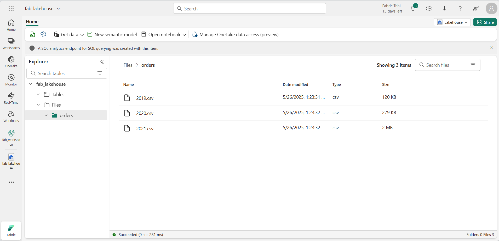

---
lab:
  title: Análisis de datos con Apache Spark
  module: Use Apache Spark to work with files in a lakehouse
---

# Análisis de datos con Apache Spark

Apache Spark es un motor de código abierto para el procesamiento de datos distribuido y se usa ampliamente para explorar, procesar y analizar grandes volúmenes de datos en el almacenamiento de lago de datos. Spark está disponible como opción de procesamiento en muchos productos de plataforma de datos, como Azure HDInsight, Azure Databricks, Azure Synapse Analytics y Microsoft Fabric. Una de las ventajas de Spark es la compatibilidad con una amplia variedad de lenguajes de programación, como Java, Scala, Python y SQL, lo que lo convierte en una solución muy flexible para cargas de trabajo de procesamiento de datos, incluida la limpieza y manipulación de datos, el análisis estadístico y el aprendizaje automático, y el análisis y la visualización de datos.

Este laboratorio tardará aproximadamente **45** minutos en completarse.

> **Nota**: Necesitarás una [evaluación gratuita de Microsoft Fabric](https://learn.microsoft.com/fabric/get-started/fabric-trial) para realizar este ejercicio.

## Creación de un área de trabajo

Antes de trabajar con datos de Fabric, cree un área de trabajo con la evaluación gratuita de Fabric habilitada.

1. En la [página principal de Microsoft Fabric](https://app.fabric.microsoft.com) en `https://app.fabric.microsoft.com`, seleccione **Ingeniería de datos de Synapse**.
1. En la barra de menús de la izquierda, seleccione **Áreas de trabajo** (el icono tiene un aspecto similar a &#128455;).
1. Cree una nueva área de trabajo con el nombre que prefiera y seleccione un modo de licencia en la sección **Avanzado** que incluya la capacidad de Fabric (*Prueba*, *Premium* o *Fabric*).
1. Cuando se abra la nueva área de trabajo, debe estar vacía.

    

## Creación de un almacén de lago y carga de archivos

Ahora que tiene un área de trabajo, es el momento de crear un almacén de lago de datos para los archivos de datos que va analizar.

1. En la página principal de **Ingeniería de datos de Synapse**, cree un nuevo **almacén de lago** con el nombre que prefiera.

    Al cabo de un minuto más o menos, se creará un nuevo almacén de lago vacío. Debe ingerir algunos datos en el almacén de lago de datos para su análisis. Hay varias maneras de hacerlo, pero en este ejercicio simplemente descargará y extraerá una carpeta de archivos de texto del equipo local (o máquina virtual de laboratorio si procede) y, luego, los cargará en el almacén de lago.

1. Descargue y extraiga los [archivos de datos](https://github.com/MicrosoftLearning/dp-data/raw/main/orders.zip) de este ejercicio desde `https://github.com/MicrosoftLearning/dp-data/raw/main/orders.zip`.

1. Después de extraer el archivo comprimido, compruebe que tiene una carpeta denominada **orders** que contiene los archivos CSV **2019.csv**, **2020.csv**y **2021.csv**.
1. Vuelva a la pestaña del explorador web que contiene el almacén de lago y, en el menú **...** de la carpeta **Archivos** del panel **Explorador**, seleccione **Cargar** y **Cargar carpeta** y, luego, cargue la carpeta **orders** del equipo local (o la máquina virtual de laboratorio, si procede) en el almacén de lago.
1. Una vez cargados los archivos, expanda **Archivos** y seleccione la carpeta **orders**; compruebe que se han cargado los archivos CSV, como se muestra aquí:

    

## Creación de un cuaderno

Para trabajar con datos en Apache Spark, puede crear un *cuaderno*. Los cuadernos proporcionan un entorno interactivo en el que puede escribir y ejecutar código (en varios lenguajes) y agregar notas para documentarlo.

1. En la página **Inicio**, mientras ve el contenido de la carpeta **orders** en el lago de datos, vaya al menú **Abrir cuaderno** y seleccione **Nuevo cuaderno**.

    Al cabo de unos segundos, se abrirá un nuevo cuaderno que contiene una sola *celda*. Los cuadernos se componen de una o varias celdas que pueden contener *código* o *Markdown* (texto con formato).

2. Seleccione la primera celda (que actualmente es una celda de *código* ) y, luego, en la barra de herramientas dinámica de su parte superior derecha, use el botón **M&#8595;** para convertir la celda en una celda de *Markdown*.

    Cuando la celda cambie a una celda de Markdown, se representará el texto que contiene.

3. Use el botón **&#128393;** (Editar) para cambiar la celda al modo de edición y, luego, modifique el Markdown de la siguiente manera:

    ```
   # Sales order data exploration

   Use the code in this notebook to explore sales order data.
    ```

4. Haga clic en cualquier parte del cuaderno fuera de la celda para dejar de editarlo y ver el Markdown representado.

## Carga de datos en un objeto DataFrame

Ahora está listo para ejecutar código que carga los datos en un objeto *DataFrame*. Los objetos DataFrame de Spark son similares a los de Pandas en Python y proporcionan una estructura común para trabajar con datos en filas y columnas.

> **Nota**: Spark admite varios lenguajes de programación, como Scala, Java y otros. En este ejercicio, se usará *PySpark*, que es una variante optimizada para Spark de Python. PySpark es uno de los lenguajes más usados en Spark y es el lenguaje predeterminado en los cuadernos de Fabric.

1. Con el cuaderno visible, en el panel **Explorador**, expanda **Lakehouses** y, después, expanda la lista **Archivos** de su instancia de Lakehouse y seleccione la carpeta **pedidos** para que los archivos CSV se muestren junto al editor de cuadernos, así:

    

1. En el menú **...** de **2019.csv**, seleccione **Cargar datos** > **Spark**. Se agregará al cuaderno una nueva celda de código que contiene el código siguiente:

    ```python
   df = spark.read.format("csv").option("header","true").load("Files/orders/2019.csv")
   # df now is a Spark DataFrame containing CSV data from "Files/orders/2019.csv".
   display(df)
    ```

    > **Sugerencia**: Puede ocultar los paneles del explorador de almacenes de lago de la izquierda mediante sus iconos **<<** . De esta forma, podrá centrarse en el cuaderno.

1. Use el botón **&#9655; Ejecutar celda** situado a la izquierda de la celda para ejecutarla.

    > **Nota**: Dado que esta es la primera vez que se ejecuta código de Spark, se debe iniciar una sesión de Spark. Esto significa que la primera ejecución de la sesión puede tardar un minuto o así en completarse. Las ejecuciones posteriores serán más rápidas.

1. Cuando se haya completado el comando de la celda, revise la salida que aparece debajo de ella, que será algo parecido a esto:

    | Índice | SO43701 | 11 | 2019-07-01 | Christy Zhu | christy12@adventure-works.com | Mountain-100 Silver, 44 | 16 | 3399,99 | 271.9992 |
    | -- | -- | -- | -- | -- | -- | -- | -- | -- | -- |
    | 1 | SO43704 | 1 | 2019-07-01 | Julio Ruiz | julio1@adventure-works.com | Mountain-100 Black, 48 | 1 | 3374,99 | 269.9992 |
    | 2 | SO43705 | 1 | 2019-07-01 | Curtis Lu | curtis9@adventure-works.com | Mountain-100 Silver, 38 | 1 | 3399,99 | 271.9992 |
    | ... | ... | ... | ... | ... | ... | ... | ... | ... | ... |

    La salida muestra las filas y columnas de datos del archivo 2019.csv. Sin embargo, observe que los encabezados de columna no parecen correctos. El código predeterminado usado para cargar los datos en un objeto DataFrame da por hecho que el archivo CSV incluye los nombres de columna en la primera fila, pero en este caso el archivo CSV solo incluye los datos sin información de encabezado.

1. Modifique el código para establecer la opción **header** en **false** de la siguiente manera:

    ```python
   df = spark.read.format("csv").option("header","false").load("Files/orders/2019.csv")
   # df now is a Spark DataFrame containing CSV data from "Files/orders/2019.csv".
   display(df)
    ```

1. Vuelva a ejecutar la celda y revise la salida, que debería parecerse a esta:

   | Índice | _c0 | _c1 | _c2 | _c3 | _c4 | _c5 | _c6 | _c7 | _c8 |
    | -- | -- | -- | -- | -- | -- | -- | -- | -- | -- |
    | 1 | SO43701 | 11 | 2019-07-01 | Christy Zhu | christy12@adventure-works.com | Mountain-100 Silver, 44 | 16 | 3399,99 | 271.9992 |
    | 2 | SO43704 | 1 | 2019-07-01 | Julio Ruiz | julio1@adventure-works.com | Mountain-100 Black, 48 | 1 | 3374,99 | 269.9992 |
    | 3 | SO43705 | 1 | 2019-07-01 | Curtis Lu | curtis9@adventure-works.com | Mountain-100 Silver, 38 | 1 | 3399,99 | 271.9992 |
    | ... | ... | ... | ... | ... | ... | ... | ... | ... | ... |

    Ahora el objeto DataFrame incluye correctamente la primera fila como valores de datos, pero los nombres de columna se generan automáticamente y no son muy útiles. Para que los datos tengan sentido, es necesario definir explícitamente el esquema y el tipo de datos correctos para los valores de datos del archivo.

1. Modifique el código de la siguiente manera para definir un esquema y aplicarlo al cargar los datos:

    ```python
   from pyspark.sql.types import *

   orderSchema = StructType([
       StructField("SalesOrderNumber", StringType()),
       StructField("SalesOrderLineNumber", IntegerType()),
       StructField("OrderDate", DateType()),
       StructField("CustomerName", StringType()),
       StructField("Email", StringType()),
       StructField("Item", StringType()),
       StructField("Quantity", IntegerType()),
       StructField("UnitPrice", FloatType()),
       StructField("Tax", FloatType())
       ])

   df = spark.read.format("csv").schema(orderSchema).load("Files/orders/2019.csv")
   display(df)
    ```

1. Ejecute la celda modificada y revise la salida, que debería parecerse a esta:

   | Índice | SalesOrderNumber | SalesOrderLineNumber | OrderDate | CustomerName | Correo electrónico | Elemento | Quantity | UnitPrice | Impuesto |
    | -- | -- | -- | -- | -- | -- | -- | -- | -- | -- |
    | 1 | SO43701 | 11 | 2019-07-01 | Christy Zhu | christy12@adventure-works.com | Mountain-100 Silver, 44 | 16 | 3399,99 | 271.9992 |
    | 2 | SO43704 | 1 | 2019-07-01 | Julio Ruiz | julio1@adventure-works.com | Mountain-100 Black, 48 | 1 | 3374,99 | 269.9992 |
    | 3 | SO43705 | 1 | 2019-07-01 | Curtis Lu | curtis9@adventure-works.com | Mountain-100 Silver, 38 | 1 | 3399,99 | 271.9992 |
    | ... | ... | ... | ... | ... | ... | ... | ... | ... | ... |

    Ahora el objeto DataFrame incluye los nombres de columna correctos (además del **índice**, que es una columna integrada en todos los objetos DataFrame en función de la posición ordinal de cada fila). Los tipos de datos de las columnas se especifican mediante un conjunto estándar de tipos definidos en la biblioteca de Spark SQL, que se importaron al principio de la celda.

1. El objeto DataFrame solo incluye los datos del archivo **2019.csv**. Modifique el código para que la ruta de acceso del archivo use un carácter comodín \* para leer los datos de los pedidos de ventas de todos los archivos de la carpeta **orders**:

    ```python
    from pyspark.sql.types import *

    orderSchema = StructType([
       StructField("SalesOrderNumber", StringType()),
       StructField("SalesOrderLineNumber", IntegerType()),
       StructField("OrderDate", DateType()),
       StructField("CustomerName", StringType()),
       StructField("Email", StringType()),
       StructField("Item", StringType()),
       StructField("Quantity", IntegerType()),
       StructField("UnitPrice", FloatType()),
       StructField("Tax", FloatType())
       ])

    df = spark.read.format("csv").schema(orderSchema).load("Files/orders/*.csv")
    display(df)
    ```

1. Ejecute la celda de código modificada y revise la salida, que ahora debe incluir las ventas de 2019, 2020 y 2021.

    **Nota**: Solo se muestra un subconjunto de las filas, por lo que es posible que no pueda ver ejemplos de todos los años.

## Exploración de datos en un objeto DataFrame

El objeto DataFrame incluye una amplia variedad de funciones que puede usar para filtrar, agrupar y manipular los datos que contiene.

### Filtrado de un objeto DataFrame

1. Agregue una nueva celda de código mediante el vínculo **+ Código** que aparece al mover el mouse debajo del lado izquierdo de la salida de la celda actual (o en la barra de menús, en la pestaña **Editar**, seleccione **+ Agregar celda de código**). Escriba el siguiente código en él.

    ```Python
   customers = df['CustomerName', 'Email']
   print(customers.count())
   print(customers.distinct().count())
   display(customers.distinct())
    ```

2. Ejecute la nueva celda de código y revise los resultados. Observe los siguientes detalles:
    - Cuando se realiza una operación en un objeto DataFrame, el resultado es un nuevo DataFrame (en este caso, se crea un nuevo DataFrame **customers** seleccionando un subconjunto específico de columnas del DataFrame **df**).
    - Los objetos DataFrame proporcionan funciones como **count** y **distinct** que se pueden usar para resumir y filtrar los datos que contienen.
    - La sintaxis `dataframe['Field1', 'Field2', ...]` es una forma abreviada de definir un subconjunto de columnas. También puede usar el método **select**, por lo que la primera línea del código anterior se podría escribir como `customers = df.select("CustomerName", "Email")`.

3. Modifique el código de la siguiente manera:

    ```Python
   customers = df.select("CustomerName", "Email").where(df['Item']=='Road-250 Red, 52')
   print(customers.count())
   print(customers.distinct().count())
   display(customers.distinct())
    ```

4. Ejecute el código modificado para ver los clientes que han comprado el producto *Road-250 Red, 52*. Tenga en cuenta que puede "encadenar" varias funciones para que la salida de una función se convierta en la entrada de la siguiente; en este caso, el objeto DataFrame creado por el método **select** es el objeto DataFrame de origen para el método **where** que se usa para aplicar criterios de filtrado.

### Agregación y agrupación de datos en un objeto DataFrame

1. Agregue una nueva celda de código al cuaderno y, luego, escriba en ella el código siguiente:

    ```Python
   productSales = df.select("Item", "Quantity").groupBy("Item").sum()
   display(productSales)
    ```

2. Ejecute la celda de código que agregó y observe que los resultados muestran la suma de las cantidades de pedido agrupadas por producto. El método **groupBy** agrupa las filas por *Item* y la función de agregado **sum** subsiguiente se aplica a todas las columnas numéricas restantes (en este caso, *Quantity*).

3. Agregue otra nueva celda de código al cuaderno y escriba en ella el código siguiente:

    ```Python
   from pyspark.sql.functions import *

   yearlySales = df.select(year(col("OrderDate")).alias("Year")).groupBy("Year").count().orderBy("Year")
   display(yearlySales)
    ```

4. Ejecute la celda de código que agregó y observe que los resultados muestran el número de pedidos de ventas por año. Observe que el método **select** incluye una función **year** de SQL para extraer el componente de año del campo *OrderDate* (motivo por el que el código incluye una instrucción **import** para importar funciones de la biblioteca Spark SQL). A continuación, se usa un método **alias** para asignar un nombre de columna al valor del año extraído. Los datos se agrupan entonces por la columna *Year* derivada y el recuento de filas de cada grupo se calcula antes de que finalmente se use el método **orderBy** para ordenar el objeto DataFrame resultante.

## Uso de Spark para transformar archivos de datos

Una tarea común para los ingenieros de datos es ingerir datos en un formato o estructura concretos y transformarlos para su posterior procesamiento o análisis.

### Uso de métodos y funciones de DataFrame para transformar datos

1. Agregue otra nueva celda de código al cuaderno y escriba en ella el código siguiente:

    ```Python
   from pyspark.sql.functions import *

   ## Create Year and Month columns
   transformed_df = df.withColumn("Year", year(col("OrderDate"))).withColumn("Month", month(col("OrderDate")))

   # Create the new FirstName and LastName fields
   transformed_df = transformed_df.withColumn("FirstName", split(col("CustomerName"), " ").getItem(0)).withColumn("LastName", split(col("CustomerName"), " ").getItem(1))

   # Filter and reorder columns
   transformed_df = transformed_df["SalesOrderNumber", "SalesOrderLineNumber", "OrderDate", "Year", "Month", "FirstName", "LastName", "Email", "Item", "Quantity", "UnitPrice", "Tax"]

   # Display the first five orders
   display(transformed_df.limit(5))
    ```

2. Ejecute el código para crear un nuevo objeto DataFrame a partir de los datos de pedido originales con las siguientes transformaciones:
    - Agregue columnas **Year** y **Month** basadas en la columna **OrderDate**.
    - Agregue columnas **FirstName** y **LastName** basadas en la columna **CustomerName**.
    - Filtre y reordene las columnas, quitando la columna **CustomerName**.

3. Revise la salida y compruebe que las transformaciones se han realizado en los datos.

    Puede usar todo el poder de la biblioteca de Spark SQL para transformar los datos filtrando filas, derivando, quitando y cambiando el nombre de columnas y aplicando cualquier otra modificación de datos necesaria.

    > **Sugerencia**: Consulte la [documentación de DataFrame de Spark](https://spark.apache.org/docs/latest/api/python/reference/pyspark.sql/dataframe.html) para más información sobre los métodos del objeto DataFrame.

### Guardado de los datos transformados

1. Agregue una nueva celda con el código siguiente para guardar el objeto DataFrame transformado en formato Parquet (sobrescriba los datos si ya existen):

    ```Python
   transformed_df.write.mode("overwrite").parquet('Files/transformed_data/orders')
   print ("Transformed data saved!")
    ```

    > **Nota**: Normalmente, el formato *Parquet* es el preferido para los archivos de datos que se emplearán en análisis posteriores o para su ingesta en un almacén analítico. Parquet es un formato muy eficaz que es compatible con la mayoría de los sistemas de análisis de datos a gran escala. De hecho, a veces el requisito de transformación de datos puede ser simplemente convertir datos de otro formato (como CSV) a Parquet.

2. Ejecute la celda y espere a que aparezca el mensaje de que se han guardado los datos. A continuación, en el panel **Lakehouses** de la izquierda, en el menú **...** del nodo **Archivos**, seleccione **Actualizar** y elija la carpeta **transformed_orders** para comprobar que contiene una nueva carpeta denominada **pedidos**, que a su vez contiene uno o varios archivos Parquet.

    

3. Agregue una nueva celda con el código siguiente para cargar un nuevo objeto DataFrame desde los archivos Parquet de la carpeta **transformed_orders/orders**:

    ```Python
   orders_df = spark.read.format("parquet").load("Files/transformed_data/orders")
   display(orders_df)
    ```

4. Ejecute la celda y compruebe que los resultados muestran los datos de pedido que se han cargado desde los archivos Parquet.

### Guardado de datos en archivos con particiones

1. Agregue una nueva celda con el código siguiente, que guarda el objeto DataFrame, y particione los datos por las columnas **Year** y **Month**:

    ```Python
   orders_df.write.partitionBy("Year","Month").mode("overwrite").parquet("Files/partitioned_data")
   print ("Transformed data saved!")
    ```

2. Ejecute la celda y espere a que aparezca el mensaje de que se han guardado los datos. A continuación, en el panel **Lakehouses** de la izquierda, en el menú **...** del nodo **Archivos**, seleccione **Actualizar** y expanda la carpeta **partitioned_orders** para comprobar que contiene una jerarquía de carpetas llamadas **Year=* xxxx***, cada una de las cuales contiene carpetas llamadas **Month=* xxxx***. Cada carpeta Month contiene un archivo Parquet con los pedidos de ese mes.

    

    La creación de particiones de archivos de datos es una manera común de optimizar el rendimiento al tratar con grandes volúmenes de datos. Esta técnica puede mejorar significativamente el rendimiento y facilitar el filtrado de datos.

3. Agregue una nueva celda con el código siguiente para cargar un nuevo objeto DataFrame desde el archivo **orders.parquet**:

    ```Python
   orders_2021_df = spark.read.format("parquet").load("Files/partitioned_data/Year=2021/Month=*")
   display(orders_2021_df)
    ```

4. Ejecute la celda y compruebe que los resultados muestran los datos de pedido de ventas de 2021. Tenga en cuenta que las columnas de partición especificadas en la ruta de acceso (**Year** y **Month**) no se incluyen en el objeto DataFrame.

## Trabajo con tablas y SQL

Como se ha visto, los métodos nativos del objeto DataFrame le permiten consultar y analizar datos de un archivo de forma bastante eficaz. Sin embargo, a muchos analistas de datos les gusta más trabajar con tablas que puedan consultar mediante la sintaxis SQL. Spark proporciona un *metastore* en el que puede definir tablas relacionales. La biblioteca de Spark SQL que proporciona el objeto DataFrame también admite el uso de instrucciones SQL para consultar tablas en el metastore. Mediante estas funcionalidades de Spark, puede combinar la flexibilidad de un lago de datos con el esquema de datos estructurado y las consultas basadas en SQL de un almacenamiento de datos relacional, de ahí el término "almacén de lago de datos".

### Creación de una tabla

Las tablas de un metastore de Spark son abstracciones relacionales de los archivos del lago de datos. Las tablas pueden ser *administradas* (en cuyo caso los archivos se administran mediante el metastore) o *externas* (en cuyo caso la tabla hace referencia a una ubicación de archivo en el lago de datos que se administra de forma independiente al metastore).

1. Agregue una nueva celda de código al cuaderno y escriba el código siguiente, que guarda el objeto DataFrame de los datos de pedidos de ventas en una tabla llamada **salesorders**:

    ```Python
   # Create a new table
   df.write.format("delta").saveAsTable("salesorders")

   # Get the table description
   spark.sql("DESCRIBE EXTENDED salesorders").show(truncate=False)
    ```

    > **Nota**: Merece la pena señalar un par de cosas sobre este ejemplo. En primer lugar, no se proporciona ninguna ruta de acceso explícita, por lo que el metastore administrará los archivos de la tabla. En segundo lugar, la tabla se guarda en formato **Delta**. Puede crear tablas basadas en varios formatos de archivo (incluidos CSV, Parquet, Avro y otros), pero *Delta Lake* es una tecnología de Spark que agrega funcionalidades de base de datos relacional a tablas, lo que incluye la compatibilidad con transacciones, versiones de fila y otras características útiles. La creación de tablas en formato Delta es más conveniente para almacenes de lago de datos de Fabric.

2. Ejecute la celda de código y revise la salida, que describe la definición de la nueva tabla.

3. En **Lakehouses**, en el menú **...** de la carpeta **Tablas**, seleccione **Actualizar**. A continuación, expanda el nodo **Tablas** y compruebe que se ha creado la tabla **salesorders**.

    

5. En el menú **...** de la tabla **salesorders**, seleccione **Cargar datos** > **Spark**.

    Se agrega al cuaderno una nueva celda de código que contiene código similar al siguiente:

    ```Python
   df = spark.sql("SELECT * FROM [your_lakehouse].salesorders LIMIT 1000")
   display(df)
    ```

6. Ejecute el nuevo código, que usa la biblioteca de Spark SQL para insertar una consulta SQL en la tabla **salesorder** en código de PySpark y cargar los resultados de la consulta en un objeto DataFrame.

### Ejecución de código SQL en una celda

Aunque resulta útil poder insertar instrucciones SQL en una celda que contenga código de PySpark, los analistas de datos suelen preferir trabajar directamente en SQL.

1. Agregue una nueva celda de código al cuaderno y, luego, escriba en ella el código siguiente:

    ```sql
   %%sql
   SELECT YEAR(OrderDate) AS OrderYear,
          SUM((UnitPrice * Quantity) + Tax) AS GrossRevenue
   FROM salesorders
   GROUP BY YEAR(OrderDate)
   ORDER BY OrderYear;
    ```

2. Ejecute la celda y revise los resultados. Observe lo siguiente:
    - La línea `%%sql` al principio de la celda (llamada *magic*) indica que se debe usar el entorno de ejecución del lenguaje Spark SQL para ejecutar el código en esta celda en lugar de PySpark.
    - El código SQL hace referencia a la tabla **salesorders** que creó anteriormente.
    - La salida de la consulta SQL se muestra automáticamente como resultado en la celda.

> **Nota**: Para más información sobre Spark SQL y los objetos DataFrame, consulte la [documentación de Spark SQL](https://spark.apache.org/docs/2.2.0/sql-programming-guide.html).

## Visualización de datos con Spark

Proverbialmente, una imagen vale más que mil palabras, y un gráfico suele ser mejor que mil filas de datos. Aunque los cuadernos de Fabric incluyen una vista de gráfico integrada para los datos que se muestran de un objeto DataFrame o una consulta de Spark SQL, no están diseñados para crear gráficos completos. Sin embargo, puede usar bibliotecas de gráficos de Python como **matplotlib** y **seaborn** para crear gráficos a partir de datos de objetos DataFrame.

### Visualización de los resultados en un gráfico

1. Agregue una nueva celda de código al cuaderno y, luego, escriba en ella el código siguiente:

    ```sql
   %%sql
   SELECT * FROM salesorders
    ```

2. Ejecute el código y observe que devuelve los datos de la vista **salesorders** que creó anteriormente.
3. En la sección de resultados debajo de la celda, cambie la opción **Ver** de **Tabla** a **Gráfico**.
4. Use el botón **Personalizar gráfico** situado en la parte superior derecha del gráfico para mostrar el panel de opciones del gráfico. A continuación, establezca las opciones como se indica a continuación y seleccione **Aplicar**:
    - **Tipo de gráfico:**  Gráfico de barras.
    - **Clave**: Elemento.
    - **Valores**: Cantidad.
    - **Grupo de series**: *déjelo en blanco*.
    - **Agregación**: Suma.
    - **Apilado**: *No seleccionado*.

5. Compruebe que el gráfico se parece a este:

    

### Introducción a **matplotlib**

1. Agregue una nueva celda de código al cuaderno y, luego, escriba en ella el código siguiente:

    ```Python
   sqlQuery = "SELECT CAST(YEAR(OrderDate) AS CHAR(4)) AS OrderYear, \
                   SUM((UnitPrice * Quantity) + Tax) AS GrossRevenue \
               FROM salesorders \
               GROUP BY CAST(YEAR(OrderDate) AS CHAR(4)) \
               ORDER BY OrderYear"
   df_spark = spark.sql(sqlQuery)
   df_spark.show()
    ```

2. Ejecute el código y observe que devuelve un objeto DataFrame de Spark que contiene los ingresos anuales.

    Para visualizar los datos en un gráfico, comenzaremos usando la biblioteca **matplotlib** de Python. Esta biblioteca es la biblioteca de trazado principal en la que se basan muchas otras y proporciona una gran flexibilidad en la creación de gráficos.

3. Agregue una nueva celda de código al cuaderno y escriba en ella el código siguiente:

    ```Python
   from matplotlib import pyplot as plt

   # matplotlib requires a Pandas dataframe, not a Spark one
   df_sales = df_spark.toPandas()

   # Create a bar plot of revenue by year
   plt.bar(x=df_sales['OrderYear'], height=df_sales['GrossRevenue'])

   # Display the plot
   plt.show()
    ```

4. Ejecute la celda y revise los resultados, que constan de un gráfico de columnas con los ingresos brutos totales de cada año. Observe las siguientes características del código usado para generar este gráfico:
    - La biblioteca **matplotlib** requiere un objeto DataFrame de *Pandas*, por lo que debe convertir a este formato el objeto DataFrame de *Spark* devuelto en la consulta de Spark SQL.
    - En el centro de la biblioteca **matplotlib** se encuentra el objeto **pyplot**. Esta es la base de la mayor parte de la funcionalidad de trazado.
    - La configuración predeterminada da como resultado un gráfico utilizable, pero hay un margen considerable para personalizarla.

5. Modifique el código para trazar el gráfico de la siguiente manera:

    ```Python
   from matplotlib import pyplot as plt

   # Clear the plot area
   plt.clf()

   # Create a bar plot of revenue by year
   plt.bar(x=df_sales['OrderYear'], height=df_sales['GrossRevenue'], color='orange')

   # Customize the chart
   plt.title('Revenue by Year')
   plt.xlabel('Year')
   plt.ylabel('Revenue')
   plt.grid(color='#95a5a6', linestyle='--', linewidth=2, axis='y', alpha=0.7)
   plt.xticks(rotation=45)

   # Show the figure
   plt.show()
    ```

6. Vuelva a ejecutar la celda de código y observe los resultados. El gráfico ahora incluye un poco más de información.

    Un gráfico está técnicamente contenido con una **Figura**. En los ejemplos anteriores, la figura se creó implícitamente; pero puede crearla explícitamente.

7. Modifique el código para trazar el gráfico de la siguiente manera:

    ```Python
   from matplotlib import pyplot as plt

   # Clear the plot area
   plt.clf()

   # Create a Figure
   fig = plt.figure(figsize=(8,3))

   # Create a bar plot of revenue by year
   plt.bar(x=df_sales['OrderYear'], height=df_sales['GrossRevenue'], color='orange')

   # Customize the chart
   plt.title('Revenue by Year')
   plt.xlabel('Year')
   plt.ylabel('Revenue')
   plt.grid(color='#95a5a6', linestyle='--', linewidth=2, axis='y', alpha=0.7)
   plt.xticks(rotation=45)

   # Show the figure
   plt.show()
    ```

8. Vuelva a ejecutar la celda de código y observe los resultados. La figura determina la forma y el tamaño del trazado.

    Una figura puede contener varios subtrazados, cada uno en su propio *eje*.

9. Modifique el código para trazar el gráfico de la siguiente manera:

    ```Python
   from matplotlib import pyplot as plt

   # Clear the plot area
   plt.clf()

   # Create a figure for 2 subplots (1 row, 2 columns)
   fig, ax = plt.subplots(1, 2, figsize = (10,4))

   # Create a bar plot of revenue by year on the first axis
   ax[0].bar(x=df_sales['OrderYear'], height=df_sales['GrossRevenue'], color='orange')
   ax[0].set_title('Revenue by Year')

   # Create a pie chart of yearly order counts on the second axis
   yearly_counts = df_sales['OrderYear'].value_counts()
   ax[1].pie(yearly_counts)
   ax[1].set_title('Orders per Year')
   ax[1].legend(yearly_counts.keys().tolist())

   # Add a title to the Figure
   fig.suptitle('Sales Data')

   # Show the figure
   plt.show()
    ```

10. Vuelva a ejecutar la celda de código y observe los resultados. La figura contiene las subtrazados especificados en el código.

> **Nota**: Para más información sobre el trazado con matplotlib, consulte la [documentación de matplotlib](https://matplotlib.org/).

### Uso de la biblioteca **seaborn**

Aunque **matplotlib** permite crear gráficos complejos de varios tipos, puede que sea necesario código complejo para lograr los mejores resultados. Por esta razón, a lo largo de los años, se han creado muchas bibliotecas nuevas sobre la base de matplotlib para abstraer su complejidad y mejorar sus capacidades. Una de estas bibliotecas es **seaborn**.

1. Agregue una nueva celda de código al cuaderno y, luego, escriba en ella el código siguiente:

    ```Python
   import seaborn as sns

   # Clear the plot area
   plt.clf()

   # Create a bar chart
   ax = sns.barplot(x="OrderYear", y="GrossRevenue", data=df_sales)
   plt.show()
    ```

2. Ejecute el código y observe que se muestra un gráfico de barras usando la biblioteca seaborn.
3. Modifique el código de la siguiente manera:

    ```Python
   import seaborn as sns

   # Clear the plot area
   plt.clf()

   # Set the visual theme for seaborn
   sns.set_theme(style="whitegrid")

   # Create a bar chart
   ax = sns.barplot(x="OrderYear", y="GrossRevenue", data=df_sales)
   plt.show()
    ```

4. Ejecute el código modificado y observe que seaborn le permite establecer un tema de color coherente para sus trazados.

5. Vuelva a modificar el código de la siguiente manera:

    ```Python
   import seaborn as sns

   # Clear the plot area
   plt.clf()

   # Create a line chart
   ax = sns.lineplot(x="OrderYear", y="GrossRevenue", data=df_sales)
   plt.show()
    ```

6. Ejecute el código modificado para ver los ingresos anuales en gráfico de líneas.

> **Nota**: Para más información sobre el trazado con seaborn, consulte la [documentación de seaborn](https://seaborn.pydata.org/index.html).

## Guardado del cuaderno y finalización de la sesión con Spark

Ahora que ha terminado de trabajar con los datos, puede guardar el cuaderno con un nombre descriptivo y finalizar la sesión con Spark.

1. En la barra de menús del cuaderno, use el icono ⚙️ **Configuración** para ver la configuración del cuaderno.
2. Establezca el **nombre** del cuaderno en **Explorar pedidos de ventas** y, luego, cierre el panel de configuración.
3. En el menú del cuaderno, seleccione **Detener sesión** para finalizar la sesión con Spark.

## Limpieza de recursos

En este ejercicio, ha aprendido a usar Spark para trabajar con datos en Microsoft Fabric.

Si ha terminado de explorar el almacén de lago, puede eliminar el área de trabajo que ha creado para este ejercicio.

1. En la barra de la izquierda, seleccione el icono del área de trabajo para ver todos los elementos que contiene.
2. En el menú **...** de la barra de herramientas, seleccione **Configuración del área de trabajo**.
3. En la sección **Otros**, seleccione **Quitar esta área de trabajo**.
