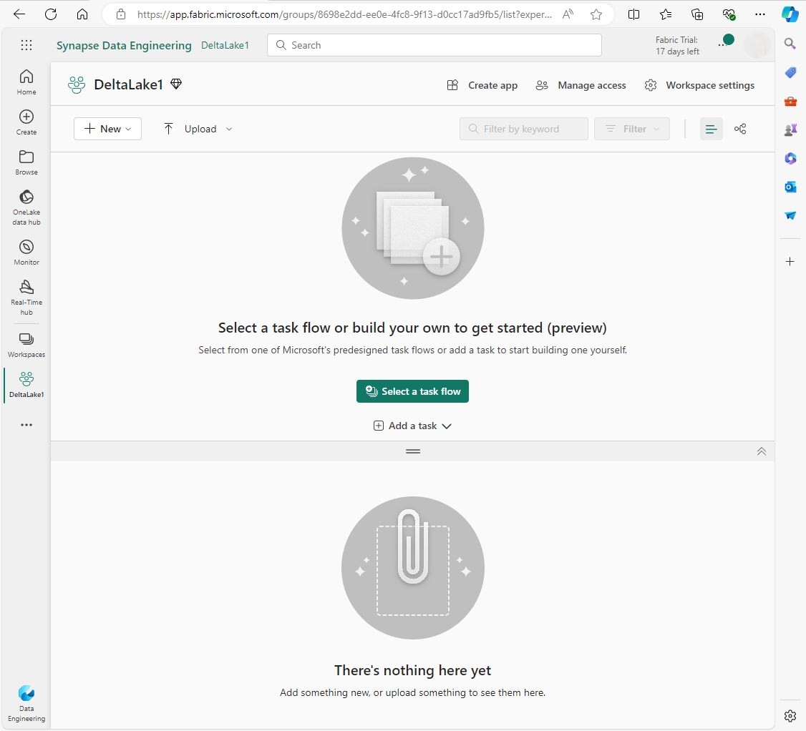

---
lab:
  title: Uso de tablas Delta en Apache Spark
  module: Work with Delta Lake tables in Microsoft Fabric
---

# Uso de tablas Delta en Apache Spark

Las tablas de un almacén de lago de Microsoft Fabric se basan en el formato Delta Lake de código abierto. Delta Lake agrega compatibilidad con la semántica relacional para los datos por lotes y de streaming. En este ejercicio, crearás tablas Delta y explorarás los datos mediante consultas SQL.

Este ejercicio debería tardar en completarse 45 minutos aproximadamente

> [!NOTE]
> Necesitarás una versión de prueba de [Microsoft Fabric](/fabric/get-started/fabric-trial) para realizar este ejercicio.

## Creación de un área de trabajo

Primero, crea un área de trabajo con la *versión de prueba* de Fabric habilitada.

1. En la página principal de Microsoft Fabric en https://app.fabric.microsoft.com, selecciona la experiencia **Synapse: ingeniería de datos**.
1. En la barra de menús de la izquierda, selecciona el **Áreas de trabajo** (🗇).
1. Crea una **nueva área de trabajo** con el nombre que prefieras y selecciona un modo de licencia que incluya capacidad de Fabric (versión de prueba, Premium o Fabric).
1. Cuando se abra la nueva área de trabajo, debe estar vacía.



## Creación de un almacén de lago y carga de datos

Ahora que tienes un área de trabajo, es el momento de crear un almacén de lago de datos y cargar algunos archivos.

1. En la página principal de **Synapse :Ingeniería de datos**, crea un nuevo **almacén de lago** con el nombre que prefieras. 
1. Hay varias maneras de ingerir datos, pero en este ejercicio descargarás un archivo de texto en el equipo local (o máquina virtual de laboratorio, si procede) y, luego, lo cargarás en el almacén de lago. Descarga el [archivo de datos](https://github.com/MicrosoftLearning/dp-data/raw/main/products.csv) de https://github.com/MicrosoftLearning/dp-data/raw/main/products.csv, guárdalo como *products.csv*.
1.  Vuelve a la pestaña del explorador web que contiene el almacén de lago y, en el panel Explorador, junto a la carpeta **Archivos**, selecciona ... menú.  Crea una **Nueva subcarpeta** denominada *products*.
1.  En ... menú de la carpeta products, **carga** el archivo *products.csv* desde el equipo local (o máquina virtual de laboratorio, si procede).
1.  Una vez cargado el archivo, selecciona la carpeta **products** y comprueba que se ha cargado el archivo, como se muestra aquí:


  
## Exploración de datos en DataFrame

1.  Crea un **nuevo cuaderno**. Al cabo de unos segundos, se abrirá un nuevo cuaderno que contiene una sola celda. Los cuadernos se componen de una o varias celdas que pueden contener código o Markdown (texto con formato).
2.  Selecciona la primera celda (que actualmente es una celda de código) y, luego, en la barra de herramientas en la parte superior derecha, usa el botón **M↓** para convertirla en una celda de Markdown. El texto dentro de la celda se mostrará como texto con formato. Usa las celdas de Markdown para proporcionar información explicativa sobre el código.
3.  Usa el botón 🖉 (Editar) para cambiar la celda al modo de edición y, luego, modifica el Markdown de la siguiente manera:

```markdown
# Delta Lake tables 
Use this notebook to explore Delta Lake functionality 
```

4. Haz clic en cualquier parte del cuaderno fuera de la celda para dejar de editarlo y ver el Markdown representado.
5. Agrega una nueva celda de código y agrega el código siguiente para leer los datos de productos en un DataFrame mediante un esquema definido:

```python
from pyspark.sql.types import StructType, IntegerType, StringType, DoubleType

# define the schema
schema = StructType() \
.add("ProductID", IntegerType(), True) \
.add("ProductName", StringType(), True) \
.add("Category", StringType(), True) \
.add("ListPrice", DoubleType(), True)

df = spark.read.format("csv").option("header","true").schema(schema).load("Files/products/products.csv")
# df now is a Spark DataFrame containing CSV data from "Files/products/products.csv".
display(df)
```

> [!TIP]
> Oculta o muestra los paneles del explorador mediante el icono del botón de contenido adicional «. Esto te permite centrarte en el cuaderno o en los archivos.

7. Usa el botón **Ejecutar celda** (▷) situado a la izquierda de la celda para ejecutarla.

> [!NOTE]
> Dado que esta es la primera vez que ejecutas código en este cuaderno, debes iniciar una sesión con Spark. Esto significa que la primera ejecución puede tardar un minuto en completarse. Las ejecuciones posteriores serán más rápidas.

8. Cuando se haya completado el código de celda, revisa la salida que aparece debajo de ella, que será algo parecido a esto:


 
## Creación de tablas Delta

Puedes guardar el DataFrame como una tabla Delta mediante el método *saveAsTable*. Delta Lake admite la creación de tablas administradas y externas:

* Las tablas Delta **administradas** se benefician del mayor rendimiento, ya que Fabric administra los metadatos del esquema y los archivos de datos.
* Las tablas **externas** permiten almacenar datos externamente, con los metadatos administrados por Fabric.

### Creación de una tabla administrada

Los archivos de datos se crean en la carpeta **Tables**.

1. En los resultados devueltos por la primera celda de código, usa el icono + Código para agregar una nueva celda de código.

> [!TIP]
> Para ver el icono + Código, mueve el ratón hasta justo debajo y a la izquierda de la salida de la celda actual. Como alternativa, en la barra de menús, en la pestaña Editar, selecciona **+ Agregar celda de código**.

2. Crea una tabla Delta administrada, agrega una nueva celda, escribe el siguiente código y, después, ejecútala:

```python
df.write.format("delta").saveAsTable("managed_products")
```

3.  En el panel del explorador del almacén de lago, **actualiza** la carpeta Tables y amplía el nodo Tables para comprobar que se ha creado la tabla **managed_products**.

>[!NOTE]
> El icono de triángulo situado junto al nombre de archivo indica una tabla Delta.

Los archivos de la tabla administrada se almacenan en la carpeta **Tables** del almacén de lago. Se ha creado una carpeta llamada *managed_products* para almacenar los archivos Parquet y la carpeta delta_log para la tabla que has creado.

### Creación de una tabla externa

También puedes crear tablas externas, que se pueden almacenar en algún lugar distinto del almacén de lago, con los metadatos de esquema almacenados en el almacén de lago.

1.  En el panel Explorador del almacén de lago, en ... menú de la carpeta **Archivos**, selecciona **Copiar ruta de acceso de ABFS**. La ruta de acceso de ABFS es la ruta de acceso completa a la carpeta Archivos del almacén de lago.

2.  En una nueva celda de código, pega la ruta de acceso de ABFS. Agrega el código siguiente mediante cortar y pegar para insertar abfs_path en el lugar correcto en el código:

```python
df.write.format("delta").saveAsTable("external_products", path="abfs_path/external_products")
```

La ruta de acceso completa debe ser similar a la siguiente:

```python
abfss://workspace@tenant-onelake.dfs.fabric.microsoft.com/lakehousename.Lakehouse/Files/external_products
```

4. **Ejecuta** la celda para guardar el DataFrame como una tabla externa en la carpeta Files/external_products.

5.  En el panel Explorador del almacén de lago, **actualiza** la carpeta Tables y amplía el nodo Tables. Comprueba que se ha creado la tabla external_products que contiene los metadatos del esquema.

6.  En el panel Explorador del almacén de lago, en ... menú de la carpeta Archivos, selecciona **Actualizar**. A continuación, expande el nodo Archivos y comprueba que se ha creado la carpeta external_products para los archivos de datos de la tabla.

### Comparación de tablas administradas y externas

Vamos a explorar las diferencias entre tablas administradas y externas mediante el comando mágico %%sql.

1. En la nueva celda de código, ejecuta el código siguiente:

```pthon
%%sql
DESCRIBE FORMATTED managed_products;
```

2. En los resultados, mira la propiedad Location de la tabla. Haz clic en el valor Location de la columna Tipo de datos para ver la ruta de acceso completa. Observa que la ubicación de almacenamiento de OneLake termina con /Tables/managed_products.

3. Modifica el comando DESCRIBE para mostrar los detalles de la tabla external_products como se muestra aquí:

```python
%%sql
DESCRIBE FORMATTED external_products;
```

4. Ejecuta la celda y, en los resultados, mira la propiedad Location de la tabla. Amplía la columna Tipo de datos para ver la ruta de acceso completa y observa que las ubicaciones de almacenamiento de OneLake terminan con /Files/external_products.

5. En la nueva celda de código, ejecuta el código siguiente:

```python
%%sql
DROP TABLE managed_products;
DROP TABLE external_products;
```

6. En el panel explorador del almacén de lago, **actualiza** la carpeta Tables para comprobar que no se muestran tablas en el nodo Tables.
7.  En el panel Explorador del almacén de lago, **actualiza** la carpeta Archivos y comprueba que la tabla external_products *no* se ha eliminado. Selecciona esta carpeta para ver los archivos de datos de Parquet y la carpeta _delta_log. 

Los metadatos de la tabla externa se eliminaron, pero no el archivo de datos.

## Uso de SQL para crear una tabla Delta

Ahora crearás una tabla Delta con el comando magic %%sql. 

1. Agrega otra celda de código y escribe el código siguiente:

```python
%%sql
CREATE TABLE products
USING DELTA
LOCATION 'Files/external_products';
```

2. En el panel Explorador del almacén de lago, en ... menú de la carpeta **Tables** selecciona **Actualizar**. A continuación, expanda el nodo Tables y comprueba que aparece una nueva tabla llamada *products*. A continuación, expande la tabla para ver el esquema.

3. Agrega otra celda de código y escribe el código siguiente:

```python
%%sql
SELECT * FROM products;
```

## Exploración del control de versiones de tabla

El historial de transacciones de las tablas Delta se almacena en archivos JSON en la carpeta delta_log. Puedes usar este registro de transacciones para administrar el control de versiones de los datos.

1.  Agrega una nueva celda de código al cuaderno y ejecuta el código siguiente que implementa una reducción del 10 % en el precio de las bicicletas de montaña:

```python
%%sql
UPDATE products
SET ListPrice = ListPrice * 0.9
WHERE Category = 'Mountain Bikes';
```

2. Agrega otra celda de código y escribe el código siguiente:

```python
%%sql
DESCRIBE HISTORY products;
```

Los resultados muestran el historial de transacciones registradas para la tabla.

3.  Agrega otra celda y escribe el código siguiente:

```python
delta_table_path = 'Files/external_products'
# Get the current data
current_data = spark.read.format("delta").load(delta_table_path)
display(current_data)

# Get the version 0 data
original_data = spark.read.format("delta").option("versionAsOf", 0).load(delta_table_path)
display(original_data)
```

Se devuelven dos conjuntos de resultados: uno que contiene los datos después de la reducción de precios y el otro que muestra la versión original de los datos.

## Análisis de datos de tabla Delta con consultas SQL

Con el comando magic de SQL, puedes usar la sintaxis SQL en lugar de Pyspark. Aquí crearás una vista temporal a partir de la tabla products mediante una instrucción `SELECT`.

1. Agrega una nueva celda de código y ejecuta el código siguiente para crear y mostrar la vista temporal:

```python
%%sql
-- Create a temporary view
CREATE OR REPLACE TEMPORARY VIEW products_view
AS
    SELECT Category, COUNT(*) AS NumProducts, MIN(ListPrice) AS MinPrice, MAX(ListPrice) AS MaxPrice, AVG(ListPrice) AS AvgPrice
        FROM products
        GROUP BY Category;

SELECT *
    FROM products_view
    ORDER BY Category;
        
```

2. Agrega una nueva celda de código y ejecuta el código siguiente para devolver las 10 categorías principales por número de productos:

```python
%%sql
SELECT Category, NumProducts
    FROM products_view
    ORDER BY NumProducts DESC
    LIMIT 10;
```

Cuando se devuelvan los datos, selecciona la vista **Gráfico** para mostrar un gráfico de barras.


Como alternativa, puedes ejecutar una consulta SQL mediante PySpark.

1. Agrega una nueva celda de código y ejecuta el código siguiente:

```python
from pyspark.sql.functions import col, desc

df_products = spark.sql("SELECT Category, MinPrice, MaxPrice, AvgPrice FROM products_view").orderBy(col("AvgPrice").desc())
display(df_products.limit(6))
```

## Uso de tablas Delta para datos de streaming

Delta Lake admite datos de streaming. Las tablas Delta pueden ser un receptor o un origen para flujos de datos creados mediante Spark Structured Streaming API. En este ejemplo, usarás una tabla Delta como receptor para algunos datos de streaming en un escenario simulado de Internet de las cosas (IoT).

1.  Agrega una nueva celda de código con el código siguiente y ejecútalo:

```python
from notebookutils import mssparkutils
from pyspark.sql.types import *
from pyspark.sql.functions import *

# Create a folder
inputPath = 'Files/data/'
mssparkutils.fs.mkdirs(inputPath)

# Create a stream that reads data from the folder, using a JSON schema
jsonSchema = StructType([
StructField("device", StringType(), False),
StructField("status", StringType(), False)
])
iotstream = spark.readStream.schema(jsonSchema).option("maxFilesPerTrigger", 1).json(inputPath)

# Write some event data to the folder
device_data = '''{"device":"Dev1","status":"ok"}
{"device":"Dev1","status":"ok"}
{"device":"Dev1","status":"ok"}
{"device":"Dev2","status":"error"}
{"device":"Dev1","status":"ok"}
{"device":"Dev1","status":"error"}
{"device":"Dev2","status":"ok"}
{"device":"Dev2","status":"error"}
{"device":"Dev1","status":"ok"}'''

mssparkutils.fs.put(inputPath + "data.txt", device_data, True)

print("Source stream created...")
```

Asegúrate de que se muestra el mensaje *Flujo de origen creado...* . El código que acabas de ejecutar ha creado un origen de datos de streaming basado en una carpeta en la que se han guardado algunos datos, que representan lecturas de dispositivos IoT hipotéticos.

2. En la nueva celda de código, agrega el código siguiente:

```python
# Write the stream to a delta table
delta_stream_table_path = 'Tables/iotdevicedata'
checkpointpath = 'Files/delta/checkpoint'
deltastream = iotstream.writeStream.format("delta").option("checkpointLocation", checkpointpath).start(delta_stream_table_path)
print("Streaming to delta sink...")
```

Este código escribe los datos del dispositivo de streaming en formato Delta en una carpeta llamada iotdevicedata. Como la ruta de acceso de la ubicación de carpeta es la carpeta Tablas, se creará automáticamente una tabla para ella.

3. En la nueva celda de código, agrega el código siguiente:

```python
%%sql
SELECT * FROM IotDeviceData;
```

Este código consulta la tabla IotDeviceData, que contiene los datos del dispositivo del origen de streaming.

4. En la nueva celda de código, agrega el código siguiente:

```python
# Add more data to the source stream
more_data = '''{"device":"Dev1","status":"ok"}
{"device":"Dev1","status":"ok"}
{"device":"Dev1","status":"ok"}
{"device":"Dev1","status":"ok"}
{"device":"Dev1","status":"error"}
{"device":"Dev2","status":"error"}
{"device":"Dev1","status":"ok"}'''

mssparkutils.fs.put(inputPath + "more-data.txt", more_data, True)
```

Este código escribe datos de dispositivo más hipotéticos en el origen de streaming.

5. Vuelve a ejecutar la celda que contiene el código siguiente:

```python
%%sql
SELECT * FROM IotDeviceData;
```

Este código consulta de nuevo la tabla IotDeviceData, que ahora debe incluir los datos adicionales que se agregaron al origen de streaming.

6. En una nueva celda de código, agrega código para detener la secuencia y ejecutar la celda:

```python
deltastream.stop()
```

## Limpieza de recursos

En este ejercicio, has aprendido a trabajar con tablas Delta en Microsoft Fabric.

Si has terminado de explorar el almacén de lago, puedes eliminar el área de trabajo que has creado para este ejercicio.

1. En la barra de la izquierda, selecciona el icono del área de trabajo para ver todos los elementos que contiene.
2. En ... menú de la barra de herramientas, selecciona **Configuración del área de trabajo**.
3. En la sección General, selecciona **Quitar esta área de trabajo**.
