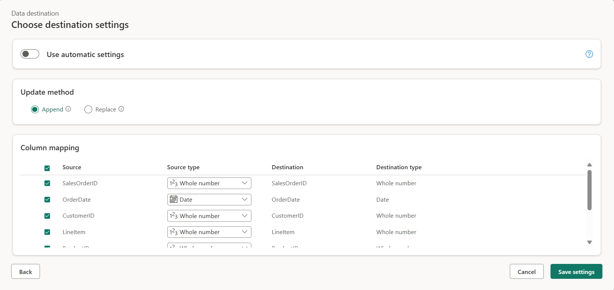

---
lab:
  title: "Creación y uso de flujos de datos (Gen2) en Microsoft\_Fabric"
  module: Ingest Data with Dataflows Gen2 in Microsoft Fabric
---

# Creación y uso de un flujo de datos (Gen2) en Microsoft Fabric

En Microsoft Fabric, los flujos de datos (Gen2) se conectan a varios orígenes de datos y realizan transformaciones en Power Query Online. Luego, se pueden usar en canalizaciones de datos para ingerir datos en un almacén de lago u otro almacén analítico, o para definir un conjunto de datos para un informe de Power BI.

Este laboratorio está diseñado para introducir los distintos elementos de los flujos de datos (Gen2) y no para crear una solución compleja que pueda existir en una empresa. Este laboratorio se realiza en **30 minutos aproximadamente**.

> **Nota**: Necesitará una [evaluación gratuita de Microsoft Fabric](https://learn.microsoft.com/fabric/get-started/fabric-trial) para realizar este ejercicio.

## Creación de un área de trabajo

Antes de trabajar con datos de Fabric, cree un área de trabajo con la evaluación gratuita de Fabric habilitada.

1. En la [página principal de Microsoft Fabric](https://app.fabric.microsoft.com), seleccione **Ingeniería de datos de Synapse**.
1. En la barra de menús de la izquierda, seleccione **Áreas de trabajo** (el icono tiene un aspecto similar a &#128455;).
1. Cree una nueva área de trabajo con el nombre que prefiera y seleccione un modo de licencia que incluya capacidad de Fabric (*Evaluación gratuita*, *Prémium* o *Fabric*).
1. Cuando se abra la nueva área de trabajo, debe estar vacía.

    

## Crear un almacén de lago

Ahora que tiene un área de trabajo, es el momento de crear un almacén de lago de datos en el cual ingerirá los datos.

1. En la página principal de **Ingeniería de datos de Synapse**, cree un nuevo **almacén de lago** con el nombre que prefiera.

    Al cabo de un minuto más o menos, se creará un nuevo almacén de lago vacío.

 

## Creación de un flujo de datos (Gen2) para ingerir datos

Ahora que tiene un almacén de lago, debe ingerir en él algunos datos. Una manera de hacerlo es definir un flujo de datos que encapsula un proceso de *extracción, transformación y carga* (ETL).

1. En la página principal del área de trabajo, seleccione **Nuevo flujo de datos Gen2**. Al cabo de unos segundos, se abre el Editor de Power Query para el nuevo flujo de datos, como se muestra aquí.

 

2. Seleccione **Importar desde un archivo de texto o CSV** y cree un nuevo origen de datos con la siguiente configuración:
 - **Vínculo al archivo**: *Seleccionado*.
 - **URL o ruta del archivo**: `https://raw.githubusercontent.com/MicrosoftLearning/dp-data/main/orders.csv`.
 - **Conexión**: Crear nueva conexión.
 - **Puerta de enlace de datos**: (ninguna).
 - **Tipo de autenticación**: Anónima.

3. Seleccione **Siguiente** para obtener una vista previa de los datos del archivo y, luego **Crear** para crear el origen de datos. El Editor de Power Query muestra el origen de datos y un conjunto inicial de pasos de consulta para dar formato a los datos, como se muestra aquí:

 

4. En la cinta de la barra de herramientas, seleccione la pestaña **Agregar columna**. A continuación, seleccione **Columna personalizada** y cree una nueva columna.

5. Establezca el *Nuevo nombre de columna* en `MonthNo`, establezca el *Tipo de datos* en **Número entero** y agregue la siguiente fórmula: `Date.Month([OrderDate])`, tal y como se muestra aquí:

 

6. Seleccione **Aceptar** para crear la columna y observe cómo se agrega el paso para agregar la columna personalizada a la consulta. La columna resultante se muestra en el panel de datos:

 

> **Sugerencia:** En el panel "Configuración de la consulta" del lado derecho, observe que los **pasos aplicados** incluyen cada paso de transformación. En la parte inferior, también puede alternar el botón **Flujo de diagrama** para activar el diagrama visual de los pasos.
>
> Los pasos se pueden mover hacia arriba o hacia abajo, se pueden editar seleccionando el icono de engranaje y puede seleccionar cada paso para ver las transformaciones que se aplican en el panel de vista previa.

7. Compruebe y confirme que el tipo de datos de la columna **OrderDate** está establecido en **Date** y el tipo de datos de la columna recién creada **MonthNo** esté establecido en **Número entero**.

## Adición de un destino de datos al flujo de datos

1. En la cinta de opciones de la barra de herramientas, seleccione la pestaña **Inicio**. A continuación, en el menú desplegable **Agregar destino de datos**, seleccione **Almacén de lago**.

   > **Nota:** Si esta opción está atenuada, es posible que ya tenga un conjunto de destino de datos. Compruebe el destino de los datos en la parte inferior del panel "Configuración de la consulta" en el lado derecho del Editor de Power Query. Si ya se ha establecido un destino, puede cambiarlo con el engranaje.

2. En el cuadro de diálogo **Conectarse al destino de datos**, edite la conexión e inicie sesión con su cuenta organizativa de Power BI para establecer la identidad que usa el flujo de datos para acceder al almacén de lago.

 

3. Seleccione **Siguiente** y, en la lista de áreas de trabajo disponibles, busque el área de trabajo y seleccione el almacén de lago que creó al principio de este ejercicio. A continuación, especifique una nueva tabla llamada **orders**:

   

4. En la página **Elegir configuración de destino**, seleccione **Anexar** y, luego, **Guardar configuración**.
    > **Nota:** se recomienda usar el editor de *Power Query* para actualizar los tipos de datos, pero también es posible hacerlo desde esta página, si lo prefiere.

    

5. En la barra de menús, abra **Vista** y seleccione **Vista de diagrama**. Tenga en cuenta que el destino **Almacén de lago** se indica con un icono en la consulta en el Editor de Power Query.

   

6. Seleccione **Publicar** para publicar el flujo de datos. A continuación, espere a que se cree el flujo de datos **Dataflow 1** en el área de trabajo.

7. Una vez publicado, puede hacer clic en los puntos suspensivos **(...)** junto al flujo de datos del área de trabajo, seleccione **Propiedades**y cambie el nombre del flujo de datos.

## Adición de un flujo de datos a una canalización

Puede incluir un flujo de datos como actividad en una canalización. Las canalizaciones se usan para orquestar las actividades de ingesta y procesamiento de datos, lo que permite combinar flujos de datos con otros tipos de operaciones en un único proceso programado. Se pueden crear canalizaciones en unas cuantas experiencias diferentes, incluida la experiencia Data Factory.

1. En el área de trabajo habilitada para Fabric, asegúrese de que todavía está en la experiencia **Ingeniería de datos**. Seleccione **Nueva**, **Canalización de datos** y, cuando se le solicite, cree una canalización llamada **Cargar datos**.

   Se abre el editor de canalizaciones.

   

   > **Sugerencia**: Si el Asistente para copiar datos se abre automáticamente, ciérralo.

2. Seleccione **Agregar actividad de canalización** y agregue una actividad **Flujo de datos** a la canalización.

3. Con la nueva actividad **Dataflow1** seleccionada, en la pestaña **Configuración**, en la lista desplegable **Flujo de datos**, seleccione **Dataflow 1** (el flujo de datos que creó anteriormente).

   

4. En la pestaña **Inicio**, guarde la canalización con el icono **&#128427;** (*Guardar*).
5. Use el botón **&#9655; Ejecutar** para ejecutar la canalización y espere a que se complete. Esto puede tardar unos minutos.

   

6. En la barra de menús del borde izquierdo, seleccione su almacén de lago.
7. En el menú **...** de **Tablas**, seleccione **Actualizar**. A continuación, expanda **Tablas** y seleccione la tabla **orders**, que ha creado el flujo de datos.

   

> **Sugerencia**: Use el *conector de flujos de datos* de Power BI Desktop para conectarse directamente a las transformaciones de datos realizadas con el flujo de datos.
>
> También puede realizar transformaciones adicionales, publicarlas como un nuevo conjunto de datos y distribuirlas con la audiencia prevista en el caso de conjuntos de datos especializados.
>
>

## Limpieza de recursos

Si ha terminado de explorar flujos de datos en Microsoft Fabric, puede eliminar el área de trabajo que creó para este ejercicio.

1. Vaya a Microsoft Fabric en el explorador.
1. En la barra de la izquierda, seleccione el icono del área de trabajo para ver todos los elementos que contiene.
1. En el menú **...** de la barra de herramientas, seleccione **Configuración del área de trabajo**.
1. En la sección **General**, seleccione **Quitar esta área de trabajo**.
