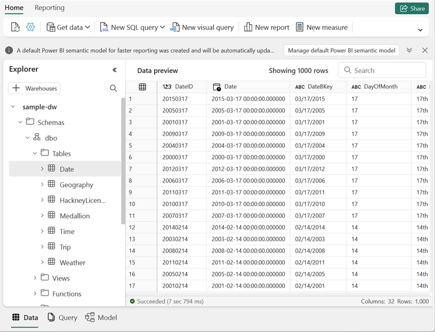

---
lab:
  title: Consulta de un almacenamiento de datos en Microsoft Fabric
  module: Query a data warehouse in Microsoft Fabric
---

# Consulta de un almacenamiento de datos en Microsoft Fabric

En Microsoft Fabric, un almacenamiento de datos proporciona una base de datos relacional para análisis a gran escala. El amplio conjunto de experiencias integradas en el área de trabajo de Microsoft Fabric permite a los clientes reducir el tiempo de obtención de información al tener un modelo semántico siempre conectado y fácil de consumir que se integra con Power BI en el modo Direct Lake. 

Este laboratorio se tarda aproximadamente **30** minutos en completarse.

> **Nota**: Necesitará una [evaluación gratuita de Microsoft Fabric](https://learn.microsoft.com/fabric/get-started/fabric-trial) para realizar este ejercicio.

## Creación de un área de trabajo

Antes de trabajar con datos de Fabric, cree un área de trabajo con la evaluación gratuita de Fabric habilitada.

1. En la [página principal de Microsoft Fabric](https://app.fabric.microsoft.com), seleccione **Synapse Data Warehouse**.
1. En la barra de menús de la izquierda, seleccione **Áreas de trabajo** (el icono tiene un aspecto similar a &#128455;).
1. Cree una nueva área de trabajo con el nombre que prefiera y seleccione un modo de licencia que incluya capacidad de Fabric (*Evaluación gratuita*, *Prémium* o *Fabric*).
1. Cuando se abra la nueva área de trabajo, debe estar vacía.

    

## Creación de un almacenamiento de datos de ejemplo

Ahora que tiene un área de trabajo, es el momento de crear un almacenamiento de datos.

1. En la parte inferior izquierda, asegúrese de que está seleccionada la experiencia **Data Warehouse**.
1. En la página **Inicio**, seleccione **Almacenamiento de ejemplo** y cree un almacenamiento de datos denominado **sample-dw**.

    Aproximadamente un minuto después se creará un almacén, que se rellenará con datos de ejemplo para un escenario de análisis de carreras de taxi.

    

## Consulta del almacenamiento de datos

El editor de consultas SQL proporciona compatibilidad con IntelliSense, finalización de código, resaltado de sintaxis y análisis, y validación del lado cliente. Puede ejecutar instrucciones del lenguaje de definición de datos (DDL), el lenguaje de manipulación de datos (DML) y el lenguaje de control de datos (DCL).

1. En la página del almacenamiento de datos **sample-dw**, en la lista desplegable **Nueva consulta SQL**, seleccione **Nueva consulta SQL**.

1. En el nuevo panel de consulta en blanco, escriba el siguiente código de Transact-SQL:

    ```sql
    SELECT 
    D.MonthName, 
    COUNT(*) AS TotalTrips, 
    SUM(T.TotalAmount) AS TotalRevenue 
    FROM dbo.Trip AS T
    JOIN dbo.[Date] AS D
        ON T.[DateID]=D.[DateID]
    GROUP BY D.MonthName;
    ```

1. Use el botón **&#9655; Ejecutar** para ejecutar el script SQL y ver los resultados, que deben mostrar el número total de viajes y total de ingresos mensual.

1. Escriba el siguiente código de Transact-SQL:

    ```sql
   SELECT 
    D.DayName, 
    AVG(T.TripDurationSeconds) AS AvgDuration, 
    AVG(T.TripDistanceMiles) AS AvgDistance 
    FROM dbo.Trip AS T
    JOIN dbo.[Date] AS D
        ON T.[DateID]=D.[DateID]
    GROUP BY D.DayName;
    ```

1. Ejecute la consulta modificada y vea los resultados, que muestran la duración media del viaje y la distancia por día de la semana.

1. Escriba el siguiente código de Transact-SQL:

    ```sql
    SELECT TOP 10 
    G.City, 
    COUNT(*) AS TotalTrips 
    FROM dbo.Trip AS T
    JOIN dbo.Geography AS G
        ON T.PickupGeographyID=G.GeographyID
    GROUP BY G.City
    ORDER BY TotalTrips DESC;
    
    SELECT TOP 10 
        G.City, 
        COUNT(*) AS TotalTrips 
    FROM dbo.Trip AS T
    JOIN dbo.Geography AS G
        ON T.DropoffGeographyID=G.GeographyID
    GROUP BY G.City
    ORDER BY TotalTrips DESC;
    ```

1. Ejecute la consulta modificada y vea los resultados, que muestran las 10 ubicaciones de recogida y entrega más populares.

1. Cierre todas las pestañas de consulta.

## Comprobación de la coherencia de los datos

La comprobación de la coherencia de los datos es importante para asegurarse de que los datos son precisos y confiables para el análisis y la toma de decisiones. Los datos incoherentes pueden provocar un análisis incorrecto y resultados engañosos. 

Vamos a consultar el almacenamiento de datos para comprobar la coherencia.

1. En la lista desplegable **Nueva consulta SQL**, seleccione **Nueva consulta SQL**.

1. En el nuevo panel de consulta en blanco, escriba el siguiente código de Transact-SQL:

    ```sql
    -- Check for trips with unusually long duration
    SELECT COUNT(*) FROM dbo.Trip WHERE TripDurationSeconds > 86400; -- 24 hours
    ```

1. Ejecute la consulta modificada y vea los resultados, que muestran los detalles de todos los viajes con una duración inusualmente larga.

1. En la lista desplegable **Nueva consulta SQL**, seleccione **Nueva consulta SQL** para agregar una segunda pestaña de consulta. Luego, en la nueva pestaña de consulta vacía, ejecute el siguiente código:

    ```sql
    -- Check for trips with negative trip duration
    SELECT COUNT(*) FROM dbo.Trip WHERE TripDurationSeconds < 0;
    ```

1. En el nuevo panel de consulta en blanco, escriba y ejecute el siguiente código de Transact-SQL:

    ```sql
    -- Remove trips with negative trip duration
    DELETE FROM dbo.Trip WHERE TripDurationSeconds < 0;
    ```

    > **Nota:** Hay varias maneras de controlar datos incoherentes. En lugar de quitarlos, una alternativa es reemplazarlos por otro valor, como el promedio o el valor medio.

1. Cierre todas las pestañas de consulta.

## Guardar como vista

Supongamos que necesita filtrar determinados viajes para un grupo de usuarios que usarán los datos para generar informes.

Vamos a crear una vista basada en la consulta que hemos usado anteriormente y agregarle un filtro.

1. En la lista desplegable **Nueva consulta SQL**, seleccione **Nueva consulta SQL**.

1. En el nuevo panel de consulta en blanco, vuelva a escribir y ejecutar el siguiente código de Transact-SQL:

    ```sql
    SELECT 
        D.DayName, 
        AVG(T.TripDurationSeconds) AS AvgDuration, 
        AVG(T.TripDistanceMiles) AS AvgDistance 
    FROM dbo.Trip AS T
    JOIN dbo.[Date] AS D
        ON T.[DateID]=D.[DateID]
    GROUP BY D.DayName;
    ```

1. Modifique la consulta para agregar `WHERE D.Month = 1`. Esto filtrará los datos para incluir solo los registros del mes de enero. La consulta final debe tener este aspecto:

    ```sql
    SELECT 
        D.DayName, 
        AVG(T.TripDurationSeconds) AS AvgDuration, 
        AVG(T.TripDistanceMiles) AS AvgDistance 
    FROM dbo.Trip AS T
    JOIN dbo.[Date] AS D
        ON T.[DateID]=D.[DateID]
    WHERE D.Month = 1
    GROUP BY D.DayName
    ```

1. Seleccione el texto de la instrucción SELECT en la consulta. A continuación, junto al botón **&#9655; Ejecutar**, seleccione **Guardar como vista**.

1. Cree una nueva vista denominada **vw_JanTrip**.

1. En el **Explorador**, vaya a **Esquemas >> dbo >> Vistas**. Anote la vista *vw_JanTrip* que acaba de crear.

1. Cierre todas las pestañas de consulta.

> **Información adicional**: Consulte [Consulta mediante el editor de consultas SQL](https://learn.microsoft.com/fabric/data-warehouse/sql-query-editor) en la documentación de Microsoft Fabric para obtener más información sobre cómo consultar un almacenamiento de datos.

## Limpieza de recursos

En este ejercicio, ha usado consultas para obtener información de los datos en un almacenamiento de datos de Microsoft Fabric.

Si ha terminado de explorar el almacenamiento de datos, puede eliminar el área de trabajo que creó para este ejercicio.

1. En la barra de la izquierda, seleccione el icono del área de trabajo para ver todos los elementos que contiene.
2. En el menú **...** de la barra de herramientas, seleccione **Configuración del área de trabajo**.
3. En la sección **General**, seleccione **Quitar esta área de trabajo**.
