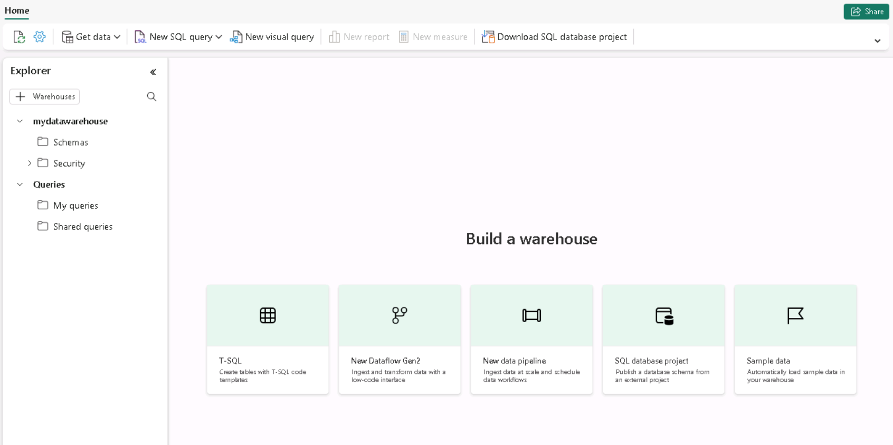

---
lab:
  title: Asegure un almacenamiento de datos de Microsoft Fabric
  module: Secure a Microsoft Fabric data warehouse
---

# Protección de los datos en un almacenamiento de datos

Los permisos de Microsoft Fabric y los permisos de SQL granulares funcionan conjuntamente para controlar el acceso al almacenamiento y los permisos de usuario. En este ejercicio, protegerá los datos mediante permisos granulares, seguridad de nivel de columna, seguridad de nivel de fila y enmascaramiento dinámico de datos.

> **Nota**: Para completar los ejercicios de este laboratorio, necesitará dos usuarios: un usuario debe tener asignado el rol de administrador del área de trabajo y el otro debe tener el rol de espectador de áreas de trabajo. Para asignar roles a las áreas de trabajo, consulte [Concesión de acceso al área de trabajo](https://learn.microsoft.com/fabric/get-started/give-access-workspaces).

Este laboratorio se realiza en **45** minutos aproximadamente.

## Creación de un área de trabajo

Antes de trabajar con datos de Fabric, cree un área de trabajo con la evaluación gratuita de Fabric habilitada.

1. En la [página principal de Microsoft Fabric](https://app.fabric.microsoft.com), seleccione **Synapse Data Warehouse**.
1. En la barra de menús de la izquierda, seleccione **Áreas de trabajo** (el icono tiene un aspecto similar a &#128455;).
1. Cree una nueva área de trabajo con el nombre que prefiera y seleccione un modo de licencia que incluya capacidad de Fabric (*Evaluación gratuita*, *Prémium* o *Fabric*).
1. Cuando se abra la nueva área de trabajo, debe estar vacía.

    

> **Nota**: Al crear un área de trabajo, se convierte automáticamente en miembro del rol de administrador del área de trabajo. Puede agregar un segundo usuario de su entorno al rol de espectador de áreas de trabajo para probar la funcionalidad configurada en estos ejercicios. Para ello, seleccione **Administrar acceso** en el área de trabajo y, a continuación, **Agregar personas o grupos**. Esto permitirá al segundo usuario ver el contenido del área de trabajo.

## Creación del almacenamiento de datos

A continuación, creará un almacenamiento de datos en el área de trabajo que ha creado. La página principal de Synapse Data Warehouse incluye un acceso directo para crear un nuevo almacén:

1. En la página principal de **Synapse Data Warehouse**, cree un nuevo **almacenamiento** con el nombre que prefiera.

    Al cabo de un minuto más o menos, se creará un nuevo almacenamiento:

    

## Aplicación del enmascaramiento dinámico de datos a columnas de una tabla

Las reglas de enmascaramiento dinámico de datos se aplican en columnas individuales en el nivel de tabla para que todas las consultas se vean afectadas por el enmascaramiento. Los usuarios que no tengan permiso explícito para ver datos confidenciales ven los valores enmascarados en los resultados de la consulta, mientras que los usuarios con permiso explícito para ver los datos los ven sin enmascarar. Hay cuatro tipos de máscara: predeterminado, correo electrónico, aleatorio y cadena personalizada. En este ejercicio, aplicará una máscara predeterminada, una máscara de correo electrónico y una máscara de cadena personalizada.

1. En su almacén, seleccione el icono **T-SQL** y sustituya el código SQL predeterminado por las siguientes instrucciones T-SQL para crear una tabla e insertar y visualizar datos.  

    ```T-SQL
   CREATE TABLE dbo.Customers
   (   
       CustomerID INT NOT NULL,   
       FirstName varchar(50) MASKED WITH (FUNCTION = 'partial(1,"XXXXXXX",0)') NULL,     
       LastName varchar(50) NOT NULL,     
       Phone varchar(20) MASKED WITH (FUNCTION = 'default()') NULL,     
       Email varchar(50) MASKED WITH (FUNCTION = 'email()') NULL   
   );
   
   INSERT dbo.Customers (CustomerID, FirstName, LastName, Phone, Email) VALUES
   (29485,'Catherine','Abel','555-555-5555','catherine0@adventure-works.com'),
   (29486,'Kim','Abercrombie','444-444-4444','kim2@adventure-works.com'),
   (29489,'Frances','Adams','333-333-3333','frances0@adventure-works.com');
   
   SELECT * FROM dbo.Customers;
    ```

    Cuando los usuarios que tienen restringida la visualización de datos sin máscara consultan la tabla, la columna **FirstName** mostrará la primera letra de la cadena con XXXXXXX y ninguno de los últimos caracteres. La columna **Phone** mostrará xxxx. La columna **Email** mostrará la primera letra de la dirección de correo electrónico seguida de `XXX@XXX.com`. Este enfoque garantiza que los datos confidenciales permanecen confidenciales, a la vez que permiten a los usuarios restringidos consultar la tabla.

2. Use el botón **&#9655; Ejecutar** para ejecutar el script de SQL, que crea una nueva tabla llamada **Clientes** en el esquema **dbo** del almacenamiento de datos.

3. A continuación, en el panel **Explorador**, expanda **Esquemas** > **dbo** > **Tablas** y compruebe que se ha creado la tabla **Clientes**. La instrucción `SELECT` devuelve datos sin máscara porque, como creador del área de trabajo, es miembro del rol de administrador del área de trabajo que puede ver datos sin máscara.

4. Conéctese como usuario de prueba que sea miembro del rol de área de trabajo del **espectador** y ejecute la siguiente instrucción T-SQL.

    ```T-SQL
    SELECT * FROM dbo.Customers;
    ```
    
    A este usuario no se le ha concedido permiso UNMASK, por lo que los datos devueltos para las columnas FirstName, Phone y Email se enmascaran porque esas columnas se definieron con una máscara en la instrucción `CREATE TABLE`.

5. Vuelva a conectarse como administrador del área de trabajo y ejecute la siguiente instrucción T-SQL para desenmascarar los datos del usuario de prueba. Reemplace `<username>@<your_domain>.com` por el nombre del usuario que está probando que es miembro del rol de área de trabajo **Espectador**. 

    ```T-SQL
    GRANT UNMASK ON dbo.Customers TO [<username>@<your_domain>.com];
    ```

6. Vuelva a conectarse como usuario de prueba y ejecute la siguiente instrucción T-SQL.

    ```T-SQL
    SELECT * FROM dbo.Customers;
    ```

    Los datos se devuelven sin máscara porque al usuario de prueba se le ha concedido el permiso `UNMASK`.

## Aplicación de seguridad a nivel de fila

La seguridad de nivel de fila (RLS) se puede usar para limitar el acceso a las filas en función de la identidad o el rol del usuario que ejecuta una consulta. En este ejercicio, va a restrigir el acceso a las filas mediante la creación de una directiva de seguridad y un predicado de seguridad definido como una función con valores de tabla insertados.

1. En el almacén que creó en el último ejercicio, seleccione la lista desplegable **Nueva consulta SQL**.  En el encabezado **En blanco**, seleccione **Nueva consulta SQL**.

2. Cree una tabla e inserte datos. Para que pueda probar la seguridad a nivel de filas en un paso posterior, sustituya `username1@your_domain.com` por un nombre de usuario de su entorno y sustituya `username2@your_domain.com` por su nombre de usuario.

    ```T-SQL
   CREATE TABLE dbo.Sales  
   (  
       OrderID INT,  
       SalesRep VARCHAR(60),  
       Product VARCHAR(10),  
       Quantity INT  
   );
    
   --Populate the table with 6 rows of data, showing 3 orders for each test user. 
   INSERT dbo.Sales (OrderID, SalesRep, Product, Quantity) VALUES
   (1, '<username1>@<your_domain>.com', 'Valve', 5),   
   (2, '<username1>@<your_domain>.com', 'Wheel', 2),   
   (3, '<username1>@<your_domain>.com', 'Valve', 4),  
   (4, '<username2>@<your_domain>.com', 'Bracket', 2),   
   (5, '<username2>@<your_domain>.com', 'Wheel', 5),   
   (6, '<username2>@<your_domain>.com', 'Seat', 5);  
    
   SELECT * FROM dbo.Sales;  
    ```

3. Use el botón **&#9655; Ejecutar** para ejecutar el script de SQL, que crea una nueva tabla llamada **Sales** en el esquema **dbo** del almacenamiento de datos.

4. A continuación, en el panel **Explorador**, expanda **Esquemas** > **dbo** > **Tablas** y compruebe que se ha creado la tabla **Sales**.
5. Cree un nuevo esquema, un predicado de seguridad definido como una función y una directiva de seguridad.  

    ```T-SQL
   --Create a separate schema to hold the row-level security objects (the predicate function and the security policy)
   CREATE SCHEMA rls;
   GO
   
   /*Create the security predicate defined as an inline table-valued function.
   A predicate evaluates to true (1) or false (0). This security predicate returns 1,
   meaning a row is accessible, when a row in the SalesRep column is the same as the user
   executing the query.*/   
   --Create a function to evaluate who is querying the table
   CREATE FUNCTION rls.fn_securitypredicate(@SalesRep AS VARCHAR(60)) 
       RETURNS TABLE  
   WITH SCHEMABINDING  
   AS  
       RETURN SELECT 1 AS fn_securitypredicate_result   
   WHERE @SalesRep = USER_NAME();
   GO   
   /*Create a security policy to invoke and enforce the function each time a query is run on the Sales table.
   The security policy has a filter predicate that silently filters the rows available to 
   read operations (SELECT, UPDATE, and DELETE). */
   CREATE SECURITY POLICY SalesFilter  
   ADD FILTER PREDICATE rls.fn_securitypredicate(SalesRep)   
   ON dbo.Sales  
   WITH (STATE = ON);
   GO
    ```

6. Utilice el botón **&#9655; Ejecutar** para ejecutar el script SQL
7. A continuación, en el panel **Explorador**, expanda **Esquemas** > **rls** > **Functions** y compruebe que se ha creado la función.
8. Inicie sesión en Fabric como usuario con el que ha reemplazado `<username1>@<your_domain>.com`, en la instrucción `INSERT` de la tabla Ventas. Confirme que ha iniciado sesión como ese usuario ejecutando la siguiente instrucción T-SQL.

    ```T-SQL
   SELECT USER_NAME();
    ```

9. Consulte la tabla **Sales** para confirmar que la seguridad de nivel de columna funciona según lo previsto. Solo debe ver los datos que cumplan las condiciones del predicado de seguridad definido para el usuario con el que ha iniciado sesión.

    ```T-SQL
   SELECT * FROM dbo.Sales;
    ```

## Implementación de la seguridad de nivel de columna

La seguridad de nivel de columna permite designar qué usuarios pueden acceder a columnas específicas de una tabla. Se implementa mediante la emisión de una instrucción `GRANT` o `DENY` en una tabla que especifica una lista de columnas y el usuario o rol que pueden o no pueden leerlas. Para simplificar la administración de acceso, asigne permisos a los roles en lugar de a usuarios individuales. En este ejercicio, creará una tabla, concederá acceso a un subconjunto de columnas de la tabla y comprobará que las columnas restringidas no las pueden ver otro usuario que no sea usted.

1. En el almacén que creó en el ejercicio anterior, seleccione la lista desplegable **Nueva consulta SQL**. En el encabezado **En blanco**, seleccione **Nueva consulta SQL**.  

2. Cree una tabla e inserte datos en ella.

    ```T-SQL
   CREATE TABLE dbo.Orders
   (   
       OrderID INT,   
       CustomerID INT,  
       CreditCard VARCHAR(20)      
   );   
   INSERT dbo.Orders (OrderID, CustomerID, CreditCard) VALUES
   (1234, 5678, '111111111111111'),
   (2341, 6785, '222222222222222'),
   (3412, 7856, '333333333333333');   
   SELECT * FROM dbo.Orders;
     ```

3. Deniegue el permiso para ver una columna en la tabla. La instrucción T-SQL impide a `<username>@<your_domain>.com` ver la columna CreditCard en la tabla Orders. En la instrucción `DENY`, reemplace `<username>@<your_domain>.com` por un nombre de usuario en el sistema que tenga permisos de **espectador** en el área de trabajo.

     ```T-SQL
   DENY SELECT ON dbo.Orders (CreditCard) TO [<username>@<your_domain>.com];
     ```

4. Pruebe la seguridad de nivel de columna iniciando sesión en Fabric como el usuario al que denegó seleccionar permisos.

5. Consulte la tabla Orders para confirmar que la seguridad de nivel de columna funciona según lo previsto. La consulta siguiente devolverá solo las columnas OrderID y CustomerID, no la columna CreditCard.  

    ```T-SQL
   SELECT * FROM dbo.Orders;
    ```

    Recibirá un error porque se ha restringido el acceso a la columna CreditCard.  Pruebe a seleccionar solo los campos OrderID y CustomerID y la consulta se realizará correctamente.

    ```T-SQL
   SELECT OrderID, CustomerID from dbo.Orders
    ```

## Configuración de permisos pormenorizados de SQL mediante T-SQL

Fabric tiene un modelo de permisos que permite controlar el acceso a los datos en el nivel de área de trabajo y en el nivel de elemento. Cuando necesite un control más granular de lo que los usuarios pueden hacer con los elementos protegibles en un almacén de Fabric, utilice los comandos estándar del lenguaje de control de datos SQL (DCL) `GRANT`, `DENY` y `REVOKE`. En este ejercicio, creará objetos, los protegerá mediante `GRANT` y `DENY` y, a continuación, ejecutará consultas para ver el efecto de aplicar permisos detallados.

1. En el almacén que creó en el ejercicio anterior, seleccione la lista desplegable **Nueva consulta SQL**. En el encabezado **En blanco**, seleccione **Nueva consulta SQL**.  

2. Creación de un procedimiento almacenado y una tabla. A continuación, ejecute el procedimiento y consulte la tabla.

     ```T-SQL
   CREATE PROCEDURE dbo.sp_PrintMessage
   AS
   PRINT 'Hello World.';
   GO   
   CREATE TABLE dbo.Parts
   (
       PartID INT,
       PartName VARCHAR(25)
   );
   
   INSERT dbo.Parts (PartID, PartName) VALUES
   (1234, 'Wheel'),
   (5678, 'Seat');
    GO
   
   /*Execute the stored procedure and select from the table and note the results you get
   as a member of the Workspace Admin role. Look for output from the stored procedure on 
   the 'Messages' tab.*/
   EXEC dbo.sp_PrintMessage;
   GO   
   SELECT * FROM dbo.Parts
     ```

3. A continuación, `DENY SELECT` los permisos en la tabla a un usuario que sea miembro del rol **Espectador del área de trabajo** y `GRANT EXECUTE` en el procedimiento al mismo usuario. Reemplace `<username>@<your_domain>.com` por un nombre de usuario del entorno que sea miembro del rol **Espectador del área de trabajo**.

     ```T-SQL
   DENY SELECT on dbo.Parts to [<username>@<your_domain>.com];

   GRANT EXECUTE on dbo.sp_PrintMessage to [<username>@<your_domain>.com];
     ```

4. Inicie sesión en Fabric como el usuario que especificó en las instrucciones `DENY` y `GRANT` en lugar de `<username>@<your_domain>.com`. A continuación, pruebe los permisos detallados que acaba de aplicar ejecutando el procedimiento almacenado y consultando la tabla.  

     ```T-SQL
   EXEC dbo.sp_PrintMessage;
   GO
   
   SELECT * FROM dbo.Parts;
     ```

## Limpieza de recursos

En este ejercicio, ha aplicado reglas de enmascaramiento dinámico de datos a las columnas de una tabla, ha aplicado la seguridad de nivel de fila, ha implementado la seguridad de nivel de columna y ha configurado permisos detallados de SQL mediante T-SQL.

1. En la barra de navegación izquierda, seleccione el icono del área de trabajo para ver todos los elementos que contiene.
2. En el menú de la barra de herramientas superior, seleccione **Configuración del área de trabajo**.
3. En la sección **General**, seleccione **Quitar esta área de trabajo**.
