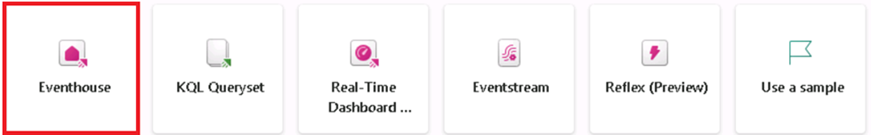

---
lab:
  title: "Introducción a inteligencia en tiempo real en Microsoft\_Fabric"
  module: Get started with Real-Time Intelligence in Microsoft Fabric
---

# Introducción a inteligencia en tiempo real en Microsoft Fabric

Microsoft Fabric proporciona un entorno de ejecución que puede usar para almacenar y consultar datos con el Lenguaje de consulta Kusto (KQL). Kusto está optimizado para datos que incluyen un componente de serie temporal, como los datos en tiempo real de archivos de registro o dispositivos IoT.

Este laboratorio se realiza en unos **30** minutos.

> **Nota**: Necesitará una [evaluación gratuita de Microsoft Fabric](https://learn.microsoft.com/fabric/get-started/fabric-trial) para realizar este ejercicio.

## Creación de un área de trabajo

Antes de trabajar con datos de Fabric, cree un área de trabajo con la evaluación gratuita de Fabric habilitada.

1. En la [página principal de Microsoft Fabric](https://app.fabric.microsoft.com), seleccione **Inteligencia en tiempo real**.
1. En la barra de menús de la izquierda, seleccione **Áreas de trabajo** (el icono tiene un aspecto similar a &#128455;).
1. Cree una nueva área de trabajo con el nombre que prefiera y seleccione un modo de licencia que incluya capacidad de Fabric (*Evaluación gratuita*, *Prémium* o *Fabric*).
1. Cuando se abra la nueva área de trabajo, debe estar vacía.

    

## Descarga de un archivo para la base de datos KQL

Ahora que tiene un área de trabajo, es el momento de descargar el archivo de datos que va a analizar.

1. Descargue el archivo de datos para este ejercicio desde [https://raw.githubusercontent.com/MicrosoftLearning/dp-data/main/sales.csv](https://raw.githubusercontent.com/MicrosoftLearning/dp-data/main/sales.csv) y guárdelo como **sales.csv** en su PC local (o su máquina virtual del laboratorio si procede).
1. Vuelva a la ventana del explorador con la experiencia **Microsoft Fabric**.

## Creación de una base de datos KQL

El Lenguaje de consulta Kusto (KQL) se usa para consultar datos estáticos o de streaming en una tabla que se define en una base de datos KQL. Para analizar los datos de ventas, debe crear una tabla en una base de datos KQL e ingerir los datos del archivo.

1. En la parte inferior izquierda del portal, cambie a la experiencia Inteligencia en tiempo real.

    

2. En la página principal de Inteligencia en tiempo real, cree un nuevo **Centro de eventos** con el nombre que prefiera.

   

   El Centro de eventos se usa para agrupar y administrar las bases de datos entre proyectos. Una base de datos KQL vacía se crea automáticamente con el nombre del centro de eventos.
   
3. Una vez creada la nueva base de datos, selecciónala de la lista de la izquierda en Bases de Datos KQL. Luego selecciona la opción para obtener datos del **archivo local**. Utiliza el asistente para importar los datos a una nueva tabla seleccionando las siguientes opciones:
    - **Destino**:
        - **Base de datos**: *La base de datos que ha creado ya está seleccionada*.
        - **Tabla**: *Cree una nueva tabla denominada* **sales** haciendo clic en el signo + a la izquierda de ***Nueva tabla***

        

        - Ahora verá que en la misma ventana aparece el hipervínculo **Arrastrar archivos aquí o Buscar archivos**.

        

        - busque o arrastre el **sales.csv** a la pantalla y espere a que el cuadro Estado cambie a una casilla verde y, a continuación, seleccione **Siguiente**

        

        - En esta pantalla verás que los encabezados de columna están en la primera fila aunque el sistema los ha detectado. Todavía es necesario mover el control deslizante que está encima de estas líneas **Primera fila es el encabezado de columna** para evitar que se produzcan errores.
        
        

        - Una vez que seleccione este control deslizante, verá que todo se ve bien para ir, seleccione el botón **Finalizar** en la parte inferior derecha del panel.

        

        - Espere a que los pasos de la pantalla de resumen se completen, entre los que se incluyen:
            - Crear tabla (ventas)
            - crear asignación (sales_mapping)
            - Puesta en cola de datos
            - Ingesta
        - Seleccione el botón **Cerrar**

        

> **Nota:** En este ejemplo, ha importado una cantidad muy pequeña de datos estáticos de un archivo, que está bien para los fines de este ejercicio. En realidad, Kusto se puede usar para analizar volúmenes de datos más grandes, incluidos datos en tiempo real de un origen de streaming como Azure Event Hubs.

## Uso de KQL para consultar la tabla "sales"

Ahora que tiene una tabla de datos en la base de datos, puede usar código KQL para consultarla.

1. Asegúrese de que tiene resaltada la tabla **sales**. En la barra de menús, seleccione la lista desplegable **Tabla de consultas** y seleccione **Mostrar 100 registros cualesquiera**.

2. Se abre un nuevo panel con la consulta y el resultado. 

3. Modifique la consulta del siguiente modo:

    ```kusto
   sales
   | where Item == 'Road-250 Black, 48'
    ```

4. Ejecuta la consulta. A continuación, revise los resultados, que deben contener solo las filas de los pedidos de ventas del producto *Road-250 Black, 48*.

5. Modifique la consulta del siguiente modo:

    ```kusto
   sales
   | where Item == 'Road-250 Black, 48'
   | where datetime_part('year', OrderDate) > 2020
    ```

6. Ejecute la consulta y revise los resultados, que solo deben contener los pedidos de ventas de *Road-250 Black, 48* realizados después de 2020.

7. Modifique la consulta del siguiente modo:

    ```kusto
   sales
   | where OrderDate between (datetime(2020-01-01 00:00:00) .. datetime(2020-12-31 23:59:59))
   | summarize TotalNetRevenue = sum(UnitPrice) by Item
   | sort by Item asc
    ```

8. Ejecute la consulta y revise los resultados, que deben contener los ingresos netos totales de cada producto entre el 1 de enero y el 31 de diciembre de 2020 por nombre de producto en orden ascendente.
9. Seleccione **Guardar como conjunto de consultas KQL** y guarde la consulta como **Ingresos por producto**.

## Creación de un informe de Power BI a partir de un conjunto de consultas KQL

Puede usar el conjunto de consultas KQL como base para un informe de Power BI.

1. En el editor del workbench del conjunto de consultas, ejecute la consulta y espere los resultados.
2. Seleccione **Crear informe de Power BI** y espere a que se abra el editor de informes.
3. En el editor de informes, en el panel **Datos**, expanda **Resultado de la consulta de Kusto** y seleccione los campos **Item** y **TotalRevenue**.
4. En el lienzo de diseño del informe, seleccione la visualización de tabla que se ha agregado y, en el panel **Visualizaciones**, seleccione **Gráfico de barras agrupadas**.

    

5. En la ventana de **Power BI**, en el menú **Archivo**, seleccione **Guardar**. A continuación, guarde el informe como **Ingresos por artículo.pbix** en el área de trabajo donde se han definido el almacén de lago y la base de datos KQL con una etiqueta de confidencialidad **No empresarial**.
6. Cierre la ventana de **Power BI** y, en la barra de la izquierda, seleccione el icono del área de trabajo.

    Actualice la página Área de trabajo si es necesario para ver todos los elementos que contiene.

7. En la lista de elementos del área de trabajo, observe que aparece el informe **Ingresos por artículo**.

## Limpieza de recursos

En este ejercicio, ha creado un almacén de lago, una base de datos KQL para analizar los datos cargados en el almacén de lago. Ha usado KQL para consultar los datos y crear un conjunto de consultas, que luego ha usado para crear un informe de Power BI.

Si ha terminado de explorar la base de datos KQL, puede eliminar el área de trabajo que ha creado para este ejercicio.

1. En la barra de la izquierda, seleccione el icono del área de trabajo.
2. En el menú **...** de la barra de herramientas, seleccione **Configuración del área de trabajo**.
3. En la sección **General**, seleccione **Quitar esta área de trabajo**.
