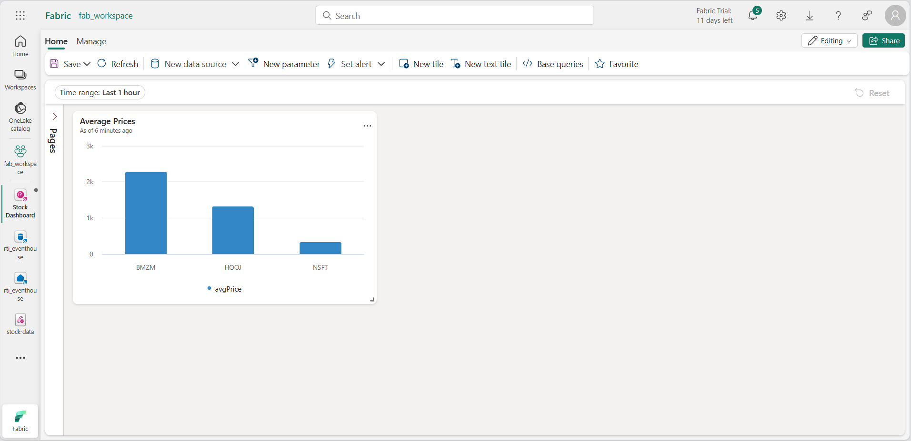

---
lab:
  title: "Introducción a inteligencia en tiempo real en Microsoft\_Fabric"
  module: Get started with Real-Time Intelligence in Microsoft Fabric
---

# Introducción a inteligencia en tiempo real en Microsoft Fabric

Microsoft Fabric proporciona inteligencia en tiempo real, lo que le permite crear soluciones analíticas para flujos de datos en tiempo real. En este ejercicio, usarás las funcionalidades de inteligencia en tiempo real de Microsoft Fabric para ingerir, analizar y visualizar un flujo de datos de mercado de valores en tiempo real.

Este laboratorio se realiza en unos **30** minutos.

> **Nota**: Necesitas un [inquilino de Microsoft Fabric](https://learn.microsoft.com/fabric/get-started/fabric-trial) para completar este ejercicio.

## Creación de un área de trabajo

Antes de trabajar con datos de Fabric, necesitas crear un área de trabajo con la capacidad gratuita de Fabric habilitada.

1. En un explorador, ve a la [página principal de Microsoft Fabric](https://app.fabric.microsoft.com/home?experience=fabric) en `https://app.fabric.microsoft.com/home?experience=fabric` e inicia sesión con tus credenciales de Fabric.
1. En la barra de menús de la izquierda, selecciona **Áreas de trabajo** (el icono tiene un aspecto similar a &#128455;).
1. Crea una nueva área de trabajo con el nombre que prefieras y selecciona un modo de licencia que incluya capacidad de Fabric (*Evaluación gratuita*, *Premium* o *Fabric*).
1. Cuando se abra la nueva área de trabajo, debe estar vacía.

    

## Crear un Eventstream

Ahora estás listo para buscar e ingerir datos en tiempo real desde un origen de streaming. Para ello, se iniciará en el centro en tiempo real de Fabric.

> **Sugerencia**: La primera vez que uses el centro en tiempo real, es posible que aparezcan algunas sugerencias de *introducción*. Puedes cerrarlas.

1. En la barra de menús de la izquierda, selecciona el centro en **tiempo real**.

    El centro en tiempo real proporciona una manera fácil de buscar y administrar orígenes de datos de streaming.

    

1. En el centro en tiempo real, en la sección **Conectar a**, selecciona **Orígenes de datos**.
1. Busca el origen de datos de ejemplo **Mercado de valores** y selecciona **Conectar**. Después, en el asistente **Conectar**, nombra el origen `stock` y edita el nombre predeterminado del flujo de eventos para cambiarlo a `stock-data`. El flujo predeterminado asociado a estos datos se denominará automáticamente *stock-data-stream*:

    

1. Selecciona **Siguiente** y espera a que se creen el origen y el flujo de eventos, después selecciona **Abrir flujo de eventos**. El flujo de eventos mostrará el origen **existencias** y el **stock-data-stream** en el lienzo de diseño:

   

## Creación de instancias de Event house

El flujo de eventos ingiere los datos de existencias en tiempo real, pero actualmente no hace nada con él. Vamos a crear un centro de eventos donde podamos almacenar los datos capturados en una tabla.

1. En la barra de menús de la izquierda, selecciona **Crear**. En la página *Nuevo*, en la sección *Inteligencia en tiempo real*, selecciona **Eventhouse**. Asígnale un nombre único que elijas.

    >**Nota**: si la opción **Crear** no está anclada a la barra lateral, primero debes seleccionar la opción de puntos suspensivos (**...**).

    Cierra las sugerencias o avisos que se muestran hasta que veas tu nuevo centro de eventos vacío.

    

1. En el panel de la izquierda, ten en cuenta que el centro de eventos contiene una base de datos KQL con el mismo nombre que el centro de eventos. Puedes crear tablas para los datos en tiempo real de esta base de datos o crear bases de datos adicionales según sea necesario.
1. Selecciona la base de datos y ten en cuenta que hay un *conjunto de consultas* asociado. Este archivo contiene algunas consultas KQL de ejemplo que puedes usar para empezar a consultar las tablas de la base de datos.

    Sin embargo, actualmente no hay tablas que consultar. Vamos a resolver ese problema mediante la obtención de datos del flujo de eventos de una nueva tabla.

1. En la página principal de la base de datos KQL, selecciona **Obtener datos**.
1. Para el origen de datos, selecciona **Flujo de eventos** > **Flujo de eventos existente**.
1. En el panel **Seleccionar o crear una tabla de destino**, crea una nueva tabla denominada `stock`. Después, en el panel **Configurar el origen de datos**, selecciona tu área de trabajo y el flujo de eventos **stock-data** y asigna a la conexión el nombre `stock-table`.

   

1. Usa el botón **Siguiente** para completar los pasos para inspeccionar los datos y después finalizar la configuración. Después cierra la ventana de configuración para ver tu centro de eventos con la tabla Existencias.

   

    Se ha creado la conexión entre el flujo y la tabla. Vamos a comprobarlo en el flujo de eventos.

1. En la barra de menús de la izquierda, selecciona el centro en **tiempo real** y después consulta la página **Mis flujos de datos**. En el menú **...** para el flujo **stock-data-stream**, selecciona **Abrir flujo de eventos**.

    El flujo de eventos muestra ahora un destino para el flujo:

   

    > **Sugerencia**: selecciona el destino en el lienzo de diseño y, si no se muestra ninguna versión preliminar de datos debajo de él, selecciona **Actualizar**.

    En este ejercicio, has creado una secuencia de eventos muy sencilla que captura datos en tiempo real y los carga en una tabla. En una solución real, normalmente añadirías transformaciones para agregar los datos a través de ventanas temporales (por ejemplo, para capturar el precio medio de cada acción durante períodos de cinco minutos).

    Ahora vamos a explorar cómo puedes consultar y analizar los datos capturados.

## Consulta de los datos capturados

La secuencia de eventos captura los datos del mercado de valores en tiempo real y los carga en una tabla de la base de datos KQL. Puedes consultar esta tabla para ver los datos capturados.

1. En la barra de menús de la izquierda, selecciona la base de datos del centro de eventos.
1. Selecciona el *conjunto de consultas* para tu base de datos.
1. En el panel de consulta, modifica la primera consulta de ejemplo como se muestra aquí:

    ```kql
    stock
    | take 100
    ```

1. Selecciona el código de consulta y ejecútalo para ver 100 filas de datos de la tabla.

    

1. Revisa los resultados y después modifica la consulta para obtener el precio medio de cada símbolo de acciones de los últimos 5 minutos:

    ```kql
    stock
    | where ["time"] > ago(5m)
    | summarize avgPrice = avg(todecimal(bidPrice)) by symbol
    | project symbol, avgPrice
    ```

1. Resalta la consulta modificada y ejecútalo para ver los resultados.
1. Espera unos segundos, ejecútala de nuevo y observa que los precios promedio cambian a medida que se agregan nuevos datos a la tabla desde la secuencia en tiempo real.

## Creación de paneles en tiempo real

Ahora que tienes una tabla que se rellena mediante la secuencia de datos, puedes usar un panel en tiempo real para visualizar los datos.

1. En el editor de consultas, selecciona la consulta KQL que has usado para recuperar los precios promedio de las acciones durante los últimos cinco minutos.
1. En la barra de herramientas, selecciona **Anclar al panel**. Después, ancla la consulta **en un nuevo panel de control** con la siguiente configuración:
    - **Nombre de panel **: `Stock Dashboard`
    - **Nombre del icono**: `Average Prices`
1. Crea el panel y ábrelo. Debería ser parecido a este:

    

1. En la parte superior del panel de control, cambia del modo **Visualización** al modo **Edición**.
1. Selecciona el icono **Editar** (*lápiz*) del icono **Precios promedio**.
1. En el panel **Formato visual**, cambia el **Objeto visual** de *Tabla* a *Gráfico de columnas*:

    

1. En la parte superior del panel, selecciona **Aplicar cambios** y consulta tu panel modificado:

    

    Ahora tienes una visualización en vivo de los datos de existencias en tiempo real.

## Crear una alerta

La inteligencia en tiempo real de Microsoft Fabric incluye una tecnología denominada *Activator*, que puede desencadenar acciones basadas en eventos en tiempo real. Vamos a usarlo para avisarte cuando el precio promedio de las acciones aumente una cantidad específica.

1. En la ventana del panel que contiene la visualización de precios de acciones, en la barra de herramientas, selecciona **Establecer alerta**.
1. En el panel **Establecer alerta**, crea una alerta con la siguiente configuración:
    - **Ejecutar consulta cada**: 5 minutos
    - **Comprobar**: en cada evento agrupado por
    - **Campo de agrupación**: símbolo
    - **Cuándo**: avgPrice
    - **Condición**: aumenta
    - **Valor**: 100
    - **Acción**: Enviarme un correo electrónico
    - **Guardar ubicación**:
        - **Área de trabajo**: *tu área de trabajo*
        - **Elemento**: crear un nuevo elemento
        - **Nombre del nuevo elemento**: *nombre único que prefieras*.

    

1. Crea la alerta y espera a que se guarde. Después, cierra el panel para confirmar que se ha creado.
1. En la barra de menús de la izquierda, selecciona la página de tu área de trabajo (guarda los cambios no guardados en tu panel si se te solicita).
1. En la página del área de trabajo, consulta los elementos que has creado en este ejercicio, incluyendo el activador de la alerta.
1. Abre el activador, y en su página, en el nodo **avgPrice**, selecciona el identificador único de tu alerta. Después, consulta su pestaña **Historial**.

    Es posible que la alerta no se haya desencadenado, en cuyo caso el historial no contendrá datos. Si el precio medio de las acciones cambia en más de 100, el activador te enviará un correo electrónico y la alerta se registrará en el historial.

## Limpieza de recursos

En este ejercicio, has creado un centro de eventos, has ingerido datos en tiempo real mediante una secuencia de eventos, has consultado los datos ingeridos en una tabla de base de datos KQL, has creado un panel en tiempo real para visualizar los datos en tiempo real y has configurado una alerta mediante Activator.

Si has terminado de explorar la inteligencia en tiempo real en Fabric, puedes eliminar el área de trabajo que has creado para este ejercicio.

1. En la barra de la izquierda, seleccione el icono del área de trabajo.
2. En la barra de herramientas, selecciona **Configuración del área de trabajo**.
3. En la sección **General**, selecciona **Quitar esta área de trabajo**.
