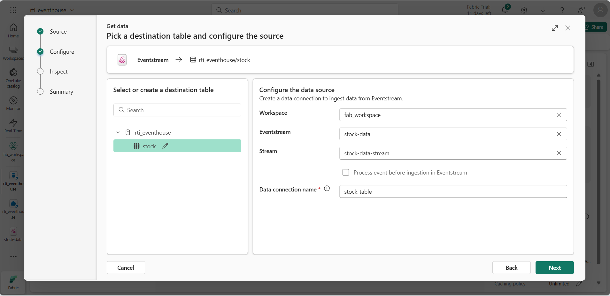
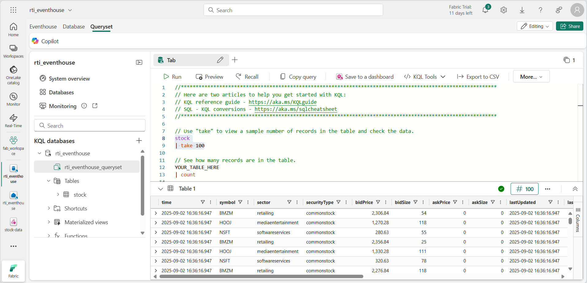

---
lab:
  title: "Introducción a inteligencia en tiempo real en Microsoft\_Fabric"
  module: Get started with Real-Time Intelligence in Microsoft Fabric
---

# Introducción a inteligencia en tiempo real en Microsoft Fabric

Microsoft Fabric proporciona un centro en tiempo real en el que puedes crear soluciones analíticas para secuencias de datos en tiempo real. En este ejercicio, explorarás algunas de las características principales de las funcionalidades de inteligencia en tiempo real de Microsoft Fabric para familiarizarte con ellas.

Este laboratorio se realiza en unos **30** minutos.

> **Nota**: Necesitas un [inquilino de Microsoft Fabric](https://learn.microsoft.com/fabric/get-started/fabric-trial) para completar este ejercicio.

## Creación de un área de trabajo

Antes de trabajar con datos de Fabric, necesitas crear un área de trabajo con la capacidad gratuita de Fabric habilitada.

1. En la [página principal de Microsoft Fabric](https://app.fabric.microsoft.com/home?experience=fabric) en `https://app.fabric.microsoft.com/home?experience=fabric`, selecciona **Real-Time Intelligence**.
1. En la barra de menús de la izquierda, selecciona **Áreas de trabajo** (el icono tiene un aspecto similar a &#128455;).
1. Crea una nueva área de trabajo con el nombre que prefieras y selecciona un modo de licencia que incluya capacidad de Fabric (*Evaluación gratuita*, *Premium* o *Fabric*).
1. Cuando se abra la nueva área de trabajo, debe estar vacía.

    

## Creación de instancia de Eventhouse

Ahora que tienes un área de trabajo, puedes empezar a crear los elementos de Fabric que necesitarás para tu solución de inteligencia en tiempo real. Empezaremos creando un centro de eventos, que contiene una base de datos KQL para los datos en tiempo real.

1. En la barra de menús de la izquierda, selecciona **Inicio**; y después, en la página principal de Inteligencia en tiempo real, crea un nuevo **Centro de eventos** con el nombre único que prefieras.
1. Cierra las sugerencias o avisos que se muestran hasta que veas tu nuevo centro de eventos vacío.

    

1. En el panel de la izquierda, ten en cuenta que el centro de eventos contiene una base de datos KQL con el mismo nombre que el centro de eventos. Puedes crear tablas para los datos en tiempo real de esta base de datos o crear bases de datos adicionales según sea necesario.
1. Selecciona la base de datos y ten en cuenta que hay un *conjunto de consultas* asociado. Este archivo contiene algunas consultas KQL de ejemplo que puedes usar para empezar a consultar las tablas de la base de datos.

    Sin embargo, actualmente no hay tablas que consultar. Vamos a resolver ese problema mediante un flujo de eventos para ingerir algunos datos de la base de datos.

## Crear un Eventstream

1. En la página principal de la base de datos KQL, selecciona **Obtener datos**.
2. Para el origen de datos, selecciona **Eventstream** > **Nuevo flujo de eventos**. Asigna un nombre al flujo de eventos `stock-stream`.

    La creación de tu nuevo flujo de eventos se completará en unos instantes. Una vez establecido, se le redirigirá automáticamente al editor principal, listo para empezar a integrar orígenes en el flujo de eventos.

    

1.  En el lienzo del flujo de eventos, selecciona **Usar datos de ejemplo**.
1. Asigna un nombre al origen `Stock` y selecciona los datos de ejemplo **Mercado de valores**.

    El flujo se asignará y se mostrará automáticamente en el **lienzo del flujo de eventos**.

   

1. En la lista desplegable **Transformar eventos o agregar destino**, en la sección **Destinos**, selecciona **Eventhouse**.
1. En el panel **Eventhouse**, establece las siguientes opciones de configuración.
   - **Modo de ingesta de datos:**: procesamiento de eventos antes de la ingesta
   - **Nombre del destino:**`stock-table`
   - **Área de trabajo:***selecciona el área de trabajo que has creado al principio de este ejercicio*
   - **Eventhouse**: *selecciona tu centro de eventos*
   - **Base de datos KQL:** *selecciona la base de datos KQL del centro de eventos.*
   - **Tabla de destino:** crea una nueva tabla denominada `stock`
   - **Formato de datos de entrada:** JSON

   

1. En el panel **Eventhouse**, selecciona **Guardar**.
1. En la barra de herramientas, seleccione **Publicar**.
1. Espera aproximadamente un minuto a que se active el destino de los datos.

    En este ejercicio, has creado una secuencia de eventos muy sencilla que captura datos en tiempo real y los carga en una tabla. En una solución real, normalmente añadirías transformaciones para agregar los datos a través de ventanas temporales (por ejemplo, para capturar el precio medio de cada acción durante períodos de cinco minutos).

    Ahora vamos a explorar cómo puedes consultar y analizar los datos capturados.

## Consulta de los datos capturados

La secuencia de eventos captura los datos del mercado de valores en tiempo real y los carga en una tabla de la base de datos KQL. Puedes consultar esta tabla para ver los datos capturados.

1. En la barra de menús de la izquierda, selecciona la base de datos del centro de eventos.
1. Selecciona el *conjunto de consultas* para tu base de datos.
1. En el panel de consulta, modifica la primera consulta de ejemplo como se muestra aquí:

    ```kql
    stock
    | take 100
    ```

1. Selecciona el código de consulta y ejecútalo para ver 100 filas de datos de la tabla.

    

1. Revisa los resultados y después modifica la consulta para obtener el precio medio de cada símbolo de acciones de los últimos 5 minutos:

    ```kql
    stock
    | where ["time"] > ago(5m)
    | summarize avgPrice = avg(todecimal(bidPrice)) by symbol
    | project symbol, avgPrice
    ```

1. Resalta la consulta modificada y ejecútalo para ver los resultados.
1. Espera unos segundos, ejecútala de nuevo y observa que los precios promedio cambian a medida que se agregan nuevos datos a la tabla desde la secuencia en tiempo real.

## Creación de paneles en tiempo real

Ahora que tienes una tabla que se rellena mediante la secuencia de datos, puedes usar un panel en tiempo real para visualizar los datos.

1. En el editor de consultas, selecciona la consulta KQL que has usado para recuperar los precios promedio de las acciones durante los últimos cinco minutos.
1. En la barra de herramientas, selecciona **Anclar al panel**. Después, ancla la consulta **en un nuevo panel de control** con la siguiente configuración:
    - **Nombre de panel **: `Stock Dashboard`
    - **Nombre del icono**: `Average Prices`
1. Crea el panel y ábrelo. Debería ser parecido a este:

    

1. En la parte superior del panel de control, cambia del modo **Visualización** al modo **Edición**.
1. Selecciona el icono **Editar** (*lápiz*) del icono **Precios promedio**.
1. En el panel **Formato visual**, cambia el **Objeto visual** de *Tabla* a *Gráfico de columnas*:

    

1. En la parte superior del panel, selecciona **Aplicar cambios** y consulta tu panel modificado:

    

    Ahora tienes una visualización en vivo de los datos de existencias en tiempo real.

## Crear una alerta

La inteligencia en tiempo real de Microsoft Fabric incluye una tecnología denominada *Activator*, que puede desencadenar acciones basadas en eventos en tiempo real. Vamos a usarlo para avisarte cuando el precio promedio de las acciones aumente una cantidad específica.

1. En la ventana del panel que contiene la visualización de precios de acciones, en la barra de herramientas, selecciona **Establecer alerta**.
1. En el panel **Establecer alerta**, crea una alerta con la siguiente configuración:
    - **Ejecutar consulta cada**: 5 minutos
    - **Comprobar**: en cada evento agrupado por
    - **Campo de agrupación**: símbolo
    - **Cuándo**: avgPrice
    - **Condición**: aumenta
    - **Valor**: 100
    - **Acción**: Enviarme un correo electrónico
    - **Guardar ubicación**:
        - **Área de trabajo**: *tu área de trabajo*
        - **Elemento**: crear un nuevo elemento
        - **Nombre del nuevo elemento**: *nombre único que prefieras*.

    

1. Crea la alerta y espera a que se guarde. Después, cierra el panel para confirmar que se ha creado.
1. En la barra de menús de la izquierda, selecciona la página de tu área de trabajo (guarda los cambios no guardados en tu panel si se te solicita).
1. En la página del área de trabajo, consulta los elementos que has creado en este ejercicio, incluyendo el activador de la alerta.
1. Abre el activador, y en su página, en el nodo **avgPrice**, selecciona el identificador único de tu alerta. Después, consulta su pestaña **Historial**.

    Es posible que la alerta no se haya desencadenado, en cuyo caso el historial no contendrá datos. Si el precio medio de las acciones cambia en más de 100, el activador te enviará un correo electrónico y la alerta se registrará en el historial.

## Limpieza de recursos

En este ejercicio, has creado un centro de eventos, has ingerido datos en tiempo real mediante una secuencia de eventos, has consultado los datos ingeridos en una tabla de base de datos KQL, has creado un panel en tiempo real para visualizar los datos en tiempo real y has configurado una alerta mediante Activator.

Si has terminado de explorar la inteligencia en tiempo real en Fabric, puedes eliminar el área de trabajo que has creado para este ejercicio.

1. En la barra de la izquierda, seleccione el icono del área de trabajo.
2. En la barra de herramientas, selecciona **Configuración del área de trabajo**.
3. En la sección **General**, selecciona **Quitar esta área de trabajo**.
