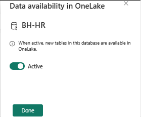
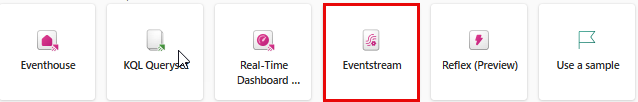
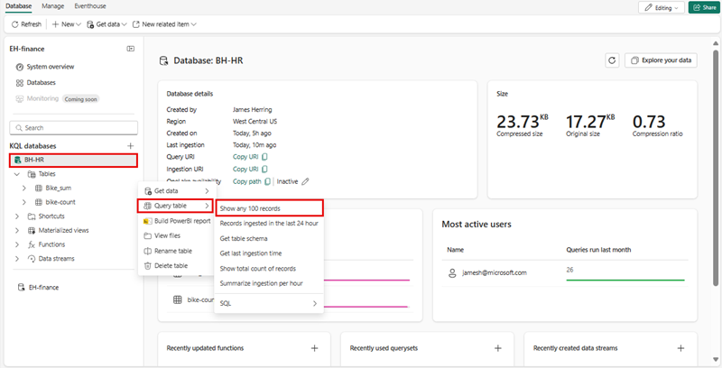
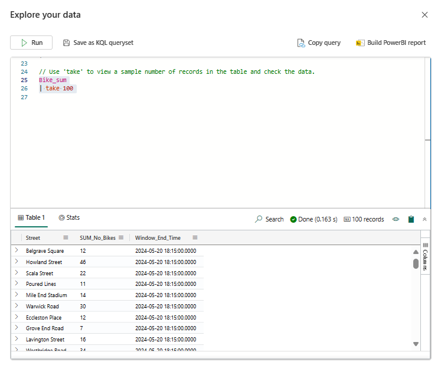
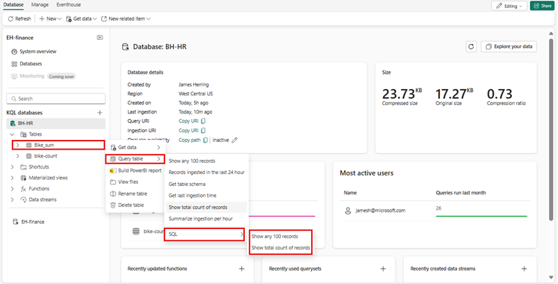
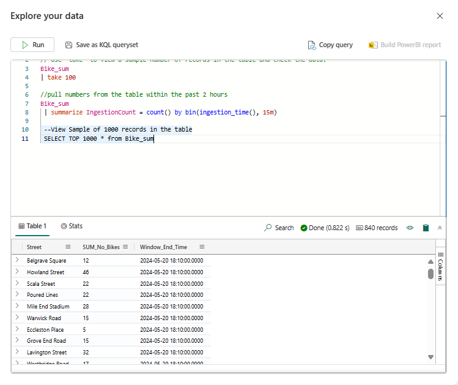

---
lab:
  title: "Introducción al análisis en tiempo real en Microsoft\_Fabric"
  module: Get started with Real-Time Analytics in Microsoft Fabric
---
# Introducción a Eventstream en Análisis en tiempo real (RTA)

Eventstream es una característica de Microsoft Fabric que captura, transforma y enruta eventos en tiempo real a varios destinos con una experiencia sin escritura de código. A Eventstream puede agregar orígenes de datos de eventos, destinos de enrutamiento y el procesador de eventos cuando sea necesaria una transformación. EventStore de Microsoft Fabric es una opción de supervisión que mantiene eventos del clúster y proporciona una manera de conocer el estado del clúster o de las cargas de trabajo en un momento dado. Se puede consultar el servicio EventStore sobre los eventos que están disponibles para cada entidad y tipo de entidad del clúster. Esto significa que puede consultar eventos en distintos niveles, como clústeres, nodos, aplicaciones, servicios, particiones y réplicas de particiones. El servicio EventStore también tiene la capacidad de correlacionar los eventos del clúster. El examen de los eventos que se escribieron al mismo tiempo desde distintas entidades y que pueden haberse afectado entre sí permite al servicio EventStore vincular estos eventos para identificar las causas de las actividades del clúster. Otra opción para la supervisión y el diagnóstico de clústeres de Microsoft Fabric es agregar y recopilar eventos con EventFlow.

Este laboratorio se realiza en unos **30** minutos.

> **Nota:** Necesitará una licencia de Microsoft Fabric para realizar este ejercicio. Consulte [Introducción a Fabric](https://learn.microsoft.com/fabric/get-started/fabric-trial) para más información sobre cómo habilitar una licencia de prueba de Fabric gratuita. Para ello, necesitará una cuenta *profesional* o *educativa* de Microsoft. Si no tiene una, puede [registrarse para una evaluación gratuita de Microsoft Office 365 E3 o superior](https://www.microsoft.com/microsoft-365/business/compare-more-office-365-for-business-plans).

## Crear un área de trabajo

Antes de trabajar con datos de Fabric, cree un área de trabajo con la evaluación gratuita de Fabric habilitada.

1. Inicie sesión en [Microsoft Fabric](https://app.fabric.microsoft.com) en `https://app.fabric.microsoft.com` y seleccione **Power BI**.
2. En la barra de menús de la izquierda, seleccione **Áreas de trabajo** (el icono tiene un aspecto similar a &#128455;).
3. Cree una nueva área de trabajo con el nombre que prefiera y seleccione un modo de licencia que incluya capacidad de Fabric (*Versión de prueba*, *Premium* o *Fabric*).
4. Cuando se abra la nueva área de trabajo, estará vacía, como se muestra aquí:

   
5. En la parte inferior izquierda del portal de Power BI, seleccione el icono de **Power BI** y cambie a la experiencia **Análisis en tiempo real**.

## Escenario

Con los Eventstreams de Fabric, puede administrar fácilmente los datos de eventos en un solo lugar. Puede recopilar, transformar y enviar datos de eventos en tiempo real a distintos destinos con el formato que desee. También puede conectar Eventstreams con Azure Event Hubs, la base de datos KQL y el almacén de lago sin problemas.

Este laboratorio se basa en datos de streaming de ejemplo denominados Stock Market Data. Los datos de ejemplo de Stock Market son un conjunto de datos de una bolsa de valores con una columna de esquema preestablecida, como la hora, el símbolo, el precio, el volumen, etc. Usará estos datos de ejemplo para simular eventos en tiempo real de los precios de las acciones y analizarlos con varios destinos, como la base de datos KQL.

Use la funcionalidad de streaming y consulta de Análisis en tiempo real para responder a preguntas clave sobre las estadísticas bursátiles. En este escenario, vamos a aprovechar al máximo el asistente en lugar de crear manualmente algunos componentes por separado, como la base de datos KQL.

En este tutorial, aprenderá a:

- Crear una base de datos KQL
- Habilitar la copia de datos en OneLake
- Crear un Eventstream
- Transmitir datos de un Eventstream a la base de datos KQL
- Explorar datos con KQL y SQL.

## Creación de una base de datos KQL

1. En **Análisis en tiempo real**, seleccione la casilla **Base de datos KQL**.

   

2. Se le pedirá que asigne un **Nombre** a la base de datos KQL.

   

3. Dele un nombre a la base de datos KQL que sea fácil de recordar, como **MyStockData**, y presione **Crear**.

1. En el panel **Detalles de la base de datos**, seleccione el icono de lápiz para activar la disponibilidad en OneLake.

   

2. Asegúrese de cambiar el botón a **Activo** y, a continuación, seleccione **Listo**.

 > **Nota:** no es necesario seleccionar una carpeta, Fabric la creará automáticamente.

   

## Creación de un Eventstream

1. En la barra de menús, seleccione **Análisis en tiempo real** (el icono tiene un aspecto similar a ).
2. En **Nuevo**, seleccione **EventStream (versión preliminar)**

   

3. Se le pedirá que le dé un **Nombre** al Eventstream. Asigne un nombre al EventStream que sea fácil de recordar, como **MyStockES**, y presione el botón **Crear**.

   

## Establecer un origen y un destino de Eventstream

1. En el lienzo Eventstream, seleccione **Nuevo origen** en la lista desplegable y elija **Datos de ejemplo**.

   

2. Escriba los valores de los datos de ejemplo como se muestra en la tabla siguiente y, a continuación, seleccione **Agregar**.

   | Campo       | Valor recomendado |
   | ----------- | ----------------- |
   | Nombre de origen | StockData         |
   | Datos de ejemplo | Stock Market      |

3. Ahora agregue un destino seleccionando **Nuevo destino** y, a continuación, seleccione **Base de datos KQL**.

   

4. En la configuración de la base de datos KQL, use la tabla siguiente para completar la configuración.

   | Campo            | Valor recomendado                              |
   | ---------------- | ---------------------------------------------- |
   | Nombre del destino | MyStockData                                    |
   | Área de trabajo        | Área de trabajo en la que creó una base de datos KQL |
   | Base de datos KQL     | MyStockData                                    |
   | Tabla de destino| MyStockData                                    |
   | Formato de datos de entrada| Json                                           |

3. Seleccione **Agregar**.

> **Nota**: La ingesta de datos comenzará inmediatamente.

Espere a que todos los pasos tengan una marca de verificación verde. Debe aparecer el título de página **Ingesta continua desde Eventsream establecida**. Después, seleccione **Cerrar** para volver a la página Eventstream.

> **Nota**: puede que sea necesario actualizar la página para ver la tabla después de haber establecido la conexión con el Eventstream.

## Consultas KQL

El Lenguaje de consulta Kusto (KQL) es una solicitud de solo lectura para procesar los datos y devolver resultados. La solicitud se indica en texto sin formato, usando un modelo de flujo de datos fácil de leer, crear y automatizar. Las consultas siempre se ejecutan en el contexto de una tabla o una base de datos determinada. Como mínimo, una consulta consta de una referencia de datos de origen y uno o varios operadores de consulta en secuencia que se indican visualmente con una barra vertical (|) para delimitarlos. Para obtener más información sobre el Lenguaje de consulta Kusto, consulte [Información general del Lenguaje de consulta Kusto](https://learn.microsoft.com/en-us/azure/data-explorer/kusto/query/?context=%2Ffabric%2Fcontext%2Fcontext).

> **Nota**: El Editor de KQL incluye la sintaxis y el resaltado de IntelliSense, lo que permite conocer rápidamente el Lenguaje de consulta Kusto (KQL).

1. Vaya a la base de datos KQL que ha creado e hidratado denominada **MyStockData**.
2. En el árbol Datos, seleccione el menú Más [...] en la tabla MyStockData. Seleccione Tabla de consulta > Mostrar 100 registros cualesquiera.

   

3. La consulta de ejemplo se abre en el panel **Comprobar los datos** con el contexto de tabla ya rellenado. Esta primera consulta usa el operador take para devolver un número de registros de ejemplo y es útil para echar un primer vistazo a la estructura de datos y los valores posibles. Las consultas de ejemplo que se rellenan automáticamente se ejecutan automáticamente. Puede ver los resultados de la consulta en el panel de resultados.

   

4. Vuelva al árbol de datos para seleccionar la siguiente consulta, que usa los operadores where y between para devolver los registros ingeridos en las últimas 24 horas.

   

> **Nota**: es posible que vea una advertencia de que ha superado los límites de consulta. Este comportamiento variará en función de la cantidad de datos transmitidos a la base de datos.

Puede seguir navegando con las funciones de consulta integradas para familiarizarse con los datos.

## Consultas SQL de ejemplo

El editor de consultas admite el uso de T-SQL además de su lenguaje de consulta principal, el Lenguaje de consulta Kusto (KQL). T-SQL puede ser útil para las herramientas que no pueden usar KQL. Para obtener más información, vea [Consulta de datos mediante T-SQL](https://learn.microsoft.com/en-us/azure/data-explorer/t-sql).

1. De nuevo en el árbol Datos, seleccione el **menú Más** [...] en la tabla MyStockData. Seleccione **Tabla de consulta > SQL > Mostrar 100 registros cualesquiera**.

   

2. Sitúe el cursor en algún lugar de la consulta y seleccione **Ejecutar** o presione **Mayús + Entrar**.

   

Puede seguir navegando con las funciones integradas y familiarizarse con los datos usando SQL o KQL. Aquí finaliza la lección.

## Limpieza de recursos

En este ejercicio, ha creado una base de datos KQL y ha configurado un streaming continuo con Eventstream. Después, ha consultado los datos con KQL y SQL. Si ha terminado de explorar la base de datos KQL, puede eliminar el área de trabajo que ha creado para este ejercicio.
1. En la barra de la izquierda, seleccione el icono del área de trabajo.
2. En el menú ... de la barra de herramientas, seleccione Configuración del área de trabajo.
3. En la sección Otros, seleccione Quitar esta área de trabajo.
