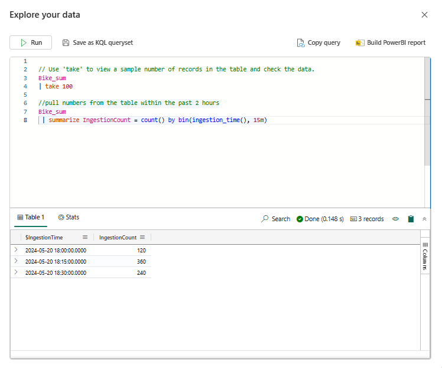
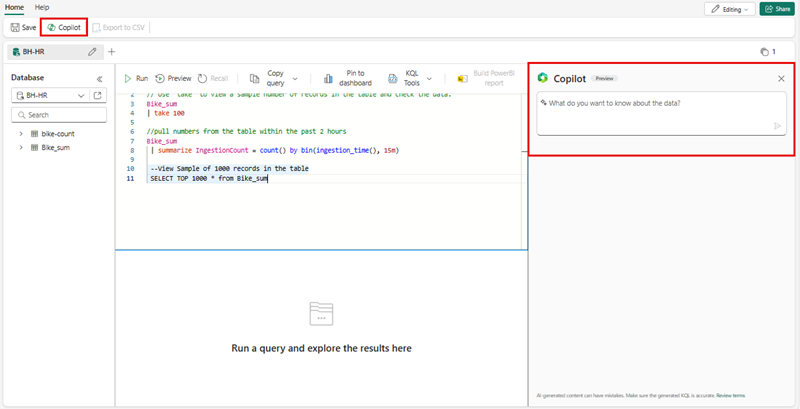

---
lab:
  title: Introducción a Eventstream en Microsoft Fabric
  module: Get started with Eventstream in Microsoft Fabric
---
# Introducción a Eventstream en Inteligencia en tiempo real

Eventstream es una característica de Microsoft Fabric que captura, transforma y enruta eventos en tiempo real a varios destinos con una experiencia sin escritura de código. A Eventstream puede agregar orígenes de datos de eventos, destinos de enrutamiento y el procesador de eventos cuando sea necesaria una transformación. EventStore de Microsoft Fabric es una opción de supervisión que mantiene eventos del clúster y proporciona una manera de conocer el estado del clúster o de las cargas de trabajo en un momento dado. Se puede consultar el servicio EventStore sobre los eventos que están disponibles para cada entidad y tipo de entidad del clúster. Esto significa que puede consultar eventos en distintos niveles, como clústeres, nodos, aplicaciones, servicios, particiones y réplicas de particiones. El servicio EventStore también tiene la capacidad de correlacionar los eventos del clúster. El examen de los eventos que se escribieron al mismo tiempo desde distintas entidades y que pueden haberse afectado entre sí permite al servicio EventStore vincular estos eventos para identificar las causas de las actividades del clúster. Otra opción para la supervisión y el diagnóstico de clústeres de Microsoft Fabric es agregar y recopilar eventos con EventFlow.

Este laboratorio se realiza en unos **30** minutos.

> **Nota**: Necesitará una [evaluación gratuita de Microsoft Fabric](https://learn.microsoft.com/fabric/get-started/fabric-trial) para realizar este ejercicio.

## Creación de un área de trabajo

Antes de trabajar con datos de Fabric, cree un área de trabajo con la evaluación gratuita de Fabric habilitada.

1. Inicie sesión en [Microsoft Fabric](https://app.fabric.microsoft.com) en `https://app.fabric.microsoft.com` y seleccione **Power BI**.
2. En la barra de menús de la izquierda, seleccione **Áreas de trabajo** (el icono tiene un aspecto similar a &#128455;).
3. Cree una nueva área de trabajo con el nombre que prefiera y seleccione un modo de licencia que incluya capacidad de Fabric (*Versión de prueba*, *Premium* o *Fabric*).
4. Cuando se abra la nueva área de trabajo, estará vacía, como se muestra aquí:

   
5. En la parte inferior izquierda del portal de Power BI, seleccione el icono de **Power BI** y cambie a la experiencia **Inteligencia en tiempo real**.

## Escenario

Con los Eventstreams de Fabric, puede administrar fácilmente los datos de eventos en un solo lugar. Puede recopilar, transformar y enviar datos de eventos en tiempo real a distintos destinos con el formato que desee. También puede conectar Eventstreams con Azure Event Hubs, la base de datos KQL y el almacén de lago sin problemas.

Este laboratorio se basa en datos de streaming de ejemplo denominados Stock Market Data. Los datos de ejemplo de Stock Market son un conjunto de datos de una bolsa de valores con una columna de esquema preestablecida, como la hora, el símbolo, el precio, el volumen, etc. Usará estos datos de ejemplo para simular eventos en tiempo real de los precios de las acciones y analizarlos con varios destinos, como la base de datos KQL.

Use la funcionalidad de streaming y consulta de Inteligencia en tiempo real para responder a preguntas clave sobre las estadísticas bursátiles. En este escenario, vamos a aprovechar al máximo el asistente en lugar de crear manualmente algunos componentes por separado, como la base de datos KQL.

En este tutorial, aprenderá a:

- Creación de instancia de Eventhouse
- Crear una base de datos KQL
- Habilitar la copia de datos en OneLake
- Crear un Eventstream
- Transmitir datos de un Eventstream a la base de datos KQL
- Explorar datos con KQL y SQL\

## Creación de un centro de eventos de inteligencia en tiempo real

1. Seleccione la opción inteligencia en tiempo real en Microsoft Fabric.
1. Seleccione Eventhouse en la barra de menús y asigne un nombre al centro de eventos.
    
    

## Creación de una base de datos KQL

1. En el panel **Eventhouse en Inteligencia en tiempo real**, seleccione la casilla **Base de datos KQL +**.
1. Tendrá la opción de asignar un nombre a la base de datos y seleccionar un **Nueva base de datos (valor predeterminado)** o crear una **base de datos de acceso directo (seguidor)**.
1. Seleccione **Crear**.

     >**Nota:** La característica de base de datos de seguidor te permite adjuntar una base de datos ubicada en otro clúster al de Azure Data Explorer. La base de datos del seguidor se adjunta en modo de solo lectura, lo que permite ver los datos y ejecutar consultas en los datos que se han ingerido en la base de datos del responsable. La base de datos del seguidor sincroniza los cambios en las bases de datos del responsable. Debido a la sincronización, hay un retraso de datos que va de unos segundos a unos minutos en la disponibilidad de los datos. La duración del retraso depende del tamaño total de los metadatos de la base de datos del responsable. Las bases de datos del responsable y el seguidor usan la misma cuenta de almacenamiento para capturar los datos. El almacenamiento pertenece a la base de datos del responsable. La base de datos del seguidor ve los datos sin necesidad de ingerirlos. Dado que la base de datos adjunta es de solo lectura, los datos, las tablas y las directivas de la base de datos no se pueden modificar, excepto en el caso de la directiva de almacenamiento en caché, las entidades de seguridad y los permisos.

   

4. Se le pedirá que asigne un **Nombre** a la base de datos KQL.

   

5. Dele un nombre a la base de datos KQL que sea fácil de recordar, como **Eventhouse-HR**, y presione **Crear**.

6. En el panel **Detalles de la base de datos**, seleccione el icono de lápiz para activar la disponibilidad en OneLake.

   

7. Asegúrese de cambiar el botón a **Activo** y, a continuación, seleccione **Listo**.

   

## Creación de un Eventstream

1. En la barra de menús, seleccione **Inteligencia en tiempo real** (el icono es similar al )
2. En **Nuevo**, selecciona **Eventstream**

   

3. Se le pedirá que le dé un **Nombre** al Eventstream. Asigna a EventStream un nombre que sea fácil de recordar, como **MyStockES**, selecciona la opción **Funcionalidades mejoradas (versión preliminar)** y selecciona el botón **Crear**.

   

     >**Nota:** La creación del nuevo flujo de eventos en el área de trabajo se completará en unos instantes. Una vez establecido, se le redirigirá automáticamente al editor principal, listo para empezar a integrar orígenes en el flujo de eventos.

## Establecer un origen de la transmisión de eventos

1. En el lienzo Eventstream, seleccione **Nuevo origen** en la lista desplegable y elija **Datos de ejemplo**.

    

2.  En **Agregar origen**, asigna un nombre al origen y selecciona **Bicicletas (compatibles con Reflex)**
3.  Seleccione el botón **Agregar**.

    

4. Una vez que seleccione el botón **Agregar**, la secuencia se asignará y se le redirigirá automáticamente al **lienzo de la transmisión de eventos**.

   
 
 > **Nota:** Después de crear el origen de datos de ejemplo, verás que se ha agregado a Eventstream en el lienzo en modo de edición. Para implementar estos datos de ejemplo recién agregados, seleccione **Publicar**.

## Agregar unos eventos de transformación o agregar actividad de destino

1. Después de publicar, puede seleccionar **Transformar eventos o agregar destino** y, a continuación, seleccione **base de datos KQL** como opción.

   

2. Verá un nuevo panel lateral abierto que ofrece muchas opciones. Escriba los detalles necesarios de la base de datos KQL.

   

    - **Modo de ingesta de datos:** Hay dos maneras de ingerir datos en la base de datos KQL:
        - ***Ingesta directa***: ingerir datos directamente en una tabla KQL sin ninguna transformación.
        - ***Procesamiento de eventos antes de la ingesta***: transforme los datos con el procesador de eventos antes de enviarlos a una tabla KQL.      
        
        > **Advertencia:** **NO** puede editar el modo de ingesta una vez que se agrega el destino de la base de datos KQL a la transmisión de eventos.     

   - **Nombre de destino:** especifica un nombre para este destino de Eventstream, como "kql-dest".
   - **Área de trabajo**: dónde se encuentra la base de datos KQL.
   - **Base de datos KQL**: nombre de la base de datos KQL.
   - **Tabla de destino**: nombre de la tabla KQL. También puede escribir un nombre para crear una nueva tabla, por ejemplo, "bike-count".
   - **Formato de datos de entrada:** Elija JSON como formato de datos para la tabla KQL.

3. Seleccione **Guardar**. 
4. Seleccione **Publish**.

## Transformación de los eventos

1. En el lienzo **transmisión de eventos**, seleccione **Transformar eventos**.

    

    A Seleccione **Grupo por**.

    B. Seleccione **Editar** representado por el icono ***lápiz***.

    C. Una vez creado el evento de transformación **Grupo por**, deberá conectarlo desde la **transmisión de eventos** a **Grupo por**. Puede hacerlo sin usar código, haga clic en punto del lado derecho **transmisión de eventos** y arrástralo al punto del lado izquierdo del nuevo cuadro **Grupo por**. 

        

2. Rellena las propiedades de la sección de configuración de **Agrupar por**:
    - **Nombre de la operación:** especifica un nombre para este evento de transformación
    - **Tipo de agregado:** Suma
    - **Campo:** No_Bikes
    - **Nombre:** SUM_No_Bikes
    - **Agrupar agregaciones por:** calle
      
3. Seleccione **Agregar** y, luego, seleccione **Guardar**.

4. De la misma manera, puedes pasar el ratón sobre la flecha entre el **flujo de eventos** y el ***kql_dest*** y seleccionar la ***papelera**. Luego, puedes conectar el evento **Agrupar por** a **kql-dest**.

   

    > **Nota:** Siempre que agregues o quites conectores, deberás volver a configurar los objetos de destino.

5. Selecciona el lápiz de **kql-dest** y crea una nueva tabla de destino denominada **Bike_sum** que recibirá la salida del evento **Agrupar por**.

## Consultas KQL

El Lenguaje de consulta Kusto (KQL) es una solicitud de solo lectura para procesar los datos y devolver resultados. La solicitud se indica en texto sin formato, usando un modelo de flujo de datos fácil de leer, crear y automatizar. Las consultas siempre se ejecutan en el contexto de una tabla o una base de datos determinada. Como mínimo, una consulta consta de una referencia de datos de origen y uno o varios operadores de consulta en secuencia que se indican visualmente con una barra vertical (|) para delimitarlos. Para obtener más información sobre el Lenguaje de consulta Kusto, consulte [Información general del Lenguaje de consulta Kusto](https://learn.microsoft.com/en-us/azure/data-explorer/kusto/query/?context=%2Ffabric%2Fcontext%2Fcontext).

> **Nota**: El Editor de KQL incluye la sintaxis y el resaltado de IntelliSense, lo que permite conocer rápidamente el Lenguaje de consulta Kusto (KQL).

1. Vaya a la base de datos KQL que ha creado e hidratado:

    A  Selecciona el **kql-dest** 

    B. Seleccione el hipervínculo **Abrir elemento** ubicado en la fila **Elemento relacionado**

   

1. En el árbol Datos, seleccione el menú Más [...] en la tabla ***Bike_sum***. Seleccione Tabla de consulta > Mostrar 100 registros cualesquiera.

   

3. La consulta de ejemplo se abre en el panel **Comprobar los datos** con el contexto de tabla ya rellenado. Esta primera consulta usa el operador `take` para devolver un número de registros de ejemplo y es útil para echar un primer vistazo a la estructura de datos y los valores posibles. Las consultas de ejemplo que se rellenan automáticamente se ejecutan automáticamente. Puede ver los resultados de la consulta en el panel de resultados.

   

4. Vuelve al árbol de datos para seleccionar la siguiente consulta **Resumen de ingesta por hora**, que usa el operador `summarize` para contar el número de registros ingeridos en un intervalo determinado.

   

> **Nota**: es posible que vea una advertencia de que ha superado los límites de consulta. Este comportamiento variará en función de la cantidad de datos transmitidos a la base de datos.

Puede seguir navegando con las funciones de consulta integradas para familiarizarse con los datos.

## Consulta con Copilot

El editor de consultas admite el uso de T-SQL además de su lenguaje de consulta principal, el Lenguaje de consulta Kusto (KQL). T-SQL puede ser útil para las herramientas que no pueden usar KQL. Para obtener más información, vea [Consulta de datos mediante T-SQL](https://learn.microsoft.com/en-us/azure/data-explorer/t-sql).

1. De nuevo en el árbol Datos, seleccione el **menú Más** [...] en la tabla MyStockData. Seleccione **Tabla de consulta > SQL > Mostrar 100 registros cualesquiera**.

   

2. Sitúe el cursor en algún lugar de la consulta y seleccione **Ejecutar** o presione **Mayús + Entrar**.

   

Puede seguir navegando con las funciones integradas y familiarizarse con los datos usando SQL o KQL. 

## Características con el conjunto de consultas

Los conjuntos de consultas de las bases de datos de KQL (lenguaje de consulta Kusto) se usan para diversos propósitos, principalmente para ejecutar consultas, ver y personalizar los resultados de las consultas en los datos de una base de datos KQL. Son un componente clave en las funcionalidades de consulta de datos de Microsoft Fabric, lo que permite a los usuarios:

 - **Ejecutar consultas:** Ejecute consultas KQL para recuperar datos de una base de datos KQL.
 - **Personalizar resultados:** Vea y modifique los resultados de la consulta, lo que facilita el análisis e interpretación de los datos.
 - **Guardar y compartir consultas:** Cree varias pestañas dentro de un conjunto de consultas para guardar las consultas para usarlas posteriormente o compartirlas con otras personas para la exploración de datos colaborativas.
 - **Admite funciones de SQL:** Al usar KQL para crear consultas, los conjuntos de consultas también admiten muchas funciones SQL, lo que proporciona flexibilidad en la consulta de datos.
 - **Aprovechar Copilot:** Una vez que haya guardado consultas como un conjunto de consultas KQL, puede verlas

Para guardar un conjunto de consultas es sencillo y tiene un par de enfoques. 

1. En la **base de datos de KQL** mientras usa la herramienta **Explorar los datos**, puede seleccionar simplemente **Guardar como conjunto de consultas KQL**

   

2. Otro enfoque es desde la página de aterrizaje de Inteligencia en tiempo real seleccionando el botón **conjunto de consultas KQL** de la página y, a continuación, asigna un nombre al **conjunto de consultas**

   

3. Una vez que esté en la **página de aterrizaje del conjunto de consultas** verá un botón **Copilot** en la barra de herramientas, selecciónelo para abrir el **panel Copilot** para formular preguntas sobre los datos.

    

4. En el **panel Copilot** simplemente escriba su pregunta y **Copilot** generará la consulta KQL y le permitirá ***copiar*** o ***insertar** la consulta en la ventana del conjunto de consultas. 

    

5. Desde este punto, tiene la opción de realizar consultas individuales y usarlas en paneles o informes de Power BI con los botones **Anclar al panel** o **Crear informe de PowerBI**.

## Limpieza de recursos

En este ejercicio, ha creado una base de datos KQL y ha configurado un streaming continuo con Eventstream. Después, ha consultado los datos con KQL y SQL. Si ha terminado de explorar la base de datos KQL, puede eliminar el área de trabajo que ha creado para este ejercicio.
1. En la barra de la izquierda, seleccione el icono del área de trabajo.
2. En el menú **...** de la barra de herramientas, seleccione **Configuración del área de trabajo**.
3. En la sección **General**, seleccione **Quitar esta área de trabajo**.
.
