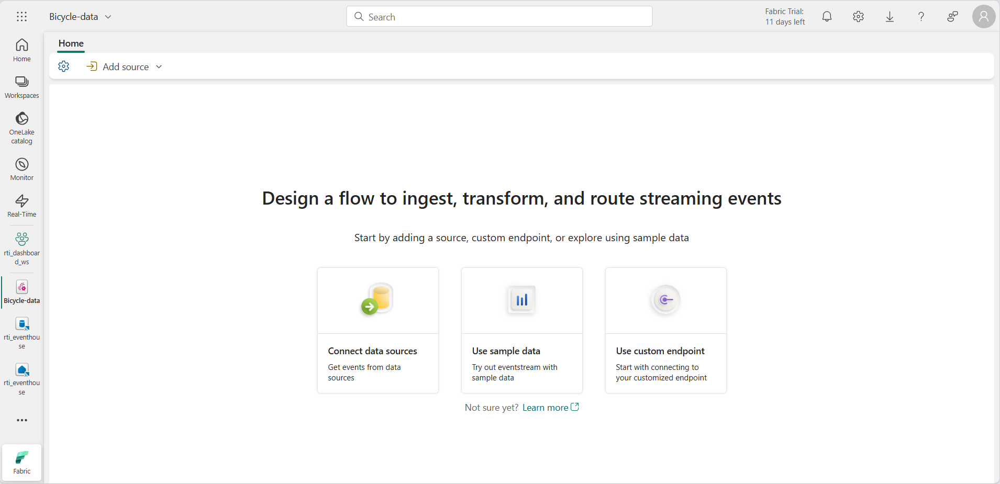
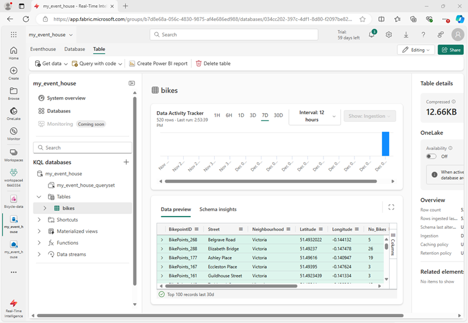
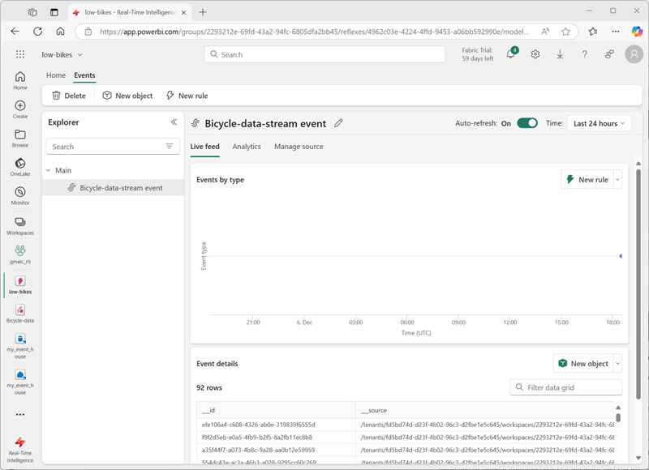
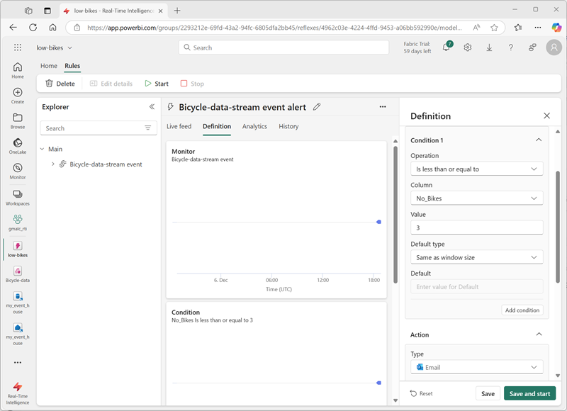

---
lab:
  title: Ingesta de datos en tiempo real con Eventstream de Microsoft Fabric
  module: Ingest real-time data with Eventstream in Microsoft Fabric
---
# Ingesta de datos en tiempo real con Eventstream de Microsoft Fabric

Eventstream es una característica de Microsoft Fabric que captura, transforma y enruta eventos en tiempo real a varios destinos. Puedes agregar orígenes de datos de eventos, destinos y transformaciones al flujo de eventos.

En este ejercicio, ingerirás datos de un origen de datos de ejemplo que emite un flujo de eventos relacionados con observaciones de puntos de recogida de bicicletas de un sistema de uso compartido de bicicletas en el que las personas pueden alquilar bicicletas dentro de una ciudad.

Este laboratorio se realiza en unos **30** minutos.

> **Nota**: Necesitas un [inquilino de Microsoft Fabric](https://learn.microsoft.com/fabric/get-started/fabric-trial) para completar este ejercicio.

## Creación de un área de trabajo

Antes de trabajar con datos de Fabric, necesitas crear un área de trabajo con la capacidad gratuita de Fabric habilitada.

1. En un explorador, ve a la [página principal de Microsoft Fabric](https://app.fabric.microsoft.com/home?experience=fabric) en `https://app.fabric.microsoft.com/home?experience=fabric` e inicia sesión con tus credenciales de Fabric.
1. En la barra de menús de la izquierda, seleccione **Áreas de trabajo** (el icono tiene un aspecto similar a &#128455;).
1. Crea una nueva área de trabajo con el nombre que prefieras y selecciona un modo de licencia que incluya capacidad de Fabric (*Evaluación gratuita*, *Premium* o *Fabric*).
1. Cuando se abra la nueva área de trabajo, debe estar vacía.

    

## Creación de instancias de Event house

Ahora que tienes un área de trabajo, puedes empezar a crear los elementos de Fabric que necesitarás para tu solución de inteligencia en tiempo real. Empezaremos por crear un centro de eventos.

1. En el área de trabajo que acabas de crear, selecciona **+ Nuevo elemento**. En el panel *Nuevo elemento*, selecciona **Eventhouse** y asígnale el nombre único que prefieras.
1. Cierra las sugerencias o avisos que se muestran hasta que veas tu nuevo centro de eventos vacío.

    

1. En el panel de la izquierda, ten en cuenta que el centro de eventos contiene una base de datos KQL con el mismo nombre que el centro de eventos.
1. Selecciona la base de datos KQL para verla.

    Actualmente no hay tablas en la base de datos. En el resto de este ejercicio, usarás un flujo de eventos para cargar datos de un origen en tiempo real en una tabla.

## Creación de un Eventstream

1. En la página principal de la base de datos KQL, selecciona **Obtener datos**.
2. Para el origen de datos, selecciona **Eventstream** > **Nuevo flujo de eventos**. Asigna un nombre al flujo de eventos `Bicycle-data`.

    La creación del nuevo flujo de eventos en el área de trabajo se completará en unos instantes. Una vez establecido, se le redirigirá automáticamente al editor principal, listo para empezar a integrar orígenes en el flujo de eventos.

    

## Agregar un origen

1. En el lienzo Eventstream, selecciona **Usar datos de ejemplo**.
2. Asigna un nombre al origen `Bicycles` y selecciona los datos de muestra **Bicicletas**.

    El flujo se asignará y se mostrará automáticamente en el **lienzo del flujo de eventos**.

   

## Agregar un destino

1. Selecciona el icono **Transformar eventos o agregar destino** y busca **Eventhouse**.
1. En el panel **Eventhouse**, establece las siguientes opciones de configuración.
   - **Modo de ingesta de datos:**: procesamiento de eventos antes de la ingesta
   - **Nombre del destino:**`bikes-table`
   - **Área de trabajo:***selecciona el área de trabajo que has creado al principio de este ejercicio*
   - **Eventhouse**: *selecciona tu centro de eventos*
   - **Base de datos KQL:** *selecciona la base de datos KQL.*
   - **Tabla de destino:** crea una nueva tabla denominada `bikes`
   - **Formato de datos de entrada:** JSON

   

1. En el panel **Eventhouse**, selecciona **Guardar**. 
1. En la barra de herramientas, seleccione **Publicar**.
1. Espera aproximadamente un minuto a que se active el destino de los datos. Después, selecciona el nodo **bikes-table** en el lienzo de diseño y visualiza el panel **Versión preliminar de datos** inferior para ver los últimos datos que se han ingerido:

   

1. Espera unos minutos y después usa el botón **Actualizar** para actualizar el panel **Versión preliminar de datos**. El flujo se ejecuta de forma perpetua, por lo que es posible que se hayan agregado nuevos datos a la tabla.
1. Debajo del lienzo de diseño del flujo de eventos, consulta la pestaña **Información de datos** para ver los detalles de los eventos de datos que se han capturado.

## Consulta de los datos capturados

El flujo de eventos que has creado toma datos del origen de ejemplo de datos de bicicletas y los carga en la base de datos del centro de eventos. Puedes analizar los datos capturados al consultar la tabla de la base de datos.

1. En la barra de menú de la izquierda, selecciona tu base de datos KQL.
1. En la pestaña **Base de datos**, de la barra de herramientas de tu base de datos KQL, usa el botón **Actualizar** para actualizar la vista hasta que veas la tabla **bikes** debajo de la base de datos. Después selecciona la tabla **bikes**.

   

1. En el menú **...** de la tabla **bikes**, selecciona **Consultar tabla** > **Registros ingeridos en las últimas 24 horas**.
1. En el panel de consulta, ten en cuenta que se ha generado y ejecutado la consulta siguiente, con los resultados que se muestran debajo:

    ```kql
    // See the most recent data - records ingested in the last 24 hours.
    bikes
    | where ingestion_time() between (now(-1d) .. now())
    ```

1. Seleccione el código de consulta y ejecútalo para ver 24 horas de datos de la tabla.

    

## Transformar datos de eventos

Los datos capturados no se modifican desde el origen. En muchos escenarios, es posible que desees transformar los datos del flujo de eventos antes de cargarlos en un destino.

1. En la barra de menús de la izquierda, selecciona el flujo de eventos **Bicycle-data**.
1. En la barra de herramientas, selecciona **Editar** para editar el flujo de eventos.
1. En el menú **Transformar eventos**, selecciona **Agrupar por** para agregar un nuevo nodo **Agrupar por** al flujo de eventos.
1. Arrastra una conexión desde la salida del nodo **Bicycle-data** a la entrada del nuevo nodo **Agrupar por** y después usa el icono del *lápiz* en el nodo **Agrupar por** para editarla.

   

1. Configura las propiedades de la sección de configuración **Agrupar por**:
    - **Nombre de la operación:** GroupByStreet
    - **Tipo de agregado:***seleccionar* Suma
    - **Campo:***selecciona* No_Bikes. *Después selecciona **Agregar** para crear la función* SUMA de No_Bikes
    - **Agrupar agregaciones por (opcional):** Calle
    - **Ventana de tiempo**: saltos de tamaño constante
    - **Duración**: 5 segundos
    - **Desplazamiento**: 0 segundos

    > **Nota**: Esta configuración hará que la secuencia de eventos calcule el número total de bicicletas en cada calle cada 5 segundos.
      
1. Guarda la configuración y vuelve al lienzo del flujo de eventos, donde se indica un error (porque necesitas almacenar la salida de la transformación en algún lugar).

1. Usa el icono **+** a la derecha del nodo **GroupByStreet** para agregar un nuevo nodo **Centro de eventos**.
1. Configura el nuevo nodo del centro de eventos con las siguientes opciones:
   - **Modo de ingesta de datos:**: procesamiento de eventos antes de la ingesta
   - **Nombre del destino:**`bikes-by-street-table`
   - **Área de trabajo:***selecciona el área de trabajo que has creado al principio de este ejercicio*
   - **Eventhouse**: *selecciona tu centro de eventos*
   - **Base de datos KQL:** *selecciona la base de datos KQL.*
   - **Tabla de destino:** crea una nueva tabla denominada `bikes-by-street`
   - **Formato de datos de entrada:** JSON

    

1. En el panel **Eventhouse**, selecciona **Guardar**. 
1. En la barra de herramientas, seleccione **Publicar**.
1. Espere aproximadamente un minuto a que se activen los cambios.
1. En el lienzo de diseño, selecciona el nodo **bikes-by-street-table** y visualiza el panel **Vista previa de datos** debajo del lienzo.

    

    Ten en cuenta que los datos trasformados incluyen el campo de agrupación que has especificado (**Calle**), la agregación que has especificado (**SUM_no_Bikes**) y un campo de marca de tiempo que indica el final de la ventana de saltos de tamaño constante de 5 segundos en la que se ha producido el evento (**Window_End_Time**).

## Consultar los datos transformados

Ahora puedes consultar los datos de bicicletas que se han transformado y cargado en una tabla mediante tu flujo de eventos.

1. En la barra de menú de la izquierda, selecciona tu base de datos KQL.
1. 1. En la pestaña **Base de datos**, de la barra de herramientas de tu base de datos KQL, usa el botón **Actualizar** para actualizar la vista hasta que veas la tabla **bikes-by-street** debajo de la base de datos.
1. En el menú **...** de la tabla **bikes-by-street**, selecciona **Consultar datos** > **Mostrar 100 registros cualesquiera**.
1. En el panel de consulta, ten en cuenta que se genera y ejecuta la consulta siguiente:

    ```kql
    ['bikes-by-street']
    | take 100
    ```

1. Modifica la consulta KQL para recuperar el número total de bicicletas por calle en cada ventana de 5 segundos:

    ```kql
    ['bikes-by-street']
    | summarize TotalBikes = sum(tolong(SUM_No_Bikes)) by Window_End_Time, Street
    | sort by Window_End_Time desc , Street asc
    ```

1. Selecciona la consulta modificada y ejecútala.

    Los resultados muestran el número de bicicletas observadas en cada calle dentro de cada período de 5 segundos.

    

<!--
## Add an Activator destination

So far, you've used an eventstream to load data into tables in an eventhouse. You can also direct streams to an activator and automate actions based on values in the event data.

1. In the menu bar on the left, return to the **Bicycle-data** eventstream. Then in the eventstream page, on the toolbar, select **Edit**.
1. In the **Add destination** menu, select **Activator**. Then drag a connection from the output of the **Bicycle-data** stream to the input of the new Activator destination.
1. Configure the new Activator destination with the following settings:
    - **Destination name**: `low-bikes-activator`
    - **Workspace**: *Select your workspace*
    - **Activator**: *Create a **new** activator named `low-bikes`*
    - **Input data format**: Json

    

1. Save the new destination.
1. In the menu bar on the left, select your workspace to see all of the items you have created so far in this exercise - including the new **low-bikes** activator.
1. Select the **low-bikes** activator to view its page, and then on the activator page select **Get data**.
1. On the **select a data source** dialog box, scroll down until you see **Data streams** and then select the **Bicycle-data-stream**.

    

1. Use the **Next**,  **Connect**, and **Finish** buttons to connect the stream to the activator.

    > **Tip**: If the data preview obscures the **Next** button, close the dialog box, select the stream again, and click **Next** before the preview is rendered.

1. When the stream has been connected, the activator page displays the **Events** tab:

    

1. Add a new rule, and configure its definition with the following settings:
    - **Monitor**:
        - **Event**: Bicycle-data-stream-event
    - **Condition**
        - **Condition 1**:
            - **Operation**: Numeric state: Is less than or equal to
            - **Column**: No_Bikes
            - **Value**: 3
            - **Default type**: Same as window size
    - **Action**:
        - **Type**: Email
        - **To**: *The email address for the account you are using in this exercise*
        - **Subject**: `Low bikes`
        - **Headline**: `The number of bikes is low`
        - **Message**: `More bikes are needed.`
        - **Context**: *Select the **Neighborhood**, **Street**, and **No-Bikes** columns.

    

1. Save and start the rule.
1. View the **Analytics** tab for the rule, which should show each instance if the condition being met as the stream of events is ingested by your eventstream.

    Each instance will result in an email being sent notifying you of low bikes, which will result in a large numbers of emails, so...

1. On the toolbar, select **Stop** to stop the rule from being processed.

-->

## Limpieza de recursos

En este ejercicio, has creado un centro de eventos y has anclado tablas en tu base de datos mediante un flujo de eventos.

Si ha terminado de explorar la base de datos KQL, puede eliminar el área de trabajo que ha creado para este ejercicio.

1. En la barra de la izquierda, seleccione el icono del área de trabajo.
2. En la barra de herramientas, selecciona **Configuración del área de trabajo**.
3. En la sección **General**, selecciona **Quitar esta área de trabajo**.
.
