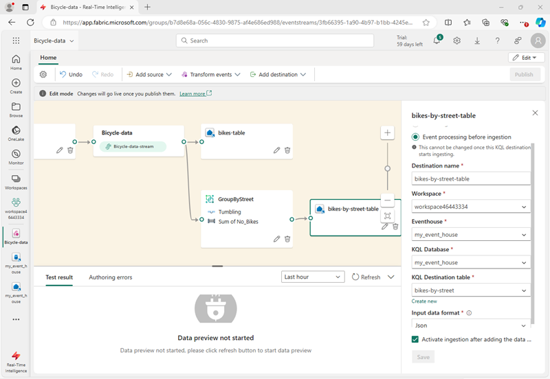

---
lab:
  title: Introducción a Eventstream en Microsoft Fabric
  module: Get started with Eventstream in Microsoft Fabric
---
# Introducción a Eventstream en Microsoft Fabric

Eventstream es una característica de Microsoft Fabric que captura, transforma y enruta eventos en tiempo real a varios destinos con una experiencia sin escritura de código. A Eventstream puede agregar orígenes de datos de eventos, destinos de enrutamiento y el procesador de eventos cuando sea necesaria una transformación. EventStore de Microsoft Fabric es una opción de supervisión que mantiene eventos del clúster y proporciona una manera de conocer el estado del clúster o de las cargas de trabajo en un momento dado. Se puede consultar el servicio EventStore sobre los eventos que están disponibles para cada entidad y tipo de entidad del clúster. Esto significa que puede consultar eventos en distintos niveles, como clústeres, nodos, aplicaciones, servicios, particiones y réplicas de particiones. El servicio EventStore también tiene la capacidad de correlacionar los eventos del clúster. El examen de los eventos que se escribieron al mismo tiempo desde distintas entidades y que pueden haberse afectado entre sí permite al servicio EventStore vincular estos eventos para identificar las causas de las actividades del clúster. Otra opción para la supervisión y el diagnóstico de clústeres de Microsoft Fabric es agregar y recopilar eventos con EventFlow.

Este laboratorio se realiza en unos **30** minutos.

> **Nota**: Necesitará una [evaluación gratuita de Microsoft Fabric](https://learn.microsoft.com/fabric/get-started/fabric-trial) para realizar este ejercicio.

## Creación de un área de trabajo

Antes de trabajar con datos de Fabric, crea un área de trabajo con la evaluación gratuita de Fabric habilitada.

1. Inicia sesión en la [página principal de Microsoft Fabric](https://app.fabric.microsoft.com/home?experience=fabric) en `https://app.fabric.microsoft.com/home?experience=fabric` y selecciona **Power BI**.
2. En la barra de menús de la izquierda, selecciona **Áreas de trabajo** (el icono tiene un aspecto similar a &#128455;).
3. Cree una nueva área de trabajo con el nombre que prefiera y seleccione un modo de licencia que incluya capacidad de Fabric (*Versión de prueba*, *Premium* o *Fabric*).
4. Cuando se abra la nueva área de trabajo, estará vacía, como se muestra aquí:

   
5. En la parte inferior izquierda del portal de Power BI, seleccione el icono de **Power BI** y cambie a la experiencia **Inteligencia en tiempo real**.

## Creación de un centro de eventos de inteligencia en tiempo real

1. En la página principal de Inteligencia en tiempo real en Microsoft Fabric, crea un nuevo **Centro de eventos** con el nombre único que prefieras.
1. Cierra las sugerencias o avisos que se muestran hasta que veas tu nuevo centro de eventos vacío.

    

## Creación de una base de datos KQL

1. En el panel **Eventhouse en Inteligencia en tiempo real**, seleccione la casilla **Base de datos KQL +**.
1. Tendrás la opción de crear una **Nueva base de datos ( predeterminada)** o crear una **Nueva base de datos de acceso directo ( seguidor)**.

    >**Nota:** La característica de base de datos de seguidor te permite adjuntar una base de datos ubicada en otro clúster al de Azure Data Explorer. La base de datos del seguidor se adjunta en modo de solo lectura, lo que permite ver los datos y ejecutar consultas en los datos que se han ingerido en la base de datos del responsable. La base de datos del seguidor sincroniza los cambios en las bases de datos del responsable. Debido a la sincronización, hay un retraso de datos que va de unos segundos a unos minutos en la disponibilidad de los datos. La duración del retraso depende del tamaño total de los metadatos de la base de datos del responsable. Las bases de datos del responsable y el seguidor usan la misma cuenta de almacenamiento para capturar los datos. El almacenamiento pertenece a la base de datos del responsable. La base de datos del seguidor ve los datos sin necesidad de ingerirlos. Dado que la base de datos adjunta es de solo lectura, los datos, las tablas y las directivas de la base de datos no se pueden modificar, excepto en el caso de la directiva de almacenamiento en caché, las entidades de seguridad y los permisos.

1. Crea una nueva base de datos y asígnale el nombre `Eventhouse-DB`.

## Creación de un Eventstream

1. En la página principal de la base de datos KQL, selecciona **Obtener datos**.
2. Para el origen de datos, selecciona **Eventstream** > **Nuevo flujo de eventos**. Asigna un nombre al flujo de eventos `bicycle-data`.

    La creación del nuevo flujo de eventos en el área de trabajo se completará en unos instantes. Una vez establecido, se le redirigirá automáticamente al editor principal, listo para empezar a integrar orígenes en el flujo de eventos.

    

## Establecer un origen de la transmisión de eventos

1. En el lienzo Eventstream, selecciona **Usar datos de ejemplo**.
2. Asigna un nombre al origen `Bicycles` y selecciona los datos de muestra **Bicicletas**.

    El flujo se asignará y se mostrará automáticamente en el **lienzo del flujo de eventos**.

   

## Agregar un destino

1. En la lista desplegable **Transformar eventos o agregar destino**, selecciona **Centro de eventos**.
1. En el panel **Eventhouse**, establece las siguientes opciones de configuración.
   - **Modo de ingesta de datos:**: procesamiento de eventos antes de la ingesta
   - **Nombre del destino:**`Bicycle-database`
   - **Área de trabajo:***selecciona el área de trabajo que has creado al principio de este ejercicio*
   - **Eventhouse**: *selecciona tu centro de eventos*
   - **Base de datos KQL:** Eventhouse-DB
   - **Tabla de destino:** crea una nueva tabla denominada `bike-count`
   - **Formato de datos de entrada:** JSON

   

1. En el panel **Eventhouse**, selecciona **Guardar**. 
1. En la barra de herramientas, seleccione **Publicar**.
1. Espera aproximadamente un minuto a que se active el destino de los datos.

## Visualización de datos capturados

El flujo de eventos que has creado toma datos del origen de ejemplo de datos de bicicletas y los carga en la base de datos del centro de eventos. Puedes ver los datos capturados al consultar la tabla de la base de datos.

1. En la barra de menús de la izquierda, selecciona tu base de datos **Eventhouse-DB**.
1. En el menú **...** de la base de datos **Eventhouse-DB** KQL, selecciona **Consultar datos**.
1. En el panel de consulta, modifica la primera consulta de ejemplo como se muestra aquí:

    ```kql
    ['bike-count']
    | take 100
    ```

1. Selecciona el código de consulta y ejecútalo para ver 100 filas de datos de la tabla.

    

## Transformar datos de eventos

Los datos capturados no se modifican desde el origen. En muchos escenarios, es posible que desees transformar los datos del flujo de eventos antes de cargarlos en un destino.

1. En la barra de menús de la izquierda, selecciona el flujo de eventos **Bicycle-data**.
1. En la barra de herramientas, selecciona **Editar** para editar el flujo de eventos.

1. En el menú **Transformar eventos**, selecciona **Agrupar por** para agregar un nuevo nodo **Agrupar por** al flujo de eventos.
1. Arrastra una conexión desde la salida del nodo **Bicycle-data** a la entrada del nuevo nodo **Agrupar por** y después usa el icono del *lápiz* en el nodo **Agrupar por** para editarla.

   

1. Configura las propiedades de la sección de configuración **Agrupar por**:
    - **Nombre de la operación:** GroupByStreet
    - **Tipo de agregado:***seleccionar* Suma
    - **Campo:***selecciona* No_Bikes. *Después selecciona **Agregar** para crear la función* SUM_No_Bikes
    - **Agrupar agregaciones por (opcional):** Calle
    - **Ventana de tiempo**: saltos de tamaño constante
    - **Duración**: 5 segundos
    - **Desplazamiento**: 0 segundos

    > **Nota**: Esta configuración hará que la secuencia de eventos calcule el número total de bicicletas en cada calle cada 5 segundos.
      
1. Guarda la configuración y vuelve al lienzo del flujo de eventos, donde se indica un error (porque necesitas almacenar la salida del grupo por transformación en algún lugar).

1. Usa el icono **+** a la derecha del nodo **GroupByStreet** para agregar un nuevo nodo **Centro de eventos**.
1. Configura el nuevo nodo del centro de eventos con las siguientes opciones:
   - **Modo de ingesta de datos:**: procesamiento de eventos antes de la ingesta
   - **Nombre del destino:**`Bicycle-database`
   - **Área de trabajo:***selecciona el área de trabajo que has creado al principio de este ejercicio*
   - **Centro de eventos**: *selecciona tu centro de eventos*
   - **Base de datos KQL:** Eventhouse-DB
   - **Tabla de destino:** crea una nueva tabla denominada `bikes-by-street`
   - **Formato de datos de entrada:** JSON

   

1. En el panel **Eventhouse**, selecciona **Guardar**. 
1. En la barra de herramientas, seleccione **Publicar**.
1. Espere aproximadamente un minuto a que se activen los cambios.

## Visualización de los datos transformados

Ahora puedes ver los datos de bicicletas que se han transformado y cargado en una tabla mediante tu flujo de eventos.

1. En la barra de menús de la izquierda, selecciona tu base de datos **Eventhouse-DB**.
1. En el menú **...** de la base de datos **Eventhouse-DB** KQL, selecciona **Consultar datos**.
1. En el panel de consulta, modifica una consulta de ejemplo como se muestra aquí:

    ```kql
    ['bikes-by-street']
    | take 100
    ```

1. Selecciona el código de consulta y ejecútalo para ver las primeras 100 filas de la tabla.

    

    > **Sugerencia**: También puedes consultar la tabla mediante la sintaxis SQL. Por ejemplo, prueba la consulta `SELECT TOP 100 * FROM bikes-by-street`.

## Limpieza de recursos

En este ejercicio, has creado un centro de eventos y has anclado tablas en tu base de datos mediante un flujo de eventos.

Si ha terminado de explorar la base de datos KQL, puede eliminar el área de trabajo que ha creado para este ejercicio.

1. En la barra de la izquierda, seleccione el icono del área de trabajo.
2. En la barra de herramientas, selecciona **Configuración del área de trabajo**.
3. En la sección **General**, seleccione **Quitar esta área de trabajo**.
.
