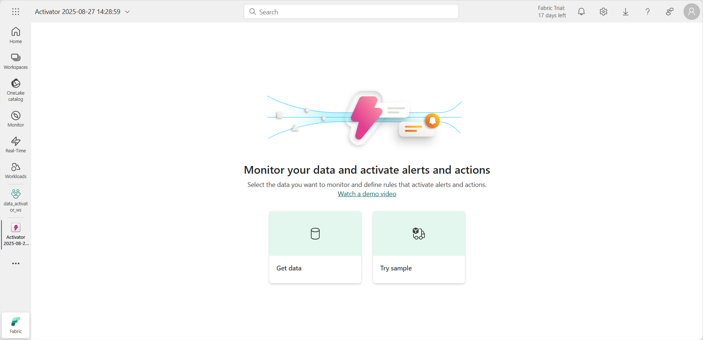

---
lab:
  title: Uso de Activator en Microsoft Fabric
  module: Use Activator in Microsoft Fabric
---
# Uso de Activator en Fabric

Activator de Microsoft Fabric realiza acciones en función de lo que sucede en los datos. Un activador permite supervisar los datos y crear desencadenadores para reaccionar ante los cambios en ellos.

Este laboratorio se realiza en unos **30** minutos.

> **Nota**: Necesitará una [evaluación gratuita de Microsoft Fabric](https://learn.microsoft.com/fabric/get-started/fabric-trial) para realizar este ejercicio.

## Escenario

En este escenario, es analista de datos de una empresa que vende y distribuye una gama de productos.  Es responsable de los datos de todos los envíos y ventas a la ciudad de Redmond. Desea crear una regla de alertas que supervise los paquetes que están pendientes de entrega. Una categoría de productos que usted envía son las recetas médicas que necesitan estar refrigeradas a una temperatura determinada durante el tránsito. Desea crear un alerta que envíe un correo electrónico al departamento de envíos si la temperatura de un paquete que contiene una receta es superior o inferior a un determinado umbral. La temperatura ideal debe estar comprendida entre 33 y 41 grados. Dado que los eventos del activador ya contienen un desencadenador similar, se crea uno específico para los paquetes enviados a la ciudad de Redmond. Comencemos.

## Creación de un área de trabajo

Antes de trabajar con datos de Fabric, crea un área de trabajo con la evaluación gratuita de Fabric habilitada.

1. En un explorador, ve a la [página principal de Microsoft Fabric](https://app.fabric.microsoft.com/home?experience=fabric-developer) en `https://app.fabric.microsoft.com/home?experience=fabric-developer` e inicia sesión con tus credenciales de Fabric.
1. En la barra de menús de la izquierda, selecciona **Áreas de trabajo** (el icono tiene un aspecto similar a &#128455;).
1. Crea una nueva área de trabajo con el nombre que prefieras y selecciona un modo de licencia que incluya capacidad de Fabric (*Evaluación gratuita*, *Premium* o *Fabric*).
1. Cuando se abra la nueva área de trabajo, debe estar vacía.

    

En este laboratorio, usará el activador de Fabric para crear desencadenadores basados en los cambios en los datos. El activador de Fabric proporciona un conjunto de datos de ejemplo que puede utilizar para explorar las funcionalidades de Activator. Usará estos datos de ejemplo para analizar el streaming de datos en tiempo real y crear un desencadenador para enviar un correo electrónico cuando se cumpla una condición.

> **Nota**: El proceso de ejemplo del activador genera algunos datos aleatorios en segundo plano. Cuanto más complejas sean las condiciones y los filtros, más tiempo se tarda en desencadenarlos. Si no ve ningún dato en el gráfico, espere unos minutos y actualice la página. Dicho esto, no es necesario esperar a que los datos se muestren en los gráficos para continuar con el laboratorio.

## Creación de un activador

A continuación, cree un activador en el área de trabajo que creó:

1. En la barra de menús de la izquierda, selecciona **Crear**. En la página *New*, en la sección *Real-Time Intelligence*, seleccione **Activator**.

    >**Nota**: si la opción **Crear** no está anclada a la barra lateral, primero debes seleccionar la opción de puntos suspensivos (**...**).

    Después de un minuto o así, se creará un nuevo activador:

    

    En un entorno de producción real, usaría sus propios datos. Sin embargo, para este laboratorio, se utilizan los datos de ejemplo que proporciona el activador. 

1. Seleccione el icono **Try sample** para rellenar el activador con datos de ejemplo.

    De forma predeterminada, el activador se crea con el nombre *Activator YYYY-MM-DD hh:mm:ss*. Dado que puede tener varios activadores en el área de trabajo, debe cambiar el nombre predeterminado por uno más descriptivo.

1. Seleccione la lista desplegable junto al nombre del activador actual en la esquina superior izquierda y cambie el nombre a ***Activador de envíos de Contoso*** para nuestro ejemplo.

    

Ya se ha creado ahora nuestro proyecto de activador, y podemos empezar a navegar por sus objetos, propiedades y reglas.

## Familiarizarse con la pantalla principal del activador

Vamos a explorar los datos de Eventstream en los que se basa este ejemplo.

1. En el panel **Explorer**, desplácese hacia abajo y seleccione el flujo **Package delivery events**.

    Estos eventos muestran el estado en tiempo real de los paquetes que están en proceso de entrega.

    

1. Revise los datos de la tabla dinámica **Event details**. Cada punto de datos contiene información sobre los eventos entrantes. Es posible que tenga que desplazarse para verlo todo.

    El panel **Explorer** muestra objetos que usan datos de instancias de Eventstream. Estos objetos tienen propiedades a partir de las cuales se pueden crear reglas. En este ejemplo, **Package** es el objeto creado a partir del Eventstream **Package delivery events**.

1. En el panel **Explorer**, en la propiedad **Temperature**, seleccione la regla **Too hot for medicine**.
1. En el panel **Definición**, revise cómo funciona la regla. En la sección **Supervisión**, la propiedad **Temperatura** se selecciona como atributo que se está supervisando. Los valores de temperatura proceden de la columna Temperatura de la tabla **Event details** que vimos anteriormente en el Eventstream. 

     

1. En la sección **Condición**, verá la condición de regla para supervisar las temperaturas superiores a 20 grados centígrados.
1. En la sección **Property filter**, verá un filtro personalizado que garantiza que nuestra regla solo se aplica a los paquetes que contienen medicamentos. En la tabla Eventstream, la regla examina la columna denominada **SpecialCare**, que se representa aquí como la propiedad *Special care contents*. En la propiedad *Special care contents*, algunos de los paquetes tienen un valor de Medicine.
1. Por último, tenemos la sección **Action**. Nuestra regla se establece para enviar un mensaje de Teams si se cumple la condición. También puede establecerlo para enviar un correo electrónico en su lugar.
1. Seleccione el tipo de acción que prefiera, compruebe que es el destinatario y, a continuación, seleccione **Send me a test action**. Recibirá el mensaje definido en el campo **Message** con detalles sobre el desencadenador, como el tiempo de activación y el identificador de paquete.

## Creación de un objeto 

En un escenario real, es posible que no sea necesario crear un nuevo objeto para este Eventstream, ya que el ejemplo del activador ya incluye un objeto denominado *Package*. Pero para este laboratorio, creamos un nuevo objeto para demostrar cómo crear uno. Vamos a crear un nuevo objeto denominado *Redmond Packages*.

1. Seleccione el Eventstream **Package delivery events** y, a continuación, seleccione **New object** en la cinta de opciones.

1. En el panel **Compilar objeto** a la derecha, escriba los siguientes valores:
    - **Nombre de objeto**: `Redmond Packages`
    - **Identificador único**: **PackageId**
    - **Propiedades**: **Ciudad**, **ColdChainType**, **SpecialCare**, **Temperatura**

1. Seleccione **Crear**.

    

En el panel **Explorer**, se ha agregado un nuevo objeto denominado **Redmond Packages**. Hora de crear la regla.

## Crear una regla

Vamos a revisar lo que quiere que haga la regla: *Desea crear una regla de alertas que envíe un correo electrónico al departamento de envíos si la temperatura de un paquete que contiene una receta es superior o inferior a un determinado umbral. La temperatura ideal debe ser inferior a 20 grados. Dado que el objeto Paquete ya contiene una regla similar, creará una específicamente para los paquetes enviados a la ciudad de Redmond*.

1. Seleccione la propiedad **Temperature** en el objeto *Redmond Packages* y seleccione el botón **New Rule** de la cinta de opciones, si aún no está seleccionado.
1. En el panel **Create rule**, escriba los siguientes valores:
    - **Condición**: Aumentos anteriores
    - **Valor**: `20`
    - **Repetición**: Cada vez que se cumple la condición
    - **Acción**: Enviarme un correo electrónico

1. Seleccione **Crear**.
1. Se crea una nueva regla con el nombre predeterminado de *Temperature alert*. Cambie el nombre a ***Medicine temp out of range***; para ello, seleccione el icono de lápiz situado junto al nombre de la regla en el panel central.

    

    Hasta ahora se ha definido la propiedad y la condición en la que desea que se active la regla, pero eso todavía no se incluyen todos los parámetros necesarios. Todavía tiene que asegurarse de que el desencadenador solo se activa para la *ciudad* de **Redmond** y para el tipo de *cuidado especial* de **Medicamento**. Vamos a añadir un par de filtros para esas condiciones.  

1. En el panel **Definition**, expanda la sección **Property filter**.
1. En el cuadro **Filter 1**, establezca el atributo en **City**, establezca la operación en **Is equal to** y seleccione **Redmond** como valor.
1. Seleccione **Add filter**y, a continuación, agregue un nuevo filtro con el atributo **SpecialCare**, establézcalo en **Is equal to** y escriba **Medicine** como valor.
1. Añadamos un filtro más para asegurarnos de que el medicamento está refrigerado. Seleccione el botón **Add filter**, establezca el atributo ***ColdChainType***, establézcala en **Is equal to** y escriba **Refrigerated** como valor.

    

    Casi ha terminado. Solo tiene que definir qué acción desea realizar cuando se activa el desencadenador. En este caso, desea enviar un correo electrónico al departamento de envío.

1. En la sección **Action**, escriba los valores siguientes:
    - **Tipo**: Correo electrónico
    - **Para**: la cuenta de usuario actual debería estar seleccionada de forma predeterminada. Con eso es suficiente para este laboratorio.
    - **Asunto**: *el paquete de medicamentos de Redmond se encuentra fuera del intervalo de temperatura aceptable*
    - **Encabezado**: *Temperatura demasiado alta*
    - **Contexto**: seleccione la propiedad *Temperature* en la lista de casillas.

    

1. Seleccione **Guardar e iniciar**.

    Ahora ha creado e iniciado una regla en el activador. La regla debe desencadenarse varias veces cada hora.

1. Una vez que haya comprobado que la regla funciona, puede desactivarla mediante el botón **Stop** de la cinta de opciones.

## Limpieza de recursos

En este ejercicio, ha creado un activador con una regla de alertas. Ahora debería estar familiarizado con la interfaz de Activator y cómo crear objetos, propiedades y reglas.

Si ha terminado de explorar el activador, puede eliminar el área de trabajo que ha creado para este ejercicio.

1. En la barra de navegación izquierda, selecciona el icono del área de trabajo para ver todos los elementos que contiene.
2. En el menú de la barra de herramientas superior, selecciona **Configuración del área de trabajo**.
3. En la sección **General**, selecciona **Quitar esta área de trabajo**.
