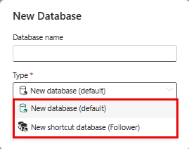
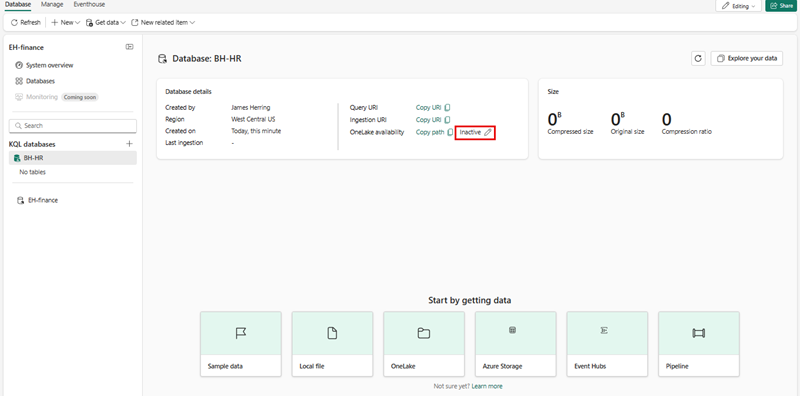

---
lab:
  title: Consultas de datos en bases de datos KQL
  module: Query data from a Kusto Query database in Microsoft Fabric
---

# Introducción a la consulta de una base de datos de Kusto en Microsoft Fabric

Un conjunto de consultas KQL es una herramienta que permite ejecutar consultas, modificar y mostrar los resultados de la consulta desde una base de datos KQL. Puede vincular cada pestaña del conjunto de consultas KQL a una base de datos KQL diferente y guardar las consultas para su uso futuro o compartirlas con otras personas para el análisis de datos. También puede cambiar la base de datos KQL para cualquier pestaña, de forma que pueda comparar los resultados de la consulta de diferentes orígenes de datos.

En este ejercicio, asumirá el rol de un analista que tiene la tarea de consultar un conjunto de datos de ejemplo de métricas sin procesar que llevan a cabo de los taxis de Nueva York y extrae estadísticas de resumen (generación de perfiles) de los datos del entorno de Fabric. Use KQL para consultar estos datos y recopilar información con el fin de obtener conclusiones informativas sobre los datos.

El conjunto de consultas KQL usa el lenguaje de consulta Kusto, que es compatible con muchas funciones SQL, para crear consultas. Para más información sobre el [lenguaje de consulta kusto (KQL)](https://learn.microsoft.com/en-us/azure/data-explorer/kusto/query/?context=%2Ffabric%2Fcontext%2Fcontext).

Este laboratorio se realiza en **25** minutos aproximadamente.

> **Nota**: Necesitará una [evaluación gratuita de Microsoft Fabric](https://learn.microsoft.com/fabric/get-started/fabric-trial) para realizar este ejercicio.

## Creación de un área de trabajo

Antes de trabajar con datos de Fabric, cree un área de trabajo con la evaluación gratuita de Fabric habilitada.

1. En la [página principal de Microsoft Fabric](https://app.fabric.microsoft.com), seleccione **Inteligencia en tiempo real**.
1. En la barra de menús de la izquierda, seleccione **Áreas de trabajo** (el icono tiene un aspecto similar a &#128455;).
1. Cree una nueva área de trabajo con el nombre que prefiera y seleccione un modo de licencia que incluya capacidad de Fabric (*Evaluación gratuita*, *Prémium* o *Fabric*).
1. Cuando se abra la nueva área de trabajo, debe estar vacía.

    

En este laboratorio, usará Inteligencia en tiempo real en Fabric para crear una base de datos KQL a partir de una secuencia de eventos de muestra. Inteligencia en tiempo real proporciona un conjunto de datos de ejemplo que puede usar para explorar las funcionalidades de Inteligencia en tiempo real. Usará estos datos de muestra para crear consultas KQL/SQL y conjuntos de consultas que analicen datos en tiempo real y permitan otros usos en procesos posteriores.

## Creación de una base de datos KQL

1. En **Inteligencia en tiempo real**, seleccione la casilla **Base de datos KQL**.

   

1. Se le pide que asigne un **Nombre** a la base de datos KQL

   

1. Dele un nombre a la base de datos KQL que sea fácil de recordar, como **TaxiData**, y presione **Crear**.

1. En el panel **Detalles de la base de datos**, seleccione el icono de lápiz para activar la disponibilidad en OneLake.

   

   Después, use el control deslizante para activar la disponibilidad.

   
   
1. Seleccione el cuadro de **datos de ejemplo** en las opciones de ***Inicio obteniendo datos***.

   

   Después, elija el cuadro **Análisis de operaciones de automoción** en las opciones de los datos de ejemplo.

   

1. Una vez que los datos terminen de cargarse, podemos comprobar que la base de datos KQL se rellena.

   

1. Una vez cargados los datos, verifíquelos en la base de datos KQL. Para realizar esta operación, seleccione los puntos suspensivos situados a la derecha de la tabla, vaya a **Consultar tabla** y seleccione **Mostrar 100 registros cualesquiera**.

    

   > **NOTA**: La primera vez que ejecute esto, puede tardar varios segundos en asignar recursos de proceso.


    

## Introducción al Lenguaje de consulta Kusto (KQL) y su sintaxis

Lenguaje de consulta Kusto (KQL) es un lenguaje de consulta que se usa para analizar datos en Microsoft Azure Data Explorer, que forma parte de Azure Fabric. KQL está diseñado para ser sencillo e intuitivo, lo que facilita a los principiantes el aprendizaje y el uso. Al mismo tiempo, también es muy flexible y personalizable, lo que permite a los usuarios avanzados realizar consultas y análisis complejos.

KQL se basa en una sintaxis similar a SQL, pero con algunas diferencias clave. Por ejemplo, KQL usa un operador de canalización (|) en lugar de un punto y coma (;) para separar comandos, y usa un conjunto diferente de funciones y operadores para filtrar y manipular datos.

Una de las características clave de KQL es su capacidad para controlar grandes volúmenes de datos de forma rápida y eficaz. Esta funcionalidad hace que sea ideal para analizar registros, datos de telemetría y otros tipos de macrodatos. KQL también admite una amplia gama de orígenes de datos, incluyendo datos estructurados y no estructurados, lo que lo convierte en una herramienta versátil para el análisis de datos.

En el contexto de Microsoft Fabric, KQL se puede usar para consultar y analizar datos de varios orígenes, como registros de aplicaciones, métricas de rendimiento y eventos del sistema. Esto puede ayudarle a obtener información sobre el estado y el rendimiento de las aplicaciones y la infraestructura, además de identificar problemas y oportunidades de optimización.

En general, KQL es un lenguaje de consulta potente y flexible que puede ayudarle a obtener información sobre los datos de forma rápida y sencilla, tanto si está trabajando con Microsoft Fabric como con otros orígenes de datos. Con sintaxis intuitiva y funcionalidades potentes, merece la pena explorar KQL más a fondo.

En este módulo, nos centramos en los conceptos básicos de las consultas en una base de datos KQL mediante KQL primero y, a continuación, en T-SQL. Nos centraremos en los elementos básicos de la sintaxis de T-SQL que se utilizan para las consultas, entre los que se incluyen:

Consultas **SELECT**, que se usan para recuperar datos de una o varias tablas. Por ejemplo, se puede usar una consulta SELECT para obtener los nombres y salarios de todos los empleados de una empresa.

Consultas **WHERE**, que se usan para filtrar los datos en función de determinadas condiciones. Por ejemplo, se puede usar una consulta WHERE para obtener los nombres de los empleados que trabajan en un departamento específico o que tengan un salario por encima de un importe determinado.

Consultas **GROUP BY**, que se usan para agrupar los datos por una o varias columnas y realizar funciones de agregado en ellos. Por ejemplo, se puede usar una consulta GROUP BY para obtener el salario medio de los empleados por departamento o por país.

Consultas **ORDER BY**, que se usan para ordenar los datos por una o varias columnas en orden ascendente o descendente. Por ejemplo, se puede usar una consulta ORDER BY para obtener los nombres de los empleados ordenados por sus salarios o por sus apellidos.

   > **ADVERTENCIA:** no se pueden crear informes de Power BI a partir de conjuntos de consultas con **T-SQL** porque Power BI no admite T-SQL como origen de datos. **Power BI solo admite KQL como lenguaje de consulta nativo para conjuntos de consultas**. Si desea usar T-SQL para consultar datos en Microsoft Fabric, deberá usar el punto de conexión de T-SQL que emula Microsoft SQL Server y le permite ejecutar consultas de T-SQL en los datos. Sin embargo, el punto de conexión de T-SQL tiene algunas limitaciones y diferencias con el SQL Server nativo y no admite la creación o publicación de informes en Power BI.

> **NOTA**: Además del enfoque para extraer una ventana de consulta mostrada anteriormente, siempre se puede presionar el botón **Explorar los datos** en el panel principal de base de datos KQL...

   

## `SELECT` datos de nuestro conjunto de datos de ejemplo mediante KQL

1. En esta consulta, se extraen 100 registros de la tabla Viajes. Se usa la palabra clave `take` para pedir al motor que devuelva 100 registros.

    ```kusto
    
    Trips
    | take 100
    ```

    > **NOTA:** El carácter de pleca `|` se usa para dos propósitos en KQL, entre ellos para separar operadores de consulta en una instrucción de expresión tabular. También se usa como operador OR lógico entre corchetes o paréntesis para indicar que se puede especificar uno de los elementos separados por la barra vertical.

1. Se puede ser más preciso agregando atributos específicos que nos gustaría consultar mediante la palabra clave `project` y, a continuación, usando la palabra clave `take` para indicar al motor cuántos registros se devolverán.

    > **NOTA:** el uso de `//` denota comentarios usados en la herramienta de consulta ***Explorar los datos*** de Microsoft Fabric.

    ```kusto
    
    // Use 'project' and 'take' to view a sample number of records in the table and check the data.
    Trips 
    | project vendor_id, trip_distance
    | take 10
    ```

1. Otra práctica habitual en el análisis consiste en cambiar el nombre de las columnas del conjunto de consultas para que sean más fáciles de usar. Esto se puede lograr mediante el nuevo nombre de columna seguido del signo igual y la columna a la que deseamos cambiar el nombre.

    ```kusto
    
    Trips 
    | project vendor_id, ["Trip Distance"] = trip_distance
    | take 10
    ```

1. Es posible que también deseemos resumir los viajes para ver cuántas millas se recorrieron:

    ```kusto
    
    Trips
    | summarize ["Total Trip Distance"] = sum(trip_distance)
    ```

## Datos de `GROUP BY` de nuestro conjunto de datos de ejemplo mediante KQL

1. A continuación, es posible que queramos `group by` la ubicación de recogida, lo que haremos con el operador `summarize`. También se puede usar el operador `project`, que nos permite seleccionar y cambiar el nombre de las columnas que se deseen incluir en la salida. En este caso, agrupamos por distrito dentro del sistema de taxi de Nueva York para proporcionar a nuestros usuarios la distancia total que viajaron desde cada distrito.

```kusto

Trips
| summarize ["Total Trip Distance"] = sum(trip_distance) by pickup_boroname
| project Borough = pickup_boroname, ["Total Trip Distance"]
```

1. En este caso, tenemos un valor vacío, que nunca es bueno para el análisis, y podemos usar la función `case` junto con las funciones `isempty` y `isnull` para clasificarlo en una categoría ***Sin identificar*** para el seguimiento.

```kusto

Trips
| summarize ["Total Trip Distance"] = sum(trip_distance) by pickup_boroname
| project Borough = case(isempty(pickup_boroname) or isnull(pickup_boroname), "Unidentified", pickup_boroname), ["Total Trip Distance"]
```

## Datos de `ORDER BY` de nuestro conjunto de datos de ejemplo mediante KQL

Para darle más sentido a nuestros datos, normalmente los ordenamos por columna, y este proceso se realiza en KQL con un operador `sort by` o `order by`, y actúan de la misma manera.
 
```kusto

// using the sort by operators
Trips
| summarize ["Total Trip Distance"] = sum(trip_distance) by pickup_boroname
| project Borough = case(isempty(pickup_boroname) or isnull(pickup_boroname), "Unidentified", pickup_boroname), ["Total Trip Distance"]
| sort by Borough asc 

// order by operator has the same result as sort by
Trips
| summarize ["Total Trip Distance"] = sum(trip_distance) by pickup_boroname
| project Borough = case(isempty(pickup_boroname) or isnull(pickup_boroname), "Unidentified", pickup_boroname), ["Total Trip Distance"]
| sort by Borough asc 
```

## Cláusula `WHERE` para filtrar datos en nuestra consulta KQL de ejemplo

A diferencia de SQL, se llama inmediatamente a nuestra cláusula `WHERE` en nuestra consulta KQL. Todavía se pueden usar los operadores lógicos `and` y `or` dentro de la cláusula WHERE y se evalúa como true o false en la tabla, pudiendo ser una expresión simple o compleja que podría implicar varias columnas, operadores y funciones.

```kusto

// let's filter our dataset immediately from the source by applying a filter directly after the table.
Trips
| where pickup_boroname == "Manhattan"
| summarize ["Total Trip Distance"] = sum(trip_distance) by pickup_boroname
| project Borough = case(isempty(pickup_boroname) or isnull(pickup_boroname), "Unidentified", pickup_boroname), ["Total Trip Distance"]
| sort by Borough asc

```

## Uso de T-SQL para consultar información de resumen

Las bases de datos KQL no admiten T-SQL de forma nativa, pero proporcionan un punto de conexión de T-SQL que emula a Microsoft SQL Server y permite ejecutar consultas de T-SQL en los datos. Sin embargo, el punto de conexión de T-SQL tiene algunas limitaciones y diferencias con respecto al SQL Server nativo. Por ejemplo, no admite la creación, modificación o eliminación de tablas, ni la inserción, actualización o eliminación de datos. Tampoco admite algunas funciones y sintaxis de T-SQL que no son compatibles con KQL. Se creó para permitir que los sistemas que no admitan KQL usen T-SQL para consultar los datos dentro de una base de datos KQL. Por lo tanto, se recomienda usar KQL como lenguaje de consulta principal para bases de datos KQL, ya que ofrece más funcionalidades y rendimiento que T-SQL. También se pueden usar algunas funciones de SQL compatibles con KQL, como count, sum, avg, min, max, etc. 

## Datos de `SELECT` de nuestro conjunto de datos de ejemplo mediante T-SQL

1. En esta consulta, se extraen los primeros 100 registros de la tabla `Trips` mediante la cláusula `TOP`. 

    ```sql
    // We can use the TOP clause to limit the number of records returned
    
    SELECT TOP 100 * from Trips
    ```

1. Si se usa `//`, que es un comentario de la herramienta ***Explorar los datos*** dentro de la base de datos de KQL, no se puede resaltar al ejecutar consultas T-SQL, por lo que debería usar la notación estándar `--` de comentarios SQL. este doble guión también indicará al motor de KQL que espere T-SQL en Azure Data Explorer.

    ```sql
    -- instead of using the 'project' and 'take' keywords we simply use a standard SQL Query
    SELECT TOP 10 vendor_id, trip_distance
    FROM Trips
    ```

1. De nuevo, se puede ver que las características estándar de T-SQL funcionan correctamente con la consulta en la que cambiamos el nombre de trip_distance a un nombre más descriptivo.

    ```sql
    
    -- No need to use the 'project' or 'take' operators as standard T-SQL Works
    SELECT TOP 10 vendor_id, trip_distance as [Trip Distance]
    from Trips
    ```

1. Es posible que también deseemos resumir los viajes para ver cuántas millas se recorrieron:

    ```sql
    Select sum(trip_distance) as [Total Trip Distance]
    from Trips
    ```
     >**NOTA:** el uso de expresiones de código delimitadas no es necesario en T-SQL en comparación con la consulta KQL. También tenga en cuenta que los comandos `summarize` e `sort by` no están disponibles en T-SQL.

## Datos de `GROUP BY` de nuestro conjunto de datos de ejemplo mediante T-SQL

1. A continuación, es posible que queramos `group by` la ubicación de recogida, lo que haremos con el operador `GROUP BY`. También se puede usar el operador `AS`, que nos permite seleccionar y cambiar el nombre de las columnas que se deseen incluir en la salida. En este caso, agrupamos por distrito dentro del sistema de taxi de Nueva York para proporcionar a nuestros usuarios la distancia total que viajaron desde cada distrito.

    ```sql
    SELECT pickup_boroname AS Borough, Sum(trip_distance) AS [Total Trip Distance]
    FROM Trips
    GROUP BY pickup_boroname
    ```

1. En este caso, tenemos un valor vacío, lo que nunca es bueno para analizar, y podemos usar la función `CASE` junto con la función `IS NULL` y el valor vacío `''` para clasificarlo en una categoría ***Sin identificar*** para el seguimiento. 

    ```sql
    
    SELECT CASE
             WHEN pickup_boroname IS NULL OR pickup_boroname = '' THEN 'Unidentified'
             ELSE pickup_boroname
           END AS Borough,
           SUM(trip_distance) AS [Total Trip Distance]
    FROM Trips
    GROUP BY CASE
               WHEN pickup_boroname IS NULL OR pickup_boroname = '' THEN 'Unidentified'
               ELSE pickup_boroname
             END;
    ```

## Datos de `ORDER BY` de nuestro conjunto de datos de ejemplo mediante T-SQL

1. Para que los datos tengan más sentido, normalmente se ordenarán por una columna, proceso que se realiza en T-SQL con un operador `ORDER BY`. No hay ningún operador ***SORT BY*** en T-SQL
 
    ```sql
    -- Group by pickup_boroname and calculate the summary statistics of trip_distance
    SELECT CASE
             WHEN pickup_boroname IS NULL OR pickup_boroname = '' THEN 'unidentified'
             ELSE pickup_boroname
           END AS Borough,
           SUM(trip_distance) AS [Total Trip Distance]
    FROM Trips
    GROUP BY CASE
               WHEN pickup_boroname IS NULL OR pickup_boroname = '' THEN 'unidentified'
               ELSE pickup_boroname
             END
    -- Add an ORDER BY clause to sort by Borough in ascending order
    ORDER BY Borough ASC;
    ```
    ## Cláusula `WHERE` para filtrar datos en nuestra consulta T-SQL de ejemplo
    
1. A diferencia de KQL, nuestra cláusula `WHERE` iría al final de la instrucción T-SQL. Sin embargo, en este caso tenemos una cláusula `GROUP BY` que requiere que usemos la instrucción `HAVING`, y se usa el nuevo nombre de la columna, en este caso, **Borough**, como nombre de columna desde el que se filtrará.

    ```sql
    -- Group by pickup_boroname and calculate the summary statistics of trip_distance
    SELECT CASE
             WHEN pickup_boroname IS NULL OR pickup_boroname = '' THEN 'unidentified'
             ELSE pickup_boroname
           END AS Borough,
           SUM(trip_distance) AS [Total Trip Distance]
    FROM Trips
    GROUP BY CASE
               WHEN pickup_boroname IS NULL OR pickup_boroname = '' THEN 'unidentified'
               ELSE pickup_boroname
             END
    -- Add a having clause due to the GROUP BY statement
    HAVING Borough = 'Manhattan'
    -- Add an ORDER BY clause to sort by Borough in ascending order
    ORDER BY Borough ASC;
    
    ```

## Limpieza de recursos

En este ejercicio, creó una base de datos KQL y configuró un conjunto de datos de ejemplo para realizar consultas. Después, ha consultado los datos con KQL y SQL. Si ha terminado de explorar la base de datos KQL, puede eliminar el área de trabajo que ha creado para este ejercicio.
1. En la barra de la izquierda, seleccione el **icono** del área de trabajo.
2. En el menú ... de la barra de herramientas, seleccione **Configuración del área de trabajo**.
3. En la sección **General**, seleccione **Quitar esta área de trabajo**.
