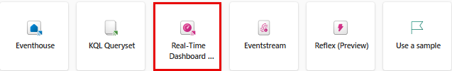

---
lab:
  title: "Paneles en tiempo real en Microsoft\_Fabric"
  module: Get Started with Real-Time Dashboards in Microsoft Fabric
---

# Introducción a los paneles en tiempo real en Microsoft Fabric

Los paneles en tiempo real le permiten obtener información detallada desde Microsoft Fabric utilizando el Lenguaje de consulta de Kusto (KQL) para recuperar datos estructurados y no estructurados y representarlos en gráficos, diagramas de dispersión, tablas, etc. dentro de paneles que permiten una vinculación similar a la de las segmentaciones de Power BI. 

Este laboratorio se realiza en **25** minutos aproximadamente.

> **Nota**: Necesita una [versión de prueba de Microsoft Fabric.](https://learn.microsoft.com/fabric/get-started/fabric-trial) para completar este ejercicio.

## Creación de un área de trabajo

Antes de trabajar con datos de Fabric, cree un área de trabajo con la evaluación gratuita de Fabric habilitada.

1. En la [página principal de Microsoft Fabric](https://app.fabric.microsoft.com), seleccione **Inteligencia en tiempo real**.
1. En la barra de menús de la izquierda, seleccione **Áreas de trabajo** (el icono tiene un aspecto similar a &#128455;).
1. Cree una nueva área de trabajo con el nombre que prefiera y seleccione un modo de licencia que incluya capacidad de Fabric (*Versión de prueba*, *Premium* o *Fabric*). O bien, puede usar un área de trabajo existente para crear un panel en tiempo real.
1. Cuando se abra la nueva área de trabajo, debe estar vacía.

    

En este laboratorio, usará la inteligencia en tiempo real de Fabric para crear un panel en tiempo real. Inteligencia en tiempo real proporciona un conjunto de datos de ejemplo que puede usar para explorar las funcionalidades de Inteligencia en tiempo real. Usará estos datos de muestra para crear consultas KQL | SQL y conjuntos de consultas que analicen datos en tiempo real y permitan otros usos en procesos posteriores.

## Creación de paneles en tiempo real

1. En **Inteligencia en tiempo real**, seleccione el cuadro **Panel en tiempo real**.

   

2. Se le pedirá que asigne un **Nombre** al Panel en tiempo real.

   

3. Asigne al Panel en tiempo real un nombre que recuerde, como algo basado en el origen principal, y presione **Crear**.

4. En el panel **Detalles de la base de datos**, seleccione el icono de lápiz para activar la disponibilidad en OneLake.

   [ ](./Images/real-time-dashboard-details-large.png#lightbox)

## Adición de un origen de datos

Los orígenes de datos sirven como referencias reutilizables a bases de datos o consultas específicas dentro del mismo área de trabajo que el Panel en tiempo real, lo que permite que varios iconos usen orígenes de datos distintos para sus necesidades de datos.

1. Seleccione la pestaña **Administrar** y, a continuación, seleccione **Nuevo origen de datos** en la ***barra de menús***.
1. Seleccione el botón **+ Agregar** en el panel **Orígenes de datos**.

    [  ](./Images/add-data-source-to-real-time-dashboard-large.png#lightbox)

1. elija una de las dos opciones principales del **centro de datos OneLake** o **Azure Data Explorer**.

    

1. Elija el **origen de datos** que satisfaga sus necesidades empresariales y, después, seleccione el botón **Conectar**.

    [ ](./Images/select-onelake-data-hub-large.png#lightbox)

    > **Nota** Una vez que se conecte a un origen de datos, tendrá la capacidad de confirmar y crear datos adicionales en la ubicación seleccionada.

1. Confirme la conexión del **origen de datos** en el panel **Crear nuevo origen de datos** y seleccione **Crear**.

    [  ](./Images/conected-now-create-datasource-large.png#lightbox)

1. En este punto, debería seleccionar los puntos suspensivos **...** a la derecha del **número de página** y seleccionar **Cambiar nombre de página** para elegir un nombre adecuado para el uso del icono.
1. Seleccione **+ Agregar icono**.

    [  ](./Images/rename-page-add-tile-large.png#lightbox)

1. Se le redirigirá al **panel de consulta del icono**, donde puede agregar parámetros y extraer consultas base para admitir el icono. 

    [  ](./Images/write-query-for-tile-large.png#lightbox)

    > **Nota** Tendrá la opción de agregar un nuevo origen de datos en la ventana desplegable de la misma ventana. Este origen puede estar dentro de su área de trabajo personal o cualquier área de trabajo a la que pueda tener otra base de datos KQL almacenada dentro de una instancia de Evenhouse a la que tenga acceso.

## Escritura de consultas

Dado que los iconos del panel en tiempo real usan fragmentos de código del lenguaje de consulta Kusto para recuperar datos y representar objetos visuales. Cada icono o consulta puede admitir un solo objeto visual.

1. Dentro de cada icono, tendrá la capacidad de escribir o pegar desde **Copilot** si decide anclarlos a un icono nuevo o existente y, después, modificarlos para satisfacer sus necesidades. A partir de una consulta simple, podemos crear una visualización de mapa que use tamaños en el mapa en función del número de bicicletas.

```kusto

['Bike-count']
BikepointID, Latitude, Longitude, No_Bikes

```

## Creación de visualizaciones

Una vez que esté satisfecho con la visualización, solo tiene que seleccionar **Aplicar cambios** y, después, agregar visualizaciones adicionales para admitir el panel en tiempo real o realizar pasos adicionales, como **Parámetros** o **Programaciones**.

   [  ](./Images/create-visual-in-tiles-large.png#lightbox)

Una vez aplicados los cambios, verá los datos y, después, podrá realizar ajustes para mejorar la legibilidad y la comprensión de los usuarios.

   [  ](./Images/first-published-visual-large.png#lightbox)

Puede seguir creando **nuevos iconos** que tengan información de tabla e información de visualización para facilitar la comprensión de la comunidad de usuarios. También tiene la capacidad de agregar **página[s]**, **nuevo[s] orígen[es] de datos**. A continuación, nos centraremos en agregar un parámetro para ayudar a navegar y reducir la cantidad de información que se presenta a un usuario.

## Agregar parámetros
Los parámetros mejoran la eficacia de la representación del panel y permiten el uso de valores de filtro en la primera fase del proceso de consulta. La inclusión de parámetros en la consulta vinculada a los iconos activa las funcionalidades de filtrado. Un parámetro se puede usar en un panel y varios parámetros pueden filtrar los datos representados en las visualizaciones subyacentes, incluidas las tablas.

La creación de un parámetro se inicia con facilidad: 

1. Seleccione el botón Nuevos parámetros en el menú superior. Se abrirá el panel Parámetros.
1. Seleccione el botón + Agregar en la parte superior del panel derecho.

    [  ](./Images/add-new-parameter-large.png#lightbox)

1. Rellene las propiedades pertinentes para el parámetro.

    [  ](./Images/configure-parameter-large.png#lightbox)

1. Una de las características más importantes de un parámetro es la capacidad de **agregar una consulta** para proporcionar al usuario solo opciones relevantes para la información subyacente.

    

1. Seleccione Done (Listo) para crear el parámetro.

    [  ](./Images/complete-parameter-settings-large.png#lightbox)

### Propiedades del parámetro

| Campo            | Descripción |
|------------------|-------------|
| **Etiqueta**        | Nombre del parámetro mostrado en el panel o en la tarjeta de edición. |
| **Parameter type** (Tipo de parámetro) | Uno de los siguientes tipos: <ul><li>Single selection (Selección única): solo se puede seleccionar un valor en el filtro como entrada para el parámetro.</li><li>Selección múltiple: se pueden seleccionar uno o varios valores en el filtro como entradas para el parámetro.</li><li>Intervalo de tiempo: Permite la creación de parámetros adicionales para filtrar consultas y paneles en función del tiempo. Cada panel tiene un selector de intervalo de tiempo predeterminado.</li><li>Texto libre: Permite a los usuarios escribir o pegar un valor en el campo de filtro sin valores rellenados previamente, conservando los valores recientes usados.</li></ul> |
| **Descripción**  | Descripción opcional del parámetro. |
| **Nombre de variable** | Nombre usado para el parámetro dentro de la consulta. |
| **Tipo de datos**    | Tipo de datos que representan los valores de parámetro. |
| **Mostrar en páginas** | Páginas en las que se mostrará el parámetro, con una opción para seleccionar todas las páginas. |
| **Origen**       | Origen de los valores de parámetro, que pueden ser: <ul><li>Valores fijos: Valores de filtro estáticos especificados manualmente.</li><li>Consulta: Valores dinámicos introducidos mediante una consulta KQL.</li></ul> |
| **Agregar el valor "Seleccionar todo"** | Aplicable a tipos de parámetros de selección únicos y múltiples, esta opción recupera datos de todos los valores de parámetro y se debe integrar en la consulta para la funcionalidad. |
| **Valor predeterminado** | Valor predeterminado del filtro, que se establece en la representación inicial del panel. |

6. Asegúrese de agregar el parámetro a cada una de las consultas de los iconos y, después, seleccione **Aplicar cambios**.

**Antes de la consulta KQL**
```kusto
//Add the street parameter to each tile's query
['bike-count']
| where No_Bikes > 0
| project BikepointID, Latitude, Longitude, No_Bikes

```

**Después de la consulta KQL**
```kusto
//Add the street parameter to each tile's query
['bike-count']
| where No_Bikes > 0 and Street == street
| project BikepointID, Latitude, Longitude, No_Bikes

```
   [ ](./Images/update-each-query-large.png#lightbox)

## Habilitación de la actualización automática

La actualización automática es una funcionalidad que permite actualizar automáticamente los datos del panel sin necesidad de volver a cargar o presionar un botón de actualización. El editor de base de datos puede configurar la frecuencia de actualización automática inicial. Tanto los editores como los visores tienen la capacidad de modificar la frecuencia de actualización automática real durante la visualización del panel. Los editores de bases de datos tienen autoridad para establecer una frecuencia de actualización mínima para mitigar la carga excesiva en el clúster. Una vez establecida esta frecuencia mínima, los usuarios de la base de datos no podrán seleccionar una frecuencia de actualización inferior a la mínima especificada. Esto garantiza que el rendimiento del sistema se mantenga sin sobrecargar los recursos.

1. Seleccione la pestaña Administrar > Actualización automática.

    [  ](./Images/enable-auto-refresh-large.png#lightbox)

1. Alterne la opción de modo que la actualización automática tenga el valor Enabled (Habilitada).
1. Seleccione los valores para los campos Minimum time interval (Intervalo de tiempo mínimo) y Default refresh rate (Frecuencia de actualización predeterminada).
1. Seleccione Apply (Aplicar) y Save (Guardar) el panel.

    [  ](./Images/enable-and-configure-refresh-rate-large.png#lightbox)

## Limpieza de recursos

En este ejercicio, creó una base de datos KQL y configuró un conjunto de datos de ejemplo para realizar consultas. Después, ha consultado los datos con KQL y SQL. Si ha terminado de explorar la base de datos KQL, puede eliminar el área de trabajo que ha creado para este ejercicio.
1. En la barra de la izquierda, seleccione el **icono** del área de trabajo.
2. En el menú ... de la barra de herramientas, seleccione **Configuración del área de trabajo**.
3. En la sección **General**, seleccione **Quitar esta área de trabajo**.

