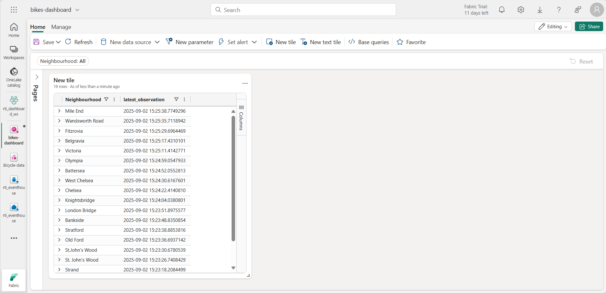

---
lab:
  title: "Introducción a los paneles en tiempo real en Microsoft\_Fabric"
  module: Get started with Real-Time Dashboards in Microsoft Fabric
---

# Introducción a los paneles en tiempo real en Microsoft Fabric

Los paneles en tiempo real de Microsoft Fabric te permiten visualizar y explorar datos de streaming mediante Lenguaje de consulta Kusto (KQL).  En este ejercicio, explorarás cómo crear y usar un panel en tiempo real basado en un origen de datos en tiempo real.

Este laboratorio se realiza en **25** minutos aproximadamente.

> **Nota**: Necesitas un [inquilino de Microsoft Fabric](https://learn.microsoft.com/fabric/get-started/fabric-trial) para completar este ejercicio.

## Creación de un área de trabajo

Antes de trabajar con datos de Fabric, necesitas crear un área de trabajo con la capacidad gratuita de Fabric habilitada.

1. En un explorador, ve a la [página principal de Microsoft Fabric](https://app.fabric.microsoft.com/home?experience=fabric) en `https://app.fabric.microsoft.com/home?experience=fabric` e inicia sesión con tus credenciales de Fabric.
1. En la barra de menús de la izquierda, selecciona **Áreas de trabajo** (el icono tiene un aspecto similar a &#128455;).
1. Crea una nueva área de trabajo con el nombre que prefieras y selecciona un modo de licencia que incluya capacidad de Fabric (*Evaluación gratuita*, *Premium* o *Fabric*).
1. Cuando se abra la nueva área de trabajo, debe estar vacía.

    

## Creación de instancia de Eventhouse

Ahora que tienes un área de trabajo, puedes empezar a crear los elementos de Fabric que necesitarás para tu solución de inteligencia en tiempo real. Empezaremos por crear un centro de eventos.

1. En la barra de menús de la izquierda, selecciona **Crear**. En la página *Nuevo*, en la sección *Inteligencia en tiempo real*, selecciona **Eventhouse**. Asígnale un nombre único que elijas.

    >**Nota**: si la opción **Crear** no está anclada a la barra lateral, primero debes seleccionar la opción de puntos suspensivos (**...**).

1. Cierra las sugerencias o avisos que se muestran hasta que veas tu nuevo centro de eventos vacío.

    

1. En el panel de la izquierda, ten en cuenta que el centro de eventos contiene una base de datos KQL con el mismo nombre que el centro de eventos.
1. Selecciona la base de datos KQL para verla.

## Crear un Eventstream

Actualmente no hay tablas en la base de datos. Usaremos un flujo de eventos para cargar datos de un origen en tiempo real en una tabla.

1. En la página principal de la base de datos KQL, selecciona **Obtener datos**.
2. Para el origen de datos, selecciona **Eventstream** > **Nuevo flujo de eventos**. Asigna un nombre al flujo de eventos `Bicycle-data`.

    

    La creación del nuevo flujo de eventos en el área de trabajo se completará en unos instantes. Una vez establecido, se te redirigirá automáticamente para seleccionar un origen de datos para el flujo de eventos.

1. Selecciona **Usar datos de ejemplo**.
1. Asigna un nombre al origen `Bicycles` y selecciona los datos de muestra **Bicicletas**.

    El flujo se asignará y se mostrará automáticamente en el **lienzo del flujo de eventos**.

   

1. En la lista desplegable **Agregar destino**, selecciona **Centro de eventos**.
1. En el panel **Eventhouse**, establece las siguientes opciones de configuración.
   - **Modo de ingesta de datos:**: procesamiento de eventos antes de la ingesta
   - **Nombre del destino:**`bikes-table`
   - **Área de trabajo:***selecciona el área de trabajo que has creado al principio de este ejercicio*
   - **Eventhouse**: *selecciona tu centro de eventos*
   - **Base de datos KQL:** *selecciona la base de datos KQL.*
   - **Tabla de destino:** crea una nueva tabla denominada `bikes`
   - **Formato de datos de entrada:** JSON

   

1. En el panel **Eventhouse**, selecciona **Guardar**. 
1. Conecte la salida del nodo **Bicycles-data** al nodo **bikes-table** y después selecciona **Publicar**.
1. Espera aproximadamente un minuto a que se active el destino de los datos. Después, selecciona el nodo **bikes-table** en el lienzo de diseño y visualiza el panel **Versión preliminar de datos** inferior para ver los últimos datos que se han ingerido:

   

1. Espera unos minutos y después usa el botón **Actualizar** para actualizar el panel **Versión preliminar de datos**. El flujo se ejecuta de forma perpetua, por lo que es posible que se hayan agregado nuevos datos a la tabla.

## Creación de paneles en tiempo real

Ahora que tienes un flujo de datos en tiempo real que se cargan en una tabla en el centro de eventos, puedes visualizarlos con un panel en tiempo real.

1. En la barra de menús de la izquierda, selecciona el centro de **inicio**. Después, en la página principal, crea un nuevo **Panel de control en tiempo real** denominado `bikes-dashboard`.

    Se crea un nuevo panel vacío.


    

1. En la barra de herramientas, selecciona **Nuevo origen de datos** y agrega un nuevo origen de datos de **centro de datos de One Lake**. Después, selecciona tu centro de eventos y crea un nuevo origen de datos con la siguiente configuración:
    - **Nombre para mostrar**: `Bike Rental Data`
    - **Base de datos**: *la base de datos predeterminada de tu centro de eventos*.
    - **Identidad de paso**: *seleccionada*

1. Cierra el panel **Orígenes de datos** y después, en el lienzo de diseño del panel, selecciona **Agregar icono**.
1. En el editor de consultas, asegúrate de que el origen **Datos de alquiler de bicicletas** está seleccionado y escribe el siguiente código KQL:

    ```kql
    bikes
        | where ingestion_time() between (ago(30min) .. now())
        | summarize latest_observation = arg_max(ingestion_time(), *) by Neighbourhood
        | project Neighbourhood, latest_observation, No_Bikes, No_Empty_Docks
        | order by Neighbourhood asc
    ```

1. Ejecuta la consulta, que muestra el número de bicicletas y los aparcamientos de bicicletas vacíos observados en cada barrio en los últimos 30 minutos.
1. Aplica los cambios para ver los datos que se muestran en una tabla del icono del panel.

   

1. En el icono, selecciona el icono **Editar** (que parece un lápiz). Después, en el panel **Formato visual**, establece las siguientes propiedades:
    - **Nombre del icono**: bicicletas y aparcamientos
    - **Tipo de objeto visual**: gráfico de barras
    - **Formato de objeto visual**: gráfico de barras apiladas
    - **Columnas Y**: No_Bikes, No-Empty_Docks
    - **Columna X**: Barrio
    - **Columnas de serie**: Inferencia
    - **Ubicación de la leyenda**: inferior

    El tiempo editado debería tener este aspecto:

   

1. Aplica los cambios y después cambia el tamaño del icono para que llene todo el alto del lado izquierdo del panel de control.

1. En la barra de herramientas, selecciona **Nuevo icono**.
1. En el editor de consultas, asegúrate de que el origen **Datos de alquiler de bicicletas** está seleccionado y escribe el siguiente código KQL:

    ```kql
    bikes
        | where ingestion_time() between (ago(30min) .. now())
        | summarize latest_observation = arg_max(ingestion_time(), *) by Neighbourhood
        | project Neighbourhood, latest_observation, Latitude, Longitude, No_Bikes
        | order by Neighbourhood asc
    ```

1. Ejecuta la consulta, que muestra la ubicación y el número de bicicletas observadas en cada barrio en los últimos 30 minutos.
1. Aplica los cambios para ver los datos que se muestran en una tabla del icono del panel.
1. En el icono, selecciona el icono **Editar** (que parece un lápiz). Después, en el panel **Formato visual**, establece las siguientes propiedades:
    - **Nombre del icono**: ubicación de las bicicletas
    - **Tipo de objeto visual**: mapa
    - **Definir ubicación por**: latitud y longitud
    - **Columna de latitud**: Latitud
    - **Columna de longitud**: Longitud
    - **Columna de etiqueta**: Barrio
    - **Tamaño**: mostrar
    - **Columna de tamaño**: No_Bikes

1. Aplica los cambios y después cambia el tamaño del icono de mapa para que ocupe la parte derecha del espacio disponible en el panel:

   

## Creación de una consulta básica

El panel contiene dos objetos visuales basados en consultas similares. Para evitar la duplicación y hacer que tu panel sea más fácil de mantener, puedes consolidar los datos comunes en una única *consulta básica*.

1. En la barra de herramientas del panel, selecciona **Consultas básicas**. Luego, seleccione **+Agregar**.
1. En el editor de consultas básicas, establece el **Nombre de variable** en `base_bike_data` y asegúrate de que está seleccionado el origen **Datos de alquiler de bicicletas**. Después, escribe la siguiente consulta:

    ```kql
    bikes
        | where ingestion_time() between (ago(30min) .. now())
        | summarize latest_observation = arg_max(ingestion_time(), *) by Neighbourhood
    ```
1. Ejecuta la consulta y comprueba que devuelve todas las columnas necesarias para ambos objetos visuales en el panel (y otros).

   

1. Selecciona **Listo** y cierra el panel **Consultas básicas**.
1. Edita el objeto visual de gráfico de barras **Bicicletas y aparcamientos** y cambia la consulta al código siguiente:

    ```kql
    base_bike_data
    | project Neighbourhood, latest_observation, No_Bikes, No_Empty_Docks
    | order by Neighbourhood asc
    ```

1. Aplica los cambios y comprueba que el gráfico de barras sigue mostrando los datos de todos los barrios.

1. Edita el objeto visual de mapa **Ubicaciones de bicicletas** y cambia la consulta por el siguiente código:

    ```kql
    base_bike_data
    | project Neighbourhood, latest_observation, No_Bikes, Latitude, Longitude
    | order by Neighbourhood asc
    ```

1. Aplica los cambios y comprueba que el mapa sigue mostrando los datos de todos los barrios.

## Agregar un parámetro

Tu panel muestra actualmente los últimos datos sobre bicicletas, aparcamientos y ubicación de todos los barrios. Ahora vamos a agregar un parámetro para que puedas seleccionar un barrio específico.

1. En la barra de herramientas del panel, en la pestaña **Administrar**, selecciona **Parámetros**.
1. Ten en cuenta cualquier parámetro existente que se haya creado automáticamente (por ejemplo, un parámetro *Intervalo de tiempo*). Después, **elimínalos**.
1. Seleccione **+Agregar**.
1. Agrega un parámetro con la siguiente configuración:
    - **Etiqueta:** `Neighbourhood`
    - **Tipo de parámetro**: selección múltiple
    - **Descripción**: `Choose neighbourhoods`
    - **Variable name** Nombre de la variable: `selected_neighbourhoods`
    - **Tipo de datos**: cadena
    - **Mostrar en páginas**: seleccionar todo
    - **Origen**: Consulta
    - **Origen de los datos**: Datos de alquiler de bicicletas
    - **Editar consulta**:

        ```kql
        bikes
        | distinct Neighbourhood
        | order by Neighbourhood asc
        ```

    - **Columna de valores**: Barrio
    - **Columna de etiqueta**: Selección de valor de coincidencia
    - **Agregar el valor "Seleccionar todo"**: *seleccionado*
    - **"Seleccionar todo" envía una cadena vacía**: *seleccionado*
    - **Restablecimiento automático del valor predeterminado**: seleccionado
    - **Valor predeterminado**: seleccionar todo

1. Seleccione **Done** (Listo) para crear el parámetro.

    Ahora que has agregado un parámetro, debes modificar la consulta básica para filtrar los datos en función de los barrios elegidos.

1. En la barra de herramientas, selecciona **Consultas básicas**. Después, selecciona la consulta **base_bike_data** y edítala para agregar una condición **And** a la cláusula **Where** para filtrar según los valores de los parámetros seleccionados, como se muestra en el siguiente código:

    ```kql
    bikes
        | where ingestion_time() between (ago(30min) .. now())
          and (isempty(['selected_neighbourhoods']) or Neighbourhood  in (['selected_neighbourhoods']))
        | summarize latest_observation = arg_max(ingestion_time(), *) by Neighbourhood
    ```

1. Selecciona **Listo** para guardar la consulta básica.

1. En el panel, use el parámetro **Barrio** para filtrar los datos en función de los barrios que selecciones.

   

1. Selecciona **Restablecer** para quitar los filtros de parámetros seleccionados.

## Agregar una página

El panel consta actualmente de una sola página. Puedes agregar más páginas para proporcionar más datos.

1. En la parte izquierda del panel, expande el panel **Páginas** y selecciona **+ Agregar página**.
1. Asigna a la nueva página el nombre **Página 2**. Después, selecciónala.
1. En la nueva página, selecciona **+ Agregar icono**
1. En el editor de consultas del nuevo icono, escribe la siguiente consulta:

    ```kql
    base_bike_data
    | project Neighbourhood, latest_observation
    | order by latest_observation desc
    ```

1. Aplique los cambios. Después, cambia el tamaño del icono para que llene todo el alto del panel.

   

## Configuración de la actualización automática

Los usuarios pueden actualizar manualmente el panel, pero puede resultar útil que actualice automáticamente los datos en un intervalo establecido.

1. En la barra de herramientas del panel, en la pestaña **Administrar**, selecciona **Actualizar automáticamente**.
1. En el panel **Actualizar automáticamente**, establece la siguiente configuración:
    - **Habilitado**: *seleccionado*
    - **Intervalo de tiempo mínimo**: Permitir todos los intervalos de actualización
    - **Frecuencia de actualización predeterminada**: 30 minutos
1. Aplica la configuración de actualización automática.

## Guarda y comparte el panel

Ahora que tienes un panel útil, puedes guardarlo y compartirlo con otros usuarios.

1. En la barra de herramientas del panel, selecciona **Guardar**.
1. Cuando se guarde el panel, selecciona **Compartir**.
1. En el cuadro de diálogo **Compartir**, selecciona **Copiar vínculo** y copia el vínculo al panel en el portapapeles.
1. Abre una nueva pestaña del explorador y pega el vínculo copiado para ir al panel compartido. Inicia sesión de nuevo con tus credenciales de Fabric si se te solicita.
1. Explora el panel y úsalo para ver la información más reciente sobre bicicletas y aparcamientos vacíos de toda la ciudad.

## Limpieza de recursos

Cuando hayas terminado de explorar tu panel, puedes eliminar el área de trabajo que has creado para este ejercicio.

1. En la barra de la izquierda, seleccione el **icono** del área de trabajo.
2. En la barra de herramientas, selecciona **Configuración del área de trabajo**.
3. En la sección **General**, selecciona **Quitar esta área de trabajo**.
