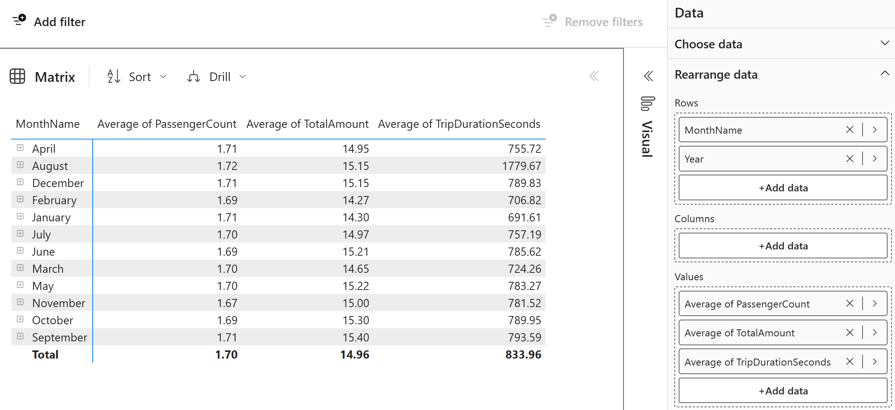

---
lab:
  title: Creación y exploración de un modelo semántico
  module: Understand scalability in Power BI
---

# Creación y exploración de un modelo semántico

En este ejercicio, usará Microsoft Fabric para desarrollar un modelo de datos para los datos de NY Taxi de ejemplo en un almacenamiento de datos.

Practicará lo siguiente:

- Creación de un modelo semántico personalizado a partir de un almacenamiento de datos de Fabric.
- Creación de relaciones y organización del diagrama del modelo.
- Exploración de los datos del modelo semántico directamente en Fabric.

Este laboratorio se realiza en unos **30** minutos.

> **Nota**: Necesitará una [evaluación gratuita de Microsoft Fabric](https://learn.microsoft.com/fabric/get-started/fabric-trial) para realizar este ejercicio.

## Creación de un área de trabajo

Antes de trabajar con datos de Fabric, cree un área de trabajo con la evaluación gratuita de Fabric habilitada.

1. En la [página principal de Microsoft Fabric](https://app.fabric.microsoft.com), seleccione **Ingeniería de datos de Synapse**.
1. En la barra de menús de la izquierda, seleccione **Áreas de trabajo** (el icono tiene un aspecto similar a &#128455;).
1. Cree una nueva área de trabajo con el nombre que prefiera y seleccione un modo de licencia que incluya capacidad de Fabric (*Evaluación gratuita*, *Prémium* o *Fabric*).
1. Cuando se abra la nueva área de trabajo, debe estar vacía.

## Creación de un almacenamiento de datos y carga de datos de ejemplo

Ahora que tiene un área de trabajo, es el momento de crear un almacenamiento de datos. La página principal de Synapse Data Warehouse incluye un acceso directo para crear un nuevo almacén:

1. En la página principal de **Synapse Data Warehouse**, cree un nuevo **almacenamiento** con el nombre que prefiera.

    Al cabo de un minuto más o menos, se creará un nuevo almacenamiento:
    
    

1. En el centro de la interfaz de usuario del almacenamiento de datos, verá algunas maneras diferentes de cargar datos en el almacenamiento. Seleccione **Datos de ejemplo** para cargar datos de NYC Taxi en el almacenamiento de datos. Este proceso tardará unos minutos.

1. Una vez cargados los datos de ejemplo, use el panel **Explorador** de la izquierda para ver qué tablas y vistas ya existen en el almacenamiento de datos de ejemplo.

1. Seleccione la pestaña **Informes** de la cinta de opciones y elija **Nuevo modelo semántico**. Esto le permite crear un nuevo modelo semántico con solo tablas y vistas específicas desde el almacenamiento de datos para su uso por parte de los equipos de datos y la empresa para crear informes.

1. Asigne al modelo semántico el nombre **Taxi Revenue**, asegúrese de que se encuentra en el área de trabajo que acaba de crear y seleccione las tablas siguientes:
   - Date
   - Trip
   - Zona geográfica
   - Tiempo
     
   
     
## Creación de relaciones entre tablas

Ahora creará relaciones entre las tablas para analizar y visualizar los datos de forma más rápida. Si está familiarizado con la creación de relaciones en Power BI Desktop, esto le resultará conocido.

1. Vuelva al área de trabajo y confirme que ve el nuevo modelo semántico, Taxi Revenue. Observe que el tipo de elemento es **Modelo semántico**, en lugar del **Modelo semántico (predeterminado)** que se crea automáticamente al crear un almacenamiento de datos.

     *Nota: Un modelo semántico predeterminado se crea automáticamente cuando se crea un punto de conexión de Warehouse o SQL Analytics en Microsoft Fabric y hereda la lógica de negocios de la instancia principal de Lakehouse o Warehouse. Un modelo semántico que cree usted mismo, como hemos hecho aquí, es un modelo personalizado que puede diseñar y modificar según sus necesidades y preferencias específicas. Puede crear un modelo semántico personalizado mediante Power BI Desktop, el servicio Power BI u otras herramientas que se conectan a Microsoft Fabric.*

1. Seleccione **Abrir modelo de datos en la cinta de opciones**.

    Ahora creará relaciones entre las tablas. Si está familiarizado con la creación de relaciones en Power BI Desktop, esto le resultará conocido.

    *Al revisar el concepto de esquema de estrella, organizaremos las tablas de nuestro modelo en una tabla de hechos y tablas de dimensiones. En este modelo, la tabla **Trip** es nuestra tabla de hechos y nuestras dimensiones son **Date**, **Geography** y **Weather**.*

1. Cree una relación entre la tabla **Date** y la tabla **Trip** mediante la columna **DateID**.

    **Seleccione la columna DateID** de la tabla **Date** y *arrástrela y suéltela encima de la columna DateID de la tabla Trip*.

    Asegúrese de que la relación sea una relación de tipo **Uno a varios** de la tabla **Date** a la tabla **Trip**.

1. Cree dos relaciones más en la tabla de datos **Trip** de la siguiente manera:

   - **Geography [GeographyID]** a **Trip [DropoffGeographyID]** (1:Many)
   - **Weather [GeographyID]** a **Trip [DropoffGeographyID]** (1:Many)

    > **Nota**: debe cambiar la cardinalidad predeterminada de la relación a **1:Many** para ambas relaciones.

1. Arrastre las tablas a su posición para que la tabla de hechos **Trip** se encuentre en la parte inferior del diagrama y las tablas restantes, que son tablas de dimensiones, estén alrededor de la tabla de hechos.

    

    *Ahora se ha completado la creación del modelo de esquema de estrella. Hay muchas configuraciones de modelado que ahora se podrían aplicar, como agregar jerarquías, cálculos y establecer propiedades como visibilidad de columnas.*

    > **Sugerencia**: En el panel Propiedades de la ventana, active *Anclar campos relacionados a la parte superior de la tarjeta*. Esto le ayudará (y a otros que informan de este modelo) a ver de un solo vistazo qué campos se usan en las relaciones. También puede interactuar con los campos de las tablas mediante el panel de propiedades. Por ejemplo, si desea confirmar que los tipos de datos están configurados correctamente, puede seleccionar un campo y revisar el formato en el panel de propiedades.

     

## Exploración de los datos

Ahora tiene un modelo semántico creado fuera del almacenamiento que tiene relaciones establecidas que son necesarias para la generación de informes. Echemos un vistazo a los datos mediante la característica **Explorar datos**.

1. Vuelva al área de trabajo y seleccione el **modelo semántico Taxi Revenue**.

1. En la ventana, seleccione **Explorar estos datos** en la cinta de opciones. Aquí verá los datos en formato tabular. Esto ofrece una experiencia centrada para explorar los datos sin crear un informe completo de Power BI.

1. Agregue **YearName** y **MonthName** a las filas y explore el **número promedio de pasajeros**, la **cantidad promedio de viajes** y la **duración promedio de viajes** en el campo de valores.

    *Al arrastrar y colocar un campo numérico en el panel de exploración, el valor predeterminado es resumir el número. Para cambiar la agregación de **Resumir** a **Promedio**, seleccione el campo y cambie la agregación en la ventana emergente.*

    

1. Para ver estos datos como un objeto visual en lugar de simplemente una matriz, seleccione **Visual** en la parte inferior de la ventana. Seleccione un gráfico de barras para visualizar rápidamente estos datos.

   *Un gráfico de barras no es la mejor manera de examinar estos datos. Juega con los distintos objetos visuales y los campos que estás viendo en la sección "Reorganizar datos" del panel Datos en el lado derecho de la pantalla.*

1. Ahora puede guardar esta vista exploración en el área de trabajo haciendo clic en el botón** Guardar** de la esquina superior izquierda. También tiene la posibilidad de **compartir** la vista seleccionando **Compartir** en la esquina superior derecha. Esto le permitirá compartir la exploración de datos con compañeros.

1. Después de haber guardado la exploración, vuelva al área de trabajo para ver el almacenamiento de datos, el modelo semántico predeterminado, el modelo semántico que ha creado y la exploración.

    
