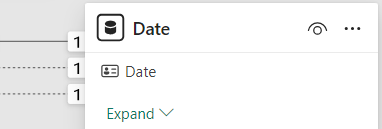
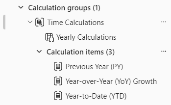
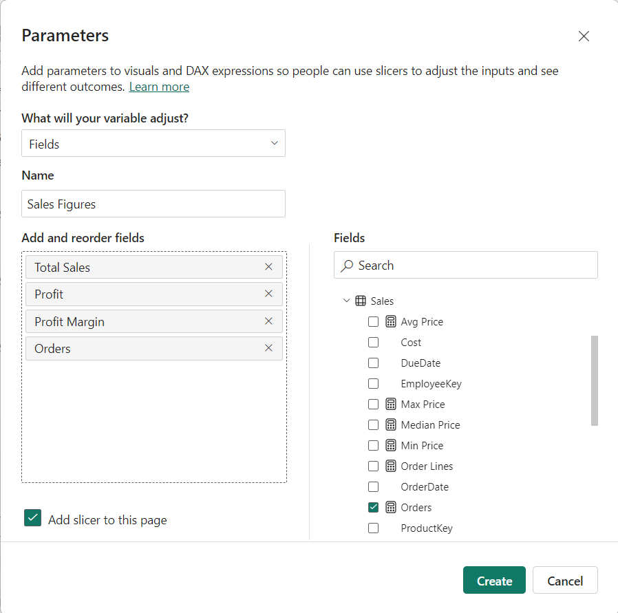

---
lab:
  title: Diseño de modelos semánticos escalables
  module: Design scalable semantic models
---

# Diseño de modelos semánticos escalables

En este ejercicio, trabajarás con funciones DAX para mejorar la flexibilidad y la eficacia de los modelos de datos, especialmente a través de características como grupos de cálculo y parámetros de campo. Al usar estas características conjuntamente, podrás crear informes interactivos sin necesidad de varios objetos visuales o expresiones DAX complejas, creando modelos semánticos altamente flexibles y escalables.

En este ejercicio aprenderás a hacer lo siguiente:

- Usar funciones DAX para modificar el comportamiento de las relaciones.
- Crear grupos de cálculo y aplicarlos en cálculos dinámicos de inteligencia de tiempo.
- Crear parámetros de campo para seleccionar y mostrar dinámicamente diferentes campos y medidas.

Este laboratorio se realiza en unos **30** minutos.

## Antes de comenzar

1. Descarga el archivo de inicio de [Sales Analysis](https://github.com/MicrosoftLearning/mslearn-fabric/raw/main/Allfiles/Labs/15/15-scalable-semantic-models.zip) de `https://github.com/MicrosoftLearning/mslearn-fabric/raw/main/Allfiles/Labs/15/15-scalable-semantic-models.zip` y guárdalo localmente.

2. Extrae la carpeta a la carpeta **C:\Users\Student\Downloads\15-scalable-semantic-models**.

3. Abre el archivo **15-Starter-Sales Analysis.pbix**.

    > Omite y cierra las advertencias que pidan aplicar cambios: no selecciones *Descartar cambios*.

## Trabajar con relaciones

En esta tarea, abrirás una solución de Power BI Desktop previamente desarrollada para obtener información sobre el modelo de datos. Después, explorarás el comportamiento de las relaciones del modelo activo.

1. En Power BI Desktop, en la parte izquierda, cambia a la vista **Modelo**.

    

2. Usa el diagrama de modelos para revisar el diseño del modelo.

    

3. Ten en cuenta que existen tres relaciones entre las tablas **Fecha** y **Ventas**.

    

    > La columna **Date** de la tabla **Date** es una columna única que representa el lado "unilateral" de las relaciones. Los filtros aplicados a cualquier columna de la tabla **Date** se propagan a la tabla **Sales** mediante una de las relaciones.*

4. Mantén el cursor sobre cada una de las tres relaciones para resaltar la columna del lado "varios" en la tabla **Ventas**.

5. Observa que la relación entre **Date** y **OrderDate** está activa. El diseño del modelo actual indica que la tabla **Date** es una dimensión realizadora de roles. Esta dimensión podría desempeñar el papel de la fecha de pedido, la fecha de vencimiento o la fecha de envío. El rol que desempeñará depende de los requisitos analíticos del informe.

> Usaremos DAX más adelante para usar estas relaciones inactivas sin crear otra tabla, simplemente para obtener dos relaciones activas para columnas de fecha diferentes.

### Visualización de datos de ventas por fecha

En esta tarea, visualizarás el total de ventas por año y usarás relaciones inactivas.

1. Cambia a la vista **Informe**.

    

2. Para agregar un objeto visual de tabla, en el panel **Visualizaciones**, selecciona el icono de objeto visual **Tabla**.

    

3. Para agregar columnas al objeto visual de tabla, en el panel **Datos** (situado a la derecha), expande primero la tabla **Date**.

4. Arrastra la columna **Year** y colócala en el objeto visual de tabla.

5. Expande y abre la tabla **Sales** y después arrastra y suelta la columna **Total Sales** en el objeto visual de tabla.

6. Revisa el objeto visual de tabla.


> El objeto visual de tabla muestra la suma de la columna **Total Sales** agrupada por año. ¿Pero qué significa **Year**? Dado que hay una relación activa entre las tablas **Date** y **Sales** con la columna **OrderDate**, **Year** significa el año fiscal en el que se realizaron los pedidos.

### Uso de relaciones inactivas

En esta tarea, usarás la función `USERELATIONSHIP` para activar una relación inactiva.

1. En el panel **Datos**, haz clic con el botón derecho del ratón en la tabla **Ventas** y después selecciona **Nueva medida**.

    

2. En la barra de fórmulas (situada debajo de la cinta), reemplaza el texto por la siguiente definición de medida y después presiona **Entrar**.

    ```DAX
    Sales Shipped =
    CALCULATE (
    SUM ('Sales'[Sales]),
    USERELATIONSHIP('Date'[Date], 'Sales'[ShipDate])
    )
    ```

    > Esta fórmula usa la función CALCULATE para modificar el contexto de filtro. Es la función USERELATIONSHIP que activa la relación **ShipDate**, solo para esta medida.

3. Agrega la nueva medida **Sales Shipped** al objeto visual de tabla.

4. Amplía el objeto visual de tabla para que todas las columnas estén completamente visibles. Observe que la fila **Total** es la misma, pero el importe de ventas de cada año en **Total Sales** y **Sales Shipped** es diferente. Esa diferencia se debe a que los pedidos se reciben en un año determinado y solo se envían al año siguiente o aún no se han enviado.


> La creación de medidas que establecen temporalmente relaciones como activas es una manera de trabajar con dimensiones realizadoras de roles. Sin embargo, puede resultar tedioso cuando es necesario crear versiones realizadoras de roles para muchas medidas. Por ejemplo, si hubiera 10 medidas relacionadas con las ventas y tres fechas realizadoras de roles, podría significar la creación de 30 medidas. Su creación con grupos de cálculo facilita el proceso.

## Creación de grupos de cálculo

En esta tarea, crearás un grupo de cálculo para el análisis de inteligencia de tiempo.

1. Cambia a la vista **Modelo**.

2. En la vista Modelo, selecciona **Grupo de cálculo** para crear una nueva tabla de grupo de cálculo, un columna de grupo y un elemento. Si aparece una ventana de advertencia, selecciona **Sí** para confirmar la creación del grupo de cálculo.

   

    > Nota: una medida implícita se produce cuando, en la vista Informe, se usa una columna de datos desde el panel Datos directamente en el objeto visual. El objeto visual te permite agregarlo como SUM, AVERAGE, MIN, MAX u otra agregación básica, que se convierte en una medida implícita. Una vez creado un grupo de cálculo, Power BI Desktop ya no creará medidas implícitas, lo que significa que deberás crear medidas explícitamente para agregar columnas de datos.

3. Cambia el nombre del grupo de cálculo a *Time Calculations* y la columna de cálculo a *Yearly Calculations*.

4. En la pestaña **Modelo** del panel **Datos**, selecciona el elemento de cálculo creado automáticamente con el grupo de cálculo.

5. Reemplaza y confirma la fórmula del elemento por lo siguiente:

    ```DAX
   Year-to-Date (YTD) = CALCULATE(SELECTEDMEASURE(), DATESYTD('Date'[Date]))
    ```

6. Haz clic con el botón derecho en el campo **Elementos de cálculo** y selecciona **Nuevo elemento de cálculo**.

7. Usa la siguiente fórmula DAX para el nuevo elemento:

    ```DAX
   Previous Year (PY) = CALCULATE(SELECTEDMEASURE(), PREVIOUSYEAR('Date'[Date]))
    ```

8. Crea un tercer elemento con la siguiente fórmula DAX:

    ```DAX
   Year-over-Year (YoY) Growth = 
   VAR MeasurePriorYear =
   CALCULATE(
       SELECTEDMEASURE(),
       SAMEPERIODLASTYEAR('Date'[Date])
   )
   RETURN
   DIVIDE(
       (SELECTEDMEASURE() - MeasurePriorYear),
       MeasurePriorYear
   )
    ```

El último elemento de cálculo solo debe devolver valores en porcentaje, por lo que necesita una cadena de formato dinámico para cambiar el formato de las medidas que afecta.

9. En el panel **Propiedades** del elemento YoY, habilita la característica **Cadena de formato dinámico**.

10. En la barra de fórmulas DAX, comprueba que el campo a su izquierda está como **Formato** y escribe la siguiente cadena de formato: `"0.##%"`

11. Confirma que el grupo de cálculo tiene el siguiente aspecto:

    

### Aplicación de un grupo de cálculo a las medidas

En esta tarea, visualizarás cómo afectan los elementos de cálculo a las medidas de un objeto visual.

1. Cambia a la vista **Informe**.

2. En la parte inferior del lienzo, selecciona la pestaña **Información general**.

3. Selecciona el objeto visual de matriz ya creado en el lienzo y arrastra la columna **Yearly Calculations** del panel **Datos** al campo **Columnas** del panel **Visualizaciones**.

    

4. Observa que ahora la matriz tiene un conjunto de cifras de ventas para cada elemento de cálculo. 

   

> Tener toda esta información en un objeto visual al mismo tiempo puede ser difícil de leer y, por lo tanto, sería conveniente limitar el objeto visual a una cifra de ventas a la vez. Para ello, podemos usar un parámetro de campo.

## Creación de parámetros de campo

En esta tarea, crearás parámetros de campo para cambiar los objetos visuales.

1. Selecciona la pestaña **Modelado** de la cinta superior y, después, expande el botón **Nuevo parámetro** y selecciona **Campos**.

    

2. En la ventana Parámetros, cambia el nombre del parámetro a **Sales Figures**, comprueba que la opción **Agregar segmentación a esta página** está activada y agrega los siguientes campos de la tabla **Sales**:

   - Total Sales
   - Profit
   - Profit Margin
   - Orders

    

3. Selecciona **Crear**.

4. Una vez creada la segmentación, podrás seleccionar la matriz y quitar todos los campos del panel **Valores** en el panel Visualizaciones y agregar en su lugar el parámetro de campo Sales Figures.

    

5. Comprueba las distintas cifras de ventas de la segmentación y cómo cambia la matriz cuando se selecciona cada una de ellas.

6. Mira cómo se selecciona el campo Profit mediante la segmentación para el parámetro de campo Sales Figures. Esta es la misma matriz anterior, por lo que puedes ver los tres elementos de cálculo (PY, YoY, YTD), pero solo se aplica a Profit debido a la segmentación.

    

### Edición de los parámetros de campo

En esta tarea, editarás el parámetro de campo **Sales Figures** modificando directamente su expresión DAX.

1. Selecciona la pestaña **Salesperson Performance** en la parte inferior del lienzo. Observa el gráfico de barras agrupadas para cambiar el gráfico entre Sales by Month y Target by Month.

    > Al crear los botones de marcador, puedes cambiar el tipo de objeto visual con cada opción, si necesitas cambiar entre muchas medidas, tendrás que crear un botón de marcador para cada una de ellas y eso te puede llevar mucho tiempo. En su lugar, podemos usar un parámetro de campo con todas las medidas que queremos analizar y cambiar rápidamente entre ellas.

    

2. Selecciona el objeto visual de gráfico de barras y reemplaza el campo **Total Sales** en el **eje X** por el parámetro de campo **Sales Figures**.

3. Crea un objeto visual de **segmentación** y arrastra el parámetro **Sales Figures** al área **Campo**.

Para este objeto visual, debes evaluar Target by Month, que no está en el parámetro de campo.

4. Selecciona el parámetro **Sales Figures** en el panel Datos y agregue el campo Target en la expresión DAX del parámetro como se indica a continuación:

    ```DAX
   Sales Figures = {
    ("Total Sales", NAMEOF('Sales'[Total Sales]), 0),
    ("Profit", NAMEOF('Sales'[Profit]), 1),
    ("Profit Margin", NAMEOF('Sales'[Profit Margin]), 2),
    ("Orders", NAMEOF('Sales'[Orders]), 3),
    ("Target", NAMEOF('Targets'[Target]), 4)
   }
    ```

5. Confirma los cambios y comprueba que el objeto visual cambia a medida que seleccionas las distintas cifras de ventas.

6. Elimina los botones de marcador y observa el estado final de la página de informe.

    

## Laboratorio completado

Para finalizar el ejercicio, cierra Power BI Desktop (no es necesario guardar el archivo).
