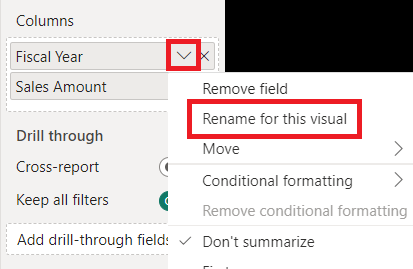
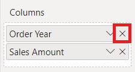

---
lab:
  title: Trabajo con relaciones de modelo
  module: Design and build tabular models
---

# Trabajo con relaciones de modelo

En este ejercicio, trabajará con relaciones de modelos específicamente para abordar la necesidad de dimensiones realizadoras de roles. Implicará trabajar con relaciones activas e inactivas, así como funciones de Data Analysis Expressions (DAX) que modifican el comportamiento de las relaciones.

En este ejercicio aprenderá a hacer lo siguiente:

- Interpretar las propiedades de relación en el diagrama del modelo.
- Establecer propiedades de relación.
- Usar funciones DAX que modifiquen el comportamiento de las relaciones.

Este laboratorio se realiza en **45** minutos aproximadamente.

> **Nota**: Necesitará una [evaluación gratuita de Microsoft Fabric](https://learn.microsoft.com/fabric/get-started/fabric-trial) para realizar este ejercicio.

## Explorar las relaciones de modelos

En este ejercicio, abrirás una solución de Power BI Desktop previamente desarrollada para obtener información sobre el modelo de datos. Después, explorarás el comportamiento de las relaciones del modelo activo.

### Descargar archivo de inicio

1. Descargue el [archivo de inicio de Análisis de ventas](https://aka.ms/fabric-relationships-starter) de `https://aka.ms/fabric-relationships-starter` y guárdelo en el equipo local (en cualquier carpeta).

1. Vaya al archivo descargado y ábralo en Power BI Desktop.
    >Nota: Omita y cierre la advertencia en la que se le pide que aplique los cambios.

### Revisión del modelo de datos

1. En Power BI Desktop, en la parte izquierda, cambia a la vista **Modelo**.

    
2. Usa el diagrama de modelos para revisar el diseño del modelo.

    

    *El modelo consta de seis tablas de dimensiones y una tabla de hechos. La tabla de hechos **Ventas** almacena los detalles de los pedidos de venta. Es un diseño clásico de esquema de estrella.*

3. Ten en cuenta que existen tres relaciones entre las tablas **Fecha** y **Ventas**.

    

    *La columna **DateKey** de la tabla **Fecha** es una columna única que representa "un" lado de las relaciones. Los filtros aplicados a cualquier columna de la tabla **Fecha** se propagan a la tabla **Ventas** con una de las relaciones.*

4. Mantén el cursor sobre cada una de las tres relaciones para resaltar la columna del lado "varios" en la tabla **Ventas**.

5. Ten en cuenta que la relación con la columna **OrderDateKey** es una línea sólida, mientras que las demás relaciones se representan con una línea de puntos.

    *Una línea sólida representa una relación activa. Solo puede haber una ruta de acceso de relación activa entre dos tablas de modelo y la ruta de acceso se usa de forma predeterminada para propagar filtros entre tablas. Por el contrario, una línea de puntos representa una relación inactiva. Las relaciones inactivas solo se usan cuando las fórmulas DAX invocan de forma explícita.*

    *El diseño del modelo actual indica que la tabla **Fecha** es una realizadora de roles. Esta dimensión podría desempeñar el papel de la fecha de pedido, la fecha de vencimiento o la fecha de envío. Qué rol depende de los requisitos analíticos del informe.*

    *En este laboratorio, aprenderás a diseñar un modelo para que sea compatible con dimensiones realizadoras de roles.*

### Visualización de datos de fecha

En esta tarea, visualizarás los datos de ventas por fecha y cambiarás el estado activo de las relaciones.

1. Cambie a la vista **Informe**.

    

2. Para agregar un visual de tabla, en el panel **Visualizaciones**, selecciona el icono del visual **Tabla**.

    

3. Para agregar columnas al visual de la tabla, en el panel **Datos** (situado a la derecha), expande primero la tabla **Fecha**.

    

4. Arrastre la columna **Año fiscal** y colócala en el visual de la tabla.

    

5. Expande y abre la tabla **Ventas** y después arrastra y suelta la columna **Importe de ventas** en el visual de la tabla.

    

6. Revisa el visual de tabla.

    

    *El visual de la tabla muestra la suma de la columna **Importe de ventas** agrupada por años. Pero, ¿qué significa **Año fiscal**? Dado que hay una relación activa entre las tablas **Fecha** y **Ventas** con la columna **OrderDateKey**, **Año fiscal** significa el año fiscal en el que se realizaron los pedidos.*

    *Para aclarar qué año fiscal, es una buena idea cambiar el nombre del campo visual (o agregar un título al objeto visual).*

7. En el panel **Visualizaciones** del objeto visual de tabla, en el área **Columnas**, selecciona la flecha abajo y, después, selecciona **Cambiar nombre para este objeto visual**.

    

8. Reemplaza el texto por **Año de pedido** y luego presiona **Entrar**.

    

    *Nota: Es más rápido cambiar el nombre de un campo visual haciendo doble clic en su nombre.*

9. Observa que el encabezado de columna del objeto visual de tabla se actualiza al nuevo nombre.

    

### Modificación del estado activo de la relación

En esta tarea, modificarás el estado activo de dos relaciones.

1. En la cinta **Modelado**, haz clic en **Administrar relaciones**.

    

2. En la ventana **Administrar relaciones**, para la relación entre las tablas **Ventas** y **Fecha** de la columna **OrderDateKey** (tercera de la lista), desactiva la casilla **Activo**.

    

3. Activa la casilla **Activo** para ver la relación entre las tablas **Ventas** y **Fecha** de la columna **ShipDateKey** (última en la lista).

    

4. Seleccione **Close** (Cerrar).

    

    *Estas configuraciones han cambiado la relación activa entre las tablas **Fecha** y **Ventas** a la columna **ShipDateKey**.*

5. Revisa el objeto visual de tabla que ahora muestra los importes de ventas agrupados por años de envío.

    

6. Cambia el nombre de la primera columna como **Año de envío**.

    

    *La primera fila representa un grupo en blanco porque algunos pedidos aún no se han enviado. En otras palabras, hay BLANK en la columna **ShipDateKey** de la tabla **Ventas**.*

7. En la ventana **Administrar relaciones**, vuelve a activar la relación **OrderDateKey** mediante los pasos siguientes:

    - Abre la ventana **Administrar relaciones**

    - Desactiva la casilla **Activa** para la relación **ShipDateKey** (última en la lista)

    - Activa la casilla **Activa** para la relación **OrderDateKey** (tercera en la lista)

    - Cierra la ventana **Administrar relaciones**

    - Cambia el nombre del primer campo visual del objeto visual de tabla como **Año del pedido**

    

    *En el ejercicio siguiente, aprenderás a activar una relación en una fórmula DAX.*

## Usar relaciones inactivas

En este ejercicio, aprenderás a activar una relación en una fórmula DAX.

### Usar relaciones inactivas

En esta tarea, usarás la función USERELATIONSHIP para activar una relación inactiva.

1. En el panel **Datos**, haz clic con el botón derecho del ratón en la tabla **Ventas** y después selecciona **Nueva medida**.

    

2. En la barra de fórmulas (situada debajo de la cinta), reemplaza el texto por la siguiente definición de medida y después presiona **Entrar**.

    ```DAX
    Sales Shipped =
    CALCULATE (
    SUM ( 'Sales'[Sales Amount] ),
    USERELATIONSHIP ( 'Date'[DateKey], 'Sales'[ShipDateKey] )
    )
    ```

    *Esta fórmula usa la función CALCULATE para modificar el contexto de filtro. Es la función USERELATIONSHIP que, para el propósito de este cálculo, activa la relación **ShipDateKey**.*

3. En la cinta contextual **Herramientas de medición**, dentro del grupo **Formato**, establece las posiciones decimales en **2**.

    

4. Agrega la nueva medida **Ventas enviadas** al objeto visual de tabla.

    

5. Amplía el objeto visual de tabla para que todas las columnas estén completamente visibles.

    

    *La creación de medidas que establecen temporalmente relaciones como activas es una manera de trabajar con dimensiones de rol. Sin embargo, puede resultar tedioso cuando es necesario crear versiones de rol para muchas medidas. Por ejemplo, si hubiera 10 medidas relacionadas con las ventas y tres fechas de rol, podría significar la creación de 30 medidas. Crearlas con grupos de cálculo podría facilitar el proceso.*

    *Otro enfoque consiste en crear una tabla de modelos diferente para cada dimensión de rol. Lo harás en el ejercicio siguiente.*

6. Para quitar la medida del objeto visual de tabla, en el panel **Visualizaciones**, desde el área **Columnas**, para el campo **Ventas enviadas**, presiona **X**.

    

## Agregar otra tabla de Fecha

En este ejercicio, agregarás una tabla de fechas para admitir el análisis de fechas de envío.

### Quitar todas las relaciones inactivas

En esta tarea, quitarás la relación existente con la columna **ShipDateKey**.

1. Cambia a la vista **Modelo**.

    

2. En el diagrama del modelo, haz clic con el botón derecho en la relación **ShipDateKey** y selecciona **Eliminar**.

    

3. Cuando se le pida que confirme la eliminación, seleccione **Sí**.

    *Al eliminar la relación, se produce un error con la medida **Ventas enviadas**. Volverás a escribir la fórmula de medida más adelante en este laboratorio.*

### Deshabilitar opciones de relación

En esta tarea, deshabilitarás dos opciones de relación.

1. En la ficha de cinta **Archivo**, selecciona **Opciones y configuración** y después selecciona **Opciones**.

    

2. En la ventana **Opciones**, en la parte inferior izquierda, en el grupo **ARCHIVO ACTUAL**, selecciona **Carga de datos**.

    

3. En la sección **Relaciones**, desactiva las dos opciones habilitadas.

    

    *Por lo general, en el trabajo diario, está bien mantener estas opciones habilitadas. Sin embargo, para el fin de este laboratorio, crearás relaciones explícitamente.*

4. Seleccione **Aceptar**.

    

### Agregar otra tabla de fechas

En esta tarea, crearás una consulta para agregar otra tabla de fechas al modelo.

1. En la ficha de cinta **Inicio**, dentro del grupo **Consultas**, seleccione el icono **Transformar datos**, que abre el **Editor de Power Query**.

    

    *Si se le pide que especifique cómo conectarse, **Editar credenciales**.*

    

    *Deje la configuración de conexión predeterminada para Windows con "Usar mis credenciales actuales" y, a continuación, **Conectar**.*

     *Seleccione **Sí** para cerrar el mensaje de advertencia.*

2. En la ventana **Editor de Power Query**, en el panel **Consultas** (ubicado a la izquierda), haz clic con el botón derecho en la consulta ** Fecha** y después selecciona **Referencia**.

    

    *Una consulta de referencia es una que usa otra consulta como origen. Por lo tanto, esta nueva consulta origina su fecha de la consulta **Fecha**.*

3. En el panel **Configuración de la consulta** (situado a la derecha), en el cuadro **Nombre**, reemplaza el texto por **Fecha de envío**.

    

4. Para cambiar el nombre de la columna **DateKey**, haz doble clic en el encabezado de la columna **DateKey**.

5. Reemplaza el texto por **ShipDateKey** y luego presiona **Entrar**.

    

6. Cambia también el nombre de la columna **Año fiscal** como **Año de envío**.

    *Si es posible, es una buena idea cambiar el nombre de todas las columnas de modo que describan rol que juegan. Para simplificar, en este laboratorio solo cambiará el nombre de dos columnas.*

7. Para cargar la tabla en el modelo, en la ficha de cinta **Inicio**, selecciona el icono **Cerrar &amp; Aplicar**.

    

8. Cuando la tabla se haya agregado al modelo, para crear una relación, desde la tabla **Fecha de envío** arrastra la columna **ShipDateKey** a la columna **ShipDateKey** de la tabla **Ventas**.

    

9. Observa que ahora existe una relación activa entre las tablas **Fecha de envío** y **Ventas**.

### Visualización de datos de fecha de envío

En esta tarea, visualizarás los datos de fecha de envío en un nuevo objeto visual de tabla.

1. Cambie a la vista **Informe**.

    

2. Para clonar el objeto visual de tabla, primero selecciona el objeto visual.

3. En la ficha de cinta **Inicio**, desde el grupo **Portapapeles**, selecciona **Copiar**.

    

4. Para pegar el objeto visual copiado, en la ficha de cinta **Inicio**, en el grupo **Portapapeles**, selecciona **Pegar**.

    *Sugerencia: También puedes usar los métodos abreviados **Ctrl+C** y **Ctrl+V**.*

    

5. Mueve el nuevo objeto visual de tabla a la derecha del objeto visual de tabla existente.

6. Selecciona el nuevo objeto visual de tabla y después, en el panel **Visualizaciones**, en el área **Columnas**, quita el campo **Año de pedido**.

    

7. En el panel **Datos**, expande para abrir la tabla **Fecha de envío**.

8. Para agregar un nuevo campo al nuevo objeto visual de tabla, desde la tabla **Fecha de envío**, arrastra el campo **Año de envío** al área **Columnas**, encima del campo **Importe de ventas**.

    

9. Comprueba que el nuevo objeto visual de tabla muestra el importe de ventas agrupado por año de envío.

    

    *El modelo ahora tiene dos tablas de fechas, cada una con una relación activa con la tabla **Ventas**. La ventaja de este enfoque de diseño es que es flexible. Ahora es posible usar todas las medidas y los campos resumibles con cualquiera de las tablas de fechas.*

    *Sin embargo, hay algunas desventajas. Cada tabla de rol contribuirá a un tamaño de modelo mayor, aunque la tabla de dimensiones no suele ser grande en términos de filas. Cada tabla de rol también requerirá duplicar las configuraciones del modelo, como marcar la tabla de fechas, crear jerarquías y otras configuraciones. Además, las tablas adicionales contribuyen a un posible número abrumador de campos. Para los usuarios puede resultar más difícil encontrar los recursos del modelo que necesitan.*

    *Por último, no es posible lograr una combinación de filtros en el objeto visual. Por ejemplo, no es posible combinar las ventas ordenadas y las ventas enviadas en el mismo objeto visual sin crear una medida. Crearás esa medida en el ejercicio siguiente.*

## Exploración de otras funciones de relación

En este ejercicio, trabajarás con otras funciones de relación DAX.

### Exploración de otras funciones de relación

En esta tarea, trabajarás con las funciones CROSSFILTER y TREATAS para modificar el comportamiento de las relaciones durante los cálculos.

1. En el panel **Datos**, en la tabla **Ventas**, selecciona la medida **Ventas enviadas**.

    

2. En la fórmula base, reemplaza el texto por la definición siguiente:

    ```dax
    Sales Shipped =
    CALCULATE (
    SUM ( 'Sales'[Sales Amount] ),
    CROSSFILTER ( 'Date'[DateKey], 'Sales'[OrderDateKey], NONE ),
    TREATAS (
    VALUES ( 'Date'[DateKey] ),
    'Ship Date'[ShipDateKey]
        )
    )
    ```

    *Esta fórmula usa la función CALCULATE para sumar la columna **Importe de ventas** mediante comportamientos de relación modificados. La función CROSSFILTER deshabilita la relación activa con la columna **OrderDateKey** (esta función también puede modificar la dirección del filtro). La función TREATAS crea una relación virtual aplicando los valores **DateKey** en contexto a la columna **ShipDateKey**.*

3. Agrega la medida **Ventas enviadas** revisada al primer objeto visual de tabla.

    

4. Revisa el primer objeto visual de tabla.

    

5. Observa que no hay ningún grupo BLANK.

    *Dado que no hay BLANK en la columna **OrderDateKey**, no se generó un grupo BLANK. Mostrar las ventas no asignadas precisará un enfoque diferente.*

### Mostrar ventas no enviadas

En esta tarea, crearás una medida para mostrar el importe de ventas no enviadas.

1. Cree una medida denominada **Sales Unshipped** en la tabla **Sales** usando la siguiente definición:

    ```DAX
    Sales Unshipped =
    CALCULATE (
    SUM ( 'Sales'[Sales Amount] ),
    ISBLANK ( 'Sales'[ShipDateKey] )
    )
    ```

    *Esta fórmula suma la columna **Importe de ventas** donde la columna **ShipDateKey** es BLANK.*

2. Da formato a la medida para usar dos posiciones decimales.

3. Para agregar un nuevo objeto visual a la página, selecciona primero un área en blanco de la página del informe.

4. En el panel **Visualizaciones**, selecciona el icono de objeto visual **Tarjeta**.

    

5. Arrastra la medida **Ventas no enviadas** al objeto visual de tarjeta.

    

6. Comprueba que el diseño de página del informe final tiene un aspecto similar al siguiente.

    

### Finalización

Para finalizar el ejercicio, cierre Power BI Desktop (no es necesario guardar el archivo).
