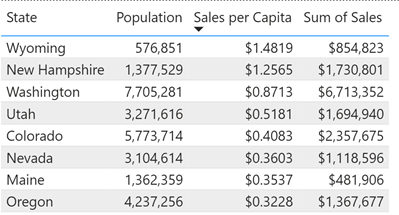

---
lab:
  title: "Creación de recursos reutilizables de Power\_BI"
  module: Create reusable Power BI assets
---

# Creación de recursos reutilizables de Power BI

En este ejercicio, crearás recursos reutilizables para que sean compatibles con el modelo semántico y el desarrollo de informes. Estos recursos incluyen archivos de proyecto y plantilla de Power BI y modelos semánticos compartidos. Al final, explorarás la vista de linaje de cómo se relacionan estos elementos entre sí en el servicio Power BI.

   > Nota: este ejercicio no requiere una licencia de Fabric y se puede completar en un entorno de Power BI o Microsoft Fabric.

Este ejercicio debería tardar en completarse **30** minutos aproximadamente.

## Antes de comenzar

Antes de comenzar este ejercicio, debes abrir un explorador web y escribir la siguiente dirección URL para descargar la carpeta zip:

`https://github.com/MicrosoftLearning/mslearn-fabric/raw/Main/Allfiles/Labs/16b/16-reusable-assets.zip`

Extrae la carpeta a la carpeta **C:\sers\student\Downloads\16-reusable-assets**.

## Publicación de un informe en el servicio Power BI

En esta tarea, usarás un informe existente para crear un modelo semántico compartido para reutilizarlo para desarrollar otros informes.

1. Desde un explorador web, ve e inicia sesión en el servicio Fabric: [https://app.fabric.microsoft.com](https://app.fabric.microsoft.com)
1. Ve a la experiencia de Power BI y crea un nuevo espacio de trabajo con un nombre único de tu elección.

    

1. En la cinta superior de tu nuevo espacio de trabajo, selecciona **Cargar > Examinar**.
1. En el nuevo cuadro de diálogo Explorador de archivos, ve al archivo de inicio *.pbix*, selecciónalo y selecciona **Abrir** para cargarlo.
1. Observa cómo ahora tienes dos elementos diferentes en el espacio de trabajo con el mismo nombre:

    - Informe
    - Modelo semántico

1. Abre el informe y observa el tema de color usado. *Cambiarás esto en una tarea posterior.*
1. Ya puedes cerrar el explorador web.

> Los archivos de Power BI *.pbix* contienen tanto el modelo semántico como los objetos visuales del informe. Al publicar informes en el servicio, estos elementos se separan. Verás esta separación de nuevo más tarde.

## Creación de un nuevo proyecto de Power BI

En esta tarea, crearás un informe mediante la conexión al modelo semántico publicado y lo guardarás como un archivo de proyecto de Power BI (*.pbip*). Los archivos del proyecto de Power BI almacenan los detalles del modelo semántico y del informe en archivos planos que funcionan con el control de código fuente. Puedes usar Visual Studio Code para modificar estos archivos o Git para realizar un seguimiento de los cambios.

1. En el escritorio, abre la aplicación Power BI Desktop y crea un informe en blanco.

    > Cuando se te solicite, inicia sesión con la misma cuenta que se está usando en el servicio Fabric.

1. Selecciona **Archivo** > **Opciones y configuración** > **Opciones** > **Características de la versión preliminar** y selecciona la opción **Almacenar modelo semántico con formato TMDL** y **Aceptar**.

    > Esto permite guardar el modelo semántico mediante el lenguaje de definición de modelos tabulares (TMDL), que actualmente es una característica en versión preliminar.

1. Si se te pide que reinicies Power BI Desktop, hazlo antes de continuar con el ejercicio.

    

1. Selecciona **Guardar como** elige el tipo de archivo seleccionando la flecha en el menú desplegable al asignar un nombre al archivo.
1. Selecciona la extensión de archivo **.*.pbip***, elige un nombre para tu informe y guárdalo en una carpeta que recuerdes.

    

1. Observa en la parte superior de la ventana de Power BI Desktop que el nombre de tu informe tiene **(Proyecto de Power BI)** junto a él.
1. En la cinta Inicio, ve a **Obtener datos > Modelos semánticos de Power BI** para conectarte al modelo semántico publicado.

    

1. Una vez conectado, deberías ver 9 tablas en el panel Datos.
1. Vuelve a **guardar** el archivo.

### Revisión de los detalles del archivo del proyecto de Power BI

Veamos cómo se reflejan los cambios en Power BI Desktop en los archivos .tmdl.

1. En el escritorio, usa el Explorador de archivos para ir a la carpeta donde has guardado el archivo *.*.pbip**.
1. Verás los siguientes elementos:

    - Archivo YourReport.*.pbip*
    - Carpeta YourReport.Report
    - Carpeta YourReport.SemanticModel
    - Archivo de código fuente Ignore de Git .gitignore

## Adición de una nueva tabla al informe

En esta tarea, agregarás una nueva tabla porque el modelo semántico no tiene todos los datos que necesitas.

1. En Power BI Desktop, ve a **Obtener datos > Web** para agregar los nuevos datos.
1. Observa el mensaje de que se requiere una conexión DirectQuery. Elige **Agregar un modelo local** para continuar.
1. El nuevo cuadro de diálogo te mostrará una base de datos y tablas para que elijas. Selecciona todo y **Enviar**.

    > El modelo semántico se trata como una base de datos de Analysis Server de SQL Server.

1. Aparecerá el cuadro de diálogo Desde web una vez conectado. Mantén seleccionado el botón de radio Básico. Escribe la siguiente ruta del archivo como ruta de acceso URL.

    `"C:\Users\Student\Downloads\16-reusable-assets\us-resident-population-estimates-2020.html"`

1. Selecciona el cuadro **Tablas HTML > Tabla 2** y, después, selecciona **Transformar datos** para continuar.

    

1. Se abrirá una nueva ventana de Editor de Power Query con la vista previa de datos de la tabla 2.
1. Cambia el nombre de la **Tabla 2** a *Población de EE. UU.*.
1. Cambia el nombre de STATE a **Estado** y NUMBER a **Población**.
1. Quita la columna RANK.
1. Selecciona **Cerrar y aplicar** para cargar los datos transformados en el modelo semántico.
1. Selecciona **Aceptar** si te aparece un cuadro de diálogo para *Posible riesgo de seguridad*.
1. **Guarde** el archivo.
1. Si se te solicita, **no actualices** al formato mejorado de Informe de Power BI.

### Revisión de los detalles del archivo del proyecto de Power BI

En esta tarea, realizaremos cambios en el informe de Power BI Desktop y veremos los cambios en los archivos .tmdl planos.

1. En el explorador de archivos, busca la carpeta de archivos ***YourReport*.SemanticModel**.
1. Abre la carpeta de definición y observa los diferentes archivos.
1. Abre el archivo **relationships.tmdl** en el Bloc de notas, y observa que hay 9 relaciones enumeradas. Cierre el archivo .
1. De vuelta en Power BI Desktop, ve a la pestaña **Modelado** de la cinta.
1. Selecciona **Administrar relaciones** y observa que hay 9 relaciones.
1. Crea una nueva relación de la siguiente manera:
    - **Desde**: revendedor con Estado-Provincia como columna clave
    - **A**: población de EE.UU. con Estado como columna clave
    - **Cardinalidad**: Varios a uno (*:1)
    - **Dirección de filtro cruzado**: ambos

    

1. **Guarde** el archivo.
1. Vuelve al archivo **relationships.tmdl** y observa que se ha agregado una nueva relación.

> Estos cambios en los archivos planos son rastreables en los sistemas de control de código fuente, a diferencia de los archivos *.pbix* que son binarios.

## Adición de una medida y un objeto visual al informe

En esta tarea, agregarás una medida y un objeto visual para ampliar el modelo semántico y usarás la medida en un objeto visual.

1. En Power BI Desktop, ve al panel Datos y selecciona la tabla Sales.
1. Selecciona **Nueva medida** en la cinta contextual Herramientas de tabla.
1. En la barra de fórmulas, escribe y confirma el código siguiente:

    ```DAX
    Sales per Capita =
    DIVIDE(
        SUM(Sales[Sales]),
        SUM('US Population'[Population])
    )
    ```

1. Busca la nueva medida **Sales per Capita** y arrástrala al lienzo.
1. Arrastra los campos **Ventas \| Ventas**, **Población de EE.UU. \| Estado** y **Población de EE.UU. \| Población** al mismo objeto visual.

   > *Los laboratorios usan una notación abreviada para hacer referencia a un campo. Tendrá este aspecto: **Sales \| Unit Price** (Ventas | Precio unitario). En este ejemplo, **Sales** (Ventas) es el nombre de la tabla y **Unit Price** (Precio unitario) es el nombre del campo.*

1. Selecciona el objeto visual y cámbialo a una **Tabla**.
1. Observa el formato incoherente de los datos Sales per Capita y Population.
1. Selecciona cada campo en el panel Datos y cambia el formato y las posiciones decimales.
    - Sales per Capita: Moneda \| 4 posiciones decimales
    - Population: Número entero \| separado por comas \| 0 posiciones decimales

    

    > Sugerencia: si creas accidentalmente una medida en la tabla incorrecta, puedes cambiar fácilmente la tabla Inicio, como se muestra en la imagen anterior.

1. Guarde el archivo.

> La tabla debe ser similar a la siguiente imagen con cuatro columnas y números con el formato correcto.



## Configuración de un archivo de plantilla (.pbit) de Power BI

En esta tarea, crearás un archivo de plantilla para que puedas compartir un archivo ligero con otros usuarios para mejorar la colaboración.

1. Ve a la pestaña Insertar de la cinta de opciones de Power BI Desktop y selecciona **Imágenes**. Ve a la carpeta de descargas y selecciona el archivo `AdventureWorksLogo.jpg`.
1. Coloca esta imagen en la esquina superior izquierda.
1. Selecciona un nuevo objeto visual y agrégale **Sales \| Profit** y **Product \| Category**.

    > Hemos usado un gráfico de anillos para la captura de pantalla siguiente.

    

1. Observa que hay 4 colores diferentes en la leyenda.
1. Ve a la pestaña **Vista** de la cinta de opciones.
1. Selecciona la flecha situada junto a **Temas** para ampliar y ver todas las opciones.
1. Selecciona uno de los **temas accesibles** que se aplicarán a este informe.

    > Estos temas se crean específicamente para que sean más accesibles para los visores de informes.

1. Vuelve a expandir los temas y selecciona **Personalizar tema actual**.

    

1. En la ventana Personalizar tema, ve a la pestaña **Texto**. Cambia la familia de fuentes a una fuente Segoe UI para cada una de las secciones.

    

1. **Aplica** los cambios una vez completados.
1. Observa los diferentes colores de los objetos visuales con el nuevo tema aplicado.

    

1. Selecciona **Archivo > Guardar como** para crear el archivo *.pbit*.
1. Cambia el tipo de archivo a *.pbit* y guárdalo en la misma ubicación que el archivo *.pbip*.
1. Escribe una descripción de lo que los usuarios pueden esperar de esta plantilla cuando la usen y selecciona Aceptar.
1. Vuelve al Explorador de archivos y abre el archivo *.pbit* y mira que tiene el mismo aspecto que el archivo *.pbip*.

    > En este ejercicio, solo queremos una plantilla de tema estándar de informe sin un modelo semántico.

1. En este mismo archivo nuevo, elimina los dos objetos visuales del lienzo.
1. Selecciona **Transformar datos** en la cinta Inicio.
1. En el Editor de Power Query, selecciona la consulta **Población de EE. UU.** y haz clic con el botón derecho para eliminarla.
1. Selecciona Configuración del origen de datos en la cinta de opciones y elimina el origen de datos **DirectQuery a AS: modelo semántico de Power BI** y **Cerrar**.
1. **Cerrar y aplicar**
1. Vuelve a Temas y comprueba que el tema Accesible modificado se sigue aplicando al informe.
1. Observa también el mensaje *aún no ha cargado ningún dato* en el panel Datos.
1. **Guardar como** un archivo *.pbit* con el mismo nombre que has usado anteriormente para sobrescribir el archivo.
1. Cierra el archivo sin título sin guardar. Todavía deberías tener el otro archivo *.pbip*.

> Ahora tienes una plantilla con un tema coherente sin datos cargados previamente.

## Publicación y exploración de los recursos

En esta tarea, publicarás el archivo del proyecto Power BI y examinarás los elementos relacionados mediante la vista Linaje en el servicio.

> Importante: hemos creado un modelo local de DirectQuery al agregar el origen de datos HTML. Los informes publicados requieren de una puerta de enlace para acceder a los datos locales, por lo que recibirás un error. Esto no afecta al valor de esta tarea, pero puede resultar confuso.

1. En el archivo del proyecto Power BI, selecciona **Publicar**.
1. **Guarda** el archivo, si se te solicita.
1. **No actualices** la versión de *PBIR*, si se te solicita.
1. Selecciona el área de trabajo que creaste al principio de este ejercicio.
1. Selecciona **Abrir "YourReport.*.pbip*" en Power BI** cuando recibas el mensaje de que se publicó el archivo, pero está desconectado.

    

1. Una vez que te encuentres en el área de trabajo, puedes ver el modelo semántico e informe anteriores, y el nuevo modelo semántico e informe.
1. En la esquina derecha debajo de Configuración del área de trabajo, selecciona **Vista de linaje** para ver cómo depende el nuevo informe de otros orígenes de datos.

    

> Cuando los modelos semánticos se relacionan con otros modelos semánticos, se conoce como encadenamiento. En este laboratorio, el modelo semántico de inicio se encadena al modelo semántico recién creado, lo que permite su reutilización para un propósito especializado.

## Limpiar

Has completado correctamente este ejercicio. Has creado archivos del proyecto y plantilla de Power BI y modelos semánticos especializados e informes. Puedes eliminar de forma segura el área de trabajo y todos los recursos locales.
