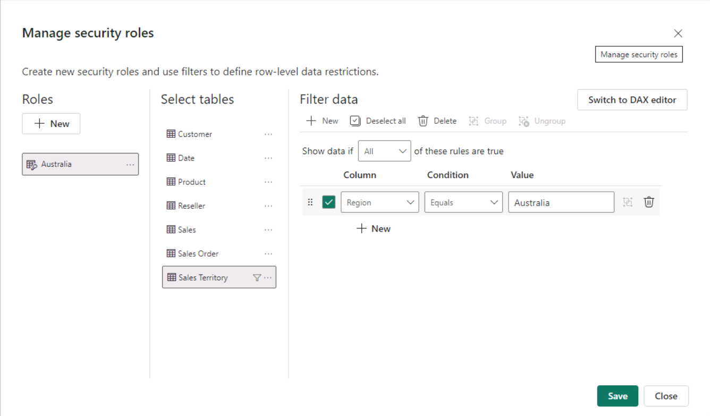

---
lab:
  title: Aplicar la seguridad del modelo semántico
  module: Design and build tabular models
---

# Aplicación de seguridad de los modelos

En este ejercicio, actualizará un modelo de datos previamente desarrollado para obligar al uso de la seguridad. En concreto, los vendedores de la empresa Adventure Works solo deben poder ver los datos de ventas relacionados con su región de ventas asignada.

En este ejercicio aprenderá a hacer lo siguiente:

- Creación de roles estáticos.
- Creación de roles dinámicos.
- Validación de roles.
- Asigne entidades de seguridad a roles de modelo semántico.

Este laboratorio se realiza en **45** minutos aproximadamente.

> **Nota**: Necesitará una [evaluación gratuita de Microsoft Fabric](https://learn.microsoft.com/fabric/get-started/fabric-trial) para realizar este ejercicio.

## Introducción

En este ejercicio prepararás el entorno.

### Descarga del archivo de inicio de Power BI

1. Descargue el [archivo de inicio de Análisis de ventas](https://aka.ms/fabric-security-starter) de `https://aka.ms/fabric-security-starter` y guárdelo en el equipo local (en cualquier carpeta).

1. Vaya al archivo descargado y ábralo en Power BI Desktop.

1. Cuando se le solicite, inicie sesión con una cuenta profesional o educativa.

### Inicio de sesión en el servicio Power BI

En esta tarea iniciarás sesión en el servicio Power BI, iniciarás una licencia de prueba y crearás un área de trabajo.

1. En un explorador web, vaya a `https://app.powerbi.com/`.

2. Complete el proceso de inicio de sesión con la misma cuenta que se usa en Power BI Desktop.

    *Importante: debes usar las mismas credenciales que se usan para iniciar sesión desde Power BI Desktop.*

    *Sugerencia: la experiencia del explorador web de Power BI se conoce como el **servicio Power BI**.*

### Creación de un área de trabajo

En esta tarea crearás un área de trabajo.

1. En el servicio de Power BI, para crear un área de trabajo, en el panel **Navegación** (situado a la izquierda), seleccione **Áreas de trabajo** y, a continuación, **+ Nueva área de trabajo**.

2. En el panel **Crear un área de trabajo** (situado en la parte derecha), en el cuadro **Nombre**, escriba un nombre para el área de trabajo.

    *El nombre debe ser único dentro del inquilino.*

3. Seleccione **Aplicar**.

    *Una vez creado, se abre el área de trabajo. En un ejercicio posterior, publicará un modelo semántico en esta área de trabajo.*

### Revisión del modelo de datos

En esta tarea revisarás el modelo de datos.

1. En Power BI Desktop, en la parte izquierda, cambia a la vista **Modelo**.

    

2. Usa el diagrama de modelos para revisar el diseño del modelo.

    

    *El modelo consta de seis tablas de dimensiones y una tabla de hechos. La tabla de hechos **Ventas** almacena los detalles del pedido de venta. Es un diseño de esquema de estrella clásico.*

3. Expande la tabla **Territorio de ventas**.

    

4. Observa que la tabla incluye una columna **Región**.

    *La columna **Región** almacena las regiones de ventas de Adventure Works. En esta organización, los vendedores solo pueden ver datos relacionados con su región de ventas asignada. En este laboratorio, implementarás dos técnicas de seguridad de nivel de fila diferentes para aplicar permisos de datos.*

## Creación de roles estáticos

En este ejercicio, creará y validará roles estáticos y, después, verá cómo asignaría entidades de seguridad a los roles de modelo semántico.

### Creación de roles estáticos

En esta tarea crearás dos roles estáticos.

1. Cambie a la vista **Informe**.

    

2. En el objeto visual de gráfico de columnas apiladas, en la leyenda, observa (por ahora) que es posible ver muchas regiones.

    

    *Por ahora, el gráfico está demasiado abarrotado. Esto se debe a que todas las regiones son visibles. Cuando la solución aplique la seguridad de nivel de fila, el consumidor del informe verá solo una región.*

3. Para añadir un rol de seguridad, en la ficha de cinta **Modelado**, desde dentro del grupo **Seguridad**, selecciona **Administrar roles**.

    

4. En la ventana **Administrar roles**, selecciona **Crear**.

    

5. Para asignar un nombre al rol, reemplaza el texto seleccionado por **Australia** y presiona **Entrar**.

    

6. En la lista **Tablas**, para la tabla **Territorio de ventas**, selecciona los puntos suspensivos y luego selecciona **Agregar filtro** > **[Región]**.

    

7. En el cuadro **Expresión DAX de filtro de tabla**, reemplaza **Valor** por **Australia**.

    

    *Esta expresión filtra la columna **Región** por el valor **Australia**.*

8. Para crear otro rol, presiona **Crear**.

    

9. Repite los pasos de esta tarea para crear un rol denominado **Canadá** que filtre la columna **Región** por **Canadá**.

    

    *En este laboratorio crearás solo los dos roles. Ten en cuenta, sin embargo, que en una solución real, se debe crear un rol para cada una de las 11 regiones de Adventure Works.*

10. Seleccione **Guardar**.

    

### Validación de los roles estáticos

En esta tarea validarás uno de los roles estáticos.

1. En la ficha de cinta **Modelado**, desde dentro del grupo **Seguridad**, selecciona **Ver como**.

    

2. En la ventana **Ver como roles**, selecciona el rol **Australia**.

    

3. Seleccione **Aceptar**.

    

4. En la página del informe observa que el objeto visual de gráfico de columnas apiladas muestra solo los datos de Australia.

    

5. En la parte superior del informe observa el banner amarillo que confirma el rol aplicado.

    

6. Para dejar de ver con el rol, a la derecha del banner amarillo, selecciona **Detener la visualización**.

    

### Publicar el informe

En esta tarea, publicará el informe.

1. Guarde el archivo de Power BI Desktop. Cuando se le pida que aplique los cambios pendientes, seleccione **Aplicar más tarde**.

    

2. Para publicar el informe, en la ficha de cinta **Inicio**, selecciona **Publicar**.

    

3. En la ventana **Publicar en Power BI**, selecciona el área de trabajo y luego **Seleccionar**.

    

4. Cuando la publicación se haya realizado correctamente, selecciona **Entendido**.

    

### Configuración de la seguridad de nivel de fila (*opcional*)

En esta tarea verás cómo configurar la seguridad de nivel de fila en el servicio Power BI.

Esta tarea se basa en la existencia de un grupo de seguridad **Salespeople_Australia** en el inquilino en el que trabajas. Este grupo de seguridad NO existe automáticamente en el inquilino. Si tienes permisos en el inquilino, puedes seguir los pasos que se indican abajo. Si usas un inquilino proporcionado para el aprendizaje, no tendrás los permisos adecuados para crear grupos de seguridad. Lee las tareas, pero ten en cuenta que no podrás completarlas debido a que no existe el grupo de seguridad. **Después de leer el material, continúa con la tarea Limpieza.**

1. Cambia al servicio Power BI (explorador web).

2. En la página de aterrizaje del área de trabajo, observe el modelo semántico **Análisis de ventas: aplicar la seguridad del modelo**.

    

3. Mantenga el cursor sobre el modelo semántico y, cuando aparezcan los puntos suspensivos, seleccione los puntos suspensivos y, a continuación, seleccione **Seguridad**.

    

    *La opción **Seguridad** admite la asignación de entidades de seguridad de Microsoft Azure Active Directory (Azure AD), que incluye grupos de seguridad y usuarios.*

4. A la izquierda, observa la lista de roles y que **Australia** está seleccionada.

    

5. En el cuadro **Miembros**, comienza a escribir **Salespeople_Australia**.

    *Los pasos 5 a 8 son solo para fines de demostración, ya que dependen de la creación o existencia de un grupo de seguridad de Salespeople_Australia. Si tienes permisos y conocimientos para crear grupos de seguridad, no dudes en continuar. De lo contrario, sigue con la tarea Limpieza.*

    

6. Seleccione **Agregar**.

    

7. Para completar la asignación de roles, selecciona **Guardar**.

    

    *Ahora todos los miembros del grupo de seguridad **Salespeople_Australia** se asignan al rol de **Australia**, lo que restringe el acceso a los datos para ver solo las ventas australianas.*

    *En una solución real, cada rol debe asignarse a un grupo de seguridad.*

    *Este enfoque de diseño es sencillo y eficaz cuando existen grupos de seguridad para cada región. Sin embargo, tiene desventajas: requiere más esfuerzo para crearlo y configurarlo. También requiere actualizar y volver a publicar el modelo semántico cuando se incorporan nuevas regiones.*

    *En el ejercicio siguiente, crearás un rol dinámico controlado por datos. Este enfoque de diseño puede ayudar a solucionar estas desventajas.*

8. Para volver a la página de aterrizaje del área de trabajo, en el panel **Navegación**, selecciona el área de trabajo.

### Limpiar la solución

En esta tarea, limpiará la solución quitando el modelo semántico y los roles de modelo.

1. Para quitar el modelo semántico, mantenga el cursor sobre el modelo semántico y, cuando aparezcan los puntos suspensivos, seleccione los puntos suspensivos y, a continuación, seleccione **Eliminar**.

    

    *Volverá a publicar un modelo semántico revisado en el ejercicio siguiente.*

2. Cuando se le pida que confirme la eliminación, seleccione **Eliminar**.

    

3. Cambiar a Power BI Desktop.

4. Para quitar los roles de seguridad, en la ficha de cinta **Modelado**, desde dentro del grupo **Seguridad**, selecciona **Administrar roles**.

    

5. En la ventana **Administrar roles**, para quitar el primer rol, selecciona **Eliminar**.

    

6. Cuando se te pida que confirmes la eliminación, presiona **Sí, eliminar**.

    

7. Quita también el segundo rol.

8. Seleccione **Guardar**.

    

## Creación de un rol dinámico

En este ejercicio, agregará una tabla al modelo, creará y validará un rol dinámico y, a continuación, asignará una entidad de seguridad al rol de modelo semántico.

### Agregación de la tabla de vendedores

En esta tarea agregarás la tabla **Vendedor** al modelo.

1. Cambia a la vista **Modelo**.

    

2. En la ficha de cinta **Inicio**, dentro del grupo **Consultas**, selecciona el icono **Transformar datos**.

    

    *Si se te pide que especifiques cómo conectarte, selecciona **Editar credenciales** y especifica cómo iniciar sesión.*

    

    *Selecciona **Conectar***

     

    *En la página **Compatibilidad con el cifrado**, seleccione **Aceptar**.*

3. En la ventana **Editor de Power Query**, en el panel **Consultas** (ubicado a la izquierda), haz clic con el botón derecho en la consulta **Cliente** y después selecciona **Duplicar**.

    

    *Dado que la consulta **Cliente** ya incluye pasos para conectar el almacenamiento de datos, duplicarlo es una manera eficaz de comenzar el desarrollo de una nueva consulta.*

4. En el panel **Configuración de la consulta** (situado a la derecha), en el cuadro **Nombre**, reemplaza el texto por **Vendedor**.

    

5. En la lista **Pasos aplicados**, haz clic con el botón derecho en el paso **Quitar otras columnas** (tercer paso) y después selecciona **Eliminar hasta el final**.

    

6. Cuando se te pida que confirmes la eliminación, selecciona **Eliminar**.

    

7. Para obtener datos de una tabla de almacenamiento de datos diferente, en la lista **Pasos aplicados**, en el paso **Navegación** (segundo paso), selecciona el icono de engranaje (ubicado a la derecha).

    

8. En la ventana **Navegación**, selecciona la tabla **DimEmployee**.

    

9. Seleccione **Aceptar**.

    

10. Para quitar columnas innecesarias, en la ficha de cinta **Inicio**, desde dentro del grupo **Administrar columnas**, selecciona el icono **Elegir columnas**.

    

11. En la ventana **Elegir columnas**, desactiva el elemento **(Seleccionar todas las columnas)**.

    

12. Cambia las tres columnas siguientes:

    - EmployeeKey

    - SalesTerritoryKey

    - EmailAddress

13. Seleccione **Aceptar**.

    

14. Para cambiar el nombre de la columna **EmailAddress**, haz doble clic en el encabezado de columna **EmailAddress**.

15. Reemplaza el texto por **UPN** y luego presiona **Entrar**.

    *UPN es un acrónimo de Nombre principal de usuario. Los valores de esta columna coinciden con los nombres de cuenta de Azure AD.*

    

16. Para cargar la tabla en el modelo, en la ficha de cinta **Inicio**, selecciona el icono **Cerrar &amp; Aplicar**.

    

17. Cuando la tabla se haya agregado al modelo, observa que se creó automáticamente una relación con la tabla **Territorio de ventas**.

### Configuración de la relación

En esta tarea configurarás las propiedades de la nueva relación.

1. Haz clic con el botón derecho en la relación entre las tablas **Vendedor** y **Territorio de ventas**, y luego selecciona **Propiedades**.

    

2. En la ventana **Editar relación**, en la lista desplegable **Dirección del filtro cruzado**, seleccione **Ambos**.

3. Active la casilla **Aplicar filtro de seguridad en ambas direcciones**.

    

    *Dado que hay una relación uno a varios de la tabla **Territorio de ventas** a la tabla **Vendedor**, los filtros se propagan solo desde la tabla **Territorio de ventas** a la tabla **Vendedor**. Para forzar la propagación en la otra dirección, la dirección del filtro cruzado debe establecerse en ambos.*

4. Seleccione **Aceptar**.

    

5. Para ocultar la tabla, en la parte superior derecha de la tabla **Vendedor**, selecciona el icono de ojo.

    

    *El propósito de la tabla **Vendedor** es aplicar permisos de datos. Cuando se oculta, los autores de informes y la experiencia de preguntas y respuestas no verán la tabla ni sus campos.*

### Creación de un rol dinámico

En esta tarea crearás un rol dinámico, que aplica permisos basados en los datos del modelo.

1. Cambie a la vista **Informe**.

    

2. Para añadir un rol de seguridad, en la ficha de cinta **Modelado**, desde dentro del grupo **Seguridad**, selecciona **Administrar roles**.

    

3. En la ventana **Administrar roles**, selecciona **Crear**.

    

4. Para asignar un nombre al rol, reemplaza el texto seleccionado por **Vendedor**.

    

    *Esta vez, solo se debe crear un rol.*

5. Agrega un filtro a la columna **UPN** de la tabla **Vendedor**.

    

6. En el cuadro **Expresión DAX de filtro de tabla** reemplace **"Valor"** por `USERPRINCIPALNAME()`.

    

    *Esta expresión filtra la columna **UPN** por la función USERPRINCIPALNAME, que devuelve el nombre principal de usuario (UPN) del usuario autenticado.*

    *Cuando el UPN filtra la tabla **Vendedor**, filtra la tabla **Territorio de ventas**, que a su vez filtra la tabla **Ventas**. De este modo, el usuario autenticado solo verá los datos de ventas de su región asignada.*

7. Seleccione **Guardar**.

    

### Validación del rol dinámico

En esta tarea validarás el rol dinámico.

1. En la ficha de cinta **Modelado**, desde dentro del grupo **Seguridad**, selecciona **Ver como**.

    

2. En la ventana **Ver como roles**, active **Otro usuario** y, a continuación, en el cuadro correspondiente, escriba: `michael9@adventure-works.com`.

    

    *Con fines de prueba, **Otro usuario** es el valor que devolverá la función USERPRINCIPALNAME. Ten en cuenta que este vendedor está asignado a la región **Noreste**.*

3. Compruebe el rol **Salespeople**.

    

4. Seleccione **Aceptar**.

    

5. En la página del informe observa que el objeto visual de gráfico de columnas apiladas muestra solo los datos de Noreste.

    

6. En la parte superior del informe observa el banner amarillo que confirma el rol aplicado.

    

7. Para dejar de ver con el rol, a la derecha del banner amarillo, selecciona **Detener la visualización**.

    

### Finalización del diseño

En esta tarea, finalizarás el diseño publicando el informe y asignando un grupo de seguridad al rol.

*Los pasos de esta tarea son deliberadamente breves. Para obtener detalles completos de los pasos, consulta los pasos de tarea del ejercicio anterior.*

1. Guarde el archivo de Power BI Desktop.

2. Publica el informe en el área de trabajo que creaste al principio del laboratorio.

3. Cierre Power BI Desktop.

4. Cambia al servicio Power BI (explorador web).

5. Vaya a la configuración de seguridad del modelo semántico **Análisis de ventas: aplicar la seguridad del modelo**.

6. Asigna el grupo de seguridad **Vendedores** al rol **Vendedores**.

    

    *Ahora todos los miembros del grupo de seguridad **Vendedores** se asignan al rol **Vendedores**. Siempre y cuando el usuario autenticado se representa mediante una fila de la tabla **Vendedor**, el territorio de ventas asignado se usará para filtrar la tabla de ventas.*

    *Este enfoque de diseño es sencillo y eficaz cuando el modelo de datos almacena los valores de nombre principal de usuario. Cuando se agregan o quitan vendedores, o se asignan a diferentes territorios de ventas, este enfoque de diseño simplemente funcionará.*
