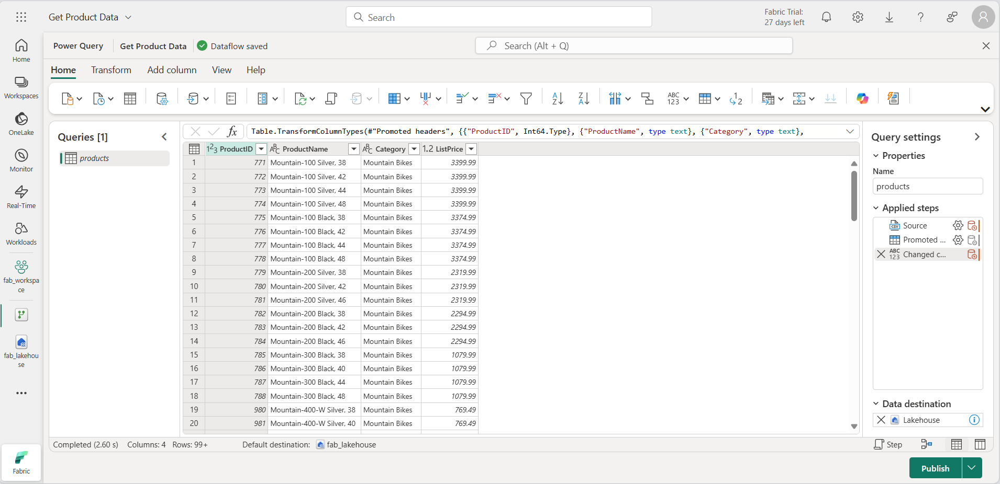
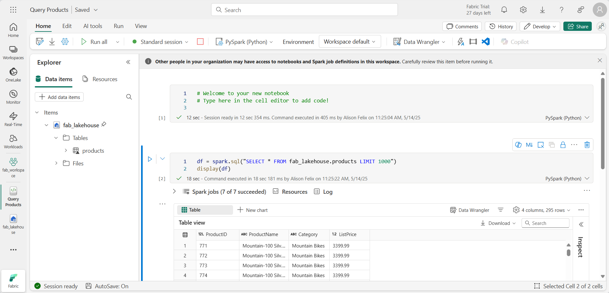
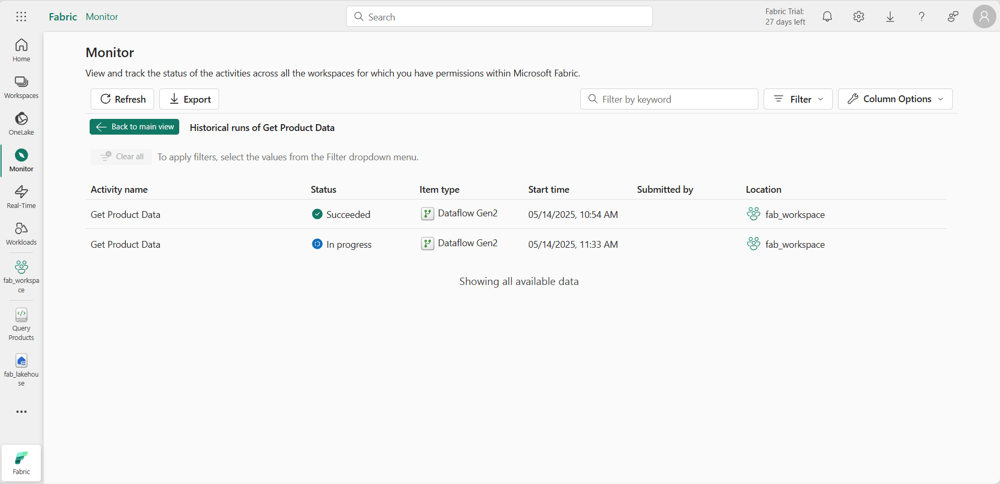

---
lab:
  title: Supervisión de la actividad de Fabric en el centro de supervisión
  module: Monitoring Fabric
---

# Supervisión de la actividad de Fabric en el centro de supervisión

El *centro de supervisión* de Microsoft Fabric proporciona un lugar central donde puedes supervisar la actividad. Puedes usar el centro de supervisión para revisar eventos relacionados con los elementos que tienes permiso para ver.

Este laboratorio se realiza en unos **30** minutos.

> **Nota**: para completar este ejercicio, necesitas acceder a un [inquilino de Microsoft Fabric](https://learn.microsoft.com/fabric/get-started/fabric-trial).

## Creación de un área de trabajo

Antes de trabajar con datos de Fabric, crea un área de trabajo en un inquilino con la capacidad de Fabric habilitada.

1. En un explorador, ve a la [página principal de Microsoft Fabric](https://app.fabric.microsoft.com/home?experience=fabric) en `https://app.fabric.microsoft.com/home?experience=fabric` e inicia sesión con tus credenciales de Fabric.
1. En la barra de menús de la izquierda, seleccione **Áreas de trabajo** (el icono tiene un aspecto similar a &#128455;).
1. Cree una nueva área de trabajo con el nombre que prefiera y seleccione un modo de licencia en la sección **Avanzado** que incluya la capacidad de Fabric (*Prueba*, *Premium* o *Fabric*).
1. Cuando se abra la nueva área de trabajo, debe estar vacía.

    

## Crear un almacén de lago

Ahora que tienes un área de trabajo, es el momento de crear un almacén de lago de datos para tus datos.

1. En la barra de menús de la izquierda, selecciona **Crear**. En la página *Nuevo*, en la sección *Ingeniería de datos*, selecciona **Almacén de lago de datos**. Asígnale un nombre único que elijas.

    >**Nota**: si la opción **Crear** no está anclada a la barra lateral, primero debes seleccionar la opción de puntos suspensivos (**...**).

    Después de un minuto o así, se habrá creado un nuevo almacén de lago:

    

1. Mira el nuevo almacén de lago y ten en cuenta que el panel **Explorador del almacén de lago** de la izquierda te permite examinar las tablas y los archivos del almacén de lago:

    Actualmente, no hay tablas ni archivos en el almacén de lago.

## Creación y supervisión de un flujo de datos

En Microsoft Fabric, puedes usar un flujo de datos (Gen2) para ingerir datos de una amplia gama de orígenes. En este ejercicio, usarás un flujo de datos para obtener datos de un archivo CSV y cargarlos en una tabla en tu almacén de lago de datos.

1. En la página **Inicio** de tu almacén de lago de datos, en el menú **Obtener datos**, selecciona **Nuevo flujo de datos Gen2**.

   Se crea y abre un nuevo flujo de datos denominado **Flujo de datos 1**.

    

1. En la parte superior izquierda de la página de flujo de datos, selecciona **Flujo de datos 1** para ver sus detalles y cambia el nombre del flujo de datos a **Obtener datos del producto**.
1. En el nuevo diseñador de flujo de datos, selecciona **Importar desde un archivo de texto/CSV**. Después, completa el asistente para obtener datos para crear una conexión de datos mediante la vinculación a `https://raw.githubusercontent.com/MicrosoftLearning/dp-data/main/products.csv` con autenticación anónima. Cuando hayas completado el asistente, se mostrará una vista previa de los datos en el diseñador de flujo de datos similar a la siguiente:

    

1. Publicar el flujo de datos.
1. En la barra de navegación de la izquierda, selecciona **Supervisar** para ver el centro de supervisión y comprueba que tu flujo de datos está en curso (si no es así, actualiza la vista hasta que la veas).

    

1. Espera unos segundos y actualiza la página hasta que el estado del flujo de datos sea **Correcto**.
1. En el panel de navegación, selecciona tu instancia almacén de lago de datos. A continuación, expande la carpeta **Tablas** para comprobar que el flujo de datos ha creado y cargado una tabla denominada **products** (es posible que tengas que actualizar la carpeta **Tablas**).

    

## Creación y supervisión de un cuaderno de Spark

En Microsoft Fabric, puedes usar cuadernos para ejecutar código de Spark.

1. En el centro de navegación, selecciona **Inicio**. En la página principal de Ingeniería de datos, crea un nuevo **cuaderno**.

    Se creará y se abrirá un nuevo cuaderno denominado **Notebook 1**.

    

1. En la parte superior izquierda de la libreta, selecciona **Cuaderno de notas 1** para ver sus detalles y cambia su nombre a **Consultar productos**.
1. En el editor de cuaderno, en el panel **Explorador**, selecciona **Lakehouses** y agrega el almacén de lago de datos que creaste anteriormente.
1. En el menú **...** de la tabla **Products**, selecciona **Cargar datos** > **Spark**. Esto agrega una nueva celda de código al cuaderno, como se muestra aquí:

    

1. Usa el botón **&#9655; Ejecutar todo** para ejecutar todas las celdas del cuaderno. Tardará un momento en iniciar la sesión de Spark y, a continuación, los resultados de la consulta se mostrarán en la celda de código.

    

1. En la barra de herramientas, usa el botón **&#9723;** (*Detener sesión*) para detener la sesión de Spark.
1. En la barra de navegación, selecciona **Supervisar** para ver el centro de supervisión y observa que aparece la actividad del cuaderno.

    

## Supervisión del historial de un elemento

Es posible que algunos elementos de un área de trabajo se ejecuten varias veces. Puedes usar el centro de supervisión para ver la ejecución de su historial.

1. En la barra de navegación, vuelve a la página de tu área de trabajo. A continuación, usa el botón **&#8635;** (*Actualizar ahora*) de tu flujo de datos **Obtener datos del producto** para volver a ejecutarlo.
1. En el panel de navegación, selecciona la página **Supervisión** para ver el centro de supervisión y comprueba que el flujo de datos está en curso.
1. En el menú **...** del flujo de datos **Obtener datos del producto**, selecciona **Ejecuciones históricas ** para ver el historial de ejecución del flujo de datos:

    

1. En el menú **...** de cualquiera de las ejecuciones históricas, selecciona **Ver detalles** para ver los detalles de la ejecución.
1. Cierra el panel **Detalles** y usa el botón **Volver a la vista principal** para volver a la página principal del centro de supervisión.

## Personalización de las vistas del centro de supervisión

En este ejercicio, solo has ejecutado algunas actividades, por lo que debe ser bastante fácil encontrar eventos en el centro de supervisión. Sin embargo, en un entorno real es posible que tengas que buscar en un gran número de eventos. El uso de filtros y otras personalizaciones de vista puede facilitar este proceso.

1. En el centro de supervisión, usa el botón **Filtrar** para aplicar el siguiente filtro:
    - **Estado**: Correcto
    - **Tipo de elemento**: Flujo de datos Gen2

    Con el filtro aplicado, solo se muestran ejecuciones correctas de flujos de datos.

    

1. Usa el botón **Opciones de columna** para incluir las columnas siguientes en la vista (usa el botón **Aplicar** para aplicar los cambios):
    - Nombre de la actividad
    - Estado
    - Tipo de elemento
    - Hora de inicio
    - Enviado por
    - Location
    - Hora de finalización
    - Duración
    - Tipo de actualización

    Es posible que debas desplazarte horizontalmente para ver estas columnas:

    

## Limpieza de recursos

En este ejercicio, has creado una instancia de almacén de lago de datos, un flujo de datos y un cuaderno de Spark; y has usado el centro de supervisión para ver la actividad del elemento.

Si ha terminado de explorar el almacén de lago, puede eliminar el área de trabajo que ha creado para este ejercicio.

1. En la barra de la izquierda, seleccione el icono del área de trabajo para ver todos los elementos que contiene.
2. En el menú **...** de la barra de herramientas, selecciona **Configuración del área de trabajo**.
3. En la sección **General**, selecciona **Quitar esta área de trabajo**.
