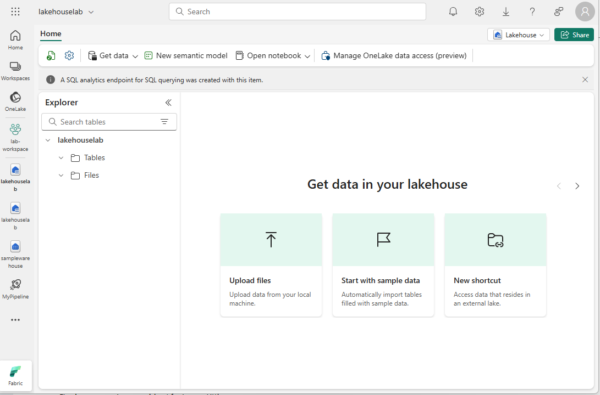

---
lab:
  title: Acceso seguro a los datos en Microsoft Fabric
  module: Secure data access in Microsoft Fabric
---

# Acceso seguro a los datos en Microsoft Fabric

Microsoft Fabric ofrece un modelo de seguridad de varias capas para administrar el acceso a datos. La seguridad se puede establecer para todo un área de trabajo, para elementos individuales o mediante permisos pormenorizados en cada motor de Fabric. En este ejercicio, protegerás los datos mediante el área de trabajo y los controles de acceso a elementos y los roles de acceso a datos de OneLake.

Este laboratorio se realiza en **45** minutos aproximadamente.

## Creación de un área de trabajo

Antes de trabajar con datos de Fabric, crea un área de trabajo con la evaluación gratuita de Fabric habilitada.

1. En un explorador, ve a la [página principal de Microsoft Fabric](https://app.fabric.microsoft.com/home?experience=fabric) en `https://app.fabric.microsoft.com/home?experience=fabric` e inicia sesión con tus credenciales de Fabric.
1. En la barra de menús de la izquierda, selecciona **Áreas de trabajo** (el icono tiene un aspecto similar a &#128455;).
1. Crea una nueva área de trabajo con el nombre que prefieras y selecciona un modo de licencia que incluya capacidad de Fabric (*Evaluación gratuita*, *Premium* o *Fabric*).
1. Cuando se abra la nueva área de trabajo, debe estar vacía.

    

> **Nota**: al crear un área de trabajo, te conviertes automáticamente en miembro del rol de administrador del área de trabajo.

## Creación del almacenamiento de datos

A continuación, crearás un almacenamiento de datos en el área de trabajo que has creado:

1. Haz clic en **+ Nuevo elemento**. En la página *Nuevo elemento*, en la sección *Almacenar datos*, selecciona **Almacén de muestra** y crea un nuevo almacenamiento de datos con el nombre que prefieras.

     Al cabo de un minuto más o menos, se creará un nuevo almacén:

    

## Creación de un almacén de lago
A continuación, crearás un almacén de lago en el área de trabajo que has creado.

1. En la barra de menús de la izquierda, selecciona **Áreas de trabajo** (el icono tiene un aspecto similar a 🗇).
2. Selecciona el área de trabajo que creaste.
3. En el área de trabajo, selecciona el botón **+ Nuevo elemento** y, a continuación, selecciona **Almacén de lago**. Crea un nuevo almacén de lago con el nombre que prefieras.

   Después de un minuto o así, se habrá creado un nuevo almacén de lago:

    

4. Selecciona el icono **Iniciar con datos de ejemplo** y, a continuación, selecciona el ejemplo **Días festivos públicos**. Después de un minuto o así, el almacén de lago se rellenará con datos.

## Aplicación del control de acceso al área de trabajo

Los roles de área de trabajo se usan para controlar el acceso a las áreas de trabajo y a su contenido. Los roles de área de trabajo se pueden asignar cuando los usuarios necesitan ver todos los elementos de un área de trabajo, cuando necesiten administrar el acceso al área de trabajo o crear nuevos elementos de Fabric, o cuando necesiten permisos específicos para ver, modificar o compartir contenido en el área de trabajo.  

En este ejercicio, agregarás un usuario a un rol de área de trabajo, aplicarás permisos y verás lo que se puede ver cuando se aplica cada conjunto de permisos. Abre dos exploradores e inicia sesión como usuarios diferentes. En un explorador, serás un **administrador del área de trabajo** y, en el otro, iniciarás sesión como segundo usuario con menos privilegios. En un explorador, el administrador del área de trabajo cambiará los permisos del segundo usuario y, en el segundo explorador, podrás ver los efectos de cambiar los permisos.  

1. En la barra de menús de la izquierda, selecciona **Áreas de trabajo** (el icono tiene un aspecto similar a &#128455;).
2. Luego selecciona el área de trabajo que has creado.
3. En la parte superior de la pantalla, selecciona **Administrar acceso**.

> **Nota**: verás el usuario con el que has iniciado sesión, que es miembro del rol **Administrador del área de trabajo** porque creaste el área de trabajo. Todavía no se asigna acceso a ningún otro usuario al área de trabajo.

4. A continuación, verás lo que puede ver un usuario sin permisos en el área de trabajo. En el explorador, abre una ventana InPrivate. En el explorador Microsoft Edge, selecciona los puntos suspensivos en la esquina superior derecha y selecciona **Nueva ventana InPrivate**.
5. Escribe https://app.fabric.microsoft.com e inicia sesión como el segundo usuario que usarás para realizar pruebas.  
6. En la esquina inferior izquierda de la pantalla, selecciona **Microsoft Fabric** y, a continuación, selecciona **Almacenamiento de datos**. A continuación, selecciona **Áreas de trabajo** (el icono tiene un aspecto similar a &#128455;).  

> **Nota:** el segundo usuario no tendrá acceso al área de trabajo, por lo que no se podrá ver.

7. A continuación, asigna el rol **Espectador de área de trabajo** al segundo usuario y observa que el rol concede acceso de lectura al almacén en el área de trabajo.  
8. Vuelve a la ventana del explorador en la que has iniciado sesión como administrador del área de trabajo. Asegúrate de que sigues en la página que muestra el área de trabajo que has creado. Debes tener los nuevos elementos del área de trabajo y el almacén de ejemplo y el almacén de lago, que se muestran en la parte inferior de la página.
9. Selecciona **Administrar acceso** en la parte superior derecha de la pantalla.
10. Selecciona **Agregar personas o grupos**. Escribe el correo electrónico del segundo usuario con el que estás probando. Selecciona **Agregar** para asignar el usuario al rol **Espectador** del área de trabajo. 
11. Vuelve a la ventana del explorador InPrivate donde has iniciado sesión como segundo usuario y selecciona el botón Actualizar en el explorador para actualizar los permisos de sesión asignados al segundo usuario.
12. Selecciona el icono **Áreas de trabajo** de la barra de menús de la izquierda (el icono tiene un aspecto similar a &#128455;) y selecciona el nombre del área de trabajo que creaste como usuario administrador del área de trabajo. El segundo usuario ahora puede ver todos los elementos del área de trabajo porque se les asignó el rol **Espectador de área de trabajo**.

    

13. Selecciona el almacén y ábrelo.
14. Selecciona la tabla **Date** y espera a que se carguen las filas. Puedes ver las filas porque como miembro del rol Espectador de área de trabajo tienes el permiso CONNECT y ReadData en las tablas del almacén. Para obtener más información sobre los permisos concedidos al rol Espectador de área de trabajo, consulta [Roles de área de trabajo](https://learn.microsoft.com/en-us/fabric/data-warehouse/workspace-roles).
15. A continuación, selecciona el icono **Áreas de trabajo** de la barra de menú de la izquierda y, después, selecciona el almacén de lago.
16. Cuando se abra el almacén de lago, haz clic en el cuadro desplegable situado en la esquina superior derecha de la pantalla que indica **Almacén de lago** y selecciona **Punto de conexión de SQL Analytics**.
17. Selecciona la tabla **publicholidays** y espera a que se muestren los datos. Los datos de la tabla de almacén de lago se pueden leer desde el punto de conexión de SQL Analytics porque el usuario es miembro del rol Espectador de área de trabajo que concede permisos de lectura en el punto de conexión de SQL Analytics.

## Aplicación del control de acceso a elementos

Los permisos de elemento controlan el acceso a elementos individuales de Fabric dentro de un área de trabajo, como almacenes, almacenes, almacenes de lago y modelos semánticos. En este ejercicio, quitarás los permisos de **Espectador del área de trabajo** aplicados en el ejercicio anterior y, después, aplicarás permisos de nivel de elemento en el almacén para que un usuario con menos privilegios solo pueda ver los datos del almacén, no los datos del almacén de lago.

1. Vuelve a la ventana del explorador donde has iniciado sesión como administrador del área de trabajo. Selecciona **Áreas de trabajo** en el panel de navegación izquierdo. 
2. Selecciona el área de trabajo que has creado para abrirla.
3. En la parte superior de la pantalla, selecciona **Administrar acceso**.
4. Selecciona la palabra **Espectador** en el nombre del segundo usuario. En el menú que aparece, selecciona **Quitar**.

   

5. Cierra la sección **Administrar acceso**.
6. En el área de trabajo, mantén el puntero sobre el nombre del almacén y aparecerán unos puntos suspensivos (**...**). Selecciona los puntos suspensivos ... y, después, selecciona **Administrar permisos**.

7. Selecciona **Agregar usuario** y escribe el nombre del segundo usuario. 
8. En el cuadro que aparece, en **Permisos adicionales**, activa **Leer todos los datos mediante SQL (ReadData)** y desactiva todas las demás casillas.

    

9. Seleccionar **Conceder**

10. Vuelve a la ventana del explorador donde has iniciado sesión como segundo usuario. Actualiza la vista del explorador.  

11. El segundo usuario ya no tiene acceso al área de trabajo y, en su lugar, solo tiene acceso al almacén. Ya no puedes examinar áreas de trabajo en el panel de navegación izquierdo para encontrar el almacén. Selecciona **OneLake** en el menú de navegación izquierdo para encontrar el almacén. 

12. Selecciona el almacén. En la pantalla que aparece, selecciona **Abrir** en la barra de menú superior.

13. Cuando aparezca la vista de almacén, selecciona la tabla **Date** para ver los datos de la tabla. Las filas son visibles porque el usuario todavía tiene acceso de lectura al almacén porque se aplicaron permisos ReadData mediante permisos de elemento en el almacén.

## Aplicación de roles de acceso a datos de OneLake en un almacén de lago

Los roles de acceso a datos de OneLake te permiten crear roles personalizados en un almacén de lago y conceder permisos de lectura a las carpetas que especifiques. Los roles de acceso a datos de OneLake son actualmente una característica en versión preliminar.

En este ejercicio, asignarás un permiso de elemento y crearás un rol de acceso a datos de OneLake. Además, descubrirás cómo funcionan conjuntamente para restringir el acceso a los datos de un almacén de lago.  

1. Permanece en el explorador donde has iniciado sesión como segundo usuario.  
2. Selecciona **OneLake** en la barra de navegación del lado izquierdo. El segundo usuario no ve el almacén de lago.  
3. Vuelve al explorador donde has iniciado sesión como administrador del área de trabajo.
4. Selecciona **Áreas de trabajo** en el menú izquierdo y selecciona tu área de trabajo. Mantén el puntero sobre el nombre del almacén de lago.  
5. Selecciona en los puntos suspensivos (**...**) a la derecha de los puntos suspensivos y selecciona **Administrar permisos**

      

6. En la pantalla que aparece, selecciona **Agregar usuario**. 
7. Asigna el segundo usuario al almacén de lago y asegúrate de que ninguna de las casillas de la ventana **Conceder acceso a personas** esté activada.  

      

8. Selecciona **Conceder**. El segundo usuario ahora tiene permisos de lectura en el almacén de lago. El permiso de lectura solo permite al usuario ver los metadatos del almacén de lago, pero no los datos subyacentes. A continuación, validaremos esto.
9. Vuelve al explorador donde has iniciado sesión como segundo usuario. Actualiza el explorador.
10. Selecciona **OneLake** en el menú de navegación izquierdo.  
11. Selecciona el almacén de lago y ábrelo. 
12. Selecciona **Abrir** en la barra de menú superior. No puedes expandir las tablas o archivos aunque se haya concedido permiso de lectura. A continuación, concede al segundo usuario acceso a una carpeta específica mediante permisos de acceso a datos de OneLake.
13. Vuelve al explorador donde has iniciado sesión como administrador del área de trabajo.
14. Selecciona la página **Áreas de trabajo** en la barra de navegación izquierda.
15. Selecciona el nombre del área de trabajo.
16. Selecciona el almacén de lago.
1. Cuando se abra el almacén de lago, selecciona **Administrar el acceso a datos de OneLake** en la barra de menú superior y habilita la característica haciendo clic en el botón **Continuar**.

      

14. Selecciona nuevo rol en la pantalla **Administrar el acceso a datos de OneLake (versión preliminar)** que aparece.
  
      

15. Crea un nuevo rol denominado **publicholidays** que solo pueda acceder a la carpeta publicholidays, como se muestra en la captura de pantalla siguiente.

      

16. Cuando el rol termine de crearse, selecciona **Asignar rol** y asigna el rol al segundo usuario, selecciona **Agregar** y, luego, **Guardar**.
 
       

17. Vuelve al explorador donde has iniciado sesión como segundo usuario. Asegúrate de que todavía estás en la página donde está abierto el almacén de lago. Actualiza el explorador.  
18. Selecciona la tabla **publicholidays** y espera a que se carguen los datos. Solo los datos de la tabla publicholidays son accesibles para el usuario porque el usuario se asignó al rol personalizado de acceso a datos de OneLake. El rol les permite ver solo los datos de la tabla publicholidays, no los datos de ninguna de las otras tablas, archivos o carpetas.

## Limpieza de recursos

En este ejercicio, has protegido los datos mediante controles de acceso al área de trabajo, controles de acceso a elementos y roles de acceso a datos de OneLake.

1. En la barra de navegación izquierda, selecciona el icono del área de trabajo para ver todos los elementos que contiene.
2. En el menú de la barra de herramientas superior, selecciona **Configuración del área de trabajo**.
3. En la sección **General**, selecciona **Quitar esta área de trabajo**.
