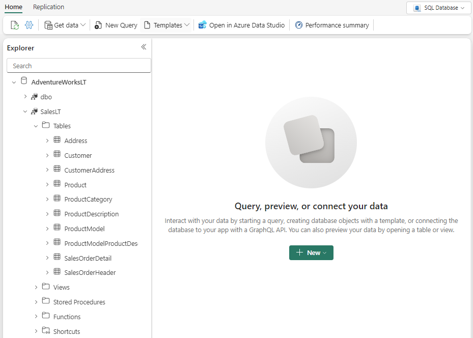

---
lab:
  title: Trabajar con SQL Database en Microsoft Fabric
  module: Get started with SQL Database in Microsoft Fabric
---

# Trabajar con SQL Database en Microsoft Fabric

SQL Database en Microsoft Fabric es una base de datos apta para desarrolladores, basada en Azure SQL Database, que permite crear fácilmente la base de datos operativa en Fabric. Una base de datos SQL de Fabric usa el motor de SQL Database como Azure SQL Database.

Este laboratorio se tarda aproximadamente **30** minutos en completarse.

> **Nota**: necesitarás una [evaluación gratuita de Microsoft Fabric](https://learn.microsoft.com/fabric/get-started/fabric-trial) para realizar este ejercicio.

## Creación de un área de trabajo

Antes de trabajar con datos de Fabric, crea un área de trabajo con la evaluación gratuita de Fabric habilitada.

1. En un explorador, ve a la [página principal de Microsoft Fabric](https://app.fabric.microsoft.com/home?experience=fabric) en `https://app.fabric.microsoft.com/home?experience=fabric` e inicia sesión con tus credenciales de Fabric.
1. En la barra de menús de la izquierda, selecciona **Nuevo espacio de trabajo**.
1. Crea una nueva área de trabajo con el nombre que prefieras y selecciona un modo de licencia que incluya capacidad de Fabric (*Evaluación gratuita*, *Premium* o *Fabric*).
1. Cuando se abra la nueva área de trabajo, debe estar vacía.

    

## Creación de una base de datos con datos de ejemplo

Ahora que tienes un área de trabajo, es el momento de crear una base de datos SQL.

1. En la barra de menús de la izquierda, selecciona **Crear**. En la página *Nuevo*, en la sección *Bases de datos*, selecciona **base de datos SQL**.

    >**Nota**: si la opción **Crear** no está anclada a la barra lateral, primero debes seleccionar la opción de puntos suspensivos (**...**).

1. Escribe **AdventureWorksLT** como nombre de la base de datos y selecciona **Crear**.
1. Una vez que hayas creado la base de datos, puedes cargar datos de ejemplo en la base de datos desde la tarjeta **Datos de ejemplo**.

    Después de un minuto, la base de datos se rellenará con datos de ejemplo para tu escenario.

    

## Consulta de una base de datos SQL

El editor de consultas SQL proporciona compatibilidad con IntelliSense, finalización de código, resaltado de sintaxis y análisis, y validación del lado cliente. Puedes ejecutar instrucciones del lenguaje de definición de datos (DDL), el lenguaje de manipulación de datos (DML) y el lenguaje de control de datos (DCL).

1. En la página base de datos **AdventureWorksLT**, ve a **Inicio** y selecciona **Nueva consulta**.

1. En el nuevo panel de consulta en blanco, escribe y ejecuta el siguiente código de T-SQL.

    ```sql
    SELECT 
        p.Name AS ProductName,
        pc.Name AS CategoryName,
        p.ListPrice
    FROM 
        SalesLT.Product p
    INNER JOIN 
        SalesLT.ProductCategory pc ON p.ProductCategoryID = pc.ProductCategoryID
    ORDER BY 
    p.ListPrice DESC;
    ```
    
    Esta consulta combina las tablas `Product` y `ProductCategory` para mostrar los nombres de producto, sus categorías y sus precios de lista, ordenados por precio en orden descendente.

1. En el nuevo editor de Power Query, escribe y ejecuta el siguiente código de T-SQL.

    ```sql
   SELECT 
        c.FirstName,
        c.LastName,
        soh.OrderDate,
        soh.SubTotal
    FROM 
        SalesLT.Customer c
    INNER JOIN 
        SalesLT.SalesOrderHeader soh ON c.CustomerID = soh.CustomerID
    ORDER BY 
        soh.OrderDate DESC;
    ```

    Esta consulta recupera una lista de clientes junto con sus fechas de pedido y subtotales, ordenados por la fecha de pedido en orden descendente. 

1. Cierra todas las pestañas de consulta.

## Integración de datos con orígenes de datos externos

Integrarás datos externos sobre días festivos públicos con pedido de venta. A continuación, identificarás los pedidos de ventas que coinciden con los días festivos, proporcionando información sobre cómo los días festivos podrían afectar a las actividades de ventas.

1. Ve a **Inicio** y selecciona **Nueva consulta**.

1. En el nuevo panel de consulta en blanco, escribe y ejecuta el siguiente código de T-SQL.

    ```sql
    CREATE TABLE SalesLT.PublicHolidays (
        CountryOrRegion NVARCHAR(50),
        HolidayName NVARCHAR(100),
        Date DATE,
        IsPaidTimeOff BIT
    );
    ```

    Esta consulta crea la tabla `SalesLT.PublicHolidays` como preparación para el paso siguiente.

1. En el nuevo editor de Power Query, escribe y ejecuta el siguiente código de T-SQL.

    ```sql
    INSERT INTO SalesLT.PublicHolidays (CountryOrRegion, HolidayName, Date, IsPaidTimeOff)
    VALUES
        ('Canada', 'Victoria Day', '2024-02-19', 1),
        ('United Kingdom', 'Christmas Day', '2024-12-25', 1),
        ('United Kingdom', 'Spring Bank Holiday', '2024-05-27', 1),
        ('United States', 'Thanksgiving Day', '2024-11-28', 1);
    ```
    
    En este ejemplo, esta consulta inserta días festivos en Canadá, el Reino Unido y los Estados Unidos para el año 2024 en la tabla `SalesLT.PublicHolidays`.    

1. En un Editor de Power Query nuevo o existente, escribe y ejecuta el siguiente código T-SQL.

    ```sql
    -- Insert new addresses into SalesLT.Address
    INSERT INTO SalesLT.Address (AddressLine1, City, StateProvince, CountryRegion, PostalCode, rowguid, ModifiedDate)
    VALUES
        ('123 Main St', 'Seattle', 'WA', 'United States', '98101', NEWID(), GETDATE()),
        ('456 Maple Ave', 'Toronto', 'ON', 'Canada', 'M5H 2N2', NEWID(), GETDATE()),
        ('789 Oak St', 'London', 'England', 'United Kingdom', 'EC1A 1BB', NEWID(), GETDATE());
    
    -- Insert new orders into SalesOrderHeader
    INSERT INTO SalesLT.SalesOrderHeader (
        SalesOrderID, RevisionNumber, OrderDate, DueDate, ShipDate, Status, OnlineOrderFlag, 
        PurchaseOrderNumber, AccountNumber, CustomerID, ShipToAddressID, BillToAddressID, 
        ShipMethod, CreditCardApprovalCode, SubTotal, TaxAmt, Freight, Comment, rowguid, ModifiedDate
    )
    VALUES
        (1001, 1, '2024-12-25', '2024-12-30', '2024-12-26', 1, 1, 'PO12345', 'AN123', 1, (SELECT TOP 1 AddressID FROM SalesLT.Address WHERE AddressLine1 = '789 Oak St'), (SELECT TOP 1 AddressID FROM SalesLT.Address WHERE AddressLine1 = '123 Main St'), 'Ground', '12345', 100.00, 10.00, 5.00, 'New Order 1', NEWID(), GETDATE()),
        (1002, 1, '2024-11-28', '2024-12-03', '2024-11-29', 1, 1, 'PO67890', 'AN456', 2, (SELECT TOP 1 AddressID FROM SalesLT.Address WHERE AddressLine1 = '123 Main St'), (SELECT TOP 1 AddressID FROM SalesLT.Address WHERE AddressLine1 = '456 Maple Ave'), 'Air', '67890', 200.00, 20.00, 10.00, 'New Order 2', NEWID(), GETDATE()),
        (1003, 1, '2024-02-19', '2024-02-24', '2024-02-20', 1, 1, 'PO54321', 'AN789', 3, (SELECT TOP 1 AddressID FROM SalesLT.Address WHERE AddressLine1 = '456 Maple Ave'), (SELECT TOP 1 AddressID FROM SalesLT.Address WHERE AddressLine1 = '789 Oak St'), 'Sea', '54321', 300.00, 30.00, 15.00, 'New Order 3', NEWID(), GETDATE()),
        (1004, 1, '2024-05-27', '2024-06-01', '2024-05-28', 1, 1, 'PO98765', 'AN321', 4, (SELECT TOP 1 AddressID FROM SalesLT.Address WHERE AddressLine1 = '789 Oak St'), (SELECT TOP 1 AddressID FROM SalesLT.Address WHERE AddressLine1 = '789 Oak St'), 'Ground', '98765', 400.00, 40.00, 20.00, 'New Order 4', NEWID(), GETDATE());
    ```

    Este código agrega nuevas direcciones y pedidos a la base de datos, simulando pedidos ficticios de diferentes países.

1. En un Editor de Power Query nuevo o existente, escribe y ejecuta el siguiente código T-SQL.

    ```sql
    SELECT DISTINCT soh.SalesOrderID, soh.OrderDate, ph.HolidayName, ph.CountryOrRegion
    FROM SalesLT.SalesOrderHeader AS soh
    INNER JOIN SalesLT.Address a
        ON a.AddressID = soh.ShipToAddressID
    INNER JOIN SalesLT.PublicHolidays AS ph
        ON soh.OrderDate = ph.Date AND a.CountryRegion = ph.CountryOrRegion
    ```

    Dedica un momento a observar los resultados, observa cómo la consulta identifica los pedidos de ventas que coinciden con los días festivos públicos en los respectivos países. Esto puede proporcionar información valiosa sobre los patrones de pedidos y posibles impactos de los días festivos en las actividades de ventas.

1. Cierra todas las pestañas de consulta.

## Protección de datos

Supongamos que un grupo específico de usuarios solo debe tener acceso a los datos de Estados Unidos para generar informes.

Vamos a crear una vista basada en la consulta que hemos usado anteriormente y agregarle un filtro.

1. En el nuevo panel de consulta en blanco, escribe y ejecuta el siguiente código de T-SQL.

    ```sql
    CREATE VIEW SalesLT.vw_SalesOrderHoliday AS
    SELECT DISTINCT soh.SalesOrderID, soh.OrderDate, ph.HolidayName, ph.CountryOrRegion
    FROM SalesLT.SalesOrderHeader AS soh
    INNER JOIN SalesLT.Address a
        ON a.AddressID = soh.ShipToAddressID
    INNER JOIN SalesLT.PublicHolidays AS ph
        ON soh.OrderDate = ph.Date AND a.CountryRegion = ph.CountryOrRegion
    WHERE a.CountryRegion = 'United Kingdom';
    ```

1. En un Editor de Power Query nuevo o existente, escribe y ejecuta el siguiente código T-SQL.

    ```sql
    -- Create the role
    CREATE ROLE SalesOrderRole;
    
    -- Grant select permission on the view to the role
    GRANT SELECT ON SalesLT.vw_SalesOrderHoliday TO SalesOrderRole;
    ```

    Cualquier usuario agregado como miembro al rol `SalesOrderRole` tendrá acceso solo a la vista filtrada. Si un usuario de este rol intenta acceder a cualquier otro objeto de usuario, recibirá un mensaje de error similar al siguiente:

    ```
    Msg 229, Level 14, State 5, Line 1
    The SELECT permission was denied on the object 'ObjectName', database 'DatabaseName', schema 'SchemaName'.
    ```

> **Más información**: consulta [¿Qué es Microsoft Fabric?](https://learn.microsoft.com/fabric/get-started/microsoft-fabric-overview) en la documentación de Microsoft Fabric para obtener más información sobre otros componentes disponibles en la plataforma.

En este ejercicio, has creado, realizado consultas y protegido datos en una base de datos SQL en Microsoft Fabric.

## Limpieza de recursos

Si has terminado de explorar la base de datos, puedes eliminar el área de trabajo que has creado para este ejercicio.

1. En la barra de la izquierda, selecciona el icono del área de trabajo para ver todos los elementos que contiene.
2. En el menú **...** de la barra de herramientas, selecciona **Configuración del área de trabajo**.
3. En la sección **General**, selecciona **Quitar esta área de trabajo**.
