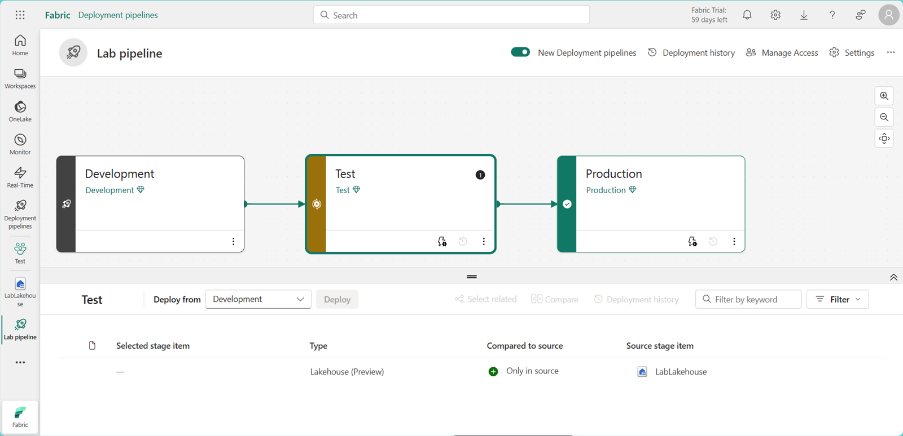

---
lab:
  title: Implementación de canalizaciones de implementación de Microsoft Fabric
  module: Implement CI/CD in Microsoft Fabric
---

# Implementación de canalizaciones de implementación de Microsoft Fabric

Las canalizaciones de implementación de Microsoft Fabric permiten automatizar el proceso de copiar los cambios realizados en el contenido de los elementos de Fabric entre entornos como desarrollo, pruebas y producción. Puedes usar canalizaciones de implementación para desarrollar y probar contenido antes de que llegue a los usuarios finales. En este ejercicio, crearás una canalización de implementación y asignarás fases a la canalización. A continuación, crearás contenido en un área de trabajo de desarrollo y usarás las canalizaciones de implementación para implementarlo entre las fases de canalización de desarrollo, pruebas y producción.

> **Nota**: para completar este ejercicio, debes ser miembro del rol de administrador del área de trabajo de Fabric. Para asignar roles, consulta [Roles en áreas de trabajo en Microsoft Fabric](https://learn.microsoft.com/en-us/fabric/get-started/roles-workspaces).

Este laboratorio se realiza en **20** minutos aproximadamente.

## Creación de áreas de trabajo

Crea tres áreas de trabajo con la versión de prueba de Fabric habilitada.

1. En un explorador, ve a la [página principal de Microsoft Fabric](https://app.fabric.microsoft.com/home?experience=fabric) en `https://app.fabric.microsoft.com/home?experience=fabric` e inicia sesión con tus credenciales de Fabric.
2. En la barra de menús de la izquierda, selecciona **Áreas de trabajo** (el icono tiene un aspecto similar a &#128455;).
3. Crea una nueva área de trabajo denominada Development y selecciona un modo de licencia que incluya la capacidad de Fabric (*Evaluación gratuita*, *Premium* o *Fabric*).
4. Repite los pasos 1 y 2 y crea dos áreas de trabajo más denominadas Pruebas y Producción. Las áreas de trabajo son: Desarrollo, Pruebas y Producción.
5. Selecciona el icono **Áreas de trabajo** de la barra de menús de la izquierda y confirma que hay tres áreas de trabajo denominadas: Desarrollo, Pruebas y Producción.

> **Nota**: si se te pide que escribas un nombre único para las áreas de trabajo, anexa uno o varios números aleatorios a las palabras: Desarrollo, Pruebas y Producción.

## Creación de una canalización de implementación

Luego crea una canalización de implementación.

1. En la barra de menús de la izquierda, selecciona **Áreas de trabajo**.
2. Selecciona **Canalizaciones de implementación** y, luego, **Nueva canalización**.
3. En la ventana **Agregar una nueva canalización de implementación**, asigna un nombre único a la canalización y selecciona **Siguiente**.
4. En la nueva ventana de canalización, selecciona **Crear y continuar**.

## Asignación de áreas de trabajo a las fases de una canalización de implementación

Asigna áreas de trabajo a las fases de la canalización de implementación.

1. En la barra de menús de la izquierda, selecciona la canalización que has creado. 
2. En la ventana que aparece, expande las opciones de **Asignar un área de trabajo** en cada fase de implementación y selecciona el nombre del área de trabajo que coincida con el nombre de la fase.
3. Activa la marca de verificación **Asignar** para cada fase de implementación.

  

## Creación de contenido

Los elementos de Fabric aún no se han creado en las áreas de trabajo. A continuación, crearás un almacén de lago en el área de trabajo de implementación.

1. En la barra de menús de la izquierda, selecciona el **Áreas de trabajo**.
2. Selecciona el área de trabajo **Desarrollo**.
3. Seleccione **Nuevo elemento**.
4. En la ventana que aparece, selecciona **Almacén de lago** y, en la **ventana Nuevo almacén de lago**, denomina al almacén de lago, **LabLakehouse**.
5. Selecciona **Crear**.
6. En la ventana Explorador de almacenes de lago, selecciona **Iniciar con datos de ejemplo** para rellenar el nuevo almacén de lago con datos.

  

7. Selecciona el ejemplo **NYCTaxi**.
8. En la barra de menús de la izquierda, selecciona la canalización que has creado.
9. Selecciona la fase **Desarrollo** y, en el lienzo de la canalización de implementación, puedes ver el almacén de lago que creaste como elemento de fase. En el borde izquierdo de la fase **Prueba**, hay una **X** dentro de un círculo. La **X** indica que las fases de desarrollo y pruebas no están sincronizadas.
10. Selecciona la fase **Prueba** y, en el lienzo de la canalización de implementación, puedes ver que el almacén de lago que creaste es solo un elemento de fase en el origen, que en este caso hace referencia a la fase **Desarrollo**.  

  

## Implementación de contenido entre las fases

Implementa el almacén de lago desde la fase **Desarrollo** en las fases **Pruebas** y **Producción**.
1. Seleccione la fase de **prueba** en el lienzo de la canalización de implementación.
1. En el lienzo de la canalización de implementación, active la casilla situada junto al elemento de almacén de lago de datos. Después, selecciona el botón **Implementar** para copiar el almacén de lago de datos en su estado actual en la fase de **prueba**.
1. En la ventana **Implementar en la siguiente fase** que aparece, seleccione **Implementar**.
 Ahora hay una X en un círculo en la fase producción en el lienzo de la canalización de implementación. El almacén del lago de datos se encuentra en las fases de desarrollo y prueba, pero aún no en la de producción.
1. Seleccione la fase de **producción** en el lienzo de implementación.
1. En el lienzo de la canalización de implementación, active la casilla situada junto al elemento de almacén de lago de datos. Después, seleccione el botón **Implementar** para copiar el almacén de lago de datos en su estado actual a la fase de **producción**.
1. En la ventana **Implementar en la siguiente fase** que aparece, seleccione **Implementar**. Las marcas de verificación verdes entre las fases indica que todas las fases están sincronizadas y contienen el mismo contenido.
1. El uso de canalizaciones de implementación para implementar entre fases también actualiza el contenido de las áreas de trabajo correspondientes a la fase Implementación. Vamos a confirmarlo.
1. En la barra de menús de la izquierda, selecciona el **Áreas de trabajo**.
1. Selecciona el área de trabajo **Pruebas**. El almacén de lago se copió allí.
1. Abre el área de trabajo **Producción** en el icono **Áreas de trabajo** del menú izquierdo. El almacén de lago también se copió en el área de trabajo Producción.

## Limpieza

En este ejercicio, has creado una canalización de implementación y has asignado fases a la canalización. Luego has creado contenido en un área de trabajo de desarrollo y lo has implementado entre fases de canalización mediante canalizaciones de implementación.

- En la barra de navegación izquierda, selecciona el icono de cada área de trabajo para ver todos los elementos que contiene.
- En el menú de la barra de herramientas superior, selecciona Configuración del área de trabajo.
- En la sección General, selecciona Quitar esta área de trabajo.
