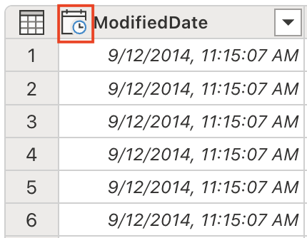

---
lab:
  title: "Trabajo de forma más inteligente con Copilot en Microsoft\_Fabric Dataflow Gen2"
  module: Get started with Copilot in Fabric for data engineering
---

# Trabajo de forma más inteligente con Copilot en Microsoft Fabric Dataflow Gen2

En Microsoft Fabric, los flujos de datos (Gen2) se conectan a varios orígenes de datos y realizan transformaciones en Power Query Online. Luego, se pueden usar en canalizaciones de datos para ingerir datos en un almacén de lago u otro almacén analítico, o para definir un conjunto de datos para un informe de Power BI. En este laboratorio se proporciona una introducción a Copilot en Flujos de datos (Gen2) en lugar de centrarse en la creación de una solución empresarial compleja.

Este ejercicio debería tardar en completarse **30** minutos aproximadamente.

## Temas que se abordarán

Al completar este laboratorio, aprenderá a:

- Comprender cómo usar Copilot en Microsoft Fabric Dataflow Gen2 para acelerar las tareas de transformación de datos.
- Ingerir, limpiar y transformar datos mediante Power Query Online con la asistencia de Copilot.
- Aplicar procedimientos recomendados para la calidad de los datos, incluido el cambio de nombre de las columnas, la eliminación de caracteres no deseados y la configuración de los tipos de datos adecuados.
- Obtener experiencia en el análisis y la expansión de datos XML dentro de un flujo de datos.
- Clasificar datos continuos en grupos significativos para su análisis.
- Publicar datos transformados en un almacén de lago de datos y validar los resultados.
- Reconocer el valor de la ingeniería de datos asistida por IA para mejorar la productividad y la calidad de los datos.

## Antes de comenzar

Necesita una [Capacidad de Microsoft Fabric (F2 o superior)](https://learn.microsoft.com/fabric/fundamentals/copilot-enable-fabric) con Copilot habilitado para completar este ejercicio.

## Escenario del ejercicio

Contoso, una empresa minorista global, va a modernizar su infraestructura de datos mediante Microsoft Fabric. Como ingeniero de datos, tiene la tarea de preparar la información del almacén para el análisis. Los datos sin procesar se almacenan en un archivo CSV e incluyen campos XML insertados, nombres de columna incoherentes y caracteres no deseados. El objetivo es usar Copilot en Dataflow Gen2 para ingerir, limpiar, transformar y enriquecer estos datos, y prepararlos para generar informes y análisis en el almacén de lago de datos. Este ejercicio práctico le guiará por cada paso, y mostrará cómo Copilot acelera y simplifica las tareas comunes de ingeniería de datos.

## Creación de un área de trabajo

Antes de trabajar con datos de Fabric, cree un área de trabajo con Fabric habilitado. Un área de trabajo actúa como contenedor para todos los elementos de Fabric y proporciona funcionalidades de colaboración para los equipos.

1. En un explorador, ve a la [página principal de Microsoft Fabric](https://app.fabric.microsoft.com/home?experience=fabric) en `https://app.fabric.microsoft.com/home?experience=fabric` e inicia sesión con tus credenciales de Fabric.

1. En la barra de menús de la izquierda, selecciona **Áreas de trabajo** (el icono tiene un aspecto similar a &#128455;).

1. Cree una área de trabajo con el nombre que prefiera y seleccione un modo de licencia que incluya capacidad de Fabric (*Premium* o *Fabric*). Tenga en cuenta que *Versión de evaluación* no se admite.

    > **Importante**: Las características de Copilot en Fabric necesitan una capacidad de pago (F2 o superior). Las áreas de trabajo de evaluación gratuita no admiten la funcionalidad de Copilot.

1. Cuando se abra la nueva área de trabajo, debe estar vacía.

    

## Crear un almacén de lago

Ahora que tiene un área de trabajo, es el momento de crear un almacén de lago de datos en el cual ingerirá los datos.

1. En la barra de menús de la izquierda, selecciona **Crear**. En la página *Nuevo*, en la sección *Ingeniería de datos*, selecciona **Almacén de lago de datos**. Asígnale un nombre único que elijas.

    >**Nota**: si la opción **Crear** no está anclada a la barra lateral, primero debes seleccionar la opción de puntos suspensivos (**...**).

    Al cabo de un minuto más o menos, se creará un nuevo almacén de lago vacío.

    

## Creación de un flujo de datos (Gen2) para ingerir datos

Ahora que tiene un almacén de lago, debe ingerir en él algunos datos. Una manera de hacerlo es definir un flujo de datos que encapsula un proceso de *extracción, transformación y carga* (ETL).

1. En la página principal de tu área de trabajo, selecciona **Obtener datos** > **Nuevo flujo de datos Gen2**. Al cabo de unos segundos, se abre el Editor de Power Query para el nuevo flujo de datos, como se muestra aquí.

    

1. Seleccione **Importar desde un archivo de texto o CSV** y cree un nuevo origen de datos con la siguiente configuración:

   - **Vínculo al archivo**: *Seleccionado*.
   - **URL o ruta del archivo**: `https://raw.githubusercontent.com/MicrosoftLearning/mslearn-fabric/refs/heads/main/Allfiles/Labs/22a/Store.csv`.
   - **Conexión**: Crear nueva conexión.
   - **Puerta de enlace de datos**: (ninguna).
   - **Tipo de autenticación**: Anónima.
   - **Nivel de privacidad**: Ninguna

1. Seleccione **Siguiente** para obtener una vista previa de los datos del archivo y, luego **Crear** para crear el origen de datos. El Editor de Power Query muestra el origen de datos y un conjunto inicial de pasos de consulta para dar formato a los datos, como se muestra aquí:

    

1. En la pestaña de la cinta **Inicio**, desde el grupo **Insights**, seleccione **Copilot**, como se muestra aquí:
    
    

1. Actualmente los nombres de columna son demasiado genéricos y carecen de significado claro (probablemente se muestren como Columna1, Columna2, etc.). Los nombres de columna significativos son fundamentales para comprender los datos y el procesamiento de bajada. Use el siguiente mensaje para refinarlos y asegurarse de que transmiten la información prevista con precisión:

    ```copilot-prompt
    Rename columns to BusinessEntityID, Name, SalesPersonID, Demographics, rowguid, ModifiedDate
    ```

    Observe que ahora los nombres de columna son precisos y descriptivos. Además, se ha incorporado un paso adicional en la lista Pasos aplicados, que muestra cómo Copilot genera automáticamente código M de Power Query en segundo plano:
    
    

1. Algunas columnas contienen un carácter "+" al final de sus valores de texto. Se trata de un problema común de calidad de datos que puede interferir con el análisis de datos y el procesamiento de bajada. 

    
    
    Ahora se eliminarán estos caracteres no deseados mediante el mensaje siguiente:
    
    ```copilot-prompt
    Delete the last character from the columns Name, Demographics, rowguid
    ```
    
    **Por qué esto importa**: La eliminación de caracteres extraños garantiza la coherencia de los datos y evita problemas al realizar operaciones de cadena o combinaciones de datos más adelante en el proceso.

1. La tabla contiene algunas columnas redundantes que se deben quitar para simplificar el conjunto de datos y mejorar la eficacia del procesamiento. Use el mensaje siguiente para refinar los datos como corresponde:

    
    
    ```copilot-prompt
    Remove the rowguid and Column7 columns
    ```
    
    **Nota**: La columna `rowguid` se usa normalmente para operaciones internas de la base de datos y no es necesaria para el análisis. `Column7` parece ser una columna vacía o irrelevante que no agrega ningún valor al conjunto de datos.
    
1. La columna Demographics incluye un carácter Unicode invisible, la marca de orden de bytes (BOM) \ufeff, que interfiere con el análisis de datos XML. Es necesario quitarlo para garantizar el procesamiento adecuado. En el panel de Copilot, escribe la indicación siguiente:

    ```copilot-prompt
    Remove the Byte Order Mark (BOM) \ufeff from the Demographics column
    ```
    
    **Descripción de BOM**: La marca de orden de bytes es un carácter Unicode que puede aparecer al principio de los archivos de texto para indicar el orden de bytes de la codificación de texto. Aunque resulta útil para la detección de codificación de archivos, puede causar problemas al analizar datos estructurados como XML.
    
    Observe la fórmula que se ha generado para quitar el carácter:
    
    
    
1. Ya puede analizar los datos XML y expandirlos en columnas independientes. La columna Demographics contiene datos con formato XML que contienen información de almacén valiosa, como ventas anuales, tamaño y otras métricas empresariales.

    
    
    En el panel de Copilot, escribe la indicación siguiente:
    
    ```copilot-prompt
    Parse this XML and expand it's columns
    ```
    
    **Descripción del análisis XML**: XML (Lenguaje de marcado extensible) es un formato de datos estructurados que se usa normalmente para almacenar información jerárquica. Al analizar y expandir el código XML, los datos anidados se convierten en una estructura tabular plana que es más fácil de analizar.
    
    Observe que se han agregado nuevas columnas a la tabla (es posible que tenga que desplazarse a la derecha).
    
    

1. Quite la columna Demographics; ya no es necesaria,porque se ha extraído toda la información valiosa en columnas independientes. En el panel de Copilot, escribe la indicación siguiente:

    ```copilot-prompt
    Remove the Demographics column.
    ```

    **Por qué se quita esta columna**: Ahora que ha analizado el código XML y ha creado columnas individuales para cada fragmento de información, la columna Demographics original que contiene el código XML sin formato es redundante y se puede quitar de forma segura para mantener limpio el conjunto de datos.

1. La columna ModifiedDate tiene una Y comercial (&) al final de sus valores. Se debe quitar antes del análisis para garantizar un procesamiento de datos adecuado.

    
    
    En el panel de Copilot, escribe la indicación siguiente:
    
    ```copilot-prompt
    Remove the last character from the ModifiedDate
    ```

1. Ya puede convertir su tipo de datos a DateTime para realizar operaciones y análisis de fecha y hora adecuados. En el panel de Copilot, escribe la indicación siguiente:

    ```copilot-prompt
    Set the data type to DateTime
    ```

    **Importancia del tipo de datos**: La conversión al tipo de datos correcto es fundamental para habilitar la ordenación, el filtrado y los cálculos basados en fechas adecuados en el análisis de bajada.

    Observe que el tipo de datos ModifiedDate ha cambiado a DateTime:
    
    
    
1. Ajuste los tipos de datos de varias columnas a valores numéricos para habilitar las operaciones matemáticas y agregaciones adecuadas. En el panel de Copilot, escribe la indicación siguiente:

    ```copilot-prompt
    Set the data type to whole number for the following columns: AnnualSales, AnnualRevenue, SquareFeet, NumberEmployee
    ```
    
    **Por qué realizar la conversión a números**: Tener tipos de datos numéricos permite cálculos matemáticos adecuados, agregaciones (suma, promedio, etc.) y análisis estadísticos que no serían posibles con datos basados en texto.
    
1. El campo SquareFeet contiene valores numéricos comprendidos entre 6000 y 80 000. La creación de agrupaciones categóricas a partir de datos numéricos continuos es una técnica analítica común que facilita la interpretación y el análisis de los datos.

    
    
    Ahora se generará una nueva columna para clasificar el tamaño del almacén en consecuencia. En el panel de Copilot, escribe la indicación siguiente:
    
    ```copilot-prompt
    Add a column StoreSize, based on the SquareFeet:
        0 - 10000: Small
        10001 - 40000: Medium
        40001 - 80000: Large
    ```
    
    Observe que se ha agregado una nueva columna StoreSize, con una fórmula basada en la columna SquareFeet. Observe también que el perfil de columna tiene tres valores distintos: Pequeño, Mediano y Grande.
    
    
    
1. Modifique los tipos de datos de columnas que actualmente carecen de un tipo especificado. En el panel de Copilot, escribe la indicación siguiente:

    ```copilot-prompt
    Set the datatype of the following columns to text: Name, BankName, BusinessType, YearOpened, Specialty, Brands, Internet, StoreSize
    ```
    
    **Coherencia del tipo de datos**: El establecimiento explícito de tipos de datos garantiza un comportamiento predecible en los procesos de bajada y evita la inferencia automática de tipos que podría dar lugar a resultados inesperados.
    
## Explicación del código

1. Se han realizado varias transformaciones. Le pedirá a Copilot que resuma los pasos que se han realizado:

    ```copilot-prompt
    Describe this query
    ```
    
    Observe que el resultado aparece en el panel Copilot. A continuación se muestra un ejemplo de la explicación proporcionada. Los resultados pueden variar ligeramente, ya que el contenido generado por la IA puede tener errores.
    
    
    
    *Esta es una explicación de **Store**: Cargue y transforme un archivo CSV, analice los datos XML y clasifique los almacenes por tamaño.*
    
    - _**Origen**: Cargue un archivo CSV desde una dirección URL con un delimitador de canalización y una codificación específica._
    - _**Tipo de columna cambiado**: Cambie los tipos de datos de las columnas._
    - _**Cambio de nombre de las columnas**: Cambie el nombre de las columnas por nombres significativos._
    - _**Personalizado**: Quite el último carácter de las columnas "Name", "Demographics" y "rowguid"._
    - _**Eliminación de columnas**: Quite las columnas "rowguid" y "Column7"._
    - _**Personalizado 1**: Quite los caracteres especiales iniciales de la columna "Demographics"._
    - _**Personalizado 2**: Analice la columna "Demographics" como XML y expándala en varias columnas._
    - _**Eliminación de columnas 1**: Quite la columna "Demographics" original._
    - _**Transformación de columnas**: Quite el último carácter de la columna "ModifiedDate"._
    - _**Transformación de columnas 1**: Convierta la columna "ModifiedDate" al tipo datetime._
    - _**Cambio de tipo**: Cambie los tipos de datos de las columnas "AnnualSales", "AnnualRevenue", "SquareFeet" y "NumberEmployees" a entero._
    - _**Columna condicional**: Agregue una nueva columna "StoreSize" basada en el valor "SquareFeet", para clasificar los almacenes como "Small", "Medium" o "Large"._
    - _**Cambio de tipo 1**: Cambie los tipos de datos de varias columnas a texto._
    
## Adición de un destino de datos al flujo de datos

1. En la cinta de opciones de la barra de herramientas, seleccione la pestaña **Inicio**. A continuación, en el menú desplegable **Agregar destino de datos**, seleccione **Almacén de lago**.

    > **Nota:** Si esta opción está atenuada, es posible que ya tenga un conjunto de destino de datos. Compruebe el destino de los datos en la parte inferior del panel "Configuración de la consulta" en el lado derecho del Editor de Power Query. Si ya se ha establecido un destino, puede cambiarlo con el engranaje.

1. En el cuadro de diálogo **Conectarse al destino de datos**, edite la conexión e inicie sesión con su cuenta organizativa de Power BI para establecer la identidad que usa el flujo de datos para acceder al almacén de lago.

    

1. Seleccione **Siguiente** y, en la lista de áreas de trabajo disponibles, busque el área de trabajo y seleccione el almacén de lago que creó al principio de este ejercicio. Después, especifique una nueva tabla llamada **Store**:

    

1. Selecciona **Siguiente** y, en la página **Elegir configuración de destino**, deshabilita la opción **Usar configuración automática**, selecciona **Anexar** y, después, **Guardar configuración**.

    > **Nota:** se recomienda usar el editor de *Power Query* para actualizar los tipos de datos, pero también es posible hacerlo desde esta página, si lo prefiere.

    

1. Seleccione **Guardar y ejecutar** para publicar el flujo de datos. A continuación, espere a que se cree el flujo de datos **Dataflow 1** en el área de trabajo.

## Validación del trabajo

Ahora es el momento de validar el proceso ETL del flujo de datos y asegurarse de que todas las transformaciones se ha aplicado correctamente.

1. Vuelva al área de trabajo y abra el almacén de lago de datos que ha creado antes.

1. En almacén de lago de datos, busque y abra la tabla **Store**. (Es posible que tenga que esperar unos minutos antes de que se rellene a medida que el flujo de datos procesa los datos).

1. Observe los siguientes aspectos clave de los datos transformados:

   - **Nombres de columna**: Compruebe que coinciden con los nombres significativos especificados (BusinessEntityID, Name, SalesPersonID, etc.)
   - **Tipos de datos**: Compruebe que las columnas numéricas se muestran como números, las columnas DateTime se muestran como fecha y hora, y las columnas de texto se muestran como texto
   - **Calidad de los datos**: Confirme que se han quitado los caracteres no deseados (+, &)
   - **Expansión XML**: Observe las columnas individuales que se han extraído de los datos demográficos XML originales
   - **Clasificación de StoreSize**: Compruebe que las categorías Small/Medium/Large se han creado correctamente en función de los valores de SquareFeet
   - **Integridad de los datos**: Asegúrese de que no se ha perdido ningún dato crítico durante el proceso de transformación

   

    **Por qué esto importa**: La tabla final debe contener datos limpios y bien estructurados con nombres de columna significativos, tipos de datos adecuados y la nueva columna de categoría StoreSize. Esto muestra cómo Copilot puede ayudar a transformar datos sin procesar y desordenados en un conjunto de datos limpio y listo para el análisis.

## Limpieza de recursos

Si ha terminado de explorar flujos de datos en Microsoft Fabric, puede eliminar el área de trabajo que creó para este ejercicio.

1. Vaya a Microsoft Fabric en el explorador.
1. En la barra de la izquierda, seleccione el icono del área de trabajo para ver todos los elementos que contiene.
1. Selecciona **Configuración del área de trabajo** y, en la sección **General**, desplázate hacia abajo y selecciona **Quitar esta área de trabajo**.
1. Selecciona **Eliminar** para eliminar el área de trabajo.

