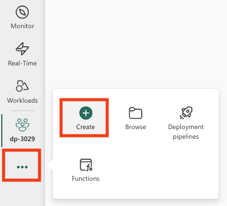
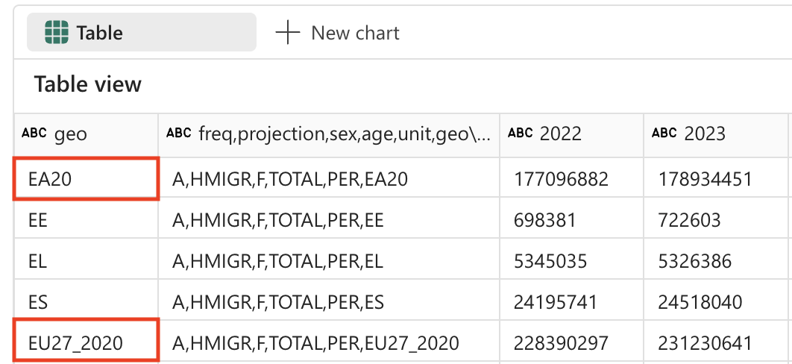

---
lab:
  title: "Análisis de datos con Apache\_Spark y Copilot en cuadernos de Microsoft\_Fabric"
  module: Get started with Copilot in Fabric for data engineering
---

# Análisis de datos con Apache Spark y Copilot en cuadernos de Microsoft Fabric

En este laboratorio, se usa Copilot para Ingeniería de datos de Fabric para cargar, transformar y guardar datos en un almacén de lago de datos mediante un cuaderno. Los cuadernos proporcionan un entorno interactivo que combina código, visualizaciones y texto narrativo en un único documento. Este formato facilita la documentación del flujo de trabajo, explicar el razonamiento y compartir resultados con otros usuarios. Al usar cuadernos, puede desarrollar y probar código de forma iterativa, visualizar los datos en cada paso y mantener un registro claro del proceso de análisis. Este enfoque mejora la colaboración, la reproducibilidad y la comprensión, lo que hace que los cuadernos sean una herramienta ideal para las tareas de ingeniería y análisis de datos.

Tradicionalmente, para trabajar con cuadernos para la ingeniería de datos es necesario escribir código en lenguajes como Python o Scala, y tener un conocimiento sólido de marcos y bibliotecas como Apache Spark y pandas. Esto puede ser difícil para aquellos que no están familiarizados con estas herramientas ni con la programación. Con Copilot en cuadernos de Fabric, puede describir las tareas de datos en lenguaje natural y Copilot generará el código que necesita y controlará gran parte de la complejidad técnica, para que pueda centrarse en el análisis.

Este ejercicio debería tardar en completarse **30** minutos aproximadamente.

## Temas que se abordarán

Después de completar este laboratorio, podrá:

- Crear y configurar un área de trabajo de Microsoft Fabric y un almacén de lago de datos para las tareas de ingeniería de datos.
- Usar Copilot en cuadernos de Fabric para generar código a partir de mensajes en lenguaje natural.
- Ingerir, limpiar y transformar datos mediante flujos de trabajo asistidos por Apache Spark y Copilot.
- Normalizar y preparar conjuntos de datos estadísticos para su análisis mediante la división, el filtrado y la conversión de tipos de datos.
- Guardar los datos transformados como una tabla en el almacén de lago de datos para el análisis de bajada.
- Usar Copilot para generar consultas y visualizaciones para la exploración y validación de datos.
- Comprender los procedimientos recomendados para la limpieza, transformación y análisis colaborativo de datos en Microsoft Fabric.

## Antes de comenzar

Necesita una [Capacidad de Microsoft Fabric (F2 o superior)](https://learn.microsoft.com/fabric/fundamentals/copilot-enable-fabric) con Copilot habilitado para completar este ejercicio.

> **Nota**: Para mayor comodidad, hay disponible un cuaderno con todas las indicaciones de este ejercicio que puede descargar en:

`https://github.com/MicrosoftLearning/mslearn-fabric/raw/refs/heads/main/Allfiles/Labs/22b/Starter/eurostat-notebook.ipynb`

## Escenario del ejercicio

Imagine que Contoso Health, una red de hospitales de varias especialidades, quiere expandir sus servicios en la UE y quiere analizar los datos de población proyectados. En este ejemplo se usa el conjunto de datos de proyección de población [Eurostat](https://ec.europa.eu/eurostat/web/main/home) (oficina estadística de la Unión Europea).

Origen: EUROPOP2023 Población el 1 de enero por edad, sexo y tipo de proyección [[proj_23np](https://ec.europa.eu/eurostat/databrowser/product/view/proj_23np?category=proj.proj_23n)], Última actualización el 28 de junio de 2023.

## Creación de un área de trabajo

Antes de trabajar con datos de Fabric, cree un área de trabajo con Fabric habilitado. Un área de trabajo de Microsoft Fabric actúa como un entorno de colaboración donde puede organizar y administrar todos los artefactos de ingeniería de datos, incluidos almacenes de lago de datos, cuadernos y conjuntos de datos. Imagine que es como una carpeta de proyecto que contiene todos los recursos necesarios para el análisis de datos.

1. En un explorador, ve a la [página principal de Microsoft Fabric](https://app.fabric.microsoft.com/home?experience=fabric) en `https://app.fabric.microsoft.com/home?experience=fabric` e inicia sesión con tus credenciales de Fabric.

1. En la barra de menús de la izquierda, selecciona **Áreas de trabajo** (el icono tiene un aspecto similar a &#128455;).

1. Cree una área de trabajo con el nombre que prefiera y seleccione un modo de licencia que incluya capacidad de Fabric (*Premium* o *Fabric*). Tenga en cuenta que *Versión de evaluación* no se admite.
   
    > **Por qué esto importa**: Copilot necesita una capacidad de Fabric de pago para funcionar. Esto garantiza que tiene acceso a las características con tecnología de inteligencia artificial que ayudarán a generar código a lo largo de este laboratorio.

1. Cuando se abra la nueva área de trabajo, debe estar vacía.

    

## Crear un almacén de lago

Ahora que tiene un área de trabajo, es el momento de crear un almacén de lago de datos en el que ingerir los datos. Un almacén de lago de datos combina las ventajas de un lago de datos (almacenar datos sin procesar en varios formatos) con un almacenamiento de datos (datos estructurados optimizados para el análisis). Servirá como ubicación de almacenamiento para los datos de población sin procesar y como destino del conjunto de datos limpio y transformado.

1. En la barra de menús de la izquierda, selecciona **Crear**. En la página *Nuevo*, en la sección *Ingeniería de datos*, selecciona **Almacén de lago de datos**. Asígnale un nombre único que elijas.

    >**Nota**: si la opción **Crear** no está anclada a la barra lateral, primero debes seleccionar la opción de puntos suspensivos (**...**).



Al cabo de un minuto más o menos, se creará un nuevo almacén de lago vacío.


## Creación de un cuaderno

Ahora puedes crear un cuaderno de Fabric para trabajar con los datos. Los cuadernos proporcionan un entorno interactivo donde puede escribir y ejecutar código, visualizar los resultados y documentar el proceso de análisis de datos. Son idóneos para el análisis exploratorio de datos y el desarrollo iterativo, lo que le permite ver los resultados de cada paso inmediatamente.

1. En la barra de menús de la izquierda, selecciona **Crear**. En la página *Nuevo*, en la sección *Ingeniería de datos*, selecciona **Cuaderno**.

    Se creará y se abrirá un nuevo cuaderno denominado **Notebook 1**.

    

1. Fabric asigna un nombre a cada cuaderno que crees, como Cuaderno 1, Cuaderno 2, etc. Haz clic en el panel de nombres situado encima de la pestaña **Inicio** del menú para cambiar el nombre a algo más descriptivo.

    

1. Selecciona la primera celda (que actualmente es una celda de código) y, luego, en la barra de herramientas en la parte superior derecha, usa el botón **M↓** para convertirla en una celda de Markdown. El texto dentro de la celda se mostrará como texto con formato.

    > **Por qué usar celdas de Markdown**: Las celdas de Markdown le permiten documentar el análisis con texto con formato, lo que hace que el cuaderno sea más legible y fácil de entender para otros usuarios (o para usted mismo cuando vuelva a él más adelante).

    

1. Usa el botón 🖉 (Editar) para cambiar la celda al modo de edición y, luego, modifica el Markdown de la siguiente manera.

    ```md
    # Explore Eurostat population data.
    Use this notebook to explore population data from Eurostat
    ```
    
    
    
    Al terminar, haz clic en cualquier parte del cuaderno fuera de la celda para dejar de editarlo.

## Asociación del almacén de lago de datos al cuaderno

Para trabajar con datos en el almacén de lago de datos desde el cuaderno, debe adjuntar el almacén de lago de datos al cuaderno. Esta conexión permite que el cuaderno lea y escriba en el almacenamiento del almacén de lago de datos, lo que crea una integración perfecta entre el entorno de análisis y el almacenamiento de datos.

1. Selecciona el área de trabajo nueva en la barra izquierda. Verás una lista de los elementos dentro del área de trabajo, incluidos el almacén de lago y el cuaderno.

1. Seleccione el almacén de lago de datos para mostrar el panel Explorador.

1. En el menú superior, selecciona **Abrir cuaderno**, **Cuaderno existente** y, a continuación, abre el cuaderno que creaste anteriormente. El cuaderno debe estar abierto junto al panel Explorador. Expanda Almacenes de lago de datos y expanda la lista Archivos. Observe que todavía no hay ninguna tabla ni archivos enumerados junto al editor de cuadernos, como se indica a continuación:

    

    > **Lo que verá**: En el panel Explorador de la izquierda se muestra la estructura del almacén de lago de datos. Actualmente, está vacío, pero a medida que se carguen y procesen datos, verá que los archivos aparecen en la sección **Archivos** y tablas en la sección **Tablas**.


## Cargar datos

Ahora se usará Copilot para ayudar a descargar datos de la API de Eurostat. En lugar de escribir código de Python desde cero, describirá lo que quiere hacer en lenguaje natural y Copilot generará el código adecuado. Esto muestra una de las principales ventajas de la programación asistida por IA: puede centrarse en la lógica de negocios en lugar de hacerlo en los detalles de la implementación técnica.

1. Cree una celda en el cuaderno y copie dentro la instrucción siguiente. Para indicar que quiere que Copilot genere código, use `%%code` como primera instrucción de la celda. 

    > **Acerca del comando magic `%%code`**: Esta instrucción especial indica a Copilot que quiere que genere código de Python basado en la descripción en lenguaje natural. Es uno de los muchos "comandos mágicos" que le ayudan a interactuar con Copilot de forma más eficaz.

    ```copilot-prompt
    %%code
    
    Download the following file from this URL:
    
    https://ec.europa.eu/eurostat/api/dissemination/sdmx/2.1/data/proj_23np$defaultview/?format=TSV
     
    Then write the file to the default lakehouse into a folder named temp. Create the folder if it doesn't exist yet.
    ```
    
1. Selecciona ▷ **Ejecutar celda** a la izquierda de la celda para ejecutar el código.

    Copilot genera el siguiente código SQL, que puede diferir ligeramente en función del entorno y de las actualizaciones más recientes de Copilot.
    
    
    
    > **Funcionamiento de Copilot**: Observe cómo Copilot traduce la solicitud en lenguaje natural en código de Python funcional. Entiende que debe realizar una solicitud HTTP, controlar el sistema de archivos y guardar los datos en una ubicación específica del almacén de lago de datos.
    
    Para su comodidad, aquí está el código completo por si experimentara excepciones durante la ejecución:
    
    ```python
    #### ATTENTION: AI-generated code can include errors or operations you didn't intend. Review the code in this cell carefully before running it.
    
    import requests
    import os
    
    # Define the URL and the local path
    url = "https://ec.europa.eu/eurostat/api/dissemination/sdmx/2.1/data/proj_23np$defaultview/?format=TSV"
    local_path = "/lakehouse/default/Files/temp/"
    file_name = "proj_23np.tsv"
    file_path = os.path.join(local_path, file_name)
    
    # Create the temporary directory if it doesn't exist
    if not os.path.exists(local_path):
        os.makedirs(local_path)
    
    # Download the file
    response = requests.get(url)
    response.raise_for_status()  # Check that the request was successful
    
    # Write the content to the file
    with open(file_path, "wb") as file:
        file.write(response.content)
    
    print(f"File downloaded and saved to {file_path}")
    ```

1. Seleccione ▷ **Ejecutar celda** a la izquierda de la celda para ejecutar el código y observar la salida. El archivo se debe descargar y guardar en la carpeta temporal del almacén de lago de datos.

    > **Nota**: Es posible que tenga que actualizar los archivos del almacén de lago de datos mediante la selección de los tres puntos ...
    
    

1. Ahora que tiene el archivo de datos sin procesar en el almacén de lago de datos, es necesario cargarlo en un elemento DataFrame de Spark para poder analizarlo y transformarlo. Cree una celda en el cuaderno y copie dentro la instrucción siguiente.

    > **Información**: Un elemento DataFrame es una colección distribuida de datos organizados en columnas con nombre, similar a una tabla de una base de datos o una hoja de cálculo.

    ```copilot-prompt
    %%code
    
    Load the file 'Files/temp/proj_23np.tsv' into a spark dataframe.
    
    The fields are separated with a tab.
    
    Show the contents of the DataFrame using display method.
    ```

1. Seleccione ▷ **Ejecutar celda** a la izquierda de la celda para ejecutar el código y observar la salida. El elemento DataFrame datos debe contener los datos del archivo TSV. Este es un ejemplo del aspecto que podría tener el código generado:

    ```python
    #### ATTENTION: AI-generated code can include errors or operations you didn't intend. Review the code in this cell carefully before running it.
    
    # Load the file 'Files/temp/proj_23np.tsv' into a spark dataframe.
    # The fields have been separated with a tab.
    file_path = "Files/temp/proj_23np.tsv"
    
    spark_df = spark.read.format("csv").option("delimiter", "\t").option("header", "true").load(file_path)
    
    # Show the contents of the DataFrame using display method
    display(spark_df)
    ```

El ejemplo siguiente muestra el aspecto que podría tener la salida:

| freq,projection,sex,age,unit,geo\TIME_PERIOD |      2022  |      2023  |   ...  |      2100  |
| -------------------------------------------- | ---------- | ---------- | ------ | ---------- |
|                         A,BSL,F,TOTAL,PER,AT |   4553444  |   4619179  |   ...  |   4807661  |
|                         A,BSL,F,TOTAL,PER,BE |   5883978  |   5947528  |   ...  |   6331785  |
|                         A,BSL,F,TOTAL,PER,BG |   3527626  |   3605059  |   ...  |   2543673  |
|                                          ... |       ...  |       ...  |   ...  |   5081250  |
|                         A,BSL,F,TOTAL,PER,CY |    463622  |    476907  |   ...  |    504781  |

> **Descripción de la estructura de datos**: Observe que la primera columna contiene varios valores separados por comas (frecuencia, tipo de proyección, sexo, edad, unidad y ubicación geográfica) mientras que las columnas restantes representan años con valores de población. Esta estructura es común en los conjuntos de datos estadísticos, pero se debe limpiar para un análisis eficaz.

## Transformación de datos: división de campos

Para continuar, transformará los datos. Es necesario asegurarse de que el primer campo se divide en columnas independientes. Además, también es necesario asegurarse de trabajar con los tipos de datos correctos y aplicar el filtrado. 

> **Por qué es necesario dividir los campos**: La primera columna contiene varios fragmentos de información concatenados (frecuencia, tipo de proyección, sexo, grupo de edad, unidad y código geográfico). Para un análisis adecuado, cada uno debe estar en su propia columna. Este proceso se denomina "normalización" de la estructura de datos.

1. Cree una celda en el cuaderno y copie dentro la instrucción siguiente.


    ```copilot-prompt
    %%code
    
    From the currently loaded DataFrame, split the first field 'freq,projection,sex,age,unit,geo\TIME_PERIOD' using a comma into 6 separate fields.
    ```

1. Seleccione ▷ **Ejecutar celda** a la izquierda de la celda para ejecutar el código y observar la salida. El ejemplo siguiente muestra el aspecto que podría tener la salida:

    ```python
    #### ATTENTION: AI-generated code can include errors or operations you didn't intend. Review the code in this cell carefully before running it.
    
    from pyspark.sql.functions import split, col
    
    # Split the first field 'freq,projection,sex,age,unit,geo\TIME_PERIOD' into 6 separate fields
    spark_df = spark_df.withColumn("freq", split(col("freq,projection,sex,age,unit,geo\\TIME_PERIOD"), ",").getItem(0)) \
                       .withColumn("projection", split(col("freq,projection,sex,age,unit,geo\\TIME_PERIOD"), ",").getItem(1)) \
                       .withColumn("sex", split(col("freq,projection,sex,age,unit,geo\\TIME_PERIOD"), ",").getItem(2)) \
                       .withColumn("age", split(col("freq,projection,sex,age,unit,geo\\TIME_PERIOD"), ",").getItem(3)) \
                       .withColumn("unit", split(col("freq,projection,sex,age,unit,geo\\TIME_PERIOD"), ",").getItem(4)) \
                       .withColumn("geo", split(col("freq,projection,sex,age,unit,geo\\TIME_PERIOD"), ",").getItem(5))
    
    # Show the updated DataFrame
    display(spark_df)
    ```

1. Selecciona ▷ **Ejecutar celda** a la izquierda de la celda para ejecutar el código. Es posible que tenga que desplazar la tabla a la derecha para ver los nuevos campos agregados a la tabla.

    

## Transformación de datos: eliminación de campos

Algunos campos de la tabla no ofrecen ningún valor significativo, ya que solo contienen una única entrada distinta. Como procedimiento recomendado, se deben quitar del conjunto de datos.

> **Principio de limpieza de datos**: Las columnas con un solo valor único no proporcionan valor analítico y pueden hacer que el conjunto de datos sea innecesariamente complejo. Al quitarlas se simplifica la estructura de datos y se mejora el rendimiento. En este caso, "freq" (frecuencia), "age" (todos los registros muestran TOTAL) y "unit" (todos los registros muestran PER para personas) son constantes en todas las filas.

1. Cree una celda en el cuaderno y copie dentro la instrucción siguiente.

    ```copilot-prompt
    %%code
    
    From the currently loaded DataFrame, remove the fields 'freq', 'age', 'unit'.
    ```

1. Seleccione ▷ **Ejecutar celda** a la izquierda de la celda para ejecutar el código y observar la salida. El ejemplo siguiente muestra el aspecto que podría tener la salida:

    ```python
    #### ATTENTION: AI-generated code can include errors or operations you didn't intend. Review the code in this cell carefully before running it.
    
    # Remove the fields 'freq', 'age', 'unit'
    spark_df = spark_df.drop("freq", "age", "unit")
    
    # Show the updated DataFrame
    display(spark_df)
    ```

1. Selecciona ▷ **Ejecutar celda** a la izquierda de la celda para ejecutar el código.

## Transformación de datos: reubicación de los campos

La organización de los datos con las columnas de identificación más importantes primero facilita la lectura y comprensión. En el análisis de datos, un procedimiento habitual consiste en colocar las columnas de categorías o dimensiones (como las de tipo de proyección, sexo y ubicación geográfica) antes que las columnas numéricas o de medida (los valores de población por año).

1. Cree una celda en el cuaderno y copie dentro la instrucción siguiente.

    ```copilot-prompt
    %%code
    
    From the currently loaded DataFrame, the fields 'projection', 'sex', 'geo' should be positioned first.
    ```

1. Seleccione ▷ **Ejecutar celda** a la izquierda de la celda para ejecutar el código y observar la salida. El ejemplo siguiente muestra el aspecto que podría tener la salida:

    ```python
    #### ATTENTION: AI-generated code can include errors or operations you didn't intend. Review the code in this cell carefully before running it.
    
    # Reorder the DataFrame with 'projection', 'sex', 'geo' fields first
    new_column_order = ['projection', 'sex', 'geo'] + [col for col in spark_df.columns if col not in {'projection', 'sex', 'geo'}]
    spark_df = spark_df.select(new_column_order)
    
    # Show the reordered DataFrame
    display(spark_df)
    ```

1. Selecciona ▷ **Ejecutar celda** a la izquierda de la celda para ejecutar el código.

## Transformación de datos: reemplazo de valores

El campo de proyección contiene actualmente códigos crípticos que no son fáciles de usar. Para mejorar la legibilidad y el análisis, se reemplazarán estos códigos por nombres descriptivos que explican claramente lo que representa cada escenario de proyección.

> **Descripción de los escenarios de proyección**: Las organizaciones estadísticas suelen usar diferentes escenarios para modelar futuros cambios de población. La línea de base representa el escenario más probable, mientras que las pruebas de confidencialidad muestran cómo la población podría cambiar en diferentes suposiciones sobre tasas de fertilidad, tasas de mortalidad y patrones de migración.

1. Cree una celda en el cuaderno y copie dentro la instrucción siguiente.


    ```copilot-prompt
    %%code
    
    The 'projection' field contains codes that should be replaced with the following values:
        _'BSL' -> 'Baseline projections'.
        _'LFRT' -> 'Sensitivity test: lower fertility'.
        _'LMRT' -> 'Sensitivity test: lower mortality'.
        _'HMIGR' -> 'Sensitivity test: higher migration'.
        _'LMIGR' -> 'Sensitivity test: lower migration'.
        _'NMIGR' -> 'Sensitivity test: no migration'.
    ```

1. Seleccione ▷ **Ejecutar celda** a la izquierda de la celda para ejecutar el código y observar la salida. El ejemplo siguiente muestra el aspecto que podría tener la salida:

    ```python
    #### ATTENTION: AI-generated code can include errors or operations you didn't intend. Review the code in this cell carefully before running it.
    
    from pyspark.sql.functions import when
    
    # Replace projection codes
    spark_df = spark_df.withColumn("projection", 
                                   when(spark_df["projection"] == "BSL", "Baseline projections")
                                   .when(spark_df["projection"] == "LFRT", "Sensitivity test: lower fertility")
                                   .when(spark_df["projection"] == "LMRT", "Sensitivity test: lower mortality")
                                   .when(spark_df["projection"] == "HMIGR", "Sensitivity test: higher migration")
                                   .when(spark_df["projection"] == "LMIGR", "Sensitivity test: lower migration")
                                   .when(spark_df["projection"] == "NMIGR", "Sensitivity test: no migration")
                                   .otherwise(spark_df["projection"]))
    
    # Display the updated DataFrame
    display(spark_df)
    ```

1. Selecciona ▷ **Ejecutar celda** a la izquierda de la celda para ejecutar el código.

    
    
## Transformación de datos: filtrado de datos

La tabla de proyecciones de población contiene dos filas para países que no existen: EU27_2020 (*total para la Unión Europea: 27 países*) y EA20 (*zona Euro: 20 países*). Es necesario quitar estas dos filas, ya que quiere mantener los datos solo en el nivel más bajo.

> **Principio de granularidad de los datos**: Para un análisis detallado, es importante trabajar con los datos en el nivel más pormenorizado posible. Los valores agregados (como los totales de la UE) siempre se pueden calcular cuando sea necesario, pero incluirlos en el conjunto de datos base puede provocar un recuento doble o confusión en el análisis.



1. Cree una celda en el cuaderno y copie dentro la instrucción siguiente.

    ```copilot-prompt
    %%code
    
    Filter the 'geo' field and remove values 'EA20' and 'EU27_2020' (these are not countries).
    ```

1. Seleccione ▷ **Ejecutar celda** a la izquierda de la celda para ejecutar el código y observar la salida. El ejemplo siguiente muestra el aspecto que podría tener la salida:

    ```python
    #### ATTENTION: AI-generated code can include errors or operations you didn't intend. Review the code in this cell carefully before running it.
    
    # Filter out 'geo' values 'EA20' and 'EU27_2020'
    spark_df = spark_df.filter((spark_df['geo'] != 'EA20') & (spark_df['geo'] != 'EU27_2020'))
    
    # Display the filtered DataFrame
    display(spark_df)
    ```

1. Selecciona ▷ **Ejecutar celda** a la izquierda de la celda para ejecutar el código.

    La tabla de proyección de la población también contiene un campo "sex", que contiene los siguientes valores distintos:
    
    - M: Male
    - F: Femenino
    - T: Total (hombre + mujer)

    De nuevo, es necesario quitar los totales, para mantener los datos en el nivel de detalle más bajo.

    > **Por qué quitar totales**: Como sucede con las agregaciones geográficas, quiere mantener solo las categorías de sexo individuales (Hombre y Mujer), y excluir los valores totales. Esto permite un análisis más flexible: siempre puede sumar los valores de Hombre y Mujer para obtener totales, pero no volver a dividir los totales en sus componentes.

1. Cree una celda en el cuaderno y copie dentro la instrucción siguiente.

    ```copilot-prompt
    %%code
    
    Filter the 'sex' field and remove 'T' (these are totals).
    ```

1. Seleccione ▷ **Ejecutar celda** a la izquierda de la celda para ejecutar el código y observar la salida. El ejemplo siguiente muestra el aspecto que podría tener la salida:

    ```python
    #### ATTENTION: AI-generated code can include errors or operations you didn't intend. Review the code in this cell carefully before running it.
    
    # Filter out 'sex' values 'T'
    spark_df = spark_df.filter(spark_df['sex'] != 'T')
    
    # Display the filtered DataFrame
    display(spark_df)
    ```

1. Selecciona ▷ **Ejecutar celda** a la izquierda de la celda para ejecutar el código.

## Transformación de datos: recorte de espacios

Algunos nombres de campo de la tabla de proyección de la población tienen un espacio al final. Es necesario aplicar una operación de recorte a los nombres de estos campos.

> **El problema de la calidad de los datos**: Los espacios adicionales en los nombres de columna pueden causar problemas al consultar datos o crear visualizaciones. Se trata de un problema de calidad de datos común, especialmente cuando los datos proceden de orígenes externos o se exportan desde otros sistemas. El recorte de espacios garantiza la coherencia y evita problemas difíciles de depurar más adelante.

1. Cree una celda en el cuaderno y copie dentro la instrucción siguiente.

    ```copilot-prompt
    %%code
    
    Strip spaces from all field names in the dataframe.
    ```

1. Seleccione ▷ **Ejecutar celda** a la izquierda de la celda para ejecutar el código y observar la salida. El ejemplo siguiente muestra el aspecto que podría tener la salida:

    ```python
    #### ATTENTION: AI-generated code can include errors or operations you didn't intend. Review the code in this cell carefully before running it.
    
    from pyspark.sql.functions import col
    
    # Strip spaces from all field names
    spark_df = spark_df.select([col(column).alias(column.strip()) for column in spark_df.columns])
    
    # Display the updated DataFrame
    display(spark_df)
    ```

1. Selecciona ▷ **Ejecutar celda** a la izquierda de la celda para ejecutar el código.

## Transformación de datos: conversión de tipos de datos

Si quiere analizar correctamente los datos más adelante (mediante Power BI o SQL, por ejemplo) debe asegurarse de que los tipos de datos (como números y fecha y hora) estén configurados correctamente. 

> **Importancia de los tipos de datos correctos**: Cuando se cargan datos desde archivos de texto, inicialmente todas las columnas se tratan como cadenas. La conversión de columnas de año en enteros permite operaciones matemáticas (como cálculos y agregaciones), y garantiza la ordenación adecuada. Este paso es fundamental para las herramientas de análisis y visualización de bajada.

1. Cree una celda en el cuaderno y copie dentro la instrucción siguiente.

    ```copilot-prompt
    %%code
    
    Convert the data type of all the year fields to integer.
    ```

1. Seleccione ▷ **Ejecutar celda** a la izquierda de la celda para ejecutar el código y observar la salida. El ejemplo siguiente muestra el aspecto que podría tener la salida:

    ```python
    #### ATTENTION: AI-generated code can include errors or operations you didn't intend. Review the code in this cell carefully before running it.
    
    from pyspark.sql.functions import col
    
    # Convert the data type of all the year fields to integer
    year_columns = [col(column).cast("int") for column in spark_df.columns if column.strip().isdigit()]
    spark_df = spark_df.select(*spark_df.columns[:3], *year_columns)
    
    # Display the updated DataFrame
    display(spark_df)
    ```
    
1. Selecciona ▷ **Ejecutar celda** a la izquierda de la celda para ejecutar el código. Este es un ejemplo del aspecto que podría tener la salida (se han quitado las columnas y las filas para mayor brevedad):

|          proyección|sex|geo|    2022|    2023|     ...|    2100|
|--------------------|---|---|--------|--------|--------|--------| 
|Proyecciones de línea de base|  F| AT| 4553444| 4619179|     ...| 4807661|
|Proyecciones de línea de base|  F| BE| 5883978| 5947528|     ...| 6331785|
|Proyecciones de línea de base|  F| BG| 3527626| 3605059|     ...| 2543673|
|...                 |...|...|     ...|     ...|     ...|     ...|
|Proyecciones de línea de base|  F| LU|  320333|  329401|     ...|  498954|

>[!TIP]
> Es posible que tenga que desplazar la tabla a la derecha para observar todas las columnas.

## Guardar datos

A continuación, quiere guardar los datos transformados en el almacén de lago de datos. 

> **Por qué guardar los datos transformados**: Después de todo este trabajo de limpieza y transformación de datos, quiere conservar los resultados. Guardar los datos como una tabla en almacén de lago de datos le permite usar este conjunto de datos limpio para varios escenarios de análisis sin tener que repetir el proceso de transformación. También permite que otras herramientas del ecosistema de Microsoft Fabric (como Power BI, punto de conexión de SQL Analytics y Data Factory) trabajen con estos datos.

1. Cree una celda en el cuaderno y copie dentro la instrucción siguiente.

    ```copilot-prompt
    %%code
    
    Save the dataframe as a new table named 'Population' in the default lakehouse.
    ```
    
1. Selecciona ▷ **Ejecutar celda** a la izquierda de la celda para ejecutar el código. Copilot genera código, que puede diferir ligeramente en función del entorno y de las actualizaciones más recientes de Copilot.

    ```python
    #### ATTENTION: AI-generated code can include errors or operations you didn't intend. Review the code in this cell carefully before running it.
    
    spark_df.write.format("delta").saveAsTable("Population")
    ```

1. Selecciona ▷ **Ejecutar celda** a la izquierda de la celda para ejecutar el código.

## Validación: formulación de preguntas

Ahora, explorará la eficacia de Copilot para el análisis de datos. En lugar de escribir consultas SQL complejas o código de visualización desde cero, puede formular a Copilot preguntas en lenguaje natural sobre los datos y generará el código adecuado para responderlas.

1. Para validar que los datos se han guardado correctamente, expanda las tablas del almacén de lago de datos y compruebe el contenido (es posible que tenga que seleccionar los tres puntos ... para actualizar la carpeta Tables). 

    

1. En la cinta Inicio, seleccione la opción Copilot.

    > **Interfaz de chat de Copilot**: En el panel de Copilot se proporciona una interfaz de conversación en la que puede formular preguntas sobre los datos en lenguaje natural. Puede generar código para el análisis, crear visualizaciones y ayudarle a explorar patrones en el conjunto de datos.

    

1. Escriba lo siguiente:

    ```copilot-prompt
    What are the projected population trends for geo BE  from 2020 to 2050 as a line chart visualization. Make sure to sum up male and female numbers. Use only existing columns from the population table. Perform the query using SQL.
    ```

    > **Qué demuestra esto**: En este mensaje se muestra la capacidad de Copilot para comprender el contexto (la tabla Population), generar consultas SQL y crear visualizaciones. Es especialmente eficaz porque combina consultas de datos con visualización en una sola solicitud.

1. Observe la salida generada, que puede diferir ligeramente en función del entorno y de las actualizaciones más recientes de Copilot. Copie el fragmento de código en una nueva celda.

    ```python
    #### ATTENTION: AI-generated code can include errors or operations you didn't intend. Review the code in this cell carefully before running it.
    
    import plotly.graph_objs as go
    
    # Perform the SQL query to get projected population trends for geo BE, summing up male and female numbers
    result = spark.sql(
        """
        SELECT projection, sex, geo, SUM(`2022`) as `2022`, SUM(`2023`) as `2023`, SUM(`2025`) as `2025`,
               SUM(`2030`) as `2030`, SUM(`2035`) as `2035`, SUM(`2040`) as `2040`,
               SUM(`2045`) as `2045`, SUM(`2050`) as `2050`
        FROM Population
        WHERE geo = 'BE' AND projection = 'Baseline projections'
        GROUP BY projection, sex, geo
        """
    )
    df = result.groupBy("projection").sum()
    df = df.orderBy("projection").toPandas()
    
    # Extract data for the line chart
    years = df.columns[1:].tolist()
    values = df.iloc[0, 1:].tolist()
    
    # Create the plot
    fig = go.Figure()
    fig.add_trace(go.Scatter(x=years, y=values, mode='lines+markers', name='Projected Population'))
    
    # Update the layout
    fig.update_layout(
        title='Projected Population Trends for Geo BE (Belgium) from 2022 to 2050',
        xaxis_title='Year',
        yaxis_title='Population',
        template='plotly_dark'
    )
    
    # Display the plot
    fig.show()
    ```

1. Selecciona ▷ **Ejecutar celda** a la izquierda de la celda para ejecutar el código. 

    Observe el gráfico que ha creado:
    
    
    
    > **Qué ha conseguido**: Ha usado correctamente Copilot para generar una visualización que muestra las tendencias de población de Bélgica en el tiempo. Esto muestra el flujo de trabajo de ingeniería de datos de un extremo a otro: ingesta de datos, transformación, almacenamiento y análisis, todo ello con ayuda de la inteligencia artificial.

## Limpieza de recursos

En este ejercicio, ha aprendido a usar Copilot y Spark para trabajar con datos en Microsoft Fabric.

Si has terminado de explorar los datos, puedes terminar la sesión de Spark y eliminar el área de trabajo que has creado para este ejercicio.

1.  En el menú del cuaderno, selecciona **Detener sesión** para finalizar la sesión con Spark.
1.  En la barra de la izquierda, seleccione el icono del área de trabajo para ver todos los elementos que contiene.
1.  Selecciona **Configuración del área de trabajo** y, en la sección **General**, desplázate hacia abajo y selecciona **Quitar esta área de trabajo**.
1.  Selecciona **Eliminar** para eliminar el área de trabajo.
