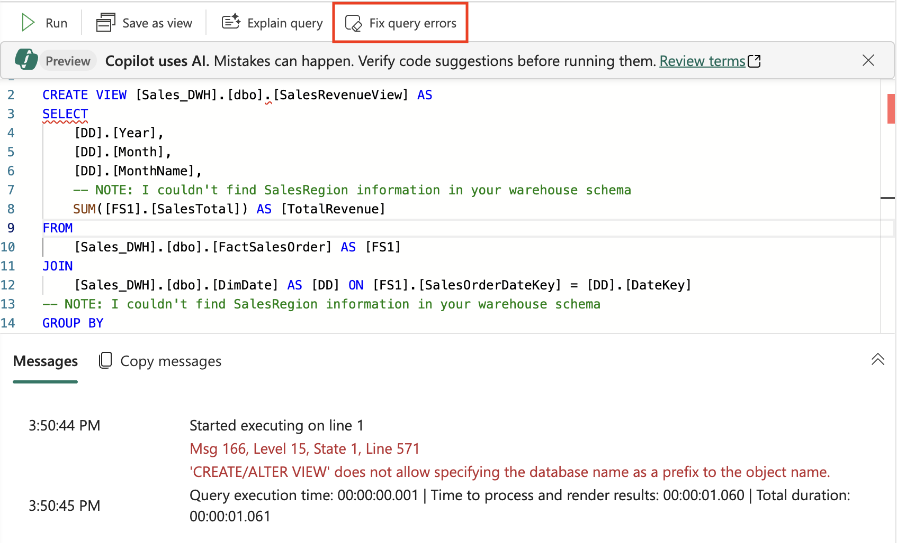

---
lab:
  title: Usa Copilot en el almacén de datos de Microsoft Fabric
  module: Get started with Copilot in Fabric for Data Warehouse
---

# Usa Copilot en el almacén de datos de Microsoft Fabric

En Microsoft Fabric, un almacenamiento de datos proporciona una base de datos relacional para análisis a gran escala. A diferencia del punto de conexión de SQL de solo lectura predeterminado para las tablas definidas en un almacén de lago, un almacenamiento de datos proporciona semántica de SQL completa; incluida la capacidad de insertar, actualizar y eliminar datos de las tablas. En este laboratorio, exploraremos cómo podemos aprovechar Copilot para crear consultas SQL.

Este ejercicio debería tardar en completarse **30** minutos aproximadamente.

## Temas que se abordarán

Después de completar este laboratorio, podrá:

- Comprender el rol de los almacenamientos de datos en Microsoft Fabric.
- Crear y configurar un área de trabajo y un almacenamiento de datos en Fabric.
- Cargar y explorar datos de ejemplo mediante SQL.
- Usar Copilot para generar, refinar y solucionar problemas de consultas SQL a partir de mensajes en lenguaje natural.
- Crear vistas y realizar análisis de datos avanzados con la generación de SQL asistida por IA.
- Aplicar las funcionalidades de Copilot para acelerar las tareas de exploración y análisis de datos.

## Antes de comenzar

Necesita una [Capacidad de Microsoft Fabric (F2 o superior)](https://learn.microsoft.com/fabric/fundamentals/copilot-enable-fabric) con Copilot habilitado para completar este ejercicio.

## Escenario del ejercicio

En este ejercicio, es un analista de datos de una empresa minorista que quiere comprender mejor el rendimiento de las ventas mediante Microsoft Fabric. Su equipo ha adoptado recientemente las funcionalidades de almacenamiento de datos de Fabric y le interesa aprovechar Copilot para acelerar la exploración y los informes de datos. Creará un almacenamiento de datos, cargará datos de ventas minoristas de ejemplo y usará Copilot para generar y refinar consultas SQL. Al final del laboratorio, tendrá experiencia práctica en el uso de la inteligencia artificial para analizar tendencias de ventas, crear vistas reutilizables y realizar análisis avanzados de datos, todo ello en el entorno de Fabric.

## Creación de un área de trabajo

Antes de trabajar con datos de Fabric, cree un área de trabajo con Fabric habilitado. Un área de trabajo de Microsoft Fabric actúa como un entorno de colaboración donde puede organizar y administrar todos los artefactos de ingeniería de datos, incluidos almacenes de lago de datos, cuadernos y conjuntos de datos. Imagine que es como una carpeta de proyecto que contiene todos los recursos necesarios para el análisis de datos.

1. En un explorador, ve a la [página principal de Microsoft Fabric](https://app.fabric.microsoft.com/home?experience=fabric) en `https://app.fabric.microsoft.com/home?experience=fabric` e inicia sesión con tus credenciales de Fabric.

1. En la barra de menús de la izquierda, selecciona **Áreas de trabajo** (el icono tiene un aspecto similar a &#128455;).

1. Cree una área de trabajo con el nombre que prefiera y seleccione un modo de licencia que incluya capacidad de Fabric (*Premium* o *Fabric*). Tenga en cuenta que *Versión de evaluación* no se admite.
   
    > **Por qué esto importa**: Copilot necesita una capacidad de Fabric de pago para funcionar. Esto garantiza que tiene acceso a las características con tecnología de inteligencia artificial que ayudarán a generar código a lo largo de este laboratorio.

1. Cuando se abra la nueva área de trabajo, debe estar vacía.


## Creación del almacenamiento de datos

Ahora que tiene un área de trabajo, es el momento de crear un almacenamiento de datos. Un almacenamiento de datos de Microsoft Fabric es una base de datos relacional optimizada para cargas de trabajo de análisis. A diferencia de las bases de datos tradicionales diseñadas para las operaciones transaccionales, los almacenes de datos se estructuran para controlar grandes volúmenes de datos y consultas complejas de forma eficaz. Busque el acceso directo para crear un almacén:

1. En la barra de menús de la izquierda, selecciona **Crear**. En la página *Nuevo*, en la sección *Almacenamiento de datos*, selecciona **Almacén**. Asígnale un nombre único que elijas. Este nombre identificará el almacenamiento de datos dentro del área de trabajo, por lo que debe elegir algo descriptivo que refleje su propósito.

    >**Nota**: si la opción **Crear** no está anclada a la barra lateral, primero debes seleccionar la opción de puntos suspensivos (**...**).

    Al cabo de un minuto aproximadamente, se creará un almacenamiento. El proceso de aprovisionamiento configura la infraestructura subyacente y crea los componentes necesarios para la base de datos analítica:

    

## Creación de tablas e inserción de datos

Un almacenamiento es una base de datos relacional en la que se pueden definir tablas y otros objetos. Para demostrar las funcionalidades de Copilot, se necesitan datos de ejemplo con los que trabajar. Se creará un esquema típico de ventas minoristas con tablas de dimensiones (cliente, fecha, producto) y una tabla de hechos (pedidos de ventas): este es un patrón común en el almacenamiento de datos denominado esquema de estrella.

1. En la pestaña del menú **Inicio**, use el botón **Nueva consulta SQL** para crear una nueva consulta. Se abre un editor de SQL donde puede escribir y ejecutar comandos de Transact-SQL. A continuación, copie y pegue el código de Transact-SQL desde `https://raw.githubusercontent.com/MicrosoftLearning/mslearn-fabric/refs/heads/main/Allfiles/Labs/22c/create-dw.txt` en el nuevo panel de consulta. Este script contiene todas las instrucciones CREATE TABLE e INSERT necesarias para crear el conjunto de datos de ejemplo.

1. Ejecute la consulta, que crea un esquema de almacenamiento de datos simple y carga algunos datos. El script debe tardar unos 30 segundos en ejecutarse. Durante este tiempo, el motor de base de datos crea las estructuras de tabla y las rellena con datos de ventas minoristas de ejemplo.

1. Use el botón **Actualizar** de la barra de herramientas para actualizar la vista. A continuación, en el panel **Explorador**, compruebe que el esquema **dbo** del almacenamiento de datos contiene ahora las cuatro tablas siguientes:
   
    - **DimCustomer**: contiene información del cliente, incluidos nombres y direcciones
    - **DimDate**: tabla de dimensiones de fecha con información de calendario (año, mes, nombres de día, etc.)
    - **DimProduct**: catálogo de productos con categorías, nombres e información de precios
    - **FactSalesOrder**: tabla de hechos central que contiene transacciones de ventas con claves externas a las tablas de dimensiones

    > **Sugerencia**: Si el esquema tarda un tiempo en cargarse, actualice la página del explorador. En el panel Explorador se muestra la estructura de la base de datos y se facilita el examen de las tablas y otros objetos de base de datos.

## Consulta de las tablas de almacenamiento de datos

Dado que el almacenamiento de datos es una base de datos relacional, puede usar SQL para consultar sus tablas. Pero escribir consultas SQL complejas desde cero puede llevar mucho tiempo y ser propenso a errores. Trabajar con Copilot hace que generar consultas SQL sea aún más rápido. Copilot usa inteligencia artificial para comprender las solicitudes en lenguaje natural y traducirlas en una sintaxis SQL adecuada, lo que hace que el análisis de datos sea más accesible.

1. Cierre la **consulta SQL 1** actual. Esto borra el área de trabajo para que se pueda centrar en el uso de Copilot para la generación de consultas.

1. En la cinta Inicio, seleccione la opción Copilot. Se abre el panel Asistente de Copilot, donde puede interactuar con la inteligencia artificial para generar consultas.

    

1. Para empezar, explorará lo que puede hacer Copilot. Haga clic en la sugerencia con la etiqueta `What can Copilot do?` y envíela como mensaje.

    Lea la salida y observe que Copilot está actualmente en versión preliminar y puede ayudar con la lluvia de ideas, generar consultas SQL, explicar y corregir consultas, etc.
    
    
    
1. El objetivo es analizar los ingresos de ventas por mes. Se trata de un requisito empresarial común: comprender las tendencias de ingresos en el tiempo ayuda a identificar patrones estacionales, tendencias de crecimiento y métricas de rendimiento. Escriba el siguiente mensaje y envíelo.

    ```copilot-prompt
    /generate-sql Calculate monthly sales revenue
    ```

1. Revise la salida generada, que puede diferir ligeramente en función del entorno y de las actualizaciones más recientes de Copilot. Observe cómo Copilot interpreta la solicitud y crea las instrucciones JOIN adecuadas entre las tablas de hechos y dimensiones para agregar datos de ventas por mes.

1. Seleccione el icono **Insertar código** ubicado en la esquina superior derecha de la consulta. Esto transfiere el código SQL generado desde el panel Copilot al editor de SQL, donde puede ejecutarlo.

    

1. Para ejecutar la consulta, seleccione la opción ▷ **Ejecutar** encima de la consulta y observe la salida. Debería ver los totales de ingresos mensuales que muestran cómo se agregan los datos de ventas entre períodos de tiempo.

    

1. Cree una **Nueva consulta SQL** y realice una pregunta de seguimiento para incluir también el nombre del mes y la región de ventas en los resultados. Esto muestra cómo puede refinar iterativamente las consultas con Copilot, basándose en solicitudes anteriores para crear análisis más detallados:

    ```copilot-prompt
    /generate-sql Retrieves sales revenue data grouped by year, month, month name and sales region
    ```

1. Seleccione el icono **Insertar código** y ▷ **Ejecutar** la consulta. Observe la salida que devuelve. Observe cómo Copilot adapta la consulta para incluir dimensiones adicionales al tiempo que mantiene la lógica de cálculo de ingresos principales.

1. Ahora se creará una vista a partir de esta consulta y se formulará a Copilot la siguiente pregunta. Las vistas son tablas virtuales que almacenan lógica de consulta, lo que facilita la reutilización de consultas complejas y proporciona patrones de acceso a datos coherentes para informes y análisis:

    ```copilot-prompt
    /generate-sql Create a view in the dbo schema that shows sales revenue data grouped by year, month, month name and sales region
    ```

1. Seleccione el icono **Insertar código** y ▷ **Ejecutar** la consulta. Revise la salida que genera. 

    La consulta no se ejecuta correctamente porque la instrucción SQL incluye el nombre de la base de datos como prefijo, lo que no se permite en el almacenamiento de datos al definir una vista. Se trata de un problema de sintaxis común al trabajar en distintas plataformas de base de datos: lo que funciona en un entorno podría necesitar un ajuste en otro.

1. Seleccione la opción **Corregir errores de consulta**. Observe cómo Copilot realiza correcciones en la consulta. Esto muestra una de las características eficaces de Copilot: no solo puede generar consultas, sino que también puede solucionar y corregir errores de sintaxis automáticamente.

    
    
    Este es un ejemplo de la consulta que ha corregido: observe los comentarios `Auto-Fix` que explican qué cambios se han realizado:
    
    ```sql
    -- Auto-Fix: Removed the database name prefix from the CREATE VIEW statement
    CREATE VIEW [dbo].[SalesRevenueView] AS
    SELECT 
        [DD].[Year],
        [DD].[Month],
        [DD].[MonthName],
        -- NOTE: I couldn't find SalesRegion information in your warehouse schema
        SUM([FS1].[SalesTotal]) AS [TotalRevenue]
    FROM 
        [dbo].[FactSalesOrder] AS [FS1] -- Auto-Fix: Removed the database name prefix
    JOIN 
        [dbo].[DimDate] AS [DD] ON [FS1].[SalesOrderDateKey] = [DD].[DateKey] -- Auto-Fix: Removed the database name prefix
    -- NOTE: I couldn't find SalesRegion information in your warehouse schema
    GROUP BY 
        [DD].[Year],
        [DD].[Month],
        [DD].[MonthName]; 
    ```
    
    Observe cómo Copilot no solo ha corregido los errores de sintaxis, sino que también ha proporcionado comentarios útiles que explican los cambios e indican que la información de la región de ventas no estaba disponible en el esquema actual.

1. Escriba otro mensaje para recuperar una lista detallada de productos, organizados por categoría. Esta consulta mostrará características de SQL más avanzadas, como funciones de ventana para clasificar datos dentro de grupos. Para cada categoría de producto, debe mostrar los productos disponibles junto con sus precios y clasificarlos dentro de sus respectivas categorías en función del precio. 

    ```copilot-prompt
    /generate-sql Retrieve a detailed product listing, organized by category. For each product category, it should display the available products along with their list prices and rank them within their respective categories based on price. 
    ```

1. Seleccione el icono **Insertar código** y ▷ **Ejecutar** la consulta. Observe la salida que devuelve. 

    Esto permite una comparación sencilla de productos dentro de la misma categoría, lo que ayuda a identificar los artículos más caros y menos costosos. La funcionalidad de clasificación es especialmente útil para la administración de productos, el análisis de precios y las decisiones de inventario.

## Resumen

En este ejercicio, ha creado un almacenamiento de datos que contiene varias tablas. Ha usado Copilot para generar consultas SQL a fin de analizar datos en el almacenamiento de datos. Ha experimentado cómo la inteligencia artificial puede acelerar el proceso de escritura de consultas SQL complejas, corregir errores automáticamente y ayudarle a explorar los datos de forma más eficaz.

A lo largo de este laboratorio, ha aprendido a:
- Sacar provecho de mensajes en lenguaje natural para generar consultas SQL
- Usar las funcionalidades de corrección de errores de Copilot para corregir problemas de sintaxis
- Crear vistas y consultas analíticas complejas con ayuda de la inteligencia artificial
- Aplicar funciones de clasificación y agrupación para el análisis de datos

## Limpieza de recursos

Si ha terminado de explorar Copilot en el almacenamiento de datos de Microsoft Fabric, puede eliminar el área de trabajo que ha creado para este ejercicio.

1. Vaya a Microsoft Fabric en el explorador.
1. En la barra de la izquierda, seleccione el icono del área de trabajo para ver todos los elementos que contiene.
1. Selecciona **Configuración del área de trabajo** y, en la sección **General**, desplázate hacia abajo y selecciona **Quitar esta área de trabajo**.
1. Selecciona **Eliminar** para eliminar el área de trabajo.


